# C++

同样是为了WASM做准备，在这里记录还能复习Linux知识。

---

## 编写服务器

参考链接[【C/C++项目开发实施】：纯C语言编写Web前端，两百行代码带你编写Web服务器！！！_哔哩哔哩_bilibili](https://www.bilibili.com/video/BV1rr4y1g7b1/?spm_id_from=333.1007.top_right_bar_window_history.content.click&vd_source=36542d6c49bf487d8a18d22be404b8d2)

---

值得注意的是，在这里，windows平台上是`#include <WinSock2.h>`。

主体框架如下:

```c
#include <stdio.h>
#include <WinSock2.h>

#pragma comment(lib, "ws2_32.lib")

//open socket
void init_socket() {
    //确定version socket

}

//close socket
void close_socket() {

}

SOCKET startServer(const char *ip, unsigned short port) {
    return 0;
}

int main() {
    init_socket();
    close_socket();
    SOCKET serfd = startServer("0.0.0.0", 80);
    printf("Hello, World!\n");
    return 0;
}

```

在`init_socket()`函数中，首先应该确定socket的版本号，使用函数`WSAStartup()`，这里是要两个字节的参数，所以使用c的`MAKEWORD()`函数拼接两个字节，在这里是2,2。

```c
void init_socket() {
    //确定version socket
    WSADATA wsaData;
    WSAStartup(MAKEWORD(2,2), &wsaData);
}
```

并且使用宏`WSAEINVAL`判断这个函数的返回值是否是失败。

```c
    if (WSAEINVAL == WSAStartup(MAKEWORD(2, 2), &wsaData)) {
        printf("WSAStartup . %d\n", WSAGetLastError());
        exit(1);
    };
```

关闭服务器

```c
void close_socket() {
    WSACleanup();
}
```

在运行一个服务器的时候，先初始化一个socket，使用了TCP的协议。并且加上错误的代码。

```c
SOCKET startServer(const char *ip, unsigned short port) {
    //create socket
    SOCKET fd = socket(AF_INET, SOCK_STREAM, IPPROTO_TCP);
    if (fd == INVALID_SOCKET) {
        printf("create socket failed\n");
        return INVALID_SOCKET;
    }
    return 0;
}
```

然后就需要绑定ip和port，查看`bind()`这里需要声明一个结构体`SOCKADDR_IN serAddr;`。

在这里需要注意小端大端的区别。在电脑上使用的是小端，在网络传输上使用的是大端。所以在这里需要转换大端再绑定端口`serAddr.sin_port = htons(port);`

```c
SOCKET startServer(const char *ip, unsigned short port) {
    // create socket
    SOCKET fd = socket(AF_INET, SOCK_STREAM, IPPROTO_TCP);
    if (fd == INVALID_SOCKET) {
        printf("Create socket failed.\n");
        return INVALID_SOCKET;
    }

    SOCKADDR_IN serAddr;
    serAddr.sin_family = AF_INET;
    serAddr.sin_port = htons(port);
    serAddr.sin_addr.S_un.S_addr = inet_addr(ip);
    // bind IP & port
    int bindFlag = bind(fd, (const struct sockaddr *) &serAddr, sizeof(serAddr));
    if (SOCKET_ERROR == bindFlag) {
        printf("Bind failed. %d\n", WSAGetLastError());
        return INVALID_SOCKET;
    }

    listen(fd, 5);
    return fd;
}
```

在main函数中创建server，监听本地5668端口。

```c
SOCKET serfd = startServer("0.0.0.0", 5668);
```

接受客户端（在这里是浏览器）

```c
SOCKET clifd = accept(serfd, NULL, NULL);
```

循环向服务器发送bytes

```c
int main() {
    init_socket();
    SOCKET serfd = startServer("0.0.0.0", 80);
    printf("start successfully\n");
    while (true) {
        SOCKET clifd = accept(serfd, NULL, NULL);
        char buf[] = "<h1>Hello SOCKET</h1>";
        send(clifd, buf, strlen(buf), 0);
    }
    
    close_socket();
    printf("Hello, World!\n");
    return 0;
}

```

注意c语言没有bool，需要引入头文件`#include <stdbool.h>`

打开本地localhost:80

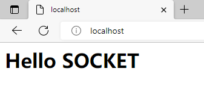

这个循环的操作就相当于一直接电话（接通了之后就给客户端发送HTML的代码）。

同时，这里也能够接收客户端发来的代码，如下：

```c
void requestHanding(SOCKET fd) {
    char buf[BUFSIZ] = {0};
    if (0 >= recv(fd, buf, sizeof(buf), 0)) {
        // 如果接受客户端信息失败了
        printf("Receive failed. %d\n", WSAGetLastError());
        return;
    }
    // 如果成功接受客户端信息
    puts(buf);
}

int main() {
    init_socket();
    SOCKET serfd = startServer("0.0.0.0", 80);
    printf("start successfully\n");
    while (true) {
        SOCKET clifd = accept(serfd, NULL, NULL);
        char buf[] = "<h1>Hello SOCKET</h1>";
        send(clifd, buf, strlen(buf), 0);
        requestHanding(clifd);
    }

    close_socket();
    printf("Server closed!\n");
    return 0;
}
```

上面的`puts(buf);`打印如下信息：

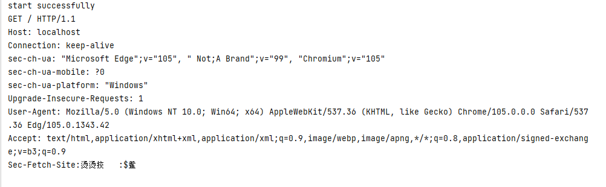

在上图中可以看到请求行等信息。

使用字符串操作来匹配method等信息，并且约定如果请求的url为/，就发送index.html

再进行一部分的字符串操作来拼接路径，还需要判断文件是否存在。

```c
struct _stat32 stat;
printf("%d================================", _stat32(url, &stat));
```

如果函数`_stat32()`第一个参数是路径读取成功，就返回0，否则返回-1。这个文件的信息保存在stat中。

创建两个文件index.html和404.html。

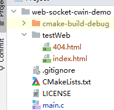

需要注意的是，html的路径是相对于生成的二进制文件而言的。

并且，如果文件不存在的话，就返回404页面，代码类似于：

```c
void requestHanding(SOCKET fd) {
    char buf[BUFSIZ] = {0};
    if (0 >= recv(fd, buf, sizeof(buf), 0)) {
        // 如果接受客户端信息失败了
        printf("Receive failed. %d\n", WSAGetLastError());
        return;
    }
    // 如果成功接受客户端信息

    // 解析
    char method[10] = {0};
    char url[128] = {0};
    char urlBackup[128] = {0};
    int index = 0;
    char *p = NULL;
    for (p = buf; *p != ' '; p++) {
        method[index++] = *p;
    }
    p++;//跳过空格

    index = 0;
    for (; *p != ' '; p++) {
        url[index++] = *p;
    }
    strcpy(urlBackup, url);
    if (strcmp(method, "GET") == 0) {
        printf("GET requestHanding\n");
//        strcpy(url,rootPath);
//        strcat(url, (strcmp(url, "/") == 0 ? "/ index.html" : url));
        sprintf(url, "%s%s", rootPath, (strcmp(urlBackup, "/") == 0 ? "/index.html" : urlBackup));
        puts(url);
        // 判断文件是否存在
        struct _stat32 stat;
//        printf("%d================================", _stat32(url, &stat));
        if (-1 == _stat32(url, &stat)) {
            // 这里返回404
            char file[128] = {0};
            sprintf(file, "%s%s", rootPath, "/404.html");
            sendFile(fd, file);
        } else {
            sendFile(fd, url);
        }
    } else if (strcmp(method, "POST") == 0) {
        printf("POST requestHanding");
    }
}
```

之后就是补全读取和发送文件的函数`sendFile()`。

在这个函数中，选择是否读取到文件的结尾可以通过函数`feof()`来判断

```c
    char buf[BUFSIZ] = {0};
    if (!feof(file)) {
        int len = fread(buf, sizeof(buf), BUFSIZ, file);
        send(fd, buf, len, 0);
    }
```

最后，read并且发送文件的函数如下所示：

```c
void sendFile(SOCKET fd, const char *filename) {
    printf("Sending file: %s\n", filename);
    FILE *file = fopen(filename, "rb");

    if (!file) {
        perror("Failed to open file ");
        return;
    }
    char buf[BUFSIZ] = {0};
    while (!feof(file)) {
        int len = fread(buf, sizeof(char), BUFSIZ, file);
        send(fd, buf, len, 0);
    }
    fclose(file);
}
```

在浏览器运行http:localhost之后，可以得到index.html的页面


输入错误的路由也可以展示404页面


整体代码如下所示，之后可以考虑添加响应头信息等操作。

```c
#include <stdio.h>
#include <WinSock2.h>
#include <stdbool.h>
#include <sys/types.h>
#include <sys/stat.h>

#pragma comment(lib, "ws2_32.lib")

char rootPath[128] = "../testWeb";

void sendFile(SOCKET fd, const char *filename) {
    printf("Sending file: %s\n", filename);
    FILE *file = fopen(filename, "rb");

    if (!file) {
        perror("Failed to open file ");
        return;
    }
    char buf[BUFSIZ] = {0};
    while (!feof(file)) {
        int len = fread(buf, sizeof(char), BUFSIZ, file);
        send(fd, buf, len, 0);
    }
    fclose(file);
}

// open socket
void init_socket() {
    // 确定version socket
    WSADATA wsaData;
    int WSASCode = WSAStartup(MAKEWORD(2, 2), &wsaData);
//    printf("WSAStartup code : %d\n", WSASCode);
    if (WSAEINVAL == WSASCode) {
        printf("WSAStartup failed. %d\n", WSAGetLastError());
        exit(1);
    };
}

// close socket
void close_socket() {
    WSACleanup();
}

SOCKET startServer(const char *ip, unsigned short port) {
    // create socket
    SOCKET fd = socket(AF_INET, SOCK_STREAM, IPPROTO_TCP);
    if (fd == INVALID_SOCKET) {
        printf("Create socket failed.\n");
        return INVALID_SOCKET;
    }

    SOCKADDR_IN serAddr;
    serAddr.sin_family = AF_INET;
    serAddr.sin_port = htons(port);
    serAddr.sin_addr.S_un.S_addr = inet_addr(ip);
    // bind IP & port
    int bindFlag = bind(fd, (const struct sockaddr *) &serAddr, sizeof(serAddr));
    if (SOCKET_ERROR == bindFlag) {
        printf("Bind failed. %d\n", WSAGetLastError());
        return INVALID_SOCKET;
    }

    listen(fd, 5);
    return fd;
}

void requestHanding(SOCKET fd) {
    char buf[BUFSIZ] = {0};
    if (0 >= recv(fd, buf, sizeof(buf), 0)) {
        // 如果接受客户端信息失败了
        printf("Receive failed. %d\n", WSAGetLastError());
        return;
    }
    // 如果成功接受客户端信息

    // 解析
    char method[10] = {0};
    char url[128] = {0};
    char urlBackup[128] = {0};
    int index = 0;
    char *p = NULL;
    for (p = buf; *p != ' '; p++) {
        method[index++] = *p;
    }
    p++;//跳过空格

    index = 0;
    for (; *p != ' '; p++) {
        url[index++] = *p;
    }
    strcpy(urlBackup, url);
    if (strcmp(method, "GET") == 0) {
        printf("GET requestHanding\n");
//        strcpy(url,rootPath);
//        strcat(url, (strcmp(url, "/") == 0 ? "/ index.html" : url));
        sprintf(url, "%s%s", rootPath, (strcmp(urlBackup, "/") == 0 ? "/index.html" : urlBackup));
        puts(url);
        // 判断文件是否存在
        struct _stat32 stat;
//        printf("%d================================", _stat32(url, &stat));
        if (-1 == _stat32(url, &stat)) {
            // 这里返回404
            char file[128] = {0};
            sprintf(file, "%s%s", rootPath, "/404.html");
            sendFile(fd, file);
        } else {
            sendFile(fd, url);
        }
    } else if (strcmp(method, "POST") == 0) {
        printf("POST requestHanding");
    }
}


int main() {
    init_socket();
    SOCKET serfd = startServer("0.0.0.0", 80);
    printf("start successfully\n");
    while (true) {
        SOCKET clifd = accept(serfd, NULL, NULL);
        requestHanding(clifd);
    }
    close_socket();
    printf("Server closed!\n");
    return 0;
}

```

---

# C

主要内容是来自《Unix环境高级编程》，使用的环境是WSL2 Debian。参考代码[cunix: 使用c语言在unix环境下编程的代码练习 (gitee.com)](https://gitee.com/masaikk/cunix)。

其中，如果要打开wsl内部文件夹，可以在文件资源管理器中打开`\\wsl$`。

## 知识点

### CPU的管态（系统态、核心态）与目态（用户态，常态）？如何切换？

CPU有两个状态，分别为系统态和用户态。
管态：操作系统管理程序运行时的状态，具有较高的特权级别，也称为特权态、系统态、内核态或者核心态。当处理器处于管态时，可以执行所有的指令，包括各种特权指令，也可以使用所有的资源，并且具有改变处理器状态的能力。
目态：用户程序运行时的状态，具有较低的特权级别，又称为普通态或用户态。在这种状态下不能使用特权指令，不能直接使用系统资源，也不能改变CPU的工作状态，并且只能访问这个用户程序自己的存储空间。
当CPU处理系统程序的时候，CPU会转为系统态；当CPU处理一般用户程序的时候，CPU的状态又由原来的系统态切换为用户态，这个时候程序只能执行非特权指令。CPU就是通过这样的基理保护操作系统的安全性。从用户态到系统态的唯一途径是中断，从系统态到用户态可以通过修改程序状态字。

### UNIX采用什么技术实现块设备的读写操作？

UNIX采用**缓冲技术**实现块设备的读写操作。驱动程序为写操作分配一个缓冲区，先从用户空间把信息复制到缓冲区，再从缓冲区输出到设备；对读操作，先从设备接收信息到缓冲区，再将信息复制到指定的用户空间。采用缓冲技术减少对块设备的访问次数可提高系统的吞吐量。

标准I／O提供三种类型的缓冲：

1. 全缓冲，在填满标准IO缓冲区后才进行实际的IO操作。

2. 行缓冲，当遇到换行符的时候才执行实际的IO操作。

3. 不带缓冲，不对字符进行缓冲存储。

### 程序、进程区别和联系？

进程是程序的实例，是在自身的虚拟地址空间运行的一个单独的程序，unix系统上所有运行的内容部可以称为进程。

（运行资源/静态动态）程序是一个静态的指令集合，不占系统的运行资源；而进程使用系统运行资源的程序，随时都可能发生变化。（数量）单个程序可以启动多个进程，多个进程可以含有相同的程序，且多个程序可以并发执行。

UNIX进程在内存中由三部分组成；进程控制块、正文段和数据段。

n 进程控制块PCB记录了进行进程调度时必须使用的主要信息。

n 正文段是可供多个进程共享的程序（机器指令），防止意外修改，常常是只读的。

n 数据段是指进程执行时用到的数据，若进程的子程序是非共享的，也包含在数据段内。**数据段**包括初始化数据段（全局）、非初始化数据段（bss）、栈（函数调用时使用）、堆（动态存储分配）。

### 解释进程的三种状态

进程有三种基本状态：

1. 运行态：进程占有处理器正在运行。

2. 就绪态：进程具备运行条件，等待系统分配处理器以便运行。

3. 等待态（阻塞态或睡眠态）：指进程不具备运行条件，正在等待某个事件的完成。


## 代码

### 3-2 文件空洞

创建一个空洞文件

```c
#include <stdio.h>
#include "apue.h"

#include <sys/types.h>
#include <sys/stat.h>
#include <fcntl.h>
#include "include/my_err.h"

char buf1[] = "abcdefghij";
char buf2[] = "ABCDEFGHIJ";

int
main(void) {
    int fd;
    if ((fd = creat("file.hole", FILE_MODE)) < 0)
        err_sys("creat error");
    if (write(fd, buf1, 10) != 10)
        err_sys("buf1 write error");
/* offset now = 10 */
    if (lseek(fd, 40, SEEK_SET) == -1)
        err_sys("lseek error");
/* offset now = 40 */
    if (write(fd, buf2, 10) != 10)
        err_sys("buf2 write error");
/* offset now = 50 */
    exit(0);
}

```

在使用lseek()设置偏移量之后，可以使文件的偏移量从10设置到40，这时再写入10，就变成50。

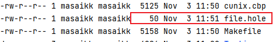

使用od目录查看内容

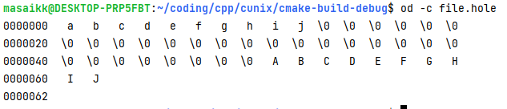

注意以上的my_err.h的内容为

```c
//
// Created by masaikk on 2022/11/3.
//

#ifndef CUNIX_MY_ERR_H
#define CUNIX_MY_ERR_H

#include <errno.h> /* for definition of errno */
#include <stdarg.h> /* ISO C variable aruments */
#include <stdlib.h>

static void err_doit(int, int, const char *, va_list);

/*
 * Nonfatal error related to a system call.
 * Print a message and return.
 */
void
err_ret(const char *fmt, ...)
{
    va_list ap;

    va_start(ap, fmt);
    err_doit(1, errno, fmt, ap);
    va_end(ap);
}


/*
 * Fatal error related to a system call.
 * Print a message and terminate.
 */
void
err_sys(const char *fmt, ...)
{
    va_list ap;

    va_start(ap, fmt);
    err_doit(1, errno, fmt, ap);
    va_end(ap);
    exit(1);
}


/*
 * Fatal error unrelated to a system call.
 * Error code passed as explict parameter.
 * Print a message and terminate.
 */
void
err_exit(int error, const char *fmt, ...)
{
    va_list ap;

    va_start(ap, fmt);
    err_doit(1, error, fmt, ap);
    va_end(ap);
    exit(1);
}


/*
 * Fatal error related to a system call.
 * Print a message, dump core, and terminate.
 */
void
err_dump(const char *fmt, ...)
{
    va_list ap;

    va_start(ap, fmt);
    err_doit(1, errno, fmt, ap);
    va_end(ap);
    abort(); /* dump core and terminate */
    exit(1); /* shouldn't get here */
}


/*
 * Nonfatal error unrelated to a system call.
 * Print a message and return.
 */
void
err_msg(const char *fmt, ...)
{
    va_list ap;

    va_start(ap, fmt);
    err_doit(0, 0, fmt, ap);
    va_end(ap);
}


/*
 * Fatal error unrelated to a system call.
 * Print a message and terminate.
 */
void
err_quit(const char *fmt, ...)
{
    va_list ap;

    va_start(ap, fmt);
    err_doit(0, 0, fmt, ap);
    va_end(ap);
    exit(1);
}


/*
 * Print a message and return to caller.
 * Caller specifies "errnoflag".
 */
static void
err_doit(int errnoflag, int error, const char *fmt, va_list ap)
{
    char buf[MAXLINE];
    vsnprintf(buf, MAXLINE, fmt, ap);
    if (errnoflag)
        snprintf(buf+strlen(buf), MAXLINE-strlen(buf), ": %s",
                 strerror(error));
    strcat(buf, "\n");
    fflush(stdout); /* in case stdout and stderr are the same */
    fputs(buf, stderr);
    fflush(NULL); /* flushes all stdio output streams */
}

#endif //CUNIX_MY_ERR_H

```

### 3-9 I/O效率 读入写出

```c
#include <stdio.h>
#include "apue.h"

#include <sys/types.h>
#include <sys/stat.h>
#include <fcntl.h>
#include "include/my_err.h"

#define BUFFSIZE 4096

int
main(void) {
    int n;
    char buf[BUFFSIZE];
    while ((n = read(STDIN_FILENO, buf, BUFFSIZE)) > 0) {
        if (write(STDOUT_FILENO, buf, n) != n) {
            err_sys("write error");
        }
    }
    if (n < 0) {
        err_sys("read error");
    }
    exit(0);
}

```

根据文件重定向符来操作需要读入的文件以及写出的文件，每次读一个BUFFSIZE。

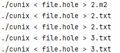

### 3-14 获取与修改文件状态标志

```c
void set_fl(int fd, int flags) {
    int val;
    if((val=fcntl(fd,F_GETFL,0))<0){
        err_sys("fcntl failed");
    }
    val |=flags;
    if(fcntl(fd,F_SETFL,0)<0){
        err_sys("fcntl failed");
    }
}
```

### 4-3 lstat读取文件类型信息

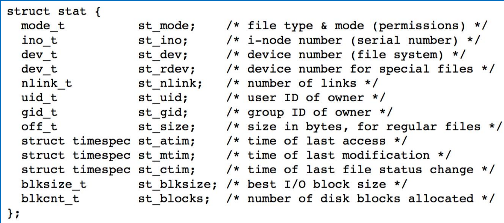

### 7-3 exit

区别三个exit函数的区别。并且，对于`exit()`在mian函数里面，return等价于`exit(0)`。

使用`int atexit(void (*func)()void)`来注册不大于32个函数以便在`exit(0)`的时候逆序调用，若成功，就返回0。例如：

```c
#include <stdio.h>
#include <pthread.h>
#include "apue.h"
#include <sys/types.h>
#include <sys/stat.h>
#include <fcntl.h>
#include "include/my_err.h"

static void my_exit1(void);
static void my_exit2(void);

int main(void){
    if(atexit(my_exit2)!=0)
        err_sys("error");
    if(atexit(my_exit1)!=0)
        err_sys("error");
    if(atexit(my_exit1)!=0)
        err_sys("error");

    printf("main call\n");
    return 0;
}

static void my_exit1(void){
    printf("my_exit1 called\n");
}

static void my_exit2(void){
    printf("my_exit2 called\n");
}
```

打印结果如下，注意它是逆序执行的：

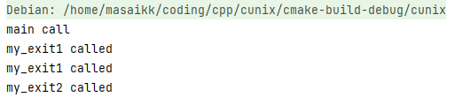

### 11-4 创建线程并且打印线程tid

```c
#include <stdio.h>
#include <pthread.h>
#include "apue.h"
#include <sys/types.h>
#include <sys/stat.h>
#include <fcntl.h>
#include "include/my_err.h"


pthread_t ntid;

void
printids(const char *s) {
    pid_t pid;
    pthread_t tid;

    pid = getpid();
    tid = pthread_self();
    printf("%s pid %lu tid %lu (0x%lx)\n", s, (unsigned long) pid,
           (unsigned long) tid, (unsigned long) tid);
}

void *
thr_fn(void *arg) {
    printids("new thread: ");
    return ((void *) 0);
}

int
main(void) {
    int err;

    err = pthread_create(&ntid, NULL, thr_fn, NULL);
    if (err != 0)
        err_exit(err, "can't create thread");
    printids("main thread:");
    sleep(1);
    exit(0);
}


```

需要注意的是，在这个出现里面，是不会自动链接`#include <pthread.h>`需要手动配置CMAKE

```cmake
cmake_minimum_required(VERSION 3.18)
project(cunix C)

set(CMAKE_C_STANDARD 99)

find_package(Threads REQUIRED)


add_executable(cunix main.c include/my_err.h)
target_link_libraries(cunix PRIVATE ${CMAKE_THREAD_LIBS_INIT})
```

这里的`pthread_create(&ntid, NULL, thr_fn, NULL);`表示创建一个线程，返回0就是表示正常。并且第三个函数为要执行的函数，第四个参数为一个结构体，用于当作参数输入到第三个作为创建的线程执行的参数中。并且，因为如果主线程停止了，整个进程也会停止，所以要sleep一下。

最终的输入如下，分别表示了主线程与新建的线程:

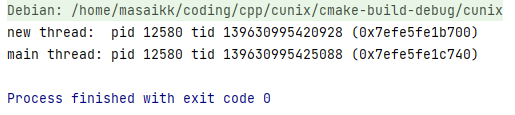

### 11-5 线程终止

如果某个进程中的任意线程调用了`exit()` 或者`_Exit()`或者`_exit()`（注意它们之间的区别,`exit()`函数是对于所有的打开流都调用`fclose()`函数），那样整个进程都会停止。如果需要单独中止线程，可以：

1. 从启动例程中返回，返回值是线程的退出码
2. 被同一进程中的其他线程取消
3. 线程调用`pthread_exit(void *rval_ptr)`

进程中的其他线程可以通过`pthred_join(pthread_t thread, void ** rval_ptr)`来获取某个线程的退出状态。

参考如下的代码

```c
#include <stdio.h>
#include <pthread.h>
#include "apue.h"
#include <sys/types.h>
#include <sys/stat.h>
#include <fcntl.h>
#include "include/my_err.h"


struct foo {
    int a, b, c, d;
};

void
printfoo(const char *s, const struct foo *fp)
{
    printf("%s", s);
    printf("  structure at 0x%lx\n", (unsigned long)fp);
    printf("  foo.a = %d\n", fp->a);
    printf("  foo.b = %d\n", fp->b);
    printf("  foo.c = %d\n", fp->c);
    printf("  foo.d = %d\n", fp->d);
}

void *
thr_fn1(void *arg)
{
    struct foo	foo = {1, 2, 3, 4};

    printfoo("thread 1:\n", &foo);
    pthread_exit((void *)&foo);
}

void *
thr_fn2(void *arg)
{
    printf("thread 2: ID is %lu\n", (unsigned long)pthread_self());
    pthread_exit((void *)0);
}

int
main(void)
{
    int			err;
    pthread_t	tid1, tid2;
    struct foo	*fp;

    err = pthread_create(&tid1, NULL, thr_fn1, NULL);
    if (err != 0)
        err_exit(err, "can't create thread 1");
    err = pthread_join(tid1, (void *)&fp);
    if (err != 0)
        err_exit(err, "can't join with thread 1");
    sleep(1);
    printf("parent starting second thread\n");
    err = pthread_create(&tid2, NULL, thr_fn2, NULL);
    if (err != 0)
        err_exit(err, "can't create thread 2");
    sleep(1);
    printfoo("parent:\n", fp);
    exit(0);
}
```

这里打印的情况为：

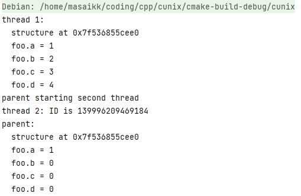

可以看出，这里是不安全的，在调用了第二个线程之后，foo的值被改变了。

### 15.5 导管通信

导管的创建如下图所示

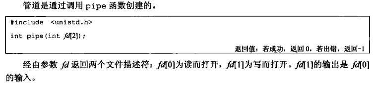

对于一个进程在创建了一个导管并且fork之后，就类似于下面所示，这时要根据数据的流向来确定要断开的路径。

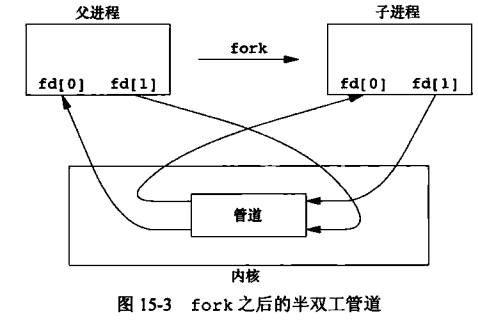

