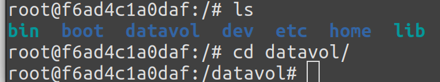
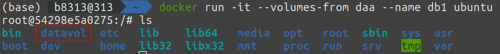
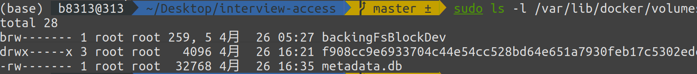

# Docker笔记

主要是看书，参考[https://yeasy.gitbook.io/docker_practice/image/pull](https://yeasy.gitbook.io/docker_practice/image/pull)

---

## Dockerfile

使用``#``进行注释

如果使用 `shell` 格式的话，实际的命令会被包装为 `sh -c` 的参数的形式进行执行。

比如：``CMD echo $HOME``在实际执行中，会将其变更为：``CMD [ "sh", "-c", "echo $HOME" ]``

Docker 不是虚拟机，容器中的应用都应该以前台执行，而不是像虚拟机、物理机里面那样，用 `systemd` 去启动后台服务，容器内没有后台服务的概念。

### 基本命令

+ 

---

## 常用容器

+ MySQL
  + ``docker run -p 3306:3306  -e MYSQL_ROOT_PASSWORD=123 -d mysql``
+ MongoDB
  + [官网](https://hub.docker.com/_/mongo)
  + ``docker run -d mongo``
  + 使用如下命令``docker exec -it ${ID} sh``
+ Nginx
  + ``docker run -p 80:80 -d nginx``
  + 配置文件位于/etc/nginx/conf.d/default.conf
  + 


---

## 常用命令行参数

+ ``-d``表示的是允许容器后台运行，对于MySQL这种容器很重要
+ ``-it``表示允许容器开启一个可以调用的终端
+ ``-P``随机一个端口映射
+ ``-link``连接数据卷容器
+ ``-v``挂载目录。``-v 宿主机目录:容器目录`` 这里的容器目录会自动创建，并且容器目录不可以为相对路径。


---

## 数据卷

区别容器中管理数据的两个方式：

+ 数据卷(Data Volumes)：容器内数据直接映射到本地的主机环境。
+ 数据卷容器(Data Volume Containers)：使用特定容器维护数据卷。

考虑在容器内创建数据卷，并且在本地目录或文件挂载到容器内的数据卷中。然后考虑创建数据卷容器在容器和主机、容器和容器之间共享数据。

**数据卷**是一种可以供容器使用的特殊的目录，相当于Linux的mount操作。使用``volume``命令。比如创建一个叫做test1的数据卷：

```shell
docker volume create -d local test1
```

推荐使用``volume``命令挂载主机到主机``/var/lib/docker/volumes``上。

使用``docker volume prune``可以自动清理无用的数据卷。

如果需要在多个容器里面共享一些数据，就建议使用**数据卷容器**。如下所示：

```shell
docker run -it -v /datavol --name daa ubuntu
```

创建了一个名字叫daa的ubuntu容器，并且挂载其中的``/datavol``目录为数据卷位置。

查看其中的数据卷``/datavol``



可以在其他容器里面使用``--volumes-from``命令，后面使用数据卷容器的名字，来挂载这个容器里面的数据卷：

```shell
docker run -it --volumes-from daa --name db1 ubuntu
```

可以看到已经挂载成功，有数据卷datavol：



并且，使用了``--volumes-from``被挂载的的数据卷容器本身不需要保持在运行状态。

在宿主机的目录上，也能看到数据卷：



注意，在把全部的数据卷容器删除之后，数据卷还在，需要手动删除。比如使用``docker volume prune``删除多余的数据卷。

---

## Kubernetes

