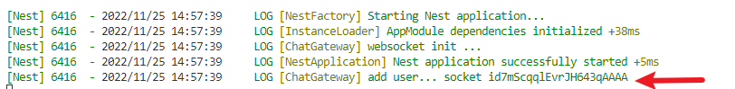

# nest-websocket

[passerma/nestjs-websocket: nestjs-websocket实现聊天功能简单例子 (github.com)](https://github.com/passerma/nestjs-websocket) 主要应该参考这个里面服务端和客户端中对于socket.io都分别是怎么使用的。对于socket.io基本的使用，可以参考[Websocket原理及具体使用（ws+socket.io） - 掘金 (juejin.cn)](https://juejin.cn/post/6857716625764777991)。对于这个软件来说，它是分为

---

## 服务端-nest部分

对于系统默认的APPmodule部分，注册了一个provide

```typescript
@Module({
  imports: [],
  controllers: [],
  providers: [AppGateway],
})
```

这里的appGateway为主要内容。它的主要代码为一个`AppGateway`类组成，并且继承了`implements OnGatewayInit, OnGatewayConnection, OnGatewayDisconnect`实质上就是实现了一下方法。然后使用nest提供的网关。

```typescript
@WebSocketGateway({
  path: '/socket',
  allowEIO3: true,
  cors: {
    origin: /.*/,
    credentials: true
  }
})
```

这里还使用了nest实现的Logger类来记录日志`private logger: Logger = new Logger('ChatGateway');`

因为继承了三个基类，所以实现了三个方法

```typescript
  private logger: Logger = new Logger('ChatGateway');
  @WebSocketServer() private ws: Server;  // socket实例
  private connectCounts = 0               // 当前在线人数
  private allNum = 0                      // 全部在线人数
  private users: any = {}                 // 人数信息
  

  /**
   * 初始化
   */
  afterInit() {
    this.logger.log('websocket init ...');
  }

  /**
   * 链接成功
   */
  handleConnection(client: Socket) {
    this.connectCounts += 1
    this.allNum += 1
    this.users[client.id] = `user-${this.connectCounts}`
    this.logger.log('add user...')
    this.ws.emit('enter', { name: this.users[client.id], allNum: this.allNum, connectCounts: this.connectCounts });
    client.emit('enterName', this.users[client.id]);
  }

  /**
   * 断开链接
   */
   handleDisconnect(client: Socket) {
    this.allNum -= 1
    this.ws.emit('leave', { name: this.users[client.id], allNum: this.allNum, connectCounts: this.connectCounts  });
  }
```

在连接过程中打印这个socket的id

```typescript
this.logger.log('add user... socket id'+client.id)
```

以下展示的是这里的id信息。



在连接之后，注意两个发送信息的方式

```typescript
    this.ws.emit('enter', { name: this.users[client.id], allNum: this.allNum, connectCounts: this.connectCounts });
    client.emit('enterName', this.users[client.id]);
```

这里一个是广播，一个是对于client发送信息。

---

## 客户端-web部分

客户端的实现是react，并且是使用类组件的形式定义在Home.jsx里面的。对于socket.io来说，它一定要使用socket.io的客户端，所以应该先导入`import io from "socket.io-client"`。

先初始化一些数据，并且添加生命周期函数：

```jsx
    constructor(props) {
        super(props);
        this.state = {
            list: [],
            inputValue: '',
            Online: 0,
            History: 0
        };
        this.name = ''
    }
    componentDidMount() {
        this.socket = io('ws://127.0.0.1:7956',{path: '/socket' ,});
        this.socket.on('enter', this.enterRoom);
        this.socket.on('enterName', this.enterNameRoom);
        this.socket.on('message', this.messageRoom);
        this.socket.on('name', this.nameRoom);
        this.socket.on('leave', this.leaveRoom);
    }

    componentDidUpdate() {
        this.refs.home.scrollTop = this.refs.home.scrollHeight;
    }
```

在`componentDidMount`中注册了一些socket的动作。下面稍做分析：

对于服务端中使用到的`client.emit('enterName', this.users[client.id]);`语句，监听了`enterName`事件，绑定到`this.socket.on('enterName', this.enterNameRoom);`这里。

```javascript
    /** 
     * 进入修改自己的名称
    */
    enterNameRoom = (name) => {
        console.log(name)
        this.name = name
    }
```

同时，客户端可以给服务端发送一个信息

```jsx
    onSearch = (value) => {
        if (value) {
            this.socket.emit('message', value)
            this.setState({
                inputValue: ''
            })
        }
    }
```

这里的value为信息内容。服务器按照message这个名字来接受信息

```typescript
  @SubscribeMessage('message')
  /** 
   * 监听发送消息
  */
  handleMessage(client: Socket, data: any): void {
    this.ws.emit('message', {
      name: this.users[client.id],
      say: data
    });
  }

```

这里服务端的操作是把接受的信息发送给全部的用户。

