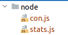

# JavaScript权威指南

---

## 第六章 **对象**

防止某个对象被第三方库意外修改，建议使用Object.create()方法 $\bigstar$

```javascript
let o = {foo: 'bar'};
library.func(Object.create(o))
```

解释Object.create()

```javascript
let o1 = Object.create(null);
// 这里o1没有任何对象属性

let o2 = Object.create(Object.prototype)
//创建一个空对象，类似于{}, new Object()
```

判断一个对象是否含有某个属性

```javascript
let o = {x: 1};
"x" in o; //ture
"toString" in o; //ture

o.hasOwnProperty("x"); // ture
o.hasOwnProperty("toString"); // false 因为·这个是继承的属性。
```

如果把x设置成undefined，

!== undefined 为 ture。

但是"y" in o 输出为false。

可以使用for 和 in 循环来判断一个对象的属性情况。

但是使用这种循环不会出现继承的属性。

```javascript
let o = {
    x: 1,
    y: 2,
    z: 3
};
console.log(o.propertyIsEnumerable("toString")); //显示false，因为这个属性不可枚举，也不是自有属性
console.log('---');
for (let p in o) {
    console.log(p);
}
```

```javascript
let o = {
    x: 1,
    y: 2,
    z: 3
};

for (let p in o) {
    if (!o.hasOwnProperty(p))
        continue //跳过继承属性
}
console.log('---');
for (let p in o) {
    if (typeof o[p] === 'function')
        continue //跳过所有方法
}
```

将一个对象的全部属性给另一个对象

```javascript
let target = {x: 1};
let source = {
    y: 2,
    z: 3
}
for (let key of Object.keys(source)) {
    target[key] = source[key];
}
console.log(target);
```

Object.assign()方法 $\bigstar$

这个方法接受两个及以上的参数。都应该是对象。

```javas
o=Object.assign({},defaults,o);
```

首先会把defaults的属性覆盖了{}，之后的o对象的属性覆盖了前面的对象。

```javascript
o = {...defaults, ...o}
```

与上述的代码相类似。

```javascript
Object.assign({x: 1}, {x: 2, y: 2}, {y: 3, z: 4})
// { x: 2, y: 3, z: 4 }
```

可以在对象的中括号里面加入字符串来当做动态的加入对象的成员，如下：

```javascript
const PROPERTY_NAME = 'p1';

function computerPropertyName() {
    return "p" + 2;
}

let p = {
    [PROPERTY_NAME]: 1,
    [computerPropertyName()]: 2
}

console.log(p.p1 + p.p2);
```

在对象的继承{}当中使用拓展的字符...是不会的继承到父对象的继承属性的。并且后面参数的同名属性会覆盖掉前面对象参数的同名属性。

覆盖的例子是：

```javascript
let o = {x: 1};
let p = {x: 0, ...o};
console.log(p.x); //1
let q = {...o, x: 2};
console.log(q.x); //2
```

不会继承父对象的继承属性的例子是：

```javas
let o = Object.create({x: 1}) // x为o对象的一个继承属性
let p = {...o};
console.log(p.x); // undefined
```

对象的setter，getter方法 $\bigstar$

```javascript
const serialnum = {
    _n: 0,
    get next() {
        return this._n++;
    },
    set next(n) {
        if (n > this._n)
            this._n = n;
    }
}

serialnum.next = 10;
console.log(serialnum.next); //10
console.log(serialnum.next); //11
console.log(serialnum); //{ _n: 12, next: [Getter/Setter] }
```

## 第七章 数组

数组的特性：

+ 数组实质上也是对象
+ 最大的索引值是 $2^{32}-1$
+ 数组从Array.prototype继承属性
+ 定型数组 11.2

---

数组的迭代器方法$\bigstar$

+ forEach():

  **传三个参数：数组元素的值，数组元素索引，数组本身**

  例如，递增每个元素的值：

  ```javas
  let data = [1, 2, 3, 4, 5]
  data.forEach(function (v, i, a) {
      a[i] = v + 1;
  })
  console.log(data);//[ 2, 3, 4, 5, 6 ]
  ```

+ map()：

 对于每个元素来说，都会调用传入的函数，并且将函数的返回值当做新的数组的元素。**注意这个函数需要有返回值。**如果数组是稀疏的，那么缺省的元素不会调用这个函数。

```javascript
let data = [1, 2, 3, 4, 5];

console.log(data.map(x => x * x));//[1, 4, 9, 16, 25]
```

+ filter():

返回一个数组的，而且这个数组一定是稠密的，对于每个元素都是属于原数组的。传入的参数是一个返回布尔类型的函数。

同时，可以清除undefined和null的元素。

```javascript
let data = [1, 2, 3, 4, 5, null, undefined]

console.log(data.filter(x => x < 2));//[ 1, null ]
data = data.filter(x => x !== undefined && x !== null);//去除空元素
console.log(data);//[ 1, 2, 3, 4, 5 ]
```

这个作为参数的函数还能有两个变量，一个是值，一个是index

```javascript
let data = [1, 2, 3, 4, 5, null, undefined]
console.log(data.filter((x, i) => i % 2 === 0));//[ 1, 3, 5, undefined ]
```

+ find() & findIndex():

与filter()类似，传入一个函数作为变量。但是不同之处在于这两个函数是迭代到第一个ture的元素就会停止。而且这两个函数之间的不同是在于一个是迭代元素，一个是迭代坐标的，传入的作为变量的函数的自变量分别是元素和坐标。

+ reduce():

*待续*P155

---

使用flat()打平数组

```javascript
let a = [1, [2, [3, [4]]]]
console.log(a.flat(1));//[ 1, 2, [ 3, [ 4 ] ] ]
console.log(a.flat(2));//[ 1, 2, 3, [ 4 ] ]
console.log(a.flat(3));//[ 1, 2, 3, 4 ]
console.log(a.flat(4));//[ 1, 2, 3, 4 ]
```

使用flat()的变量来指定打平的层数。

---

slice()返回数组切片

传入两个参数，第一个参数为前坐标，第二个参数为后坐标。返回的切片是从前坐标到后坐标-1。如果只传入一个参数，则视为前坐标到数组结束。负数坐标与Python类似，-1表示最后一个元素。

```javascript
let a = [1, 2, 3, 4, 5];
console.log(a.slice(0, 3));//[1, 2, 3]
console.log(a.slice(3));//[4, 5]
console.log(a.slice(1, -1));//[2, 3, 4]
```

splice()

fill()

见P159

---

数组索引的方法

indexOf()表示从前往后找数组的某个元素，找到了就返回坐标值，没有找到就返回-1。

lastIndexOf()表示从后往前找。

sort()方法，默认字典序排列数组。

---

## 第八章 函数

函数表达式可以定义完立即执行

```	javascript
let squared = (function (x) {
    return x * x;
}(10))
console.log(squared)
//100
```

确定是否是严格模式

```javascript
const strict = (function () {
    return !this;
}());
```

在ES2020中，在函数表达式的后面，括号前插入?，从而只在函数不是null和undefined时调用函数。

```javascript
f?.(x)
    //相当于
    (f !== null && f !== undefined) ? f(x) : undefined
```

对于非严格模式下的函数（不是箭头函数）调用，调用上下文（this）是全局对象。在严格模式下，调用上下文是undefined。

---

**this指针$\bigstar\bigstar\bigstar$**

除了箭头函数，嵌套函数不会继承包含函数的this值。

如果嵌套函数（不是箭头函数）被当作函数来调用，则它的this值要么是全局对象（非严格模式），要么是undefined（严格模式）。

```javascript
let o = {
    m: function () {
        let self = this;
        this === o;  // true
        f();

        function f() {
            this === o; // false , this 是 undefined
            self === o; // true
        }
    }
};
o.m();
```

注意在嵌套函数f()的内部，this并不等于对象o，这个问题可以通过在函数之外把一个值定为this来解决。

另外两个解决办法：

+ 将这里的f()改为箭头函数
+ 使用bind()方法

```javascript
let o = {
    m: function () {
        let self = this;
        this === o;  // true
        f();

        const f = () => {
            this === o; // true
        }
    }
};
o.m();


let o = {
    m: function () {
        let self = this;
        this === o;  // true
        f();

        const f = (function () {
            this === o; // ture
        }).bind(this)
    }
};
o.m();
```

接受不同个数的参数，可以使用“剩余形参”的方法（ES6）。但是剩余形参必须要在最后面，例如

```javascript
function max(first = -Infinity, ...rest) {
    let maxValue = first;

    for (let n of rest) {
        if (n > maxValue) {
            maxValue = n;
        }
    }
    return maxValue;
}
```

给函数定义自己的函数属性

```javascript
uniqueInteger.counter = 0;

function uniqueInteger() {
    return uniqueInteger.counter++;
}

console.log(uniqueInteger()); // 0
console.log(uniqueInteger()); // 1
console.log(uniqueInteger); // [Function: uniqueInteger] { counter: 2 }
```

把数据缓存

```javascript
function factorial(n) {
    if (Number.isInteger(n) && n > 0) {
        if (!(n in factorial)) {
            factorial[n] = n * factorial(n - 1);

        }
        return factorial[n];
    } else {
        return NaN;
    }
}

factorial[1] = 1;
console.log(factorial(6));//720
console.log(factorial[5]);//120
console.log(factorial);
/*[Function: factorial] {
    '1': 1,
        '2': 2,
        '3': 6,
        '4': 24,
        '5': 120,
        '6': 720
}*/
```

---

**闭包$\bigstar\bigstar\bigstar$** P188

参看代码

```javascript
let scope = 'global';

function checkScope() {
    let scope = 'local';

    function f() {
        return scope;
    }

    return f;
}

console.log(checkScope()()); // local
```

其它重点看面经 **重要$\bigstar$**

---

call()方法和apply()方法$\bigstar$

他们允许简介调用一个函数，就像是这个对象的函数一样。

```javascript
f.call(o);
f.apply(o);
```

就相当于

```javascript
o.m = f;
o.m();
delete o.m();
```

他们之间的区别是apply()是接受数组的

```javascript
f.call(o, 1, 2);
f.apply(o, [1, 2]);
```

bind()方法$\bigstar$

将一个函数绑定到对象，并且返回一个函数

P194 有点难以理解，**需要反复看**，并且区分箭头函数的this指针情况。

实例代码

```javascript
function f(y) {
    return this.x + y;
}// 需要绑定

let o = {x: 1};
let g = f.bind(o);
console.log(g(2));// 3
let p = {x: 10, g, f};
console.log(p.g(2));// g 仍然绑定到o，输出3
console.log(p.f(2)); // 12
```

---

## 第九章 对象

原型与构造函数的关系。

类从原型继承属性。

```javascript
let F = function () {
};
let p = F.prototype;
let c = p.constructor;
console.log(c === F);//true
```

定义一个类，注意里面的迭代器方法

```javascript
class Range {
    constructor(from, to) {
        this.from = from;
        this.to = to;
    }

    //类的方法之间不需要分号，并且也不需要function关键字
    includes(x) {
        return this.from <= x && x <= this.to;
    }

    * [Symbol.iterator]() {
        for (let x = Math.ceil(this.from); x <= this.to; x++) {
            yield x;
        }
    }//这个生成器方法让这个类可以迭代

    toString() {
        return `${this.from}...${this.to}`;
    }
}

let r = new Range(1, 5);
console.log(r.includes(4));//true
console.log([...r]) //[ 1, 2, 3, 4, 5 ]
```

类里面的代码**默认严格模式**

函数的声明会提升，但是类的声明不会提升。

JavaScript类的静态方法：

比如给上面的类加上静态方法

```javascript
static
parse(s)
{
    let matches = s.match(/^\((\d+)\.\.\.(\d+)\)$/);
    if (!matches) {
        throw new TypeError(`cannot parse ${s}`)
    }
    return new Range(parseInt(matches[1]), parseInt(matches[2]));
}
```

必须通过构造函数才能调用它，Range.prototype.parse()也不行。

```javascript
let r = Range.parse('(1...10)');
console.log(r.includes(4));//true
console.log([...r]) //[1, 2, 3, 4,  5, 6, 7, 8, 9, 10]
```

为已经声明的类添加方法，应该对原型直接添加，因为类从原型继承属性。

```javascript
if (!Range.prototype.fun) {
    Range.prototype.fun = function (s) {
        return s;
    }
}
```

JavaScript类的继承实际上就是子类的原型继承了父类的原型，在ES5之前的继承方法如下所示：

```javascript
function Span(start, span) {
    if (span >= 0) {
        this.from = start;
        this.to = start + span;
    } else {
        this.to = start;
        this.from = start + span;
    }
}

Span.prototype = Object.create(Range.prototype);
Span.prototype.constructor = Span;//定义自己构造函数
let s = new Span(1, 4);
console.log([...s]);
```

**如果很多子类的功能极其类似，那么应该”能组合就不继承“(favor composition over inheritance)**

抽象类与类层次 无法理解此存在意义，有机会再补充 P222

---

## 第十章 模块

node的require方法不是官方承认的

ES6是export与import

导出函数（*无法理解*）：

```javascript
const stats = (function () {
    const sum = (x, y) => x + y;
    const square = x => x * x;

    function mean(data) {
        return data.reduce(sum) / data.length;
    }

    function stddev(data) {
        let m = mean(data);
        return Math.sqrt(
            data.map(x => x - m).map(square).reduce(sum) / (data.length - 1)
        );
    }

    return {mean, stddev};
}());

console.log(stats.mean([1, 3, 5, 9, 7]));//5
console.log(stats.stddev([1, 3, 5, 7, 9]));//3.1622776601683795
```

*上面的这个立即执行的常函数是有必要的吗？*

---

Node使用require方法导入其他模块，这些模块在导入之前在自己的命名空间里面是私有的，通过设置Expoets对象的属性或者完全替换module.exports对象来导出公共API。

Node定义了一个始终有定义的全局对象exports，可以将想导出的对象设定为这个全局exports对象的属性。

如果只是想导出一个函数或者类，就直接把导出的值赋值到module.exports

```javascript
module.exports = {
    mean, stddev
}
```

导入对象的require返回导出的值。

文件视图如下所示：



可以通过导入整个对象或者解构赋值的方法导入部分特定的属性

```javascript
const stats = require('./stats');
const {stddev} = require('./stats')
const data = [1, 3, 5, 9, 7];
console.log(stats.mean(data));
console.log(stddev(data));
```

解构对象的重命名

```javascript
const {stddev: ddd} = require('./stats');//解构对象的重命名
const data = [1, 3, 5, 9, 7];
console.log(ddd(data));//3.1622776601683795
```

---

ES6中的模块自动应用严格模式。即无法使用with和arguments对象。 其余的看链接[konw](know.md)

---

对于ES6标准来说，使用export关键字导出即可，或者导出一个对象

```javascript
export const PI = Math.PI;

//直接导出，通过export关键字
export class Circle {
    constructor(r) {
        this.r = r;
    }

    area() {
        return PI * this.r * this.r;
    }
}

//或者如下方式导出
export {PI, Circle}
```

注意，export关键字只能出现在JavaScript的顶层。并且如果这个模块只导出一个对象，应该使用export default关键字。为模块的默认导出，一个模块只能有一个默认导出。

```javascript
export default class BitSet{
    //
}
```

导入时使用import关键字，并且模块的默认导出的值会变成当前模块中指定标识符的值。

```javascript
import {BitSet} from "./bitset";

// 重命名

import {BitSet as bbb} from "./bitset";
```

---

## 第十一章 JavaScript标准库

可以使用Set的has方法来看一个元素是否位于这个集合中

```javascript
let primes = new Set([2,3,5,7]);
console.log(primes.has(2)); //true
console.log(primes.has(5)); //true
console.log(primes.has('5')); //false
```

因为Set也可以迭代，所以可以使用...把它拆开

```javascript
console.log(...primes); // 2 3 5 7
```

Map对象提供了一个与数组类似的键值对查询到功能，但是没有数组的下标取值快。

与集合一样，任何的JavaScript值都可以作为键或值，包括null，undefined和NaN，对象和数组。并且使用了全等性来比较key。

```javascript
let m = new Map();
ob = {};
m.set({}, 1);
m.set({}, 2);
m.set(ob, 3);
console.log(m.size);//3
console.log(m.get({}));//undefined
console.log(m.get(ob));//3
```


---

## 第十二章 迭代器与生成器

可以使用...来展开或者拓展可迭代对象

```javascript
let charsList = [..."abcd lbwnb"];
console.log(charsList);//[ 'a', 'b', 'c', 'd', ' ', 'l', 'b', 'w', 'n', 'b']
```

可以通过map的entries()，keys()和values()方法来迭代map的键值对，键和值。

```javascript
let m = new Map();
ob = {};
m.set({}, 1);
m.set({}, 2);
m.set(ob, 3);

console.log([...m.entries()])
//[ [ {}, 1 ], [ {}, 2 ], [ {}, 3 ] ]
```

可迭代对象指的是任何具有专用迭代器的方法，并且该方法返回迭代器对象。以下的可迭代对象iterable的简单for/of循环的迭代器方法没有惯用名称，所以使用Symbol.iterator作为名字。

```javascript
let iterable = [99];
let iterator = iterable[Symbol.iterator]();
for (let res = iterator.next(); !res.done; res = iterator.next()) {
    console.log(res.value); // 99
}
```

---

实现可迭代对象