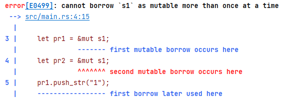

# WASM

记录WebAssembly的学习笔记。**下定决心，不怕牺牲，排除万难，去争取胜利。**

## rust基础

### 语法知识1

贴一个简单的小程序，用于猜数字。

```rust
use std::io;

fn main() {
    println!("guess the number");
    let mut guess = String::new();
    io::stdin().read_line(&mut guess).expect("error");
    println!("{}", guess)
}
```

在这个语言中，`println!`是宏的意思，因为有`!`。

在rust中，变量默认是不可变的，是immutable的，需要使用mut关键字来修饰才可变。如上面的`let mut guess = String::new();`。

`String::new()`这里表示String类型的关联函数`new()`。`pub const fn new() -> String`

`read_line(&mut guess)`中的&表示参数是一个引用。前面加上mut也是表示这个是可变的变量。

对于rust生成随机数，可以在cargo.toml中添加依赖，如下所示

```toml
[package]
name = "cargotest2"
version = "0.1.0"
edition = "2021"

# See more keys and their definitions at https://doc.rust-lang.org/cargo/reference/manifest.html

[dependencies]
rand = "^0.3.14"
```

再使用`cargo build`命令可以下载所需要的包。

```rust
use std::io;
use rand::Rng;

fn main() {
    let some_intergater:u32 = rand::thread_rng().gen_range(1..101);
    let mut guess:String=String::new();
    io::stdin().read_line(&mut guess).expect("msg");
    println!("{}--{}",some_intergater,guess)
}

```

值得注意的是，rust推荐是下划线命名法。

对于生成随机数的`gen_range()`来说，它需要一个`R: SampleRange<T>`参数，所以说是`1..101`，这里是左闭右开的。

在使用比较大小的操作中，不使用大于号或者小于号的操作，而是使用match操作，对于match中的分支，被称为arm。

使用`let guess:u32=guess.trim().parse().expect("");`语句先来去除前后空格，之后的`parse()`表示解析类型，所以前面必须要显式指定类型。并且使用expect方法是用于处理parse()方法中枚举错误的操作。示例代码如下：

```rust
    let guess:u32=guess.trim().parse().expect("");

    match guess.cmp(&some_intergater){
        Ordering::Less=>{
            println!("too small")
        },
        Ordering::Greater=>println!("too big"),
        Ordering::Equal=>println!("Is it.")

    }
```

类似于别的语言的`while(true)`，rust中提供了loop关键字，它也可以通过break退出循环。

```rust
use rand::Rng;
use std::cmp::Ordering;
use std::io;

fn main() {
    let some_intergater = rand::thread_rng().gen_range(1..101);
    println!("end {}",some_intergater);
    loop {
        println!("猜测一个数字");
        let mut guess: String = String::new();
        io::stdin().read_line(&mut guess).expect("error");
        let guess: u32 = guess.trim().parse().expect("error");

        match guess.cmp(&some_intergater) {
            Ordering::Less => {
                println!("too small.")
            }
            Ordering::Greater => println!("too big."),
            Ordering::Equal => {
                println!("Is it.");
                break;
            }
        }
    }
}
```

**请注意`print!()`和`println!()`的区别。现在使用的是`println!()`。**

对于复合类型，rust提供了元组和数组两种方式，可以类似于JavaScript的解析变量，同时，对于元组，也可以下标取值。

```javascript
let t:(i32,f64,u8)=(123,5.6,3);
let (a,b,c)=t;
```


并且，编译器会自动推导类型。

对于数组来说，每个类型都是相同的。

其中，`let a=[3;5]`与`let a=[3,3,3,3,3]`等价。

在rust中，函数的名字需要显式标出参数类型和返回值类型，例如

```rust
fn add(a:usize, b:usize) -> usize {
    return a+b;
}
```

### rust的所有权$\bigstar$

rust的所有权使得rust无需GC，也能保证内存安全，是一个很重要的特性。


区分栈内存和堆内存，栈内存是固定大小的，堆内存不固定大小。

把数据压到栈内存中会比分配到堆内存中快得多，对于栈内存来说，不能叫做“分配”。

并且，由于指针的大小是固定的，所以会被压到栈内存中。


对于String分配的内存需要注意以下两点：

1. rust中的字符串字面值表示的是在代码中已经写定的字符串。
2. 为了保存类似于用户输入的这种可变的字符串，rust创建了第二种，即String类型。

所以String类型是保存在堆内存中。而字符串字面量是直接硬编码在内存中以保证了使用的高效。对于简单变量比如说i32来说，会发生复制，而不是所有权的转换。

并且类似于上文猜数字的代码中，可以通过字符串字面量来创建String，例如`let mut s = String::from("123");`


而在拷贝复杂数据的时候，参考JavaScript的浅拷贝，数据结构是这样的，这里以String为例，变量指针放在stack里面，数据存放在heap里面：


而一个变量离开作用域的时候，会删除heap数据，因为有两个变量，很有可能导致多次释放变量的错误，所以在Rust里面的做法是在语句`let s2=s1`中，废弃掉s1。不同于其他语言的浅拷贝或者是深拷贝，rust中的这个操作，可以叫做“移动”。如果想要类似于其他语言的深拷贝，在rust里面叫做“克隆”。

```rust
fn main() {
    let s1 = String::from("hello world");
    let s2 = s1.clone();
    println!("{}", s1);
    println!("{}", s2);
}
```

对于一个函数来说：

+ 把一个值赋值给其他变量的时候就会发生移动
+ 当一个包含heap数据的变量离开作用域的时候，它的值就会被drop函数清理掉，除非数据的所有权移动到另一个函数变量上面了。

```rust
fn main() {
    let s1 = String::from("Hello");
    let len = calculate_length(&s1);
    println!("{} len is {}", s1, len);
}

fn calculate_length(s: &String) -> usize {
    return s.len();
}

```

在rust中，&表示引用，表示引用某些值而不取得所有权。


如上图，可以看出s是s1的一个引用。

在以上函数`calculate_length(s: &String) -> usize`的作用域范围内，离开了作用域，s指向的值也不能被销毁，因为s只是一个引用，并没有获得字符串的所有权，这种情况叫做“借用”。借用的东西默认是不能修改的。如果想要修改，必须在函数的声明中加入关键字`mut`。

```rust
fn main() {
    let mut s1 = String::from("Hello");
    let len = calculate_length(&mut s1);
    println!("{} len is {}", s1, len);
}

fn calculate_length(s: &mut String) -> usize {
    s.push_str(" world!");
    return s.len();
}

```

可变引用的一个限制：**在特定作用域内，对每一块数据，只能有一个可变的引用。**

String是由指针，容量和长度组成，&str是由指针和长度组成。直接写好的字符串常量在动态内存中。

例如如下代码：

```rust
fn main() {
    let mut s1 = String::from("Hello");
    let pr1 = &mut s1;
    let pr2 = &mut s1;
    pr1.push_str("ptr1");
    pr2.push_str("ptr2");
    println!("{}", s1);
}
```

会报错，因为对于可变变量s1进行了两次可变引用。



还有一个限制是不能把一个可变变量同时给一个可变引用和一个不可变引用。

```rust
fn main() {
    let mut   s1 = String::from("Hello");
    let pr1 = &mut s1;
    let pr2 = & s1;
    pr1.push_str("ptr1");
    // pr2.push_str("ptr2");
    println!("{}", s1);
}
```


悬空引用：一个引用的的值已经被销毁了，但是引用还在，之后这个引用很有可能修改与之无关的值。而在rust中，编译器会保证这种情况不会发生。

例如以下的代码是不行的

```rust
fn main() {
    let mut s2 = re_str();
}

fn re_str() -> &mut String {
    let mut s = String::from("hello");
    return &mut s;
}
```

因为在出定义域之外s已经被销毁了。

rust中还有一个不持有所有权的数据结构，切片(slice)

```rust
fn main() {
    let  s2 = String::from("hello world");
    let fac1=&s2[0..5];
    let fac2 = &s2[6..s2.len()];
    println!("{} {}", fac1,fac2);
}

```

在切片中，0和`s2.len()`都可以省略，这里的切片坐标是左闭右开的。实际上，字符串字面值就是切片。并且，对于函数的参数来说，建议使用字符串切片来当作参数，即`&str`。如果是字符串，就转化为切片的形式使用。

### rust的模块化编程

[了解下Rust 模块使用方式 - 知乎 (zhihu.com)](https://zhuanlan.zhihu.com/p/474899358)

可以在src下构建一个文件夹，例如utils，并且在文件夹里面创建文件mod.rs，类似于JavaScript的index.js。参考

```rust
pub fn get_add(a: isize, b: isize) -> isize {
    return a + b;
}
```

需要在main中使用`mod`关键字引用，再使用`use`关键字使用这个函数：

```rust
mod utils;

use utils::get_add;

fn main() {
    let a: isize = 63;
    let b: isize = 3;
    let ans = get_add(a, b);
    println!("ans is {}", ans);
}

```

编译执行后：


### rust命令行参数

如果想用不具名的命令行参数，直接使用env包即可。

如果想使用有名字的命令行参数，可以使用clap库，使用命令`cargo add clap --features derive`安装。

如果需要cargo换源，参考[更换cargo源_LittleTan24的博客-CSDN博客_cargo换源](https://blog.csdn.net/tanshiqian/article/details/121963284)

Cargo.toml类似于

```toml
[package]
name = "rustuni"
version = "0.1.0"
edition = "2021"

# See more keys and their definitions at https://doc.rust-lang.org/cargo/reference/manifest.html

[dependencies]
clap = { version = "4.0.22", features = ["derive"] }

```

在使用clap的时候，参考代码

```rust
use clap::Parser;

/// Simple program to greet a person
#[derive(Parser, Debug)]
#[command(author, version, about, long_about = None)]
struct Args {
    /// Name of the person to greet
    #[arg(short, long)]
    name: String,

    /// Number of times to greet
    #[arg(short, long, default_value_t = 1)]
    count: u8,
}

fn main() {
    let args = Args::parse();

    for _ in 0..args.count {
        println!("Hello {}!", args.name)
    }
}
```

在编译之后，还可以使用`-h`命令


在使用的时候可以使用`./rustuni --name masaikk`来使用。并且对于编译命令来说，使用`--`可以连接build时候的命令行参数，如下所示：

```shell
cargo run --package rustuni --bin rustuni -- --name masaikk --count 2
```


`--`后面的值都变成了build之后运行的参数。

### 结构体

使用`struct`创建结构体，例如

```rust
struct Rectangle {
    height: u32,
    width: u32,
}
```

在使用的时候，可以使用借用的方法

```rust
struct Rectangle {
    height: u32,
    width: u32,
}

fn main() {
    let rec = Rectangle {
        height: 3,
        width: 4,
    };
    println!("{}",calculate_sum(&rec));
}

fn calculate_sum(r: &Rectangle) -> u32 {
    let sum = r.height * r.width ;
    return sum;
}
```

如果想在没定义fmt方法的情况下还想打印全部信息，可以加上注释`#[derive(Debug)]`，并且使用`println!("{:?}", rec);`打印：

```rust
#[derive(Debug)]
struct Rectangle {
    height: u32,
    width: u32,
}

fn main() {
    let rec = Rectangle {
        height: 3,
        width: 4,
    };
    println!("{:?}", rec);
    println!("{}", calculate_sum(&rec));
}

fn calculate_sum(r: &Rectangle) -> u32 {
    let sum = r.height * r.width;
    return sum;
}
```


使用`impl`关键字定义方法，并且第一个参数使用自己的引用`&self`

```rust
impl Rectangle {
    fn calculate_me(&self) -> u32 {
        self.height * self.width
    }
}
```

使用实例的加方法名运行`rec.calculate_me()`，并且这里rust会自动为调用方法的实例取借用，所以等价于`(&rec).calculate_me()`

类似与CPP的静态方法，在rust里面叫做关联函数。与实例方法的区别在于在调用的使用使用`::`，例如：

```rust
#[derive(Debug)]
struct Rectangle {
    height: u32,
    width: u32,
}

fn main() {
    let r = Rectangle::rec_as(10);
    println!("{}", r.calculate_me());
}

impl Rectangle {
    fn calculate_me(&self) -> u32 {
        self.height * self.width
    }

    fn rec_as(length: u32) -> Rectangle {
        Rectangle {
            height: length,
            width: length,
        }
    }
}

```

其中`Rectangle::rec_as(10);`就是关联函数。

---

## rust构建WASM

可以参考[WebAssembly 与 Rust 编程系列05 Rust编写wasm模块_austindev的博客-CSDN博客_rust wasm](https://blog.csdn.net/austindev/article/details/107093013#:~:text=我们需要把rust代码编译成wasm目标模块%2C必须安装 rust WebAssembly 对应的target,我们可以通过 rustup 的target命令%2C 了解可用的target 以及是否安装)

首先初始化项目

```shell
cargo new --lib hello-wasm
```

注意这里要``--lib``

然后可以在lib.rs中输入示例代码

```rust
extern crate wasm_bindgen;
use wasm_bindgen::prelude::*;

#[wasm_bindgen]
extern {
    pub fn alert(s: &str);
}

#[wasm_bindgen]
pub fn greet(name: &str){
    alert(&format!("hello {} !",name));
}
```

其次，在cargo.toml中引入依赖

```toml
[package]
name = "hello-wasm"
version = "0.1.0"
edition = "2021"

# See more keys and their definitions at https://doc.rust-lang.org/cargo/reference/manifest.html

[lib]
crate-type = ["cdylib"]

[dependencies]
wasm-bindgen = "0.2"

```

然后需要安装在编译的依赖，根据以上引用的文章，安装 `wasm32-unknown-unknown`

```shell
rustup target add wasm32-unknown-unknown
```

之后使用`cargo build --release --target wasm32-unknown-unknown`可以进行编译，在target下面可以找到wasm文件。

参考[博客](https://blog.csdn.net/weixin_47723549/article/details/126161165)

在clion中创建一个rust的lib项目，在这里可以看到src下是lib.rs


在Cargo.toml中写依赖：

```toml
[package]
name = "rustlibDemo1"
version = "0.1.0"
edition = "2021"

# See more keys and their definitions at https://doc.rust-lang.org/cargo/reference/manifest.html

[lib]
crate-type = ["cdylib"]

[dependencies]
wasm-bindgen = "0.2.78"
base64 = "0.13.0"

[package.metadata.wasm-pack.profile.release]
wasm-opt = false

```

在lib.rs里面写示例代码，定义两个函数，这里的函数名之后在js中也能用到

```rust
use wasm_bindgen::prelude::*;
use base64::decode;

//解析base64
#[wasm_bindgen]
pub fn my_str(s:String) -> String{
    let s = base64::decode(s).unwrap();
    return String::from_utf8(s.clone()).unwrap();
}
//计算两个数相加
#[wasm_bindgen]
pub fn add(a:i32, b:i32) -> i32{
    return a+b;
}
```

配置build，主要是设置target为web


按照clion的提示安装相关依赖，使用clion进行build操作之后，可以看到这里有文件在pkg里面。


创建一个html文件，导入js文件

```html
<!DOCTYPE html>
<html lang="en">
<head>
    <meta charset="UTF-8">
    <title>Title</title>
    <script type="module">
        import init, {add, my_str} from "./pkg/rustlibDemo1.js";

        init().then(() => {
            console.log(add(1, 2))
            console.log(my_str("6ams6LWb5p+v5p+v"))
        });
    </script>
</head>
<body>

</body>
</html>
```

可以成功运行，在控制台中打出如下信息：


对于vue3项目来说，可以考虑在onMounted阶段导入init函数，然后异步await。

示例代码如下

```vue
<template>
  <div>
    <h1>
      {{ msg }}
    </h1>
    <button @click="clickHandler">click</button>
  </div>
</template>

<script lang="ts">
import {onBeforeMount, Ref, ref} from "vue";
import init, {my_str, add} from "./pkg";
import {onMounted} from "vue";

export default {
  name: "WasmComp1",

  setup() {
    let msg: Ref<string> = ref('initial');
    onBeforeMount(async () => {
      await init();
    })
    const clickHandler = () => {
      alert(my_str('6ams6LWb5p+v5p+v'))
    }
    onMounted(() => {
      console.log(add(114, 514))
    })

    return {
      msg,
      clickHandler
    }
  }

}
</script>
```

绑定了按钮点击事件，能正常展示：


为了使得整个app可以加载一次wasm模块而不是每次挂载组件都init一次，可以把init函数在app组件中使用

```vue
<script setup lang="ts">
import HelloWorld from './components/HelloWorld.vue'
import init from "./components/comp/wasmComp1/pkg";
import {onBeforeMount} from "vue";
onBeforeMount(async ()=>{
  console.log('use init function');
  await init()
})
</script>

<template>
  <HelloWorld msg="Hello Demo4 + Vite" />
</template>
```

也可以达到上图效果。

类似的，在nextjs这种SSR框架中，也可以使用以上的操作。在_app.tsx中导入init函数并且异步await。

可以使用react的钩子函数`useEffect()`不过需要注意的是，这个hook里面不能直接使用async函数，示例如下：

```tsx
import '../styles/globals.css'
import type {AppProps} from 'next/app'
import init from "@/components/UseWASMComp1/pkg";
import {useEffect} from "react";

function MyApp({Component, pageProps}: AppProps) {
    useEffect(() => {
        async function initAsync() {
            await init();
            console.log('initial WASM pkg');
        }
        initAsync();
    }, [])

    return <Component {...pageProps} />
}

export default MyApp

```

具体在页面中，用法相似：

```tsx
import React, {useEffect} from "react";
import {Button} from "antd";
import init, {add, my_str} from "@/components/UseWASMComp1/pkg";

const UseWASMComp1: React.FC = () => {

    const clickHandler = () => {
        console.log(my_str('6ams6LWb5p+v5p+v'));
        console.log(add(114, 514));
    }

    return (
        <>
            <Button onClick={clickHandler}>use wasm</Button>
        </>
    )
}

export default UseWASMComp1;
```

可以得到一样的效果。


---
