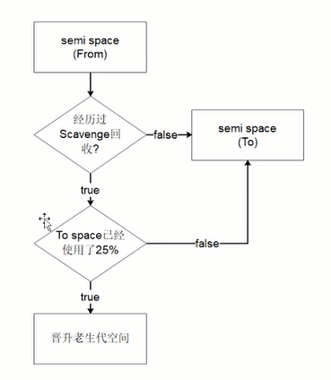

# 前端面试基础知识

408知识位于首页的[408文件](../408.md)

参考[掘金链接](https://juejin.cn/post/7016593221815910408)

---

## 面试杂项知识-计算机网络相关

### http与https

http是使用tcp协议获取服务器超文本数据的协议。https是用ssl加密的，安全的http。

http 协议的默认端口为 80，https 的默认端口为 443。

---

### https的工作流程

1. 客户端使用 https url 访问服务器，则要求 web 服务器`建立 ssl 链接`。
2. web 服务器接收到客户端的请求之后，会`将网站的证书（证书中包含了公钥），传输给客户端`。
3. 客户端浏览器通过双方协商一致的安全等级，`建立会话密钥`，然后通过网站的公钥来加密会话密钥，并传送给网站。
4. web 服务器`通过自己的私钥解密出会话密钥`。
5. web 服务器`通过会话密钥加密与客户端之间的通信`。

---

### TCP的三次握手和四次挥手

待补充

---

### TCP/IP保证数据传输的可靠性

对字节流分段并进行编号然后`通过 ACK 回复`和`超时重发`这两个机制来保证。

+ 为了保证数据包的可靠传递，发送方必须把已发送的数据包保留在缓冲区；
+ 并为每个已发送的数据包启动一个超时定时器；
+ 如在定时器超时之前收到了对方发来的应答信息（可能是对本包的应答，也可以是对本包后续包的应答），则释放该数据包占用的缓冲区;
+ 否则，重传该数据包，直到收到应答或重传次数超过规定的最大次数为止。
+ 接收方收到数据包后，先进行CRC校验，如果正确则把数据交给上层协议，然后给发送方发送一个累计应答包，表明该数据已收到，如果接收方正好也有数据要发给发送方，应答包也可方在数据包中捎带过去。

---

### TCP与UDP的区别

参考[掘金](https://juejin.cn/post/6992743999756845087)

+ TCP是面向连接的，UDP是无连接的。
+ TCP仅仅支持单播，UDP支持多播。
+ TCP是可靠的，UDP是不可靠的。
+ UDP的头部开销比TCP的更小，数据传输速率更高，实时性更好。

---

### Cookie、sessionStorage、localStorage 的区别

+ cookie数据大小不能超过4k；sessionStorage和localStorage的存储比cookie大得多，可以达到5M以上。
+ cookie设置的过期时间之前一直有效；localStorage永久存储，浏览器关闭后数据不丢失除非主动删除数据；sessionStorage数据在当前浏览器窗口关闭后自动删除。
+ cookie的数据会自动的传递到服务器；sessionStorage和localStorage数据保存在本地。

---


## 编程语言基础知识

### JS中类型检测的三种方法

1. ``typeof``关键字

   ```javascript
   console.log(typeof 1);               // number
   console.log(typeof true);            // boolean
   console.log(typeof 'mc');            // string
   console.log(typeof Symbol)           // function
   console.log(typeof function(){});    // function
   console.log(typeof console.log());   // function
   console.log(typeof []);              // object 
   console.log(typeof {});              // object
   console.log(typeof null);            // object
   console.log(typeof undefined);       // undefined
   ```

2. ``instanceof``关键字

   ```javascript
   console.log(1 instanceof Number);                    // false
   console.log(true instanceof Boolean);                // false 
   console.log('str' instanceof String);                // false  
   console.log([] instanceof Array);                    // true
   console.log(function(){} instanceof Function);       // true
   console.log({} instanceof Object);                   // true
   ```

3. ``Object.prototype.toString.call()``方法

   ```javascript
   var toString = Object.prototype.toString;
   console.log(toString.call(1));                      //[object Number]
   console.log(toString.call(true));                   //[object Boolean]
   console.log(toString.call('mc'));                   //[object String]
   console.log(toString.call([]));                     //[object Array]
   console.log(toString.call({}));                     //[object Object]
   console.log(toString.call(function(){}));           //[object Function]
   console.log(toString.call(undefined));              //[object Undefined]
   console.log(toString.call(null));                   //[object Null]
   ```

---

### this的指向问题

+ 作为普通函数执行时，`this`指向`window`。

+ 当函数作为对象的方法被调用时，`this`就会指向`该对象`。

+ 构造器调用，`this`指向`返回的这个对象`。

+ 箭头函数 箭头函数的`this`绑定看的是`this所在函数定义在哪个对象下`，就绑定哪个对象。如果有嵌套的情况，则this绑定到最近的一层对象上。

+ 基于Function.prototype上的 `apply 、 call 和 bind `调用模式，这三个方法都可以显示的指定调用函数的 this 指向。`apply`接收参数的是数组，`call`接受参数列表，`` bind`方法通过传入一个对象，返回一个` this `绑定了传入对象的新函数。这个函数的 `this`指向除了使用`new `时会被改变，其他情况下都不会改变。若为空默认是指向全局对象window。

---

### new运算符的实现机制

1.  首先创建了一个新的`空对象`。
2.  `设置原型`，将对象的原型设置为函数的`prototype`对象。
3.  让函数的`this`指向这个对象，执行构造函数的代码（为这个新对象添加属性）。
4.  判断函数的返回值类型，如果是值类型，返回创建的对象。如果是引用类型，就返回这个引用类型的对象。

---

### Promise

promise传入一个函数作为参数，这个函数包含两个参数，分别是``resolve``和``reject``，而且它们本身也是函数。示例异步代码：

```javascript
setTimeout(()=>{
    console.log('setTime out 1000 ms');
},1000)
```

包裹后为：

```javascript
new Promise((resolve, reject) => {
    setTimeout(()=>{
        console.log('setTime out 1000 ms');
    },1000)
})
```

可以将之间的log函数写成``resolve()``，这样的话执行到了这里就直接执行then函数。类似于：

```javascript
new Promise((resolve, reject) => {
    setTimeout(()=>{
        resolve()
    },1000)
}).then(()=>{
    console.log('then ');
})
```

then函数使用一个函数作为其参数进行使用。promise里面的``resolve()``中使用的参数作为then函数作为参数的函数中的参数进行使用，例如

```javascript
new Promise((resolve, reject) => {
    setTimeout(()=>{
        resolve('111argu')
    },1000)
}).then((s)=>{
    console.log('then ');
    console.log(s)
})
```

可以化简如下链式的调用情况

```javascript
setTimeout(() => {
    console.log('第一层');
    console.log('第一层');
    console.log('第一层');
    console.log('第一层');
    setTimeout(() => {
        console.log('第二层');
        console.log('第二层');
        console.log('第二层');
        console.log('第二层');
        setTimeout(() => {
            console.log('第三层');
            console.log('第三层');
            console.log('第三层');
            console.log('第三层');
        }, 1000)
    }, 1000)
}, 1000)
```

可以在then函数中返回设置新的promise对象。

```java
new Promise((resolve, reject) => {
    setTimeout(() => {
        resolve()
    }, 1000)
}).then(() => {
    console.log('第一层');
    console.log('第一层');
    console.log('第一层');
    console.log('第一层');
    return new Promise((resolve, reject) => {
        setTimeout(() => {
            resolve()
        }, 1000)
    })
}).then(() => {
    console.log('第二层');
    console.log('第二层');
    console.log('第二层');
    console.log('第二层');
    return new Promise((resolve, reject) => {
        setTimeout(() => {
            resolve()
        }, 1000)
    })
}).then(() => {
    console.log('第三层');
    console.log('第三层');
    console.log('第三层');
    console.log('第三层');
})
```

then()函数还能接收两个参数，实际上是then()和catch()两个参数的简写。

**promise的三种状态**

+ pending：等待状态，比如正在进行网络请求
+ fulfill：满足状态，主动回调了resolve()时就是这个状态，会回调then()
+ reject：拒绝状态，主动回调了reject()时就是这个状态，会回调catch()

形如以上的三层链式调用的代码（代码位于code/js/other/promise/化简链式.js），如果第二第三层中没有异步操作的话，还可以有简写形式。

使用``return Promise.resolve(res)``的方法。

例如以下的代码

```javascript
new Promise((resolve, reject) => {
    setTimeout(() => {
        resolve()
    }, 1000)
}).then(() => {
    console.log('第一层');
    console.log('第一层');
    console.log('第一层');
    console.log('第一层');
    return new Promise((resolve, reject) => {
        resolve()
    })
}).then(() => {
    console.log('第二层');
    console.log('第二层');
    console.log('第二层');
    console.log('第二层');
    return new Promise((resolve, reject) => {
        resolve()
    })
}).then(() => {
    console.log('第三层');
    console.log('第三层');
    console.log('第三层');
    console.log('第三层');
})
```

可以化简为：

```javascript
new Promise((resolve, reject) => {
    setTimeout(() => {
        resolve()
    }, 1000)
}).then(() => {
    console.log('第一层');
    console.log('第一层');
    console.log('第一层');
    console.log('第一层');
    return Promise.resolve()
}).then(() => {
    console.log('第二层');
    console.log('第二层');
    console.log('第二层');
    console.log('第二层');
    return Promise.resolve()
}).then(() => {
    console.log('第三层');
    console.log('第三层');
    console.log('第三层');
    console.log('第三层');
})
```

甚至以上代码的``return Promise.resolve()``都可以直接省略.

代码位于``code/js/other/promise/化简非异步链式.js``

**异常的问题**

在链式的调用的过程中可以使用``throw``的语法糖来直接调用链式的某一次的catch函数。之后的链式结构都不会继续执行。

```javascript
new Promise((resolve, reject) => {
    setTimeout(() => {
        resolve()
    }, 1000)
}).then(() => {
    console.log('第一层');
    console.log('第一层');
    console.log('第一层');
    console.log('第一层');
	return //这里如果调用resolve()无参数的话可以直接省略d
}).then(() => {
    console.log('第二层');
    console.log('第二层');
    console.log('第二层');
    throw "x出现错误，调用catch"
    console.log('第二层');

}).then(() => {
    console.log('第三层');
    console.log('第三层');
    console.log('第三层');
    console.log('第三层');
}).catch((err)=>{
    console.log(err);
})

/*
第一层
第一层
第一层
第一层
第二层
第二层
第二层
x出现错误，调用catch
*/
```

**顺序**
先执行promise里面的的同步代码，然后再执行then里面的异步代码，可以使用事件循环来解释。

```javascript
new Promise((resolve, reject) => {
    setTimeout(()=>{
        resolve('111argu');
        console.log('after resolve');
        reject('reject')
    },1000)
}).then((s)=>{
    console.log('then ');
    console.log(s)
}).catch((e)=>{
    console.log(e);
}).finally(()=>{
    console.log('finally');
})
```

以上代码输出

```shell
then 
111argu
finally
after resolve
```

---

### 防抖和节流

#### 具体场景

节流：滚动加载更多、搜索框搜的索联想功能、高频点击、表单重复提交
防抖：搜索框搜索输入，并在输入完以后自动搜索、手机号，邮箱验证输入检测、窗口大小 resize 变化后，再重新渲染

#### 代码说明

```javascript
/**
 * 节流函数 一个函数执行一次后，只有大于设定的执行周期才会执行第二次。有个需要频繁触发的函数，出于优化性能的角度，在规定时间内，只让函数触发的第一次生效，后面的不生效。
 * @param fn要被节流的函数
 * @param delay规定的时间
 */
function throttle(fn, delay) {
    //记录上一次函数触发的时间
    var lastTime = 0;
    return function(){
        //记录当前函数触发的时间
        var nowTime = Date.now();
        if(nowTime - lastTime > delay){
            //修正this指向问题
            fn.call(this);
            //同步执行结束时间
            lastTime = nowTime;
        }
    }
}

document.onscroll = throttle(function () {
    console.log('scllor事件被触发了' + Date.now());
}, 200); 

/**
 * 防抖函数  一个需要频繁触发的函数，在规定时间内，只让最后一次生效，前面的不生效
 * @param fn要被节流的函数
 * @param delay规定的时间
 */
function debounce(fn, delay) {
    //记录上一次的延时器
    var timer = null;
    return function () {
       //清除上一次的演示器
        clearTimeout(timer);
        //重新设置新的延时器
        timer = setTimeout(function(){
            //修正this指向问题
            fn.apply(this);
        }, delay); 
    }
}
document.getElementById('btn').onclick = debounce(function () {
    console.log('按钮被点击了' + Date.now());
}, 1000);

```

---

针对视图的长宽

```html
    <style>
        .inner {
            width: 1vmin;
            height: 1vmin;
            background: blue;
        }
    </style>
```

根据CSS3规范，视口单位主要包括以下4个：

1. vw：相对于视口的宽度， 视口被均分为 100 单位的vw，1vw等于视口宽度的1%。

2. vh：相对于视口的宽度， 视口被均分为 100 单位的vh，1vh等于视口高度的1%。

3. vmin：选取vw和vh中最小的那个。

4. vmax：选取vw和vh中最大的那个。

---

## Django要点

### csrf

由于django对于post等登陆接口的保护，所以设置了“跨站请求伪造保护”机制，即csrf。实质上就是对于post请求的字段中增加了应该token用来保证整个请求是真实的用户发送的（但是不能防止xss注入）。如果只是在模板中的表单里面使用csrf机制，只要在表单里面添加````，详见[官方文档](https://docs.djangoproject.com/zh-hans/4.0/ref/csrf/)，在此讨论在前后端分离的项目中使用这个机制。

创建新的django项目之后，可以看到csrf中间件是默认开启的，即``django.middleware.csrf.CsrfViewMiddleware``已经在settings.py的``MIDDLEWARE``字段中。例如：

```python
MIDDLEWARE = [
    'corsheaders.middleware.CorsMiddleware',
    'django.middleware.security.SecurityMiddleware',
    'django.contrib.sessions.middleware.SessionMiddleware',
    'django.middleware.common.CommonMiddleware',
    
    'django.middleware.csrf.CsrfViewMiddleware',

    'django.contrib.auth.middleware.AuthenticationMiddleware',
    'django.contrib.messages.middleware.MessageMiddleware',
    'django.middleware.clickjacking.XFrameOptionsMiddleware',
]
```

设置测试的路由``path('po/',views.testpost,name='po')``，对应函数

```python
def testpost(request):
    return HttpResponse('Got post successfully')
```

直接用postman测试，返回403，显示被csrf挡了


但是，get请求是不会被csrf挡住的，所以提供如下解决post不被挡住的思路：

1. 安排一个设置token的接口，使用get获取，并且将token保存在本地的cookies中
2. 在发post到安排了csrf的端口之前，解析本地的cookies，获取到token字段
3. 将token的名字设置为``X-CSRFToken``添加到post的head中。
4. 最后再发送post请求。

下面对于以上步骤进行说明：

设置获取token的get端口：

```python
from django.middleware.csrf import get_token,rotate_token

def set_cook(request):
    get_token(request)
    rotate_token(request)
    return render(request,'rrl.html')
```

以上代码也可以用如下方式代替

```python
from django.views.decorators.csrf import ensure_csrf_cookie
    
@ensure_csrf_cookie
def server(request):
 
    return render(request,'server.html')
```

即可获取包含了token的cookies：


在post环境下，可以在test中写如下JavaScript代码，获取这里的cookies并且可以进行下一次请求的发送：

```javascript
var csrf_token = postman.getResponseCookie("csrftoken").value
postman.clearGlobalVariable("csrftoken");
postman.setGlobalVariable("csrftoken", csrf_token);
```

以上代码的意思是设置了一个叫``csrftoken``的postman的全局变量，来保存这里的token

在下一个post请求的head中，设置如下：


使用mustache语法来添加head里面的``X-CSRFToken``字段，再次对于刚才被csrf拒绝的端口进行测试，即可成功运行。

**使用axios解决csrf问题** 待补充

**csrf装饰器对于视图函数的设置：**

装饰器`csrf_protect`可以在全局未开启csrf保护的时候单独为某一个视图函数添加csrf保护。

装饰器``csrf_exempt``可以忽略一个视图函数的csrf保护。

---

### cors

参考https://www.ruanyifeng.com/blog/2016/04/cors.html

CORS是一个W3C标准，全称是"跨域资源共享"（Cross-origin resource sharing）。


---

### django部署

对于生成环境来说，使用``python manage.py runserver``来说是不合适的。可以使用uWSGI服务器来运行django项目。但是由于自己的机子装不好uwsgi，所以使用docker安装。测试的django项目名字叫做sjor。


**首先使用uwsgi搭建可以使用http的环境的方法。这里可以直接用浏览器访问。**

拉取python:3.8镜像并且映射端口。使用``docker cp /path id:/sjor``命令将项目文件复制到编号为id的容器的/sjor目录下。

因为python镜像的CMD命令是``python3``所以应该使用``docker exec -it id bash``attach到容器的bash中。使用``pip install -r requirements.txt``安装依赖。参考依赖：

```markdown
asgiref==3.5.1
backports.zoneinfo==0.2.1
Django==4.0.4
mysqlclient==2.1.0
PyMySQL==1.0.2
sqlparse==0.4.2
typing_extensions==4.2.0
uWSGI==2.0.20
```

使用``uwsgi --ini uwsgi.ini``来运行项目，示例的代码如下：

```ini
[uwsgi]
http = :8002
chdir = /sjor
wsgi-file = sjor/wsgi.py
process = 4
threads = 2
pidfile = pro.pid
daemonize=sjor.log
master=true
```

可以使用``uwsgi --stop pro.pid``来停止服务。

以上表示将http请求发送到了容器8002端口。如果在运行容器的时候进行了端口映射，那么直接浏览器访问就可以看到:


可以在容器内使用``ps -aux``看到进程列表：


**还可以考虑使用uwsgi和nginx的方法来搭建发送socket的后端。这里不能直接用浏览器访问uswgi。**

这里可以使用uwsgi的socket服务而不是使用http，这样的话就更快。

```ini
[uwsgi]
socket = :8002
chdir = /sjor
wsgi-file = sjor/wsgi.py
process = 4
threads = 2
pidfile = pro.pid
daemonize = sjor.log
master = true
vacuum = true
max-requests = 1000
limit-as = 512
buffer-size = 30000

```

开启一个nginx容器，映射端口80到宿主机上，如下所示：

```nginx
upstream todj{
    server 119.23.182.180:10003 weight=1;
}

server {
    listen       80;
    listen  [::]:80;
    server_name  localhost;

    access_log  /var/log/nginx/host.access.log  main;

    location / {
        uwsgi_pass todj;
        include /etc/nginx/uwsgi_params;
    }

    #error_page  404              /404.html;

    # redirect server error pages to the static page /50x.html
    #
    error_page   500 502 503 504  /50x.html;
    location = /50x.html {
        root   /usr/share/nginx/html;
    }

}
```

这里的流的名字，要加入到django项目的``ALLOW_HOST``字段中。例如这里的``todj``。

打开本地宿主机被绑定的端口，可以看到已经成功访问了：


但是如果是本地docker的Python容器运行的uwsgi，用nginx进行上述连接会报错。

```markdown
An error occurred.
Sorry, the page you are looking for is currently unavailable.
Please try again later.

If you are the system administrator of this resource then you should check the error log for details.

Faithfully yours, nginx.
```

---

### nginx转发到django

背景：如果有多台服务器，可以部署多个后端对数据进行分布式处理。配合docker等工具，虽然有多个服务器，但是前端在请求的时候只用请求nginx服务器，之后的工作由nginx处理。并且使用nginx的反向代理可以顺带解决跨域请求的问题。如果每个服务器端配置不同，可以通过nginx实现端口转发，负载控制操作。碰巧我就有那么几台服务器，所以可以部署诺干个django后端。并且可以使用nginx的代理操作将某一个请求的端口号省略掉。

在宝塔或者阿里云控制台等开启某防火墙端口，运行django，确保可以直接访问。

django里面的app的views视图可以添加如下函数:

```python
def showG(request):
    print('Request from {}:'.format(request.META['REMOTE_ADDR']))
    return HttpResponse('get')
```

使用``runserver``运行服务器。

本地运行一个docker的nginx容器，使用如下命令``docker run -it -d -p 12345:80 nginx``

浏览器打开[http://127.0.0.1:12345](http://127.0.0.1:12345)就可以看到nginx默认页面


可以修改配置文件``etc/nginx/conf.d/defalut.conf``进行一次反向代理

```nginx
server {
    listen       80;
    listen  [::]:80;
    server_name  www.masaikk.xyz;

    #access_log  /var/log/nginx/host.access.log  main;

    location / {
        proxy_pass http://www.masaikk.xyz:10003;
        proxy_redirect default;
    }

    #error_page  404              /404.html;

    # redirect server error pages to the static page /50x.html
    #
    error_page   500 502 503 504  /50x.html;
    location = /50x.html {
        root   /usr/share/nginx/html;
    }

}
```

这里将本地的80转发到了``http://www.masaikk.xyz:10003``，可以正常访问。


后端也可以正常收到请求并且记录。


添加对于多个服务器的配置，在配置文件中添加如下流：

```nginx
upstream todj{
    server www.masaikk.xyz:10003;
    server 119.23.182.180:10003;
}
```

**这个流的名字``todj``需要添加到django的ALLOW_HOSTS中。**

修改配置文件

```nginx
upstream todj{
    server www.masaikk.xyz:10003;
    server 119.23.182.180:10003;
}

server {
    listen       80;
    listen  [::]:80;
    server_name  www.masaikk.xyz;

    #access_log  /var/log/nginx/host.access.log  main;

    location / {
        proxy_pass http://todj;
        proxy_redirect default;
    }

    #error_page  404              /404.html;

    # redirect server error pages to the static page /50x.html
    #
    error_page   500 502 503 504  /50x.html;
    location = /50x.html {
        root   /usr/share/nginx/html;
    }

}


```

重启容器，即可达到预想效果：


两台服务器都能收到请求。

同时，可以通过设置权重的方式来设置对于每个服务器的访问流量控制。

```nginx
upstream todj{
    server www.masaikk.xyz:10003 weight=1;
    server 119.23.182.180:10003 weight=3;
}
```

也可以使用上述说明的使用socket的方式和nginx沟通，不过需要注意的是，使用了socket的ip不需要记上``http://``等前缀。

---

#### django admin

可以使用admin对于model层的数据进行可视化操作。（感觉比pycharm好看一些）

如果需要对于某个model的类进行管理，需要在那个app的admin中注册：

```python
from django.contrib import admin

# Register your models here.
from useapi.models import User, MusicLog


@admin.register(User)
@admin.register(MusicLog)
class UserAdmin(admin.ModelAdmin):
    pass

```

以上是使用类以及装饰器的方法。

---

## V8引擎


### 简述

在v8中，负责内存回收的只有两个部分New Space 和 Old Space。

Large Object Space的意义是，如果一个对象在定义了之后，大小大于了定义的大小，就不会进入New Space而是进入Large Object Space。

Code Space为JIT的空间，JIT在这里存储已编译的代码块。

如果一个对象被指针引用或者指向了其他对象的话，那么这个对象会放在老生代的Old Pointer Space中。如果是原始对象，没有指针引用，就放在Old Data Space。


### 垃圾回收

新生代非垃圾copy算法：


向左边的From块中加入了数据，即橙色的。之后还需要再加入新的数据，当如果左边的from块中数据满了，就从左边的块中copy非垃圾块到右边的to块。然后将to块转变成from块，再继续刚才的操作。

这种情况下是牺牲空间换时间，因为from块和to块一定有一块是没用上的，但是copy数据的速度是很快的。

老生代的标记清除或者标记整理算法：


标记清除(Mark-Sweep)算法使用了广度优先探索将与根节点中有关的数据标记起来，没被搜索到的就是垃圾。之后就可以被清除。

标记整理(Mark-Compact)算法是在广度优先搜索之后将被标记的数据整理到一起，之后把别的区域的数据直接删除。这样做的好处是在整理的过程中，需要留下的数据将部分不需要的数据挤掉了，这样可以减少之后删除无用数据的时间。

### 新生代晋升到老生代



首先先看这个数据在新生代有没有被复制一次，再看to空间是否已经使用了25%以上，若两个条件都满足，就可以将这个数据升级到老生代。

### v8处理变量

在浏览器中可以使用``window.perforance``查看当前使用的内存情况。


使用--max-old-space-size来设置老生代的大小，使用--max-new-space-size设置新生代大小。注意前面的单位是MB，后面的单位是KB。

js中的局部变量会随着程序的结束并且没有引用时被销毁，而全局变量将不会变化。

---

## JavaScript执行过程

参考https://blog.csdn.net/wexin_37276427/article/details/105028116

对于常见编译型语言（例如：`Java` ）来说，编译步骤分为：词法分析 -> 语法分析 -> 语义检查 -> 代码优化和[字节码](https://so.csdn.net/so/search?q=字节码&spm=1001.2101.3001.7020)生成

对于解释型语言（例如：`JavaScript` ）来说，编译阶通过词法分析 -> 语法分析 -> [代码生成](https://so.csdn.net/so/search?q=代码生成&spm=1001.2101.3001.7020)，就可以解释并执行代码了。

例如以下代码：

```javascript
(()=>{
    let li = [...[1,2]];
})()
```

在语法分析之后的tokens阶段的输出为

```json
{
  "type": "Program",
  "body": [
    {
      "type": "ExpressionStatement",
      "expression": {
        "type": "CallExpression",
        "callee": {
          "type": "ArrowFunctionExpression",
          "id": null,
          "params": [],
          "body": {
            "type": "BlockStatement",
            "body": [
              {
                "type": "VariableDeclaration",
                "declarations": [
                  {
                    "type": "VariableDeclarator",
                    "id": {
                      "type": "Identifier",
                      "name": "li"
                    },
                    "init": {
                      "type": "ArrayExpression",
                      "elements": [
                        {
                          "type": "SpreadElement",
                          "argument": {
                            "type": "ArrayExpression",
                            "elements": [
                              {
                                "type": "Literal",
                                "value": 1,
                                "raw": "1"
                              },
                              {
                                "type": "Literal",
                                "value": 2,
                                "raw": "2"
                              }
                            ]
                          }
                        }
                      ]
                    }
                  }
                ],
                "kind": "let"
              }
            ]
          },
          "generator": false,
          "expression": false,
          "async": false
        },
        "arguments": []
      }
    }
  ],
  "sourceType": "script"
}
```

当 JS 引擎开始执行第一行 JavaScript 代码时，它会创建一个全局执行上下文然后将它压到执行栈中，每当引擎遇到一个函数调用，它会为该函数创建一个新的执行上下文并压入栈的顶部。

引擎会执行那些执行上下文位于栈顶的函数。当该函数执行结束时，执行上下文从栈中弹出，控制流程到达当前栈中的下一个上下文。

```javascript
let a = 'Hello World!';
function first() {
  console.log('Inside first function');
  second();
  console.log('Again inside first function');
}
function second() {
  console.log('Inside second function');
}
first();
console.log('Inside Global Execution Context');
```


下面对于创建执行上下文进行解释：

- 绑定 `this`
- 创建**词法环境**
- 创建**变量环境**

在 ES6 中，**词法环境**和**变量环境**的一个不同就是前者被用来存储函数声明和变量（``let`` 和`` const``）绑定，而后者只用来存储`` var ``变量绑定。

---

### 

