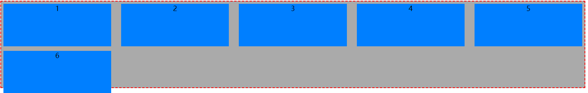

# css学习

---

## flex布局

代码位于[masaikk/jss (gitee.com)](https://gitee.com/masaikk/jss)。学习视频[【黑马！真的很详细！】CSS3-flex布局(flex布局的单个知识点忘记也可以复习)_哔哩哔哩_bilibili](https://www.bilibili.com/video/BV1N54y1i7dG)和[五分钟掌握 css3 flex弹性布局 超详细！_哔哩哔哩_bilibili](https://www.bilibili.com/video/BV1Lp4y1S7XM)

---

#### display

将根组件加上``display: flex;``可以将该节点变为flex盒子。

基本的flex如下所示

```html
<!DOCTYPE html>
<html lang="en">
<head>
    <meta charset="UTF-8">
    <title>useFlex</title>
    <style type="text/css">
        #roo {
            background-color: #aaaaaa;
            height: 200px;
            border: red 2px dashed;
            display: flex;
            width: 80%
        }

        .inn {
            margin: 5px;
            height: 100px;
            width: 150px;
            background-color: #007fff;
            text-align: center;
        }
    </style>
</head>
<body>
<div>
    <div id="roo">
        <span class="inn">1</span>
        <span class="inn">2</span>
        <span class="inn">3</span>
    </div>
</div>
</body>
</html>
```

展示的界面如下


如果要让这三块依次排布，则可以在根节点上加入``justify-content: space-around;``便可以得到如下效果：


代码位于flex/basic/useflex.html

**当父盒子设置为flex布局之后，子元素的float,clear,vertical-align都会失效。**

flex的默认主轴是行，即属性``flex-direction: row;``默认存在。此时y轴就算是侧轴，元素沿着主轴排列。``flex-direction: row-reverse;``表示行内倒排，即如下：


如果子元素在轴上显示不开，就会压缩子元素的大小，即``flex-wrap: nowrap;``。如果不想要，就设置``flex-wrap: wrap;``例如

```html
<!DOCTYPE html>
<html lang="en">
<head>
    <meta charset="UTF-8">
    <title>useFlex</title>
    <style type="text/css">
        body{

        }

        #roo {
            background-color: #aaaaaa;
            height: 200px;
            border: red 2px dashed;
            display: flex;
            width: 80%;
            justify-content: space-between;
            /*flex-direction: row;*/
            /*flex-direction: row-reverse;*/
            flex-wrap: wrap;
        }

        .inn {
            margin: 5px;
            height: 100px;
            width: 250px;
            background-color: #007fff;
            text-align: center;
        }
    </style>
</head>
<body>
<div>
    <div id="roo">
        <span class="inn">1</span>
        <span class="inn">2</span>
        <span class="inn">3</span>
        <span class="inn">4</span>
        <span class="inn">5</span>
        <span class="inn">6</span>

    </div>
</div>
</body>
</html>

```




#### justify-content

**``justify-content``属性是设置主轴上的排布。**

设置为``justify-content: flex-end;``可以让元素靠右排列


设置``justify-content: space-between;``表示两边贴边，中间平分。


#### align-items

设置侧轴上的子元素排列方式 （单行情况）


#### align-content

侧轴上子元素的排列方式（换行情况）

```css
flex-wrap: wrap;
align-content: flex-start;
```


取消父节点的height属性并且修改``align-content: space-between;``显示为：


align-content属性参考如下，注意此时只能在换行才有效，单行是无效的，都是以侧轴而言的。 单行的只能考虑align-item


#### flex子元素属性

子元素的flex属性表示子元素可以分到多少份，从**剩余空间**之间划分。

比如如下代码，中间第二块div划分到全部的剩余空间

```html
<!DOCTYPE html>
<html lang="en">
<head>
    <meta charset="UTF-8">
    <title>useFlex</title>
    <style type="text/css">
        section{
            display: flex;
            width: 60%;
            height: 150px;
            background-color: pink;
            margin: 0 auto;
        }
        section > div{
            border: 1px black dotted;
            text-align: center;
        }

        section div:nth-child(1){
            width: 100px;
            height: 150px;
            background-color: red;
        }
        section div:nth-child(2){
            flex:1;
            background-color: white;
        }
        section div:nth-child(3){
            width: 100px;
            height: 150px;
            background-color: blue;
        }
    </style>
</head>
<body>
<div>
    <section id="roo">
        <div class="inn">1</div>
        <div class="inn">2</div>
        <div class="inn">3</div>
    </section>

</div>
</body>
</html>

```


而且左右两侧的宽度是固定的，但是中间这块的宽度是可以压缩的，为圣杯布局。


将flex盒子里的子元素全部设置flex到1，就可以实现均匀分布

```html
    <p>
        <span>1</span>
        <span>2</span>
        <span>3</span>
    </p>
```

```css
        p{
            display: flex;
            width: 60%;
            height: 150px;
            background-color: pink;
            margin: 100px auto;
        }

        p > span{
            flex: 1;
            text-align: center;
            border: 1px black dotted;
        }
```

显示的效果：


使用子节点的``align-self``属性可以控制自己的样式，例如

```css
        div span:nth-child(3){
            align-self: flex-end;
        }
```


---

## 居中的若干种方法


### 水平居中

#### 块级元素一般居中

```css
.son {
    margin: 0 auto;
}
```

示例代码

```html
<!DOCTYPE html>
<html lang="en">
<head>
    <meta charset="UTF-8">
    <title>brock</title>
    <style>
        .father {
            width: 80%;
            height: 1000px;
            background-color: pink;
        }

        .son {
            width: 200px;
            height: 200px;
            margin: 0 auto;
            text-align: center;
            background-color: gray;
        }
    </style>
</head>
<body>
<div class="father">
    <div class="son">aaa</div>
</div>

</body>
</html>
```


代码位于``center/brock/1.html``

#### 块级元素子元素含float

```css
.parent{
    width:fit-content;
    margin:0 auto;
}

.son {
    float: left;
}
```

示例代码

```html
<!DOCTYPE html>
<html lang="en">
<head>
    <meta charset="UTF-8">
    <title>brock</title>
    <style>
        .father {
            /*width: 80%;*/
            height: 1000px;
            background-color: pink;
            width:fit-content;
            margin:0 auto;
        }

        .son {
            width: 200px;
            height: 200px;
            margin: 0 auto;
            text-align: center;
            background-color: gray;
            float: left;
        }
    </style>
</head>
<body>
<div class="father">
    <div class="son">aaa</div>
</div>

</body>
</html>
```


代码位于``center/brock/2.html``

#### flex

```css
.parent {
    display: flex;
    justify-content: center;
}

```

示例代码

```html
<!DOCTYPE html>
<html lang="en">
<head>
    <meta charset="UTF-8">
    <title>brock</title>
    <style>
        .father {
            width: 80%;
            height: 1000px;
            background-color: pink;
            display: flex;
            justify-content: center;
        }

        .son {
            width: 200px;
            height: 200px;
            margin: 0 auto;
            text-align: center;
            background-color: gray;
            /*float: left;*/
        }
    </style>
</head>
<body>
<div class="father">
    <div class="son">aaa</div>
</div>

</body>
</html>
```


