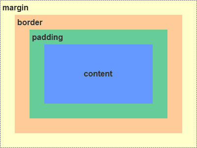
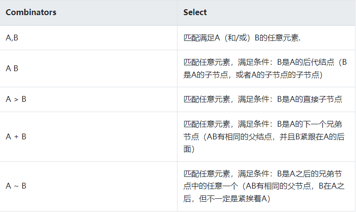
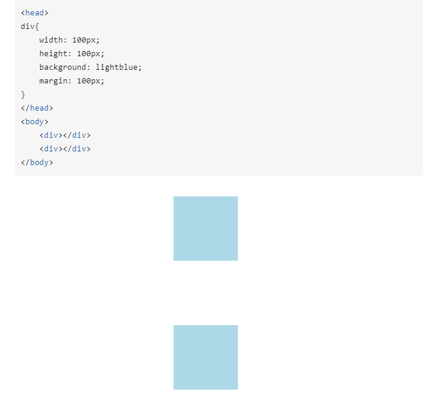
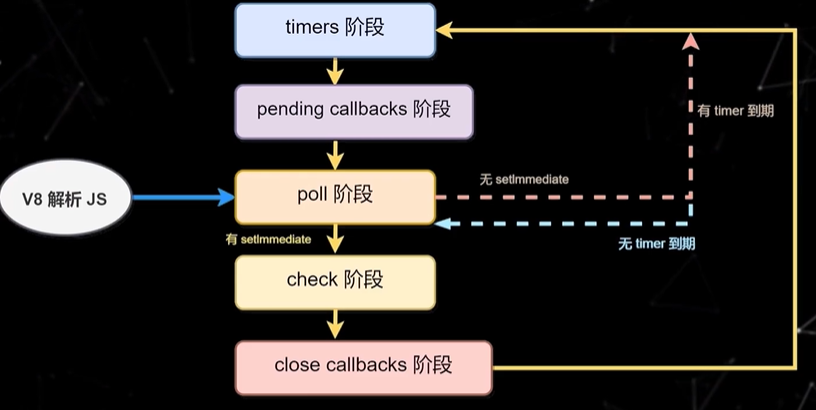
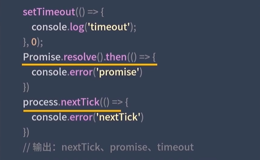
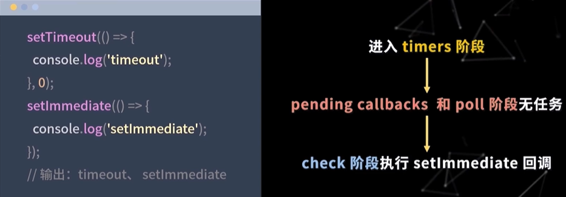
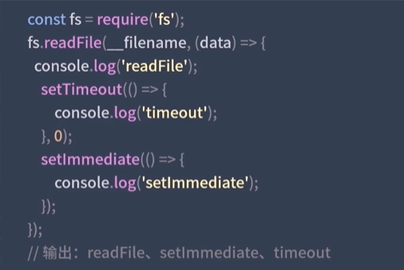
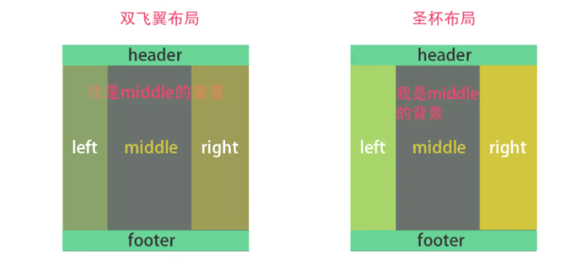

# 前端面经的飞书笔记

*飞书文档链接[Docs (feishu.cn)前端](https://bytedance.feishu.cn/base/app8Ok6k9qafpMkgyRbfgxeEnet?table=tblEnSV2PNAajtWE&view=vewJHSwJVd)*

主要记录该文档的前端基础，框架，以及Node部分。Vue部分可以参考vue3的网课和官方文档（感觉主要内容在于vue3的迁移部分[はじめに | Vue.js (vuejs.org)](https://v3.ja.vuejs.org/guide/migration/introduction.html)）。

有时候，看到别人的好的项目就会懊恼，感叹自己水平低下。我在这里放下两个参考范例：[VOICEVOX/voicevox: 無料で使える中品質なテキスト読み上げソフトウェア、VOICEVOXのエディター (github.com)](https://github.com/VOICEVOX/voicevox)和[MakinoharaShoko/WebGAL: 全新的基于 Web 的 视觉小说引擎 | A brand new Visual Novel engine based on Web. (github.com)](https://github.com/MakinoharaShoko/WebGAL)

---

## 前端基础

### 原型链

[JavaScript深入之从原型到原型链 · Issue #2 · mqyqingfeng/Blog (github.com)](https://github.com/mqyqingfeng/Blog/issues/2)

感觉是ES5重点，在JS权威指南的笔记中有写到prototype。

别人的示例代码如下

```javascript
function Person() {

}
// 虽然写在注释里，但是你要注意：
// prototype是函数才会有的属性
Person.prototype.name = 'Kevin';
var person1 = new Person();
var person2 = new Person();
console.log(person1.name) // Kevin
console.log(person2.name) // Kevin
```

类的prototype也是一个对象。

**每一个JavaScript对象(除了 null )都具有的一个属性，叫\_\_proto\_\_，这个属性会指向该对象的原型。**


**每个原型都有一个 constructor 属性指向关联的构造函数。**


```javascript
function Person() {

}

var person = new Person();

console.log(person.__proto__ == Person.prototype) // true
console.log(Person.prototype.constructor == Person) // true
// 顺便学习一个ES5的方法,可以获得对象的原型
console.log(Object.getPrototypeOf(person) === Person.prototype) // true
```

而对于对象Object的prototype指向的那个对象，是没有\_\_proto\_\_属性的。

并且，对于constructor来说，设置以下的例子

```javascript
function Person() {

}
var person = new Person();
console.log(person.constructor === Person); // true
```

当获取 person.constructor 时，其实 person 中并没有 constructor 属性,当不能读取到constructor 属性时，会从 person 的原型也就是 Person.prototype 中读取，正好原型中有该属性，所以：

```javascript
person.constructor === Person.prototype.constructor
```


---

### 继承

[JavaScript深入之继承的多种方式和优缺点 · Issue #16 · mqyqingfeng/Blog (github.com)](https://github.com/mqyqingfeng/Blog/issues/16)

*感觉这里是ES5留下的糟粕，还应该关注一下webpack babel转义ES6之后具体用的哪种方式。*

继承分为原型链继承，经典（使用构造函数）继承，组合继承，原型式继承，寄生式继承，寄生组合式继承六种。下面将讨论优缺点

🌑原型链继承为：

```javascript
function Parent () {
    this.name = 'kevin';
}

Parent.prototype.getName = function () {
    console.log(this.name);
}

function Child () {

}

Child.prototype = new Parent();

var child1 = new Child();

console.log(child1.getName()) // kevin
```

这里带来了两个缺点：

+ 父对象的属性对于每个子对象来说都是共用的（相当于静态属性）。
+ 在创建 Child 的实例时，不能向Parent传参。

🌒以下是使用构造函数继承的方法

```javascript
function Parent () {
    this.names = ['kevin', 'daisy'];
}

function Child () {
    Parent.call(this);
}

var child1 = new Child();

child1.names.push('yayu');

console.log(child1.names); // ["kevin", "daisy", "yayu"]

var child2 = new Child();

console.log(child2.names); // ["kevin", "daisy"]
```

这里的优点在于父对象的每个属性在不同的子对象里面有各自的。并且也可以向父对象传参了。

```javascript
function Parent (name) {
    this.name = name;
}

function Child (name) {
    Parent.call(this, name);
}

var child1 = new Child('kevin');

console.log(child1.name); // kevin

var child2 = new Child('daisy');

console.log(child2.name); // daisy
```

*这里的call()方法观看之前js权威指南的笔记。*

这种继承方法的缺点是，方法都在构造函数中定义，每次创建实例都会创建一遍方法。

🌓组合继承。即使用原型链继承和构造函数合并的继承法一起用，如下所示：

```javascript
function Parent (name) {
    this.name = name;
    this.colors = ['red', 'blue', 'green'];
}

Parent.prototype.getName = function () {
    console.log(this.name)
}

function Child (name, age) {

    Parent.call(this, name);
    
    this.age = age;

}

Child.prototype = new Parent();
Child.prototype.constructor = Child;

var child1 = new Child('kevin', '18');

child1.colors.push('black');

console.log(child1.name); // kevin
console.log(child1.age); // 18
console.log(child1.colors); // ["red", "blue", "green", "black"]

var child2 = new Child('daisy', '20');

console.log(child2.name); // daisy
console.log(child2.age); // 20
console.log(child2.colors); // ["red", "blue", "green"]
```

优点：融合原型链继承和构造函数的优点，是 JavaScript 中最常用的继承模式。

🌔原型式继承

类似于重写Object.create()方法

```javascript
function createObj(o) {
    function F(){}
    F.prototype = o;
    return new F();
}
```

缺点：包含引用类型的属性值始终都会共享相应的值，这点跟原型链继承一样。

```javascript
var person = {
    name: 'kevin',
    friends: ['daisy', 'kelly']
}

var person1 = createObj(person);
var person2 = createObj(person);

person1.name = 'person1';
console.log(person2.name); // kevin

person1.friends.push('taylor');
console.log(person2.friends); // ["daisy", "kelly", "taylor"]
```

注意：修改`person1.name`的值，`person2.name`的值并未发生改变，并不是因为`person1`和`person2`有独立的 name 值，而是因为`person1.name = 'person1'`，给`person1`添加了 name 值，并非修改了原型上的 name 值。

🌕寄生式继承

创建一个仅用于封装继承过程的函数，该函数在内部以某种形式来做增强对象，最后返回对象。

```javascript
function createObj (o) {
    var clone = Object.create(o);
    clone.sayName = function () {
        console.log('hi');
    }
    return clone;
}
```

缺点：跟借用构造函数模式一样，每次创建对象都会创建一遍方法。

🌖寄生组合式继承

```javascript
function Parent (name) {
    this.name = name;
    this.colors = ['red', 'blue', 'green'];
}

Parent.prototype.getName = function () {
    console.log(this.name)
}

function Child (name, age) {
    Parent.call(this, name);
    this.age = age;
}

// 关键的三步
var F = function () {};

F.prototype = Parent.prototype;

Child.prototype = new F();


var child1 = new Child('kevin', '18');

console.log(child1);

function object(o) {
    function F() {}
    F.prototype = o;
    return new F();
}

function prototype(child, parent) {
    var prototype = object(parent.prototype);
    prototype.constructor = child;
    child.prototype = prototype;
}

// 当我们使用的时候：
prototype(Child, Parent);
```

这里有点看不懂。

这种方式的高效率体现它只调用了一次 Parent 构造函数，并且因此避免了在 Parent.prototype 上面创建不必要的、多余的属性。与此同时，原型链还能保持不变；因此，还能够正常使用 instanceof 和 isPrototypeOf。开发人员普遍认为寄生组合式继承是引用类型最理想的继承范式。

---

### 闭包

ECMAScript中，闭包指的是：

1. 从理论角度：所有的函数。因为它们都在创建的时候就将上层上下文的数据保存起来了。哪怕是简单的全局变量也是如此，因为函数中访问全局变量就相当于是在访问自由变量，这个时候使用最外层的作用域。
2. 从实践角度：以下函数才算是闭包：
   1. 即使创建它的上下文已经销毁，它仍然存在（比如，内部函数从父函数中返回）
   2. 在代码中引用了自由变量

实例代码

```javascript
var scope = "global scope";
function checkscope(){
    var scope = "local scope";
    function f(){
        return scope;
    }
    return f;
}

var foo = checkscope();
console.log(foo());
// local scope
```

了解VO上下文的问题。

---

### 函数的立即调用

```javascript
//向下面这样定义的函数可以通过在函数名后加一对括号进行调用，像这样`foo()`，
//因为foo相对于函数表达式`function(){/* code */}`只是一个引用变量

var foo = function(){/* code */}

//那这可以说明函数表达式可以通过在其后加上一对括号自己调用自己吗？

function(){ /* code */}(); //SyntaxError: Unexpected token (
```

正如你所看到的，这里捕获了一个错误。当圆括号为了调用函数出现在函数后面时，无论在全局环境或者局部环境里遇到了这样的`function`关键字，默认的，它会将它当作是一个函数声明，而不是函数表达式，如果你不明确的告诉圆括号它是一个表达式，它会将其当作没有名字的函数声明并且抛出一个错误，因为函数声明需要一个名字。

```javascript
//然而函数声明语法上是无效的，它仍然是一个声明，紧跟着的圆括号是无效的，因为圆括号里需要包含表达式

function foo(){ /* code */ }();//SyntaxError: Unexpected token

//现在，你把一个表达式放在圆括号里，没有抛出错误...,但是函数也并没有执行，因为：

function foo(){/* code */}(1)

//它等同于如下，一个函数声明跟着一个完全没有关系的表达式:

function foo(){/* code */}
(1);
```

在Javascript里，圆括号不能**包含**声明。因为这点，当圆括号为了包裹函数碰上了 `function`关键词，它便知道将它作为一个函数表达式去解析而不是函数声明。

- 当圆括号出现在匿名函数的末尾想要调用函数时，它会默认将函数当成是函数声明。
- 当圆括号包裹函数时，它会默认将函数作为表达式去解析，而不是函数声明。

---

### instanceof 原理

这个操作符的实际意义是检查右值的prototype属性是否在左值的原型链上。查看代码

```javascript
function Foo() {
}

Object instanceof Object // true
Function instanceof Function // true
Function instanceof Object // true
Foo instanceof Foo // false
Foo instanceof Object // true
Foo instanceof Function // true

```

Foo 函数的 `prototype` 属性是 `Foo.prototype`，而 Foo 的 `__proto__` 属性是 `Function.prototype`，由图可知，Foo 的原型链上并没有 `Foo.prototype` ，因此 `Foo instanceof Foo` 也就返回 false 。

手写代码

```javascript
function instanceOf(left, right) {
    let leftValue = left.__proto__;
    let rightValue = right.prototype;
    while(leftValue ){ 
        if(leftValue === rightValue ){
        return true
        }else{
          leftValue = leftValue.__proto__
        }         
   }
   return false   
}
```

---

### bind

``bind()`` 方法会创建一个新函数。当这个新函数被调用时，``bind()`` 的第一个参数将作为它运行时的 ``this``，之后的一序列参数将会在传递的实参前传入作为它的参数.

```javascript
var foo = {
    value: 1
};

function bar() {
    console.log(this.value);
}

// 返回了一个函数
var bindFoo = bar.bind(foo); 

bindFoo(); // 1
```

如果大于一个参数，那就相当于传参

```javascript
var foo = {
    value: 1
};

function bar(name, age) {
    console.log(this.value);
    console.log(name);
    console.log(age);

}

var bindFoo = bar.bind(foo, 'daisy');
bindFoo('18');
// 1
// daisy
// 18
```

---

### apply和 call

#### call

- 调用 call 的对象，必须是个函数 Function。
- call 的第一个参数，是一个对象。 Function 的调用者，将会指向这个对象。如果不传，则默认为全局对象 window。
- 第二个参数开始，可以接收任意个参数。每个参数会映射到相应位置的 Function 的参数上。但是如果将所有的参数作为数组传入，它们会作为一个整体映射到 Function 对应的第一个参数上，之后参数都为空。

#### apply

- 它的调用者必须是函数 Function，并且只接收两个参数，第一个参数的规则与 call 一致。
- 第二个参数，必须是数组或者类数组，它们会被转换成类数组，传入 Function 中，并且会被映射到 Function 对应的参数上。这也是 call 和 apply 之间，很重要的一个区别。

---

### V8的垃圾回收机制

[一文搞懂V8引擎的垃圾回收 - 掘金 (juejin.cn)](https://juejin.cn/post/6844904016325902344)

---

### Promise

Promise 必须为以下三种状态之一：等待态（Pending）、执行态（Fulfilled）和拒绝态（Rejected）。一旦Promise 被 resolve 或 reject，不能再迁移至其他任何状态（即状态 immutable）。

1. 初始化 Promise 状态（pending）
2. 立即执行 Promise 中传入的 fn 函数，将Promise 内部 resolve、reject 函数作为参数传递给 fn ，按事件机制时机处理
3. 执行 then(..) 注册回调处理数组（then 方法可被同一个 promise 调用多次）
4. Promise里的关键是要保证，then方法传入的参数 onFulfilled 和 onRejected，必须在then方法被调用的那一轮事件循环之后的新执行栈中执行。

---

### 盒子模型



区分IE模式与标准模式

IE模式为**width=content+padding**

标准模式为**width=content**

通过css3新增的属性 `box-sizing: content-box | border-box`分别设置盒模型为标准模型（`content-box`）和IE模型（`border-box`）。

当两个垂直外边距相遇时，他们将形成一个外边距，合并后的外边距高度等于两个发生合并的外边距的高度中的较大者。

BFC：块级格式化上下文

**BFC的原理（渲染规则）**

1. BFC元素垂直方向的边距会发生重叠。属于不同BFC外边距不会发生重叠
2. BFC的区域不会与浮动元素的布局重叠。
3. BFC元素是一个独立的容器，外面的元素不会影响里面的元素。里面的元素也不会影响外面的元素。
4. 计算BFC高度的时候，浮动元素也会参与计算(清除浮动)

**如何创建BFC**

1. overflow不为visible;
2. float的值不为none；
3. position的值不为static或relative；
4. display属性为inline-blocks,table,table-cell,table-caption,flex,inline-flex;

---

### CSS选择器

- `简单选择器（Simple selectors）`：通过元素类型、class 或 id 匹配一个或多个元素。
- `属性选择器（Attribute selectors）`：通过 属性 / 属性值 匹配一个或多个元素。
- `伪类（Pseudo-classes）`：匹配处于确定状态的一个或多个元素，比如被鼠标指针悬停的元素，或当前被选中或未选中的复选框，或元素是 DOM 树中一父节点的第一个子节点。
- `伪元素（Pseudo-elements）`:匹配处于相关的确定位置的一个或多个元素，例如每个段落的第一个字，或者某个元素之前生成的内容。
- `组合器（Combinators）`：这里不仅仅是选择器本身，还有以有效的方式组合两个或更多的选择器用于非常特定的选择的方法。例如，你可以只选择 divs 的直系子节点的段落，或者直接跟在 headings 后面的段落。
- `多用选择器（Multiple selectors）`：这些也不是单独的选择器；这个思路是将以逗号分隔开的多个选择器放在一个 CSS 规则下面， 以将一组声明应用于由这些选择器选择的所有元素。

#### 简单选择器

使用ID，元素或者类来选择

还包括通配符``*``以及组合符号：



#### 属性选择器

属性选择器是一种特殊类型的选择器，它根据元素的 属性和属性值来匹配元素。它们的通用语法由方括号([]) 组成，其中包含属性名称，后跟可选条件以匹配属性的值。 属性选择器可以根据其匹配属性值的方式分为两类： **存在和值属性选择器** 和 **子串值属性选择器**。

**存在和值（Presence and value）属性选择器**

这些属性选择器尝试匹配精确的属性值：

- [attr]：该选择器选择包含 attr 属性的所有元素，不论 attr 的值为何。
- [attr=val]：该选择器仅选择 attr 属性被赋值为 val 的所有元素。
- [attr~=val]：该选择器仅选择 attr 属性的值（以空格间隔出多个值）中有包含 val 值的所有元素，比如位于被空格分隔的多个类（class）中的一个类。

**子串值（Substring value）属性选择器**

这种情况的属性选择器也被称为“伪正则选择器”，因为它们提供类似 regular expression 的灵活匹配方式（但请注意，这些选择器并不是真正的正则表达式）：

- [attr|=val] : 选择attr属性的值以val（包括val）或val-开头的元素（-用来处理语言编码）。
- [attr^=val] : 选择attr属性的值以val开头（包括val）的元素。
- [attr$=val] : 选择attr属性的值以val结尾（包括val）的元素。
- [attr*=val] : 选择attr属性的值中包含字符串val的元素

#### 伪类和伪元素

---

### BFC块级格式化上下文

[10 分钟理解 BFC 原理 - 知乎 (zhihu.com)](https://zhuanlan.zhihu.com/p/25321647)

**具有 BFC 特性的元素可以看作是隔离了的独立容器，容器里面的元素不会在布局上影响到外面的元素，并且 BFC 具有普通容器所没有的一些特性。**

只要元素满足下面任一条件即可触发 BFC 特性：

- body 根元素
- 浮动元素：float 除 none 以外的值
- 绝对定位元素：position (absolute、fixed)
- display 为 inline-block、table-cells、flex
- overflow 除了 visible 以外的值 (hidden、auto、scroll)

#### BFC 特性及应用

 **同一个 BFC 下外边距会发生折叠**

*参考上文盒子模型*



**如果想要避免外边距的重叠，可以将其放在不同的 BFC 容器中。**

**BFC 可以包含浮动的元素（清除浮动）**

**BFC 可以阻止元素被浮动元素覆盖**

---

### 事件循环

#### 浏览器中的事件循环

有执行栈，消息队列和微任务队列

``setTimeOut``压入消息队列中。

``promise.then``和``await``压入微任务队列中。

在一次事件循环中，事件循环的末尾执行微任务队列的任务，将它们导入执行栈中运行。在下一次事件循环之前，执行消息队列中的事务。

#### NodeJS中的事件循环

使用libuv库来实现跨平台能力和事件循环机制。



有六个阶段，这里标明了五个阶段。其中每个阶段都要在这个阶段的宏任务执行完之后就执行本阶段的微任务。当全部的微任务执行完之后才进行下一个阶段。

在node11之后，每个timer执行之后，都会先去检查一下微任务队列。



node中的``process.nextTick()``是在同步代码执行之后立即执行的，比全部的异步代码都早。比微任务中的``Promise.then()``还早。

``setTimeOut()``和``setImmediate()``是分别属于timers阶段和check阶段。



但是如下所示



检查了这段代码中的setImmediate就进入了check阶段。在执行完之后在下一个循环中的timers阶段再执行``setTimeOut``中的代码。

---

### 圣杯布局和双飞翼布局



圣杯布局的代码

```html
<!DOCTYPE html>
<html lang="zh">

<head>
  <meta charset="UTF-8">
  <meta name="viewport" content="width=device-width, initial-scale=1.0">
  <meta http-equiv="X-UA-Compatible" content="ie=edge">
  <title>圣杯布局</title>
  <style>
    * {
      margin: 0;
      padding: 0;
    }

    .header,
    .footer {
      height: 100px;
      line-height: 100px;
      background-color: green;
      text-align: center;
      font-size: 30px;
      font-weight: bolder;
    }

    .footer {
      background-color: goldenrod;
    }

    .container {
      padding: 0 220px 0 200px;
      overflow: hidden;
    }

    .left,
    .middle,
    .right {
      position: relative;
      float: left;
      min-height: 130px;
      word-break: break-all;
    }

    .left {
      margin-left: -100%;
      left: -200px;
      width: 200px;
      background-color: red;
    }

    .right {
      margin-left: -220px;
      right: -220px;
      width: 220px;
      background-color: green;
    }

    .middle {
      width: 100%;
      background-color: blue;
    }
  </style>
</head>

<body>
  <div class="header">header</div>
  <div class="container">
    <div class="middle">
      <h4>middle</h4>
      <p>
        middlemiddlemiddlemiddlemiddlemiddlemiddlemiddle
        middlemiddlemiddlemiddlemiddlemiddlemiddlemiddle
        middlemiddlemiddlemiddlemiddlemiddlemiddlemiddle
        middlemiddlemiddlemiddlemiddlemiddlemiddlemiddle
        middlemiddlemiddlemiddlemiddlemiddlemiddlemiddle
        middlemiddlemiddlemiddlemiddle
      </p>
    </div>
    <div class="left">
      <h4>left</h4>
      <p>
        leftleftleftleftleftleftleftleftleftleftleftleft
        leftleftleftleftleftleftleftleftleftleftleftleft
        leftleftleftleftleftleftleftleftleftleftleftleft
      </p>
    </div>
    <div class="right">
      <h4>right</h4>
      <p>
        rightrightrightrightrightrightrightrightrightright
        rightrightrightrightrightrightrightrightrightright
        rightrightrightrightrightrightright
      </p>
    </div>
  </div>
  <div class="footer">footer</div>
</body>

</html>
```

双飞翼布局

```html
<!DOCTYPE html>
<html lang="zh">

<head>
  <meta charset="UTF-8">
  <meta name="viewport" content="width=device-width, initial-scale=1.0">
  <meta http-equiv="X-UA-Compatible" content="ie=edge">
  <title>双飞翼布局</title>
  <style>
    * {
      margin: 0;
      padding: 0;
    }

    .header,
    .footer {
      height: 100px;
      line-height: 100px;
      background-color: green;
      text-align: center;
      font-size: 30px;
      font-weight: bolder;
    }

    .footer {
      background-color: goldenrod;
    }

    .container {
      overflow: hidden;
    }

    .left,
    .middle,
    .right {
      float: left;
      min-height: 130px;
      word-break: break-all;
    }

    .left {
      margin-left: -100%;
      width: 200px;
      background-color: red;
    }

    .right {
      margin-left: -220px;
      width: 220px;
      background-color: green;
    }

    .middle {
      width: 100%;
      height: 100%;
      background-color: blue;
    }

    .inner {
      margin: 0 220px 0 200px;
      min-height: 130px;
      background: blue;
      word-break: break-all;
    }
  </style>
</head>

<body>
  <div class="header">header</div>
  <div class="container">
    <div class="middle">
      <div class="inner">
        <h4>middle</h4>
        <p>
          middlemiddlemiddlemiddlemiddlemiddlemiddlemiddle
          middlemiddlemiddlemiddlemiddlemiddlemiddlemiddle
          middlemiddlemiddlemiddlemiddlemiddlemiddlemiddle
          middlemiddlemiddlemiddlemiddlemiddlemiddlemiddle
          middlemiddlemiddlemiddlemiddlemiddlemiddlemiddle
          middlemiddlemiddlemiddlemiddle
        </p>
      </div>
    </div>
    <div class="left">
      <h4>left</h4>
      <p>
        leftleftleftleftleftleftleftleftleftleftleftleft
        leftleftleftleftleftleftleftleftleftleftleftleft
        leftleftleftleftleftleftleftleftleftleftleftleft
      </p>
    </div>
    <div class="right">
      <h4>right</h4>
      <p>
        rightrightrightrightrightrightrightrightrightright
        rightrightrightrightrightrightrightrightrightright
        rightrightrightrightrightrightright
      </p>
    </div>
  </div>
  <div class="footer">footer</div>
</body>

</html>

```

---

### CSS3性能优化

1. 合并css文件，如果页面加载10个css文件,每个文件1k，那么也要比只加载一个100k的css文件慢。
2. 减少css嵌套，最好不要嵌套三层以上。
3. 不要在ID选择器前面进行嵌套，ID本来就是唯一的而且权限值大，嵌套完全是浪费性能。
4. 建立公共样式类，把相同样式提取出来作为公共类使用。
5. 减少通配符*或者类似[hidden="true"]这类选择器的使用，挨个查找所有...这性能能好吗？
6. 巧妙运用css的继承机制，如果父节点定义了，子节点就无需定义。
7. 拆分出公共css文件，对于比较大的项目可以将大部分页面的公共结构样式提取出来放到单独css文件里，这样一次下载 后就放到缓存里，当然这种做法会增加请求，具体做法应以实际情况而定。
8. 不用css表达式，表达式只是让你的代码显得更加酷炫，但是对性能的浪费可能是超乎你想象的。
9. 少用css rest，可能会觉得重置样式是规范，但是其实其中有很多操作是不必要不友好的，有需求有兴趣，可以选择normolize.css。
10. cssSprite，合成所有icon图片，用宽高加上background-position的背景图方式显现icon图，这样很实用，减少了http请求。
11. 善后工作，css压缩(在线压缩工具 YUI Compressor)
12. GZIP压缩，是一种流行的文件压缩算法。

css选择器的匹配是从右向左进行的，这一策略导致来不同种类的选择器之间的性能也存在差异。相比于 #markdown-content-h3,显然使用 #markdown.content h3时，浏览器生成渲染树所要花费的时间更多。因为后者需要先找到DOM中的所有h3元素，再过滤掉祖先元素不是.content的，最后过滤掉.content不是#markdown的。

 1. 保持简单，不要使用嵌套过多过于复杂的选择器
 2. 通配符和属性选择器效率最低，需要匹配的元素最多，尽量避免使用。
 3. 不要使用类选择器和ID选择器修饰元素标签，如：h3#markdown-content，这一多此一举，还会降低效率
 4. 不要为了追求速度而放弃可读性和可维护性

---

### CSS层叠上下文

[深入理解CSS中的层叠上下文和层叠顺序 « 张鑫旭-鑫空间-鑫生活 (zhangxinxu.com)](https://www.zhangxinxu.com/wordpress/2016/01/understand-css-stacking-context-order-z-index/)


普通元素的层叠水平优先由层叠上下文决定，因此，层叠水平的比较只有在当前层叠上下文元素中才有意义。

1. **谁大谁上：**当具有明显的层叠水平标示的时候，如识别的z-indx值，在同一个层叠上下文领域，层叠水平值大的那一个覆盖小的那一个。通俗讲就是官大的压死官小的。
2. **后来居上：**当元素的层叠水平一致、层叠顺序相同的时候，在DOM流中处于后面的元素会覆盖前面的元素。

---

### div居中和浮动

[（史上最全）div居中的几种方法 - 掘金 (juejin.cn)](https://juejin.cn/post/6844903821529841671)

[带你彻底了解CSS浮动（文字整理版） - SegmentFault 思否](https://segmentfault.com/a/1190000012739764)

---

### 跨域

[前端跨域整理 - 掘金 (juejin.cn)](https://juejin.cn/post/6844903448903696398)

+ jsonp：通过添加script节点的方式来请求数据，但是不安全，只有get方法
+ cors：对于请求添加头部信息
+ Nginx反向代理：添加同源下的跳板，顺便修改cookies，也能维护同源问题。

---

### 块级元素与行内元素

块级元素会独占一行，其宽度自动填满其父元素宽度
行内元素不会独占一行，相邻的行内元素会排列在同一行里，知道一行排不下，才会换行，其宽度随元素的内容而变化

块级元素可以设置 width, height属性，【注意：块级元素即使设置了宽度，仍然是独占一行的】
行内元素设置width, height无效;

块级元素可以设置margin 和 padding.
行内元素的水平方向的padding-left,padding-right,margin-left,margin-right 都产生边距效果，但是竖直方向的padding-top,padding-bottom,margin-top,margin-bottom都不会产生边距效果。（水平方向有效，竖直方向无效）

行内元素设置width无效，height无效(可以设置line-height)，margin上下无效，padding上下无效.

---

