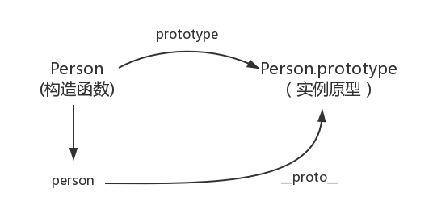
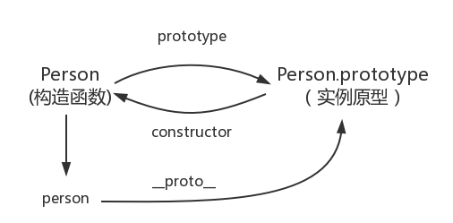
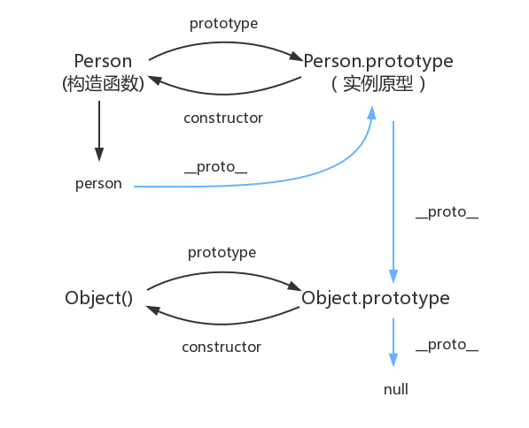

# 前端面经的飞书笔记

*飞书文档链接[Docs (feishu.cn)前端](https://bytedance.feishu.cn/base/app8Ok6k9qafpMkgyRbfgxeEnet?table=tblEnSV2PNAajtWE&view=vewJHSwJVd)*

主要记录该文档的前端基础，框架，以及Node部分。Vue部分可以参考vue3的网课和官方文档（感觉主要内容在于vue3的迁移部分[はじめに | Vue.js (vuejs.org)](https://v3.ja.vuejs.org/guide/migration/introduction.html)）。

有时候，看到别人的好的项目就会懊恼，感叹自己水平低下。我在这里放下两个参考范例：[VOICEVOX/voicevox: 無料で使える中品質なテキスト読み上げソフトウェア、VOICEVOXのエディター (github.com)](https://github.com/VOICEVOX/voicevox)和[MakinoharaShoko/WebGAL: 全新的基于 Web 的 视觉小说引擎 | A brand new Visual Novel engine based on Web. (github.com)](https://github.com/MakinoharaShoko/WebGAL)

---

## 前端基础

### 原型链

[JavaScript深入之从原型到原型链 · Issue #2 · mqyqingfeng/Blog (github.com)](https://github.com/mqyqingfeng/Blog/issues/2)

感觉是ES5重点，在JS权威指南的笔记中有写到prototype。

别人的示例代码如下

```javascript
function Person() {

}
// 虽然写在注释里，但是你要注意：
// prototype是函数才会有的属性
Person.prototype.name = 'Kevin';
var person1 = new Person();
var person2 = new Person();
console.log(person1.name) // Kevin
console.log(person2.name) // Kevin
```

类的prototype也是一个对象。

**每一个JavaScript对象(除了 null )都具有的一个属性，叫\_\_proto\_\_，这个属性会指向该对象的原型。**



**每个原型都有一个 constructor 属性指向关联的构造函数。**



```javascript
function Person() {

}

var person = new Person();

console.log(person.__proto__ == Person.prototype) // true
console.log(Person.prototype.constructor == Person) // true
// 顺便学习一个ES5的方法,可以获得对象的原型
console.log(Object.getPrototypeOf(person) === Person.prototype) // true
```

而对于对象Object的prototype指向的那个对象，是没有\_\_proto\_\_属性的。

并且，对于constructor来说，设置以下的例子

```javascript
function Person() {

}
var person = new Person();
console.log(person.constructor === Person); // true
```

当获取 person.constructor 时，其实 person 中并没有 constructor 属性,当不能读取到constructor 属性时，会从 person 的原型也就是 Person.prototype 中读取，正好原型中有该属性，所以：

```javascript
person.constructor === Person.prototype.constructor
```




---

### 继承

[JavaScript深入之继承的多种方式和优缺点 · Issue #16 · mqyqingfeng/Blog (github.com)](https://github.com/mqyqingfeng/Blog/issues/16)

*感觉这里是ES5留下的糟粕，还应该关注一下webpack babel转义ES6之后具体用的哪种方式。*

继承分为原型链继承，经典（使用构造函数）继承，组合继承，原型式继承，寄生式继承，寄生组合式继承六种。下面将讨论优缺点

🌑原型链继承为：

```javascript
function Parent () {
    this.name = 'kevin';
}

Parent.prototype.getName = function () {
    console.log(this.name);
}

function Child () {

}

Child.prototype = new Parent();

var child1 = new Child();

console.log(child1.getName()) // kevin
```

这里带来了两个缺点：

+ 父对象的属性对于每个子对象来说都是共用的（相当于静态属性）。
+ 在创建 Child 的实例时，不能向Parent传参。

🌒以下是使用构造函数继承的方法

```javascript
function Parent () {
    this.names = ['kevin', 'daisy'];
}

function Child () {
    Parent.call(this);
}

var child1 = new Child();

child1.names.push('yayu');

console.log(child1.names); // ["kevin", "daisy", "yayu"]

var child2 = new Child();

console.log(child2.names); // ["kevin", "daisy"]
```

这里的优点在于父对象的每个属性在不同的子对象里面有各自的。并且也可以向父对象传参了。

```javascript
function Parent (name) {
    this.name = name;
}

function Child (name) {
    Parent.call(this, name);
}

var child1 = new Child('kevin');

console.log(child1.name); // kevin

var child2 = new Child('daisy');

console.log(child2.name); // daisy
```

*这里的call()方法观看之前js权威指南的笔记。*

这种继承方法的缺点是，方法都在构造函数中定义，每次创建实例都会创建一遍方法。

🌓组合继承。即使用原型链继承和构造函数合并的继承法一起用，如下所示：

```javascript
function Parent (name) {
    this.name = name;
    this.colors = ['red', 'blue', 'green'];
}

Parent.prototype.getName = function () {
    console.log(this.name)
}

function Child (name, age) {

    Parent.call(this, name);
    
    this.age = age;

}

Child.prototype = new Parent();
Child.prototype.constructor = Child;

var child1 = new Child('kevin', '18');

child1.colors.push('black');

console.log(child1.name); // kevin
console.log(child1.age); // 18
console.log(child1.colors); // ["red", "blue", "green", "black"]

var child2 = new Child('daisy', '20');

console.log(child2.name); // daisy
console.log(child2.age); // 20
console.log(child2.colors); // ["red", "blue", "green"]
```

优点：融合原型链继承和构造函数的优点，是 JavaScript 中最常用的继承模式。

🌔原型式继承

类似于重写Object.create()方法

```javascript
function createObj(o) {
    function F(){}
    F.prototype = o;
    return new F();
}
```

缺点：包含引用类型的属性值始终都会共享相应的值，这点跟原型链继承一样。

```javascript
var person = {
    name: 'kevin',
    friends: ['daisy', 'kelly']
}

var person1 = createObj(person);
var person2 = createObj(person);

person1.name = 'person1';
console.log(person2.name); // kevin

person1.friends.push('taylor');
console.log(person2.friends); // ["daisy", "kelly", "taylor"]
```

注意：修改`person1.name`的值，`person2.name`的值并未发生改变，并不是因为`person1`和`person2`有独立的 name 值，而是因为`person1.name = 'person1'`，给`person1`添加了 name 值，并非修改了原型上的 name 值。

🌕寄生式继承

创建一个仅用于封装继承过程的函数，该函数在内部以某种形式来做增强对象，最后返回对象。

```javascript
function createObj (o) {
    var clone = Object.create(o);
    clone.sayName = function () {
        console.log('hi');
    }
    return clone;
}
```

缺点：跟借用构造函数模式一样，每次创建对象都会创建一遍方法。

🌖寄生组合式继承

```javascript
function Parent (name) {
    this.name = name;
    this.colors = ['red', 'blue', 'green'];
}

Parent.prototype.getName = function () {
    console.log(this.name)
}

function Child (name, age) {
    Parent.call(this, name);
    this.age = age;
}

// 关键的三步
var F = function () {};

F.prototype = Parent.prototype;

Child.prototype = new F();


var child1 = new Child('kevin', '18');

console.log(child1);

function object(o) {
    function F() {}
    F.prototype = o;
    return new F();
}

function prototype(child, parent) {
    var prototype = object(parent.prototype);
    prototype.constructor = child;
    child.prototype = prototype;
}

// 当我们使用的时候：
prototype(Child, Parent);
```

这里有点看不懂。

这种方式的高效率体现它只调用了一次 Parent 构造函数，并且因此避免了在 Parent.prototype 上面创建不必要的、多余的属性。与此同时，原型链还能保持不变；因此，还能够正常使用 instanceof 和 isPrototypeOf。开发人员普遍认为寄生组合式继承是引用类型最理想的继承范式。

---

### 闭包

ECMAScript中，闭包指的是：

1. 从理论角度：所有的函数。因为它们都在创建的时候就将上层上下文的数据保存起来了。哪怕是简单的全局变量也是如此，因为函数中访问全局变量就相当于是在访问自由变量，这个时候使用最外层的作用域。
2. 从实践角度：以下函数才算是闭包：
   1. 即使创建它的上下文已经销毁，它仍然存在（比如，内部函数从父函数中返回）
   2. 在代码中引用了自由变量

实例代码

```javascript
var scope = "global scope";
function checkscope(){
    var scope = "local scope";
    function f(){
        return scope;
    }
    return f;
}

var foo = checkscope();
console.log(foo());
// local scope
```

了解VO上下文的问题。

---

函数的立即调用

```javascript
//向下面这样定义的函数可以通过在函数名后加一对括号进行调用，像这样`foo()`，
//因为foo相对于函数表达式`function(){/* code */}`只是一个引用变量

var foo = function(){/* code */}

//那这可以说明函数表达式可以通过在其后加上一对括号自己调用自己吗？

function(){ /* code */}(); //SyntaxError: Unexpected token (
```

正如你所看到的，这里捕获了一个错误。当圆括号为了调用函数出现在函数后面时，无论在全局环境或者局部环境里遇到了这样的`function`关键字，默认的，它会将它当作是一个函数声明，而不是函数表达式，如果你不明确的告诉圆括号它是一个表达式，它会将其当作没有名字的函数声明并且抛出一个错误，因为函数声明需要一个名字。

```javascript
//然而函数声明语法上是无效的，它仍然是一个声明，紧跟着的圆括号是无效的，因为圆括号里需要包含表达式

function foo(){ /* code */ }();//SyntaxError: Unexpected token

//现在，你把一个表达式放在圆括号里，没有抛出错误...,但是函数也并没有执行，因为：

function foo(){/* code */}(1)

//它等同于如下，一个函数声明跟着一个完全没有关系的表达式:

function foo(){/* code */}
(1);
```

在Javascript里，圆括号不能**包含**声明。因为这点，当圆括号为了包裹函数碰上了 `function`关键词，它便知道将它作为一个函数表达式去解析而不是函数声明。

- 当圆括号出现在匿名函数的末尾想要调用函数时，它会默认将函数当成是函数声明。
- 当圆括号包裹函数时，它会默认将函数作为表达式去解析，而不是函数声明。

---

### instanceof 原理

这个操作符的实际意义是检查右值的prototype属性是否在左值的原型链上。查看代码

```javascript
function Foo() {
}

Object instanceof Object // true
Function instanceof Function // true
Function instanceof Object // true
Foo instanceof Foo // false
Foo instanceof Object // true
Foo instanceof Function // true

```

Foo 函数的 `prototype` 属性是 `Foo.prototype`，而 Foo 的 `__proto__` 属性是 `Function.prototype`，由图可知，Foo 的原型链上并没有 `Foo.prototype` ，因此 `Foo instanceof Foo` 也就返回 false 。

---

### bind

``bind()`` 方法会创建一个新函数。当这个新函数被调用时，``bind()`` 的第一个参数将作为它运行时的 ``this``，之后的一序列参数将会在传递的实参前传入作为它的参数.

```javascript
var foo = {
    value: 1
};

function bar() {
    console.log(this.value);
}

// 返回了一个函数
var bindFoo = bar.bind(foo); 

bindFoo(); // 1
```

如果大于一个参数，那就相当于传参

```javascript
var foo = {
    value: 1
};

function bar(name, age) {
    console.log(this.value);
    console.log(name);
    console.log(age);

}

var bindFoo = bar.bind(foo, 'daisy');
bindFoo('18');
// 1
// daisy
// 18
```

---

### apply和 call


---

### V8的垃圾回收机制

[一文搞懂V8引擎的垃圾回收 - 掘金 (juejin.cn)](https://juejin.cn/post/6844904016325902344)

---

### Event Loop

