# node

这里是node底层的学习笔记，包括v8引擎以及node服务端的知识

## v8引擎


### v8引擎原理

参考[认识 V8 引擎 - 知乎 (zhihu.com)](https://zhuanlan.zhihu.com/p/27628685)


webkit调用v8的结构


首先是网页内容，输入到HTML解析器，HTML解析器解析，然后构建DOM树，在这期间如果遇到JavaScript代码则交给JavaScript引擎处理；如果来自CSS解析器的样式信息，构建一个内部绘图模型。该模型由布局模块计算模型内部各个元素的位置和大小信息，最后由绘图模块完成从该模型到图像的绘制。

而具体在v8引擎中：

源代码-→抽象语法树-→字节码-→JIT-→本地代码(V8引擎没有中间字节码)。

*在运行JavaScript之前，相比其它的JavaScript的引擎转换成字节码或解释执行，V8将其编译成原生机器码（IA-32, x86-64, ARM, or MIPS CPUs），并且使用了如内联缓存（inline caching）等方法来提高性能。*

---

### v8的内存回收

---

### v8的promise

---

## webkit

## NestJS

参考掘金小册[NestJS 项目实战 - CookieBoty - 掘金小册 (juejin.cn)](https://juejin.cn/book/7065201654273933316)使用`nest new mynest`创建一个叫做mynest的项目，在此之前需要安装cli工具`npm install -g @nestjs/cli`。我的代码位于[mynest: nestjs的demo (gitee.com)](https://gitee.com/masaikk/mynest)。运行之后打开http://127.0.0.1:3000/可以看到：


### 建立controller

使用`nest g co u1`建立一个名叫u1的controller，并且这个命令会自动在app.module.ts进行注册。

```typescript
import { Module } from '@nestjs/common';
import { AppController } from './app.controller';
import { AppService } from './app.service';
import { U1Controller } from './u1/u1.controller';

@Module({
  imports: [],
  controllers: [AppController, U1Controller],
  providers: [AppService],
})
export class AppModule {}

```

如果不需要生成spec文件，就需要在nest-cli.json中添加属性，参考

```json
{
  "$schema": "https://json.schemastore.org/nest-cli",
  "collection": "@nestjs/schematics",
  "sourceRoot": "src",
  "generateOptions": {
    "spec": false
  }
}

```

在对应u1的controller中修改到如下内容

```typescript
import { Controller, Get } from "@nestjs/common";

@Controller("u1")
export class U1Controller {
  @Get()
  getHello(): string {
    return "hello u1";
  }
}

```

浏览器中打开[127.0.0.1:3000/u1](http://127.0.0.1:3000/u1)，可以get到字符串：


也可以添加Get装饰器，添加一个新的路由

```typescript
import { Controller, Get } from "@nestjs/common";

@Controller("u1")
export class U1Controller {
  @Get()
  getHello(): string {
    return "hello u1";
  }

  @Get("another")
  getAnother(): string {
    return "another greet";
  }
}

```

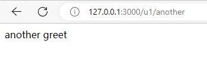

或者直接使用`@Body()`装饰器来获取body。

如果使用RESTful的动态路由，也可以使用`@Param`装饰器来获取值，类似与官方文档中的：

```typescript
  @Get(":id")
  findOne(@Param("id") id: string) {
    return this.userService.findOne(+id);
  }
```


### 建立CURD

可以使用如下命令创建一个CURD：`nest g resource user `，选择RESTful类型的，这个情况是使用请求的方式来判断具体的操作的，打开[127.0.0.1:3000/user](http://127.0.0.1:3000/user)，对应到这里

```typescript
@Get()
  findAll() {
    return this.userService.findAll();
  }
```

展示：


需要注意的是，创建单独的controller以及CRUD应用，在app.module里面的注册是不同的，参考以上的两个的注册为一个在imports中一个在controllers中。

```typescript
import { Module } from '@nestjs/common';
import { AppController } from './app.controller';
import { AppService } from './app.service';
import { U1Controller } from './u1/u1.controller';
import { UserModule } from './user/user.module';

@Module({
  imports: [UserModule],
  controllers: [AppController, U1Controller],
  providers: [AppService],
})
export class AppModule {}
```

对于一个controller来说，可以在参数中使用@Request或者@Query装饰器来获取request或者query，例如

```typescript
  @Get()
  @Version("3")
  fundAll3(@Query() query) {
    console.log(query);
    return {
      code: 200,
      message: query.name,
    };
  }
```

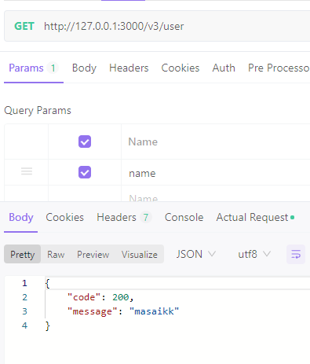

可以通过query对象来获取到message的值。注意它们是针对get请求来说的。

针对于post请求，可以使用requset.body的形式。类似于：

```typescript
  @Post()
  @Version("2")
  create2(@Request() req) {
    console.log(req.body);
    return {
      code: 200,
    };
  }
```

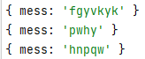

### 创建Api版本号

对于一个api来说，它的内部实现以及返回可能会变，所以可以添加版本号来标识api的不同。比如一开始的[127.0.0.1:3000/user](http://127.0.0.1:3000/user)可以变为[127.0.0.1:3000/v1/user](http://127.0.0.1:3000/v1/user)。

首先在main.ts中导入版本库

```typescript
import { VersioningType } from "@nestjs/common";
import { NestFactory } from "@nestjs/core";
import { AppModule } from "./app.module";

async function bootstrap() {
  const app = await NestFactory.create(AppModule);

  app.enableVersioning({
    type: VersioningType.URI,
  });

  await app.listen(3000);
}

bootstrap();

```

然后对于controller的方法，添加version装饰器

```typescript
  @Get()
  @Version("1")
  findAll() {
    return this.userService.findAll();
  }
```

使用[127.0.0.1:3000/v1/user](http://127.0.0.1:3000/v1/user)访问得到：

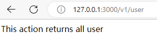

如果想创建更多不同version的api，需要修改mian.ts的配置，比如说添加v1以及v2版本的api如下：

```typescript
import { VERSION_NEUTRAL, VersioningType } from "@nestjs/common";
import { NestFactory } from "@nestjs/core";
import { AppModule } from "./app.module";

async function bootstrap() {
  const app = await NestFactory.create(AppModule);

  app.enableVersioning({
    type: VersioningType.URI,
    defaultVersion: [VERSION_NEUTRAL, "1", "2"],
  });

  await app.listen(3000);
}

bootstrap();

```

添加controller的第二个findAll方法

```typescript
  @Get()
  @Version("2")
  findAll2() {
    return "version 2 find all";
  }
```

使用[127.0.0.1:3000/v2/user](http://127.0.0.1:3000/v2/user)获取：

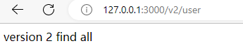

### 守卫

守卫有一个单独的责任。它们根据运行时出现的某些条件（例如权限，角色，访问控制列表等）来确定给定的请求是否由路由处理程序处理。这通常称为授权。在传统的 Express 应用程序中，通常由中间件处理授权(以及认证)。中间件是身份验证的良好选择，因为诸如 token 验证或添加属性到 request 对象上与特定路由(及其元数据)没有强关联。

*守卫在每个中间件之后执行，但在任何拦截器或管道之前执行。*

[小满nestjs（第二十一章 nestjs 守卫）_小满zs的博客-CSDN博客_nestjs 守卫](https://blog.csdn.net/qq1195566313/article/details/127175529?ops_request_misc=%7B%22request%5Fid%22%3A%22166916857616782425124866%22%2C%22scm%22%3A%2220140713.130102334.pc%5Fall.%22%7D&request_id=166916857616782425124866&biz_id=0&utm_medium=distribute.pc_search_result.none-task-blog-2~all~first_rank_ecpm_v1~rank_v31_ecpm-1-127175529-null-null.142^v66^pc_rank_34_queryrelevant25,201^v3^add_ask,213^v2^t3_esquery_v1&utm_term=小满nestjs 守卫&spm=1018.2226.3001.4187)

### RxJs

在nestjs中使用rxjs来处理异步队列，它的设计也有着“观察者模式”

```typescript
import { Observable } from "rxjs";

const observable = new Observable<any>((subscriber) => {
  subscriber.next(1);
  subscriber.next(2);
  subscriber.next(3);
  setTimeout(() => {
    subscriber.next(4);
    subscriber.complete();
  }, 3000);
});

observable.subscribe({
  next: (num) => {
    console.log(num);
  },
});
```

如上所示，定义可观测对象observable，它的参数订阅者`subscriber`可以通过`next()`来获取到消息，如上所示，对订阅者发送了四条消息。再对其进行订阅，并且打印这些消息。

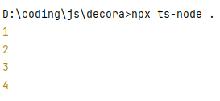

类似与如下代码，可以输出序列

```typescript
import { Observable, interval, take } from "rxjs";

interval(500)
  .pipe(take(5))
  .subscribe((e) => {
    console.log(e);
  });

```

这里`interval(500)`表示为每500毫秒开始从0开始输出一个数字，`take(5)`表示截断到5，所以输出为

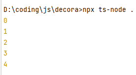


如果将take换成map，就可以进行更多的操作`map((n) => ({ num: n }))`把n转换成对象。但是没有take就不会停。

```typescript
import { Observable, interval, take } from "rxjs";
import { map } from "rxjs/operators";

interval(500)
  .pipe(map((n) => ({ num: n })))
  .subscribe((e) => {
    console.log(e);
  });
```

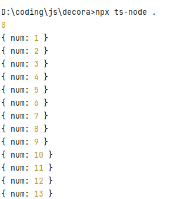

同时也可以设计条件暂停订阅

```typescript
import { Observable, interval, take } from "rxjs";
import { map } from "rxjs/operators";

const subs = interval(500)
  .pipe(map((n) => ({ num: n })))
  .subscribe((e) => {
    console.log(e);
    if (e.num == 10) {
      subs.unsubscribe();
    }
  });

```

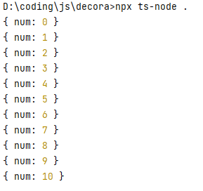

对于传入的队列，也可以使用of来指定

```typescript
import { of, Observable, interval, take } from "rxjs";
import { map } from "rxjs/operators";

const subs = of(1, 1, 4, 5, 1, 4)
  .pipe(map((n) => ({ num: n })))
  .subscribe((e) => {
    console.log(e);
    if (e.num == 10) {
      subs.unsubscribe();
    }
  });

```

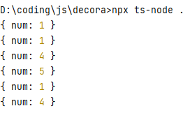

### 拦截器

#### 响应拦截器

对于响应来说，需要规范响应返回的数据，例如如下类型

```typescript
{
          data,
          status: 200,
          message: "",
          success: true,
        };
```

因此，可以建立如下的响应拦截器

```typescript
import {
  Injectable,
  NestInterceptor,
  CallHandler,
  ExecutionContext,
} from "@nestjs/common";
import { map } from "rxjs/operators";
import { Observable } from "rxjs";

interface Data<T> {
  data: T;
}

@Injectable()
export class Response<T> implements NestInterceptor {
  intercept(
    context: ExecutionContext,
    next: CallHandler<any>,
  ): Observable<Data<T>> {
    return next.handle().pipe(
      map((data) => {
        return {
          data,
          status: 200,
          message: "这是一个返回，data字符串长度" + data.length,
          success: true,
        };
      }),
    );
  }
}

```

这里定义为了有类型提示，加入了接口Data，结合上一节中介绍了RxJs的导管的特点。注意加上装饰器`@Injectable()`，即可在main.ts中注入。

```typescript
import { VERSION_NEUTRAL, VersioningType } from "@nestjs/common";
import { NestFactory } from "@nestjs/core";
import { AppModule } from "./app.module";
import { Response } from "./common/response";

async function bootstrap() {
  const app = await NestFactory.create(AppModule);

  app.enableVersioning({
    type: VersioningType.URI,
    defaultVersion: [VERSION_NEUTRAL, "1", "2", "3"],
  });
  app.useGlobalInterceptors(new Response());

  await app.listen(3000);
}

bootstrap();

```

之后的响应都被拦截器拦截下来并且都是返回希望的格式了，例如http://127.0.0.1:3000/v1/user得到

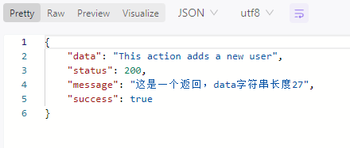

#### 请求拦截器

参考[第十七章（nestjs 异常拦截器）_哔哩哔哩_bilibili](https://www.bilibili.com/video/BV1NG41187Bs?p=17&vd_source=36542d6c49bf487d8a18d22be404b8d2)

### swagger

如果想使用swagger接口文档，需要安装依赖`npm install @nestjs/swagger swagger-ui-express -S`

首先在main.ts导入`import { SwaggerModule, DocumentBuilder } from "@nestjs/swagger";`，再创建配置

```typescript
const options = new DocumentBuilder()
  .setTitle("MyNest 文档")
  .setVersion("1")
  .build();
```

再生成文档和挂载

```typescript
  const document = SwaggerModule.createDocument(app, options);
  SwaggerModule.setup("/api-docs", app, document);
```

最终main.ts的代码如下

```typescript
import { VERSION_NEUTRAL, VersioningType } from "@nestjs/common";
import { NestFactory } from "@nestjs/core";
import { AppModule } from "./app.module";
import { SwaggerModule, DocumentBuilder } from "@nestjs/swagger";

async function bootstrap() {
  const app = await NestFactory.create(AppModule);

  app.enableVersioning({
    type: VersioningType.URI,
    defaultVersion: [VERSION_NEUTRAL, "1", "2", "3"],
  });
  const options = new DocumentBuilder()
    .setTitle("MyNest 文档")
    .setVersion("1")
    .build();
  const document = SwaggerModule.createDocument(app, options);
  SwaggerModule.setup("/api-docs", app, document);

  await app.listen(3000);
}

bootstrap();

```

可以访问[Swagger UI](http://localhost:3000/api-docs#/)得到。

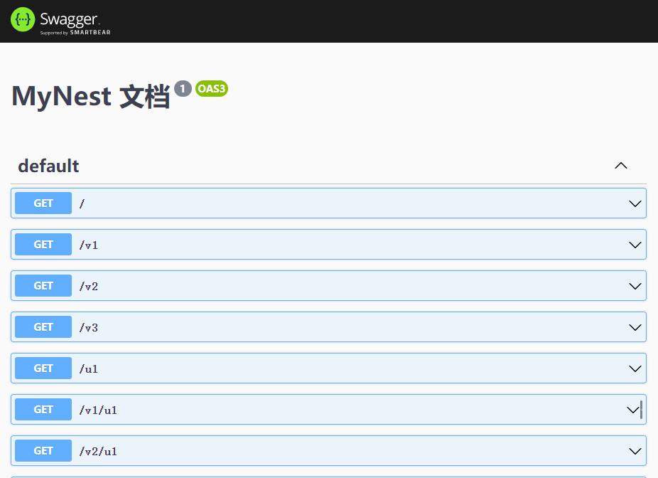

配置具体情况参考[第二十三章（nestjs swagger接口文档）_哔哩哔哩_bilibili](https://www.bilibili.com/video/BV1NG41187Bs?p=23&vd_source=36542d6c49bf487d8a18d22be404b8d2)

### typeORM

使用typeORM连接数据库，安装依赖`npm install --save @nestjs/typeorm typeorm mysql2`
