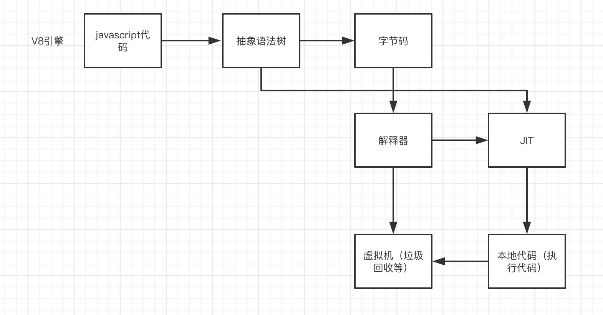
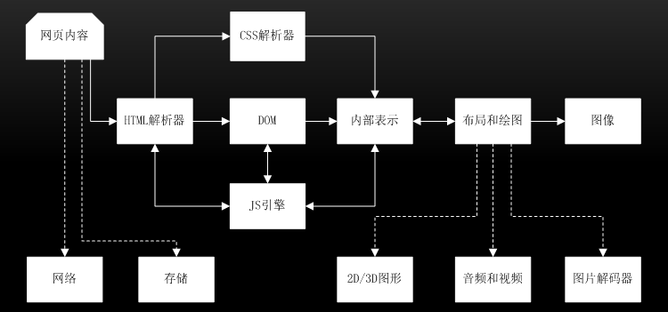
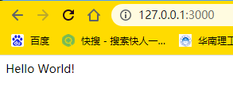
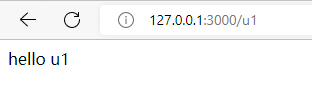
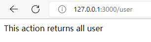

# node

这里是node底层的学习笔记，包括v8引擎以及node服务端的知识

## v8引擎


### v8引擎原理

参考[认识 V8 引擎 - 知乎 (zhihu.com)](https://zhuanlan.zhihu.com/p/27628685)



webkit调用v8的结构



首先是网页内容，输入到HTML解析器，HTML解析器解析，然后构建DOM树，在这期间如果遇到JavaScript代码则交给JavaScript引擎处理；如果来自CSS解析器的样式信息，构建一个内部绘图模型。该模型由布局模块计算模型内部各个元素的位置和大小信息，最后由绘图模块完成从该模型到图像的绘制。

而具体在v8引擎中：

源代码-→抽象语法树-→字节码-→JIT-→本地代码(V8引擎没有中间字节码)。

*在运行JavaScript之前，相比其它的JavaScript的引擎转换成字节码或解释执行，V8将其编译成原生机器码（IA-32, x86-64, ARM, or MIPS CPUs），并且使用了如内联缓存（inline caching）等方法来提高性能。*

---

### v8的内存回收

---

### v8的promise

---

## webkit

## NestJS

参考掘金小册[NestJS 项目实战 - CookieBoty - 掘金小册 (juejin.cn)](https://juejin.cn/book/7065201654273933316)使用`nest new mynest`创建一个叫做mynest的项目，在此之前需要安装cli工具`npm install -g @nestjs/cli`。我的代码位于[mynest: nestjs的demo (gitee.com)](https://gitee.com/masaikk/mynest)。运行之后打开http://127.0.0.1:3000/可以看到：



### 建立controller

使用`nest g co u1`建立一个名叫u1的controller，并且这个命令会自动在app.module.ts进行注册。

```typescript
import { Module } from '@nestjs/common';
import { AppController } from './app.controller';
import { AppService } from './app.service';
import { U1Controller } from './u1/u1.controller';

@Module({
  imports: [],
  controllers: [AppController, U1Controller],
  providers: [AppService],
})
export class AppModule {}

```

如果不需要生成spec文件，就需要在nest-cli.json中添加属性，参考

```json
{
  "$schema": "https://json.schemastore.org/nest-cli",
  "collection": "@nestjs/schematics",
  "sourceRoot": "src",
  "generateOptions": {
    "spec": false
  }
}

```

在对应u1的controller中修改到如下内容

```typescript
import { Controller, Get } from "@nestjs/common";

@Controller("u1")
export class U1Controller {
  @Get()
  getHello(): string {
    return "hello u1";
  }
}

```

浏览器中打开[127.0.0.1:3000/u1](http://127.0.0.1:3000/u1)，可以get到字符串：



### 建立CURD

可以使用如下命令创建一个CURD：`nest g resource user `，打开[127.0.0.1:3000/user](http://127.0.0.1:3000/user)，对应到这里

```typescript
@Get()
  findAll() {
    return this.userService.findAll();
  }
```

展示：




