# react学习笔记

## 基本知识

参考[masaikk/react-pc-doc (gitee.com)](https://gitee.com/masaikk/react-pc-doc)

### 单个组件

渲染根组件到root节点上

```jsx
const root = ReactDOM.createRoot(document.getElementById('root'));
root.render(
  <React.StrictMode>
    <App />
  </React.StrictMode>
);
```

以上``ReactDOM``来自react-dom\client。还可以使用v18之前的react-dom的react-dom用如下方式挂载

```jsx
ReactDOM.render(
    <React.StrictMode>
        <App />
    </React.StrictMode>,
    document.getElementById('root')
)
```

可以删除严格模式节点

```javascript
const root = ReactDOM.createRoot(document.getElementById('root'));
root.render(
    <App />
);
```

#### 变量使用

使用单个大括号进行变量的使用`{}`，例如

```jsx
const msg = 'masaikk';

function App() {
    return (
        <div className="App">
            {msg}
        </div>
    );
}

export default App;
```

#### 渲染列表

```jsx
const msg = 'masaikk';

const songs = [
    { id: 1, name: '痴心绝对' },
    { id: 2, name: '像我这样的人' },
    { id: 3, name: '南山南' }
]

function App() {
    return (
        <div className="App">
            {msg}
            <ul>
                {
                    songs.map(item => <li>{item.name}</li>)
                }
            </ul>
        </div>
    );
}

export default App;
```

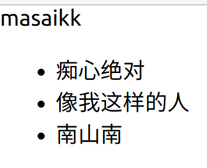

也可以使用forEach方法渲染列表

```jsx
const getForEachList=()=>{
    let list=[];
    songs.forEach((item)=>{
        list.push(<li>{item.name}</li>)
    })
    return list;
}
```

#### 控制内联样式

需要使用到两个大括号``{{}}``进行内联样式的控制，第一个括号表示使用了jsx，第二个括号表示style的对象。例如

```jsx
 <h1 style = {
                {
                    color:"blue"
                }
            }> {msg}</h1>
```

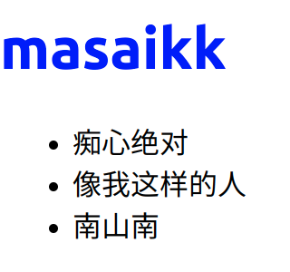

#### 控制类名样式

需要绑定className属性在节点上。

```jsx
const getForEachList=()=>{
    let list=[];
    songs.forEach((item)=>{
        list.push(<li className='my-class1'>{item.name}</li>)
    })
    return list;
}
```

然后写到css文件中

```css
.my-class1{
    color: aqua;
}
```

再在js文件中导入即可

```jsx
import './app.css'
```

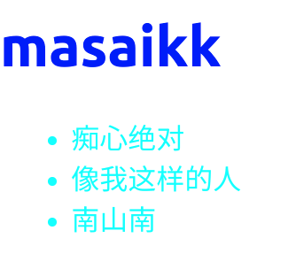

#### 函数型组件

```jsx
function Hello(){
    return <div>hello</div>
}

function App() {
  return (
    <div className="App">
        <Hello></Hello>
    </div>
  );
}
```

也可以自闭合的形式``<Hello/>``。组件的名称必须首字母大写，必须要有返回值。

#### 类组件

```jsx
class HelloComponent extends React.Component {
    render() {
        return(
            <div>
                hello component in class definition
            </div>
        )
    }
}
```

首字母必须要大写，继承来自``React.Component``在类中实现render方法，并且有一个返回值。

#### 事件绑定

##### 基本绑定

用``onClick``这种形式来绑定事件。绑定两种组件声明方式的示例代码：

```jsx
import React from "react";

const clickAndMotion = ()=>{
    console.log('clicked');
}

function Hello(){
    return(
        <div onClick={
            clickAndMotion
        }>hello</div>
    )
}

class HelloComponent extends React.Component {
    render() {
        return(
            <div onClick={
                clickAndMotion
            }>
                hello component in class definition
            </div>
        )
    }
}
```

注意要有大括号。

#### 阻止默认事件

使用句柄event对象的preventDefault()可以阻止默认事件的触发。

```jsx
class MyATag1 extends React.Component {
    aTagMethod=(e)=>{
        e.preventDefault();
        console.log('默认事件被阻止了');
    }

    render() {
        return(
            <a onClick={
                this.aTagMethod
            } href = 'http://masaikk.xyz'>
                a标签,但是被阻止了默认事件
            </a>
        )
    }
}
```

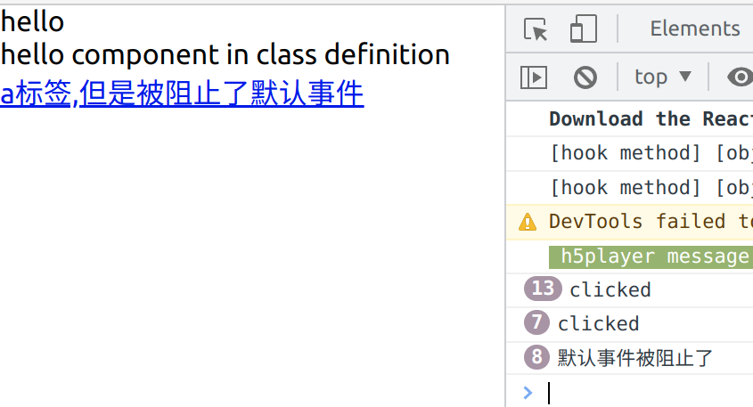

#### 传递更多参数

必须改成箭头函数调用的形式，如下：

```jsx
function Hello(){
    const saySome = (msg) => {
        console.log(msg);
    }
    return(
        <div onClick={
            ()=>{
                saySome('my information')
            }
        }>hello</div>
    )
}
```

这样的形式然后还想操作event句柄的话就需要指定箭头函数的参数：

```jsx
function Hello(){
    const saySome = (msg,e) => {
        console.log(msg);
    }
    const checkEvent=(e)=>{
        e.preventDefault();
    }
    return(
        <a href='http://www.masaikk.xyz' onClick={
            (e)=>{
                saySome('my information');
                checkEvent(e)
            }
        }>hello</a>
    )
}
```

#### 组件状态

在没有hook之前，函数组件是没有状态的。

修改状态要使用setState方法来进行。

```jsx
state = {
        msg: 'this is a message',
        counter: 0
    }
addCount = () => {
        this.setState({
            counter: this.state.counter + 1
        })
    }
```

这里的``state``的名字是固定的。

完整的组件例子，并且在jsx中要注意this的指向问题

```jsx
class HelloComponent extends React.Component {
    state = {
        msg: 'this is a message',
        counter: 0
    }
    addCount = () => {
        this.setState({
            counter: this.state.counter + 1
        })
    }

    render() {
        return (
            <>
                <h3>
                    {this.state.msg}
                </h3>
                <div onClick={
                    clickAndMotion
                }>
                    hello component in class definition and the count is {this.state.counter}
                </div>
                <button onClick={this.addCount}>add count</button>
            </>

        )
    }
}
```

不同于vue的响应式，在react中对于state中不同的数据结构的修改药使用setState，参考：

```jsx
state = {
  count : 0,
  list: [1,2,3],
  person: {
     name:'jack',
     age:18
  }
}
```

示例的修改代码：

```jsx
this.setState({
    count: this.state.count + 1
    list: [...this.state.list, 4],
    person: {
       ...this.state.person,
       // 覆盖原来的属性 就可以达到修改对象中属性的目的
       name: 'rose'
    }
})
```

#### react组件中的this问题

因为this的问题，所以建议在类定义中使用箭头函数添加方法。

或者在构造函数中使用bind的方法绑定函数到this上。

#### 绑定表单数据

##### 受控组件

参考vue中的双向绑定。

```jsx
class InputComponent extends React.Component {
    // 声明组件状态
    state = {
        message: 'this is message',
    }
    // 声明事件回调函数
    changeHandler = (e) => {
        this.setState({ message: e.target.value })
    }
    render () {
        return (
            <div>
                {/* 绑定value 绑定事件*/}
                <input value={this.state.message} onChange={this.changeHandler} />
            </div>
        )
    }
}
```

##### 使用ref操作非受控组件

非受控组件相比于上述绑定表单数据到state中的受控组件的区别是，这里操作ref来使用手动来操作dom节点。

1. 导入`createRef` 函数
2. 调用createRef函数，创建一个ref对象，存储到名为`msgRef`的实例属性中
3. 为input添加ref属性，值为`msgRef`
4. 在按钮的事件处理程序中，通过`msgRef.current`即可拿到input对应的dom元素，而其中`msgRef.current.value`拿到的就是文本框的值。

#### 组件通信

##### 父传子

使用props：

+ 在类组件中使用this.props获取props对象
+ 在函数组件中使用参数来获取props对象

在父组件中传值的写法是一样的

```jsx
class App extends React.Component {
    state = {
        msg:"app父组件的信息"
    }
    render() {
        return(
            <>
                <Son1 msg={this.state.msg}></Son1>
                <Son2 msg={this.state.msg}></Son2>
            </>
        )
    }
}
```

函数式组件需要在参数中加入props

```jsx
function Son1(props){
    return(
        <div>
            {props.msg}
            函数组件
        </div>
    )
}
```

类组件中要使用this.props才能拿到数据。

```jsx
class Son2 extends React.Component {
    render() {
        return(
            <div>
                类组件,{this.props.msg}
            </div>
        )
    }
}
```

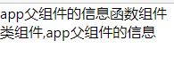

##### 子传父

使用回调函数的方法：

1. 父组件提供一个回调函数 - 用于接收数据
2. 将函数作为属性的值，传给子组件
3. 子组件通过props调用 回调函数
4. 将子组件中的数据作为参数传递给回调函数

例如如下的父组件先声明一个回调函数，再通过props的方式传递给子组件：

```jsx
class App extends React.Component {
    state = {
        msg:"app父组件的信息"
    }
    changeAppStateMsg=(newMsg)=>{
        this.setState({
            msg:newMsg
        })
    }
    render() {
        return(
            <>
                <Son1 msg={this.state.msg} changeAppStateMsg={this.changeAppStateMsg}></Son1>
                <Son2 msg={this.state.msg}></Son2>
            </>
        )
    }
}
```

在子组件中先通过props拿到这个回调函数，在通过自己的方法调用这个回调函数即可。

```jsx
function Son1(props){
    function handlerChangeMsg(){
        console.log('修改数据');
        props.changeAppStateMsg('新的信息，由子组件修改')
    }
    return(
        <div>
            <button onClick={handlerChangeMsg}>改变数据</button>
        </div>
    )
}
```

由于测试的组件

```jsx
class Son2 extends React.Component {
    render() {
        return(
            <div>
                类组件,{this.props.msg}
            </div>
        )
    }
}
```

最初的页面为：

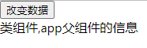

点击按钮启动改变数据（传递信息）的回调函数之后：


##### 跨组件通信

1. 创建Context对象 导出 Provider 和 Consumer对象

   ```
   const { Provider, Consumer } = createContext()
   ```

2. 使用Provider包裹根组件提供数据

   ```
   <Provider value={this.state.message}>
       {/* 根组件 */}
   </Provider>
   ```

3. 需要用到数据的组件使用Consumer包裹获取数据

   ```
   <Consumer >
       {value => /* 基于 context 值进行渲染*/}
   </Consumer>
   ```

使用``import React, { createContext }  from 'react'``

注意provider节点的包裹问题，示例代码如下所示：

```jsx
function GrandSon1(){
    return(
        <div>
            <p>孙子节点</p>
            <Consumer>
                {value => value}
            </Consumer>
        </div>
    )
}

class Son2 extends React.Component {
    render() {
        return(
            <div>
                <GrandSon1></GrandSon1>
                类组件,{this.props.msg}
            </div>
        )
    }
}


class App extends React.Component {
    state = {
        msg:"app父组件的信息",
        toGrandson:"给孙子节点的信息"
    }
    changeAppStateMsg=(newMsg)=>{
        this.setState({
            msg:newMsg
        })
    }
    render() {
        return(
            <>
                <Son1 msg={this.state.msg} changeAppStateMsg={this.changeAppStateMsg}></Son1>
                <Provider value={this.state.toGrandson}>
                    <Son2 msg={this.state.msg}></Son2>
                </Provider>

            </>
        )
    }
}
```

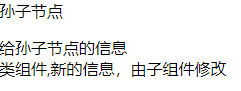


#### 生命周期

只有类组件才有生命周期，因为函数式组件不需要实例化所以没有生命周期。


上部分为render阶段，应该保持纯净的渲染指令，不能写其他的东西。

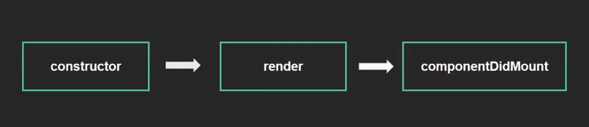

与vue的hook函数写法有些不同，示例代码

```jsx
class LifeCycle extends React.Component {
    constructor() {
        super();
        console.log('constructor');
    }

    componentDidMount() {
        console.log('componentDidMount');
    }

    render() {
        console.log('render');
        return (
            <div>
                life cycle func
            </div>
        )
    }
}
```

会按照上述的顺序打印字符串：

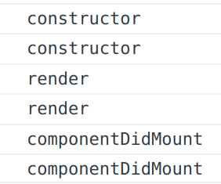

| 钩子 函数         | 触发时机                                            | 作用                                                         |
| ----------------- | --------------------------------------------------- | ------------------------------------------------------------ |
| constructor       | 创建组件时，最先执行，初始化的时候只执行一次        | 1. 初始化state 2. 创建 Ref 3. 使用 bind 解决 this 指向问题等 |
| render            | 每次组件渲染都会触发                                | 渲染UI（**注意： 不能在里面调用setState()** ）               |
| componentDidMount | 组件挂载（完成DOM渲染）后执行，初始化的时候执行一次 | 1. 发送网络请求 2.DOM操作                                    |

更新渲染的生命周期


| 钩子函数           | 触发时机                  | 作用                                                         |
| ------------------ | ------------------------- | ------------------------------------------------------------ |
| render             | 每次组件渲染都会触发      | 渲染UI（与 挂载阶段 是同一个render）                         |
| componentDidUpdate | 组件更新后（DOM渲染完毕） | DOM操作，可以获取到更新后的DOM内容，**不要直接调用setState** |

消除时的生命周期

| 钩子函数             | 触发时机                 | 作用                               |
| -------------------- | ------------------------ | ---------------------------------- |
| componentWillUnmount | 组件卸载（从页面中消失） | 执行清理工作（比如：清理定时器等） |

#### Hook

*hook只能在函数组件中使用。*

##### useState

1. 导入 `useState` 函数
2. 调用 `useState` 函数，并传入状态的初始值
3. 从`useState`函数的返回值中，拿到状态和修改状态的方法
4. 在JSX中展示状态
5. 调用修改状态的方法更新状态

```jsx
import {useState} from "react";

export function Comp1() {
    const [msg, changeMsg] = useState('this message');

    function changeMsgHandler() {
        changeMsg(
            msg + '!'
        )
    }

    return (
        <div>
            <button onClick={changeMsgHandler}>
                {msg}
            </button>
        </div>
    )
}
```

使用``useState()``返回一个包含了两个元素的数组，第一个是值，第二个是用来设置值的函数。使用时给这个函数传入数据``changeMsg(msg + '!')``。并且每次使用了这个函数并且造成VNode更新之后，这个组件都会重新渲染。

##### useEffect

设置副作用，通过传入一个回调函数来进行副作用的操作。例如

```jsx
import {useState, useEffect} from "react";

export function Comp1() {
    const [msg, changeMsg] = useState('this message');
    useEffect(() => {
        document.title = msg;
    })

    function changeMsgHandler() {
        changeMsg(
            msg + '!'
        )

    }

    return (
        <div>
            <button onClick={changeMsgHandler}>
                {msg}
            </button>
        </div>
    )
}
```

以上的情况下会在出现渲染之后都会调用一次``useEffect``里面的回调函数（默认情况）。

也可以控制``useEffect``的调用时机，通过给``useEffect``传入第二个参数来控制。在这个回调函数中用到的数据都应该添加在这第二个数组参数中比如

```javascript
useEffect(() => {
        document.title = msg;
    },[msg])
```

### react-router

#### 安装

使用``npm install react-router-dom@6 --save``安装，``import {BrowserRouter, Routes, Route, Link} from "react-router-dom";``导入。

#### 基本使用

示例代码：

```jsx
class App extends React.Component {

    render() {
        return (
            <>
                <BrowserRouter>
                    <Link to="/">首页</Link>
                    <Link to="/about">关于</Link>

                    <Routes>
                        <Route path="/" element={<Home/>}/>
                        <Route path="/about" element={<About/>}/>
                    </Routes>
                </BrowserRouter>

            </>
        )
    }
}
```

其中Home和About分别是两个组件。

```jsx
function Home(){
    return(
        <div>
            home
        </div>
    )
}
export default Home
```

```jsx
function About(){
    return(
        <div>
            about
        </div>
    )
}

export default About
```

显示的结果如下：

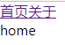

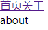

#### 两种router

有``HashRouter``和``BrowserRouter``两种形式，分别对应与hash模式与history模式的两种路由。

#### Routes

在这个标签里面添加路由以及要渲染的页面

```jsx
<Routes>
                        <Route path="/" element={
                            <>
                                <Home/>
                                <About/>
                            </>
                        }/>
                        <Route path="/about" element={<About/>}/>
                    </Routes>
```

#### useNavigate

使用这个钩子函数可以在jsx中进行路由的跳转，示例：

```jsx
import {useNavigate} from "react-router-dom";

function Home() {
    const navigate = useNavigate();
    const goToAboutPageHandler = () => {
        navigate('/about', {
            replace: true
        })
    }
    return (
        <div>
            <h3>
                home
            </h3>
            <button onClick={goToAboutPageHandler}>跳转至about</button>
        </div>
    )
}

export default Home
```

首先生成一个实例``const navigate = useNavigate();``

然后调用相关的方法进行路由的跳转：

```jsx
const goToAboutPageHandler = () => {
        navigate('/about', {
            replace: true
        })
    }
```

第二个参数``{replace: true }``表示不采用历史模式。

#### router携带参数

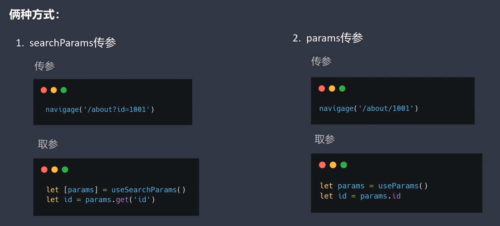

通过以上的方法进行参数的传递和参数的解析

```jsx
import {useNavigate} from "react-router-dom";

function Home() {
    const navigate = useNavigate();
    const goToAboutPageHandler = () => {
        navigate('/about?msg=masaikk', {
            replace: true
        })
    }
    return (
        <div>
            <h3>
                home
            </h3>
            <button onClick={goToAboutPageHandler}>跳转至about</button>
        </div>
    )
}

export default Home
```

在被跳转的组件中使用``useSearchParams``钩子先获取params对象，在调用get方法获取参数的值。

```jsx
import {useSearchParams} from "react-router-dom";

function About() {
    const [params] = useSearchParams();
    const msg = params.get('msg')
    return (
        <div>
            about with msg: {msg}
        </div>
    )
}

export default About
```

页面展示如下所示：

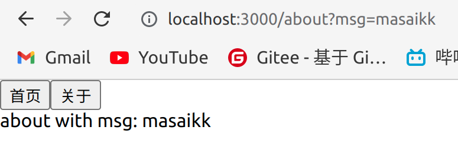

---

## React ssr

在掘金上花了一杯奶茶钱买了一个小课[SSR 实战：官网开发指南 - 祯民 - 掘金小册 (juejin.cn)](https://juejin.cn/book/7137945369635192836)，这里记录笔记。在这里的主要内容是包括搭建eslint、typescript、react的SSR项目。

---

首先在空项目里安装eslint依赖，注意使用了typescript。

```shell
npm install eslint eslint-plugin-react @typescript-eslint/eslint-plugin @typescript-eslint/parser  --save-dev
```

之后使用`npx eslint --init`预设项目里面的eslint。在初始化之后，就会生成一个.eslintrc.js文件

```javascript
// .eslintrc.js
module.exports = {
  env: {
    browser: true,
    commonjs: true, // ADD, 支持对commonjs全局变量的识别
    es2021: true,
    node: true,
  },
  extends: [
    "eslint:recommended",
    "plugin:react/recommended",
    "plugin:@typescript-eslint/recommended",
  ],
  parser: "@typescript-eslint/parser",
  parserOptions: {
    ecmaFeatures: {
      jsx: true,
    },
    ecmaVersion: "latest",
  },
  plugins: ["react", "@typescript-eslint"],
  rules: {
    "react/jsx-uses-react": "off",
    "react/react-in-jsx-scope": "off",
    "@typescript-eslint/no-var-requires": "off", 
  },
};
```

然后安装commit lint插件`npm install --save-dev @commitlint/config-conventional @commitlint/cli`。

之后就是配置*commitlint.config.js*

```javascript
// commitlint.config.js
module.exports = {
  extends: ["@commitlint/config-conventional"],
  rules: {
    "type-enum": [2, "always", ["feat", "fix", "revert"]],
    "subject-max-length": [1, "always", 30],
  },
};
```

开始正常的项目开设，首先安装express。

创建src/index.js，用node运行，不再赘述。

```javascript
const express = require("express");
const childProcess = require("child_process");

const app = express();

app.get("*", (req, res) => {
  res.send(`
    <html
      <body>
        <div>hello-ssr</div>
      </body>
    </html>
  `);
});

app.listen(3000, () => {
  console.log("ssr-server listen on 3000");
});

childProcess.exec("start http://127.0.0.1:3000");
```

最后面`childProcess.exec("start http://127.0.0.1:3000");`作用是用浏览器打开这个网址。

之后导入webpack，首先安装loader`npm install @babel/preset-env babel-loader ts-loader webpack webpack-merge webpack-cli --save-dev`

配置webpack.base.js和webpack.server.js两个文件，并且使用webpack-merge来merge配置

```javascript
// webpack.base.js
const path = require("path");

module.exports = {
  module: {
    rules: [
      {
        test: /.js$/,
        loader: "babel-loader",
        exclude: /node_modules/,
        options: {
          presets: ["@babel/preset-env"],
        },
      },
      {
        test: /.(ts|tsx)?$/,
        use: "ts-loader",
        exclude: /node_modules/,
      },
    ],
  },
  resolve: {
    extensions: [".tsx", ".ts", ".js"],
    alias: {
      "@": path.resolve(process.cwd(), "./src"),
    },
  },
};
```

```javascript
// webpack.server.js

const path = require("path");
const { merge } = require("webpack-merge");
const baseConfig = require("./webpack.base");

module.exports = merge(baseConfig, {
  mode: "development",
  entry: "./src/server/index.tsx",
  target: "node",
  output: {
    filename: "bundle.js",
    path: path.resolve(process.cwd(), "server_build"),
  },
});
```

以上完成了webpack的设置。

将express改写成typescript，并且安装express的typescript依赖`npm install @types/express --save-dev`。

初始化tsconfig.json

```json
{
  "compilerOptions": {
    "module": "CommonJS",
    "types": ["node"], // 声明类型，使得ts-node支持对tsx的编译
    "jsx": "react-jsx", // 全局导入, 不再需要每个文件定义react
    "target": "es6",
    "lib": ["dom", "dom.iterable", "esnext"],
    "allowJs": true,
    "skipLibCheck": true,
    "esModuleInterop": true,
    "allowSyntheticDefaultImports": true,
    "strict": true,
    "forceConsistentCasingInFileNames": true,
    "moduleResolution": "node",
    "resolveJsonModule": true,
    "isolatedModules": true,
    "baseUrl": "./",
    "paths": {
      "@/*": ["./src/*"]
    }
  },
  "include": ["src/**/*"]
}
```

使用`npx webpack build --config ./webpack.server.js --watch`编译，即可得到webpack配置内容下的打包的bundle.js，可以使用nodemon来运行。

最后得到的页面：

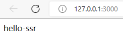


## Nextjs

可以使用`yarn create next-app`来新建一个next项目，并且如果带上`--typescript`则可以使用typescript语法编写，参考课程[react ssr nextjs从入门到放弃_哔哩哔哩_bilibili](https://www.bilibili.com/video/BV1V44y1K7Zz/?spm_id_from=333.337.search-card.all.click&vd_source=36542d6c49bf487d8a18d22be404b8d2)

---

由于nextjs的理念也是约定大于配置，所以在pages创建页面即可相当于新建一个路由。示例的模板如下，其中，命名规范也相当于react，首字母大写：

```tsx
import React from "react";

function About() {

    return (
        <>
            <h1>about</h1>
            <h2>msg</h2>
        </>
    )
}

export default About;
```

使用react的语法，能很自然地渲染出页面：

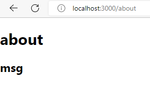

使用`useState()`

```tsx
import React,{useState} from "react";
// import type { NextPage } from 'next'
function Count(){
    let [count,setCount]=useState(1);
    const addCountHandler=()=>{
        setCount(count+1);
    }

    return(
        <>
            <h2>Counter page</h2>
            <div>
                <button onClick={addCountHandler}>click</button>
                <h3>now count is {count}</h3>
            </div>
        </>
    )
}

export default Count;
```

### 动态路由设置

在pages设置动态路由，示例如下：

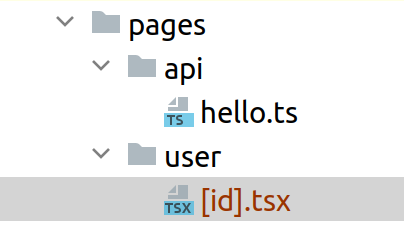

变量由`[]`包括，之后可以使用`useRouter()`来获取路由的参数。

例如如下代码：

```tsx
import React from "react";
import {useRouter} from "next/router";

const IndexUser = () => {
    const router = useRouter();
    const indexNumber = router.query.id;

    return (
        <div>
            <h1>Index : {indexNumber}</h1>
        </div>
    )
}

export default IndexUser;
```

可以正常渲染并且展示:

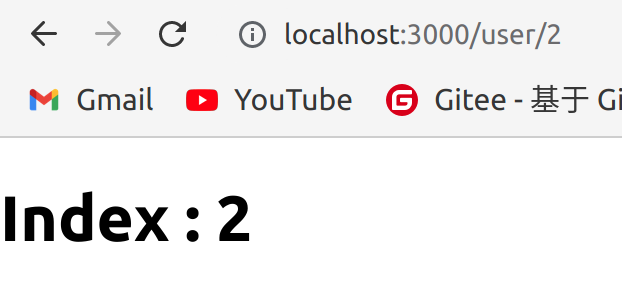

### next Link

类似于vue的router-link，也可以使用next的Link实现跳转

```tsx
import React from "react";
import Link from 'next/link'

function About() {
    const userIndexList: number[] = [1, 2, 3, 4, 5];

    return (
        <>
            <h1>about</h1>
            <h2>msg</h2>
            <div>
                <ul>
                    {
                        userIndexList.map((value) => {
                            return (
                                <li key={value}>
                                    <Link href={`user/${value}`}><a>{`user ID : ${value}`}</a></Link>
                                </li>
                            )
                        })
                    }
                </ul>
            </div>
        </>
    )
}

export default About;

```

渲染的结果如下所示：

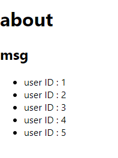

与vue3的router不同的是，Link不能嵌套多个根节点，如果有，应该嵌套在一个div中。

```tsx
<ul>
                    {
                        userIndexList.map((value) => {
                            return (
                                <li key={value}>
                                    <Link
                                        href={`user/${value}`}>
                                        <div>
                                            <a>{`user ID : ${value}`}</a>
                                            <h6>{`user ID : ${value}`}</h6>
                                        </div>
                                    </Link>
                                </li>
                            )
                        })
                    }
                </ul>
```

### 执行第三方script

由于没有index.html，如果要执行第三方JavaScript库，可以使用Script节点。在这里还可以设置JavaScript文件执行的四个模式，区别如下：

There are four different loading strategies that can be used:

- `beforeInteractive`: Load before the page is interactive
- `afterInteractive`: (**default**) Load immediately after the page becomes interactive
- `lazyOnload`: Load during idle time
- `worker`: (experimental) Load in a web worker

JavaScript文件放在public文件夹下面。

具体使用可以参考，即可正常执行。

```tsx
<Script src="/staticJs.js" strategy="lazyOnload"></Script>
```

### api路由

因为nextjs使用nodejs，所以可以用到类似express的后端特性。

在api文件夹下创建ts文件apple.ts，写下示例内容：

```typescript
import type {NextApiRequest, NextApiResponse} from "next";

type Data = {
    mess: string
}

export default function handler(
    req:NextApiRequest,
    res:NextApiResponse<Data>
){
    res.status(200).json({
        mess:"this is api router response"
    })
}

```

浏览器打开[localhost:3000/api/apple](http://localhost:3000/api/apple)

可以查看到返回值，之后还需要考虑cors

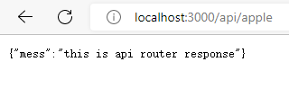
