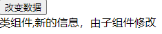
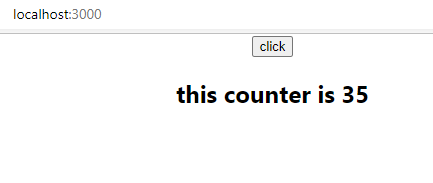
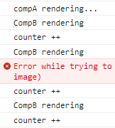
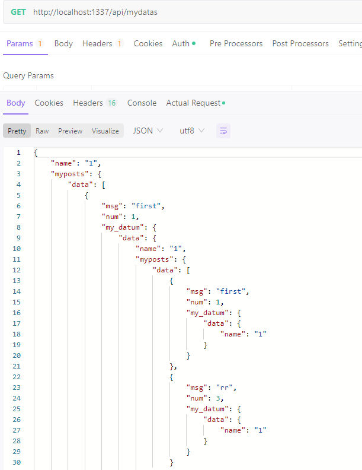

# react学习笔记

## 基本知识

参考[masaikk/react-pc-doc (gitee.com)](https://gitee.com/masaikk/react-pc-doc)

### 单个组件

渲染根组件到root节点上

```jsx
const root = ReactDOM.createRoot(document.getElementById('root'));
root.render(
  <React.StrictMode>
    <App />
  </React.StrictMode>
);
```

以上``ReactDOM``来自react-dom\client。还可以使用v18之前的react-dom的react-dom用如下方式挂载

```jsx
ReactDOM.render(
    <React.StrictMode>
        <App />
    </React.StrictMode>,
    document.getElementById('root')
)
```

可以删除严格模式节点

```javascript
const root = ReactDOM.createRoot(document.getElementById('root'));
root.render(
    <App />
);
```

#### 变量使用

使用单个大括号进行变量的使用`{}`，例如

```jsx
const msg = 'masaikk';

function App() {
    return (
        <div className="App">
            {msg}
        </div>
    );
}

export default App;
```

#### 渲染列表

```jsx
const msg = 'masaikk';

const songs = [
    { id: 1, name: '痴心绝对' },
    { id: 2, name: '像我这样的人' },
    { id: 3, name: '南山南' }
]

function App() {
    return (
        <div className="App">
            {msg}
            <ul>
                {
                    songs.map(item => <li>{item.name}</li>)
                }
            </ul>
        </div>
    );
}

export default App;
```


也可以使用forEach方法渲染列表

```jsx
const getForEachList=()=>{
    let list=[];
    songs.forEach((item)=>{
        list.push(<li>{item.name}</li>)
    })
    return list;
}
```

需要注意的是，对于遍历操作的回调函数，需要注意加上`return`。

#### 控制内联样式

需要使用到两个大括号``{{}}``进行内联样式的控制，第一个括号表示使用了jsx，第二个括号表示style的对象。例如

```jsx
 <h1 style = {
                {
                    color:"blue"
                }
            }> {msg}</h1>
```


#### 控制类名样式

需要绑定className属性在节点上。

```jsx
const getForEachList=()=>{
    let list=[];
    songs.forEach((item)=>{
        list.push(<li className='my-class1'>{item.name}</li>)
    })
    return list;
}
```

然后写到css文件中

```css
.my-class1{
    color: aqua;
}
```

再在js文件中导入即可

```jsx
import './app.css'
```


#### 函数型组件

```jsx
function Hello(){
    return <div>hello</div>
}

function App() {
  return (
    <div className="App">
        <Hello></Hello>
    </div>
  );
}
```

也可以自闭合的形式``<Hello/>``。组件的名称必须首字母大写，必须要有返回值。

#### 类组件

```jsx
class HelloComponent extends React.Component {
    render() {
        return(
            <div>
                hello component in class definition
            </div>
        )
    }
}
```

首字母必须要大写，继承来自``React.Component``在类中实现render方法，并且有一个返回值。

#### 事件绑定

##### 基本绑定

用``onClick``这种形式来绑定事件。绑定两种组件声明方式的示例代码：

```jsx
import React from "react";

const clickAndMotion = ()=>{
    console.log('clicked');
}

function Hello(){
    return(
        <div onClick={
            clickAndMotion
        }>hello</div>
    )
}

class HelloComponent extends React.Component {
    render() {
        return(
            <div onClick={
                clickAndMotion
            }>
                hello component in class definition
            </div>
        )
    }
}
```

注意要有大括号。

#### 阻止默认事件

使用句柄event对象的preventDefault()可以阻止默认事件的触发。

```jsx
class MyATag1 extends React.Component {
    aTagMethod=(e)=>{
        e.preventDefault();
        console.log('默认事件被阻止了');
    }

    render() {
        return(
            <a onClick={
                this.aTagMethod
            } href = 'http://masaikk.xyz'>
                a标签,但是被阻止了默认事件
            </a>
        )
    }
}
```


#### 传递更多参数

必须改成箭头函数调用的形式，如下：

```jsx
function Hello(){
    const saySome = (msg) => {
        console.log(msg);
    }
    return(
        <div onClick={
            ()=>{
                saySome('my information')
            }
        }>hello</div>
    )
}
```

这样的形式然后还想操作event句柄的话就需要指定箭头函数的参数：

```jsx
function Hello(){
    const saySome = (msg,e) => {
        console.log(msg);
    }
    const checkEvent=(e)=>{
        e.preventDefault();
    }
    return(
        <a href='http://www.masaikk.xyz' onClick={
            (e)=>{
                saySome('my information');
                checkEvent(e)
            }
        }>hello</a>
    )
}
```

#### 组件状态

在没有hook之前，函数组件是没有状态的。

修改状态要使用setState方法来进行。

```jsx
state = {
        msg: 'this is a message',
        counter: 0
    }
addCount = () => {
        this.setState({
            counter: this.state.counter + 1
        })
    }
```

这里的``state``的名字是固定的。

完整的组件例子，并且在jsx中要注意this的指向问题

```jsx
class HelloComponent extends React.Component {
    state = {
        msg: 'this is a message',
        counter: 0
    }
    addCount = () => {
        this.setState({
            counter: this.state.counter + 1
        })
    }

    render() {
        return (
            <>
                <h3>
                    {this.state.msg}
                </h3>
                <div onClick={
                    clickAndMotion
                }>
                    hello component in class definition and the count is {this.state.counter}
                </div>
                <button onClick={this.addCount}>add count</button>
            </>

        )
    }
}
```

不同于vue的响应式，在react中对于state中不同的数据结构的修改药使用setState，参考：

```jsx
state = {
  count : 0,
  list: [1,2,3],
  person: {
     name:'jack',
     age:18
  }
}
```

示例的修改代码：

```jsx
this.setState({
    count: this.state.count + 1
    list: [...this.state.list, 4],
    person: {
       ...this.state.person,
       // 覆盖原来的属性 就可以达到修改对象中属性的目的
       name: 'rose'
    }
})
```

#### react组件中的this问题

因为this的问题，所以建议在类定义中使用箭头函数添加方法。

或者在构造函数中使用bind的方法绑定函数到this上。

#### 绑定表单数据

##### 受控组件

参考vue中的双向绑定。

```jsx
class InputComponent extends React.Component {
    // 声明组件状态
    state = {
        message: 'this is message',
    }
    // 声明事件回调函数
    changeHandler = (e) => {
        this.setState({ message: e.target.value })
    }
    render () {
        return (
            <div>
                {/* 绑定value 绑定事件*/}
                <input value={this.state.message} onChange={this.changeHandler} />
            </div>
        )
    }
}
```

##### 使用ref操作非受控组件

非受控组件相比于上述绑定表单数据到state中的受控组件的区别是，这里操作ref来使用手动来操作dom节点。

1. 导入`createRef` 函数
2. 调用createRef函数，创建一个ref对象，存储到名为`msgRef`的实例属性中
3. 为input添加ref属性，值为`msgRef`
4. 在按钮的事件处理程序中，通过`msgRef.current`即可拿到input对应的dom元素，而其中`msgRef.current.value`拿到的就是文本框的值。

##### 使用hook

##### `useRef`

`useRef()`可以以hook的形式来获取Dom里面的组件。

可以传入null值，然后在组件的ref中进行绑定，之后可以通过current字段获取到dom。如下所示：

```tsx
import React, {MutableRefObject, useRef, useState} from "react";

const CompE: React.FC = () => {
    const [msg, setMsg] = useState("default");
    const infoRef: MutableRefObject<any> = useRef(null);
    const clickHandler = () => {
        console.log(infoRef.current.value);
    }
    const changeMsg = (e: any) => {
        console.log(e);
        setMsg(e.target.value)
    }
    return (
        <>
            <button onClick={clickHandler}>click</button>
            <input onChange={changeMsg} ref={infoRef} type={"text"} value={msg}/>
        </>
    )
}

export default CompE;
```

例如以上的input标签，可以通过`infoRef.current.value`来获取内容。


#### 组件通信

##### 父传子

使用props：

+ 在类组件中使用this.props获取props对象
+ 在函数组件中使用参数来获取props对象

在父组件中传值的写法是一样的

```jsx
class App extends React.Component {
    state = {
        msg:"app父组件的信息"
    }
    render() {
        return(
            <>
                <Son1 msg={this.state.msg}></Son1>
                <Son2 msg={this.state.msg}></Son2>
            </>
        )
    }
}
```

函数式组件需要在参数中加入props

```jsx
function Son1(props){
    return(
        <div>
            {props.msg}
            函数组件
        </div>
    )
}
```

类组件中要使用this.props才能拿到数据。

```jsx
class Son2 extends React.Component {
    render() {
        return(
            <div>
                类组件,{this.props.msg}
            </div>
        )
    }
}
```


##### 子传父

使用回调函数的方法：

1. 父组件提供一个回调函数 - 用于接收数据
2. 将函数作为属性的值，传给子组件
3. 子组件通过props调用 回调函数
4. 将子组件中的数据作为参数传递给回调函数

例如如下的父组件先声明一个回调函数，再通过props的方式传递给子组件：

```jsx
class App extends React.Component {
    state = {
        msg:"app父组件的信息"
    }
    changeAppStateMsg=(newMsg)=>{
        this.setState({
            msg:newMsg
        })
    }
    render() {
        return(
            <>
                <Son1 msg={this.state.msg} changeAppStateMsg={this.changeAppStateMsg}></Son1>
                <Son2 msg={this.state.msg}></Son2>
            </>
        )
    }
}
```

在子组件中先通过props拿到这个回调函数，在通过自己的方法调用这个回调函数即可。

```jsx
function Son1(props){
    function handlerChangeMsg(){
        console.log('修改数据');
        props.changeAppStateMsg('新的信息，由子组件修改')
    }
    return(
        <div>
            <button onClick={handlerChangeMsg}>改变数据</button>
        </div>
    )
}
```

由于测试的组件

```jsx
class Son2 extends React.Component {
    render() {
        return(
            <div>
                类组件,{this.props.msg}
            </div>
        )
    }
}
```

最初的页面为：


点击按钮启动改变数据（传递信息）的回调函数之后：



##### 跨组件通信

1. 创建Context对象 导出 Provider 和 Consumer对象

   ```
   const { Provider, Consumer } = createContext()
   ```

2. 使用Provider包裹根组件提供数据

   ```
   <Provider value={this.state.message}>
       {/* 根组件 */}
   </Provider>
   ```

3. 需要用到数据的组件使用Consumer包裹获取数据

   ```
   <Consumer >
       {value => /* 基于 context 值进行渲染*/}
   </Consumer>
   ```

使用``import React, { createContext }  from 'react'``

注意provider节点的包裹问题，示例代码如下所示：

```jsx
function GrandSon1(){
    return(
        <div>
            <p>孙子节点</p>
            <Consumer>
                {value => value}
            </Consumer>
        </div>
    )
}

class Son2 extends React.Component {
    render() {
        return(
            <div>
                <GrandSon1></GrandSon1>
                类组件,{this.props.msg}
            </div>
        )
    }
}


class App extends React.Component {
    state = {
        msg:"app父组件的信息",
        toGrandson:"给孙子节点的信息"
    }
    changeAppStateMsg=(newMsg)=>{
        this.setState({
            msg:newMsg
        })
    }
    render() {
        return(
            <>
                <Son1 msg={this.state.msg} changeAppStateMsg={this.changeAppStateMsg}></Son1>
                <Provider value={this.state.toGrandson}>
                    <Son2 msg={this.state.msg}></Son2>
                </Provider>

            </>
        )
    }
}
```


#### 生命周期

只有类组件才有生命周期，因为函数式组件不需要实例化所以没有生命周期。


上部分为render阶段，应该保持纯净的渲染指令，不能写其他的东西。


与vue的hook函数写法有些不同，示例代码

```jsx
class LifeCycle extends React.Component {
    constructor() {
        super();
        console.log('constructor');
    }

    componentDidMount() {
        console.log('componentDidMount');
    }

    render() {
        console.log('render');
        return (
            <div>
                life cycle func
            </div>
        )
    }
}
```

会按照上述的顺序打印字符串：


| 钩子 函数         | 触发时机                                            | 作用                                                         |
| ----------------- | --------------------------------------------------- | ------------------------------------------------------------ |
| constructor       | 创建组件时，最先执行，初始化的时候只执行一次        | 1. 初始化state 2. 创建 Ref 3. 使用 bind 解决 this 指向问题等 |
| render            | 每次组件渲染都会触发                                | 渲染UI（**注意： 不能在里面调用setState()** ）               |
| componentDidMount | 组件挂载（完成DOM渲染）后执行，初始化的时候执行一次 | 1. 发送网络请求 2.DOM操作                                    |

更新渲染的生命周期


| 钩子函数           | 触发时机                  | 作用                                                         |
| ------------------ | ------------------------- | ------------------------------------------------------------ |
| render             | 每次组件渲染都会触发      | 渲染UI（与 挂载阶段 是同一个render）                         |
| componentDidUpdate | 组件更新后（DOM渲染完毕） | DOM操作，可以获取到更新后的DOM内容，**不要直接调用setState** |

消除时的生命周期

| 钩子函数             | 触发时机                 | 作用                               |
| -------------------- | ------------------------ | ---------------------------------- |
| componentWillUnmount | 组件卸载（从页面中消失） | 执行清理工作（比如：清理定时器等） |

#### Hook

*hook只能在函数组件中使用。*

##### useState

1. 导入 `useState` 函数
2. 调用 `useState` 函数，并传入状态的初始值
3. 从`useState`函数的返回值中，拿到状态和修改状态的方法
4. 在JSX中展示状态
5. 调用修改状态的方法更新状态

```jsx
import {useState} from "react";

export function Comp1() {
    const [msg, changeMsg] = useState('this message');

    function changeMsgHandler() {
        changeMsg(
            msg + '!'
        )
    }

    return (
        <div>
            <button onClick={changeMsgHandler}>
                {msg}
            </button>
        </div>
    )
}
```

使用``useState()``返回一个包含了两个元素的数组，第一个是值，第二个是用来设置值的函数。使用时给这个函数传入数据``changeMsg(msg + '!')``。并且每次使用了这个函数并且造成VNode更新之后，这个组件都会重新渲染。

##### useEffect

设置副作用，通过传入一个回调函数来进行副作用的操作。例如

```jsx
import {useState, useEffect} from "react";

export function Comp1() {
    const [msg, changeMsg] = useState('this message');
    useEffect(() => {
        document.title = msg;
    })

    function changeMsgHandler() {
        changeMsg(
            msg + '!'
        )

    }

    return (
        <div>
            <button onClick={changeMsgHandler}>
                {msg}
            </button>
        </div>
    )
}
```

以上的情况下会在出现渲染之后都会调用一次``useEffect``里面的回调函数（默认情况）。

也可以控制``useEffect``的调用时机，通过给``useEffect``传入第二个参数来控制。在这个回调函数中用到的数据都应该添加在这第二个数组参数中比如

```javascript
useEffect(() => {
        document.title = msg;
    },[msg])
```

如果第二个参数为空数组，那就只会在这个组件渲染的第一次执行第一个参数的回调函数。

对于传入``useEffect``的回调函数来说，它也可以设置一个return的值，return的值可以是一个函数，这个函数在每次执行``useEffect``的回调函数之后会执行一次。这就意味着，在``useEffect``的回调函数中设置定时器之类的对象，可以在它的回调函数中销毁它。

##### useContext

参考[React Hooks 系列之3 useContext - 掘金 (juejin.cn)](https://juejin.cn/post/6844904153584500749)

##### useCallback

参考[React Hooks 系列之5 useCallback - 掘金 (juejin.cn)](https://juejin.cn/post/6844904162040233997)

它的作用是返回一个 memoized 回调函数。

把内联回调函数及依赖项数组作为参数传入 `useCallback`，它将返回该回调函数的 memoized 版本，该回调函数仅在某个依赖项改变时才会更新。当你把回调函数传递给经过优化的并使用引用相等性去避免非必要渲染（例如 shouldComponentUpdate）的子组件时，它将非常有用。

##### useMemo

参考[React Hooks 系列之6 useMemo - 掘金 (juejin.cn)](https://juejin.cn/post/6844904162304458760)

### react-router

#### 安装

使用``npm install react-router-dom@6 --save``安装，``import {BrowserRouter, Routes, Route, Link} from "react-router-dom";``导入。

#### 基本使用

示例代码：

```jsx
class App extends React.Component {

    render() {
        return (
            <>
                <BrowserRouter>
                    <Link to="/">首页</Link>
                    <Link to="/about">关于</Link>

                    <Routes>
                        <Route path="/" element={<Home/>}/>
                        <Route path="/about" element={<About/>}/>
                    </Routes>
                </BrowserRouter>

            </>
        )
    }
}
```

其中Home和About分别是两个组件。

```jsx
function Home(){
    return(
        <div>
            home
        </div>
    )
}
export default Home
```

```jsx
function About(){
    return(
        <div>
            about
        </div>
    )
}

export default About
```

显示的结果如下：


对于根节点`<BrowserRouter>`来说，它也可以写在main.tsx中。

```tsx
import React from "react";
import ReactDOM from "react-dom/client";
import App from "./App";
import "./index.css";
import "antd/dist/reset.css";
import { BrowserRouter } from "react-router-dom";

ReactDOM.createRoot(document.getElementById("root") as HTMLElement).render(
  <React.StrictMode>
    <BrowserRouter>
      <App />
    </BrowserRouter>
  </React.StrictMode>
);

```


#### 两种router

有``HashRouter``和``BrowserRouter``两种形式，分别对应与hash模式与history模式的两种路由。

#### Routes

在这个标签里面添加路由以及要渲染的页面

```jsx
<Routes>
                        <Route path="/" element={
                            <>
                                <Home/>
                                <About/>
                            </>
                        }/>
                        <Route path="/about" element={<About/>}/>
                    </Routes>
```

#### useNavigate

使用这个钩子函数可以在jsx中进行路由的跳转，示例：

```jsx
import {useNavigate} from "react-router-dom";

function Home() {
    const navigate = useNavigate();
    const goToAboutPageHandler = () => {
        navigate('/about', {
            replace: true
        })
    }
    return (
        <div>
            <h3>
                home
            </h3>
            <button onClick={goToAboutPageHandler}>跳转至about</button>
        </div>
    )
}

export default Home
```

首先生成一个实例``const navigate = useNavigate();``

然后调用相关的方法进行路由的跳转：

```jsx
const goToAboutPageHandler = () => {
        navigate('/about', {
            replace: true
        })
    }
```

第二个参数``{replace: true }``表示不采用历史模式。

#### router携带参数


通过以上的方法进行参数的传递和参数的解析

```jsx
import {useNavigate} from "react-router-dom";

function Home() {
    const navigate = useNavigate();
    const goToAboutPageHandler = () => {
        navigate('/about?msg=masaikk', {
            replace: true
        })
    }
    return (
        <div>
            <h3>
                home
            </h3>
            <button onClick={goToAboutPageHandler}>跳转至about</button>
        </div>
    )
}

export default Home
```

在被跳转的组件中使用``useSearchParams``钩子先获取params对象，在调用get方法获取参数的值。

```jsx
import {useSearchParams} from "react-router-dom";

function About() {
    const [params] = useSearchParams();
    const msg = params.get('msg')
    return (
        <div>
            about with msg: {msg}
        </div>
    )
}

export default About
```

页面展示如下所示：


### redux

#### 基础redux

对于一个项目来说，action和reducer不止一个，为了方便管理，所以在src下创建action和reducer目录并且创建相应的index.js。

对于一个发送action的函数来说，它的返回值是一个action，即有type字段，例如：

```javascript
const sendAction = () => {
    return {
        type: "masaikk_action1",
        msg: "this is a action"
    }
}

module.exports = {
    sendAction
}
```

对于reducer来说，它是一个函数，并且接受两个参数，第一个参数是state当前值，第二个参数是一个action，函数体中通过判断action的type进行状态更新，然后返回一个新的state。并且，如果没有当前的state，就可以指定一个初始化的state。

```javascript
const initState = {
    msg: 'init'
}
const aReducer = (state = initState, action) => {
    switch (action.type) {
        case "masaikk_action1": {
            return {
                msg: 'thank you masaikk'
            }
        }
        default: {
            return state
        }
    }
}

module.exports = {
    aReducer
}
```

之后创建store，从redux中导入，注意原来的函数被废弃了。`import {legacy_createStore as createStore} from "redux";`

导入刚才定义的reducer，再使用`createStore`，最后导出。

```javascript
import {legacy_createStore as createStore} from "redux";
import {aReducer} from "../reducer";

const store = createStore(aReducer)
export default store;
```

在页面中使用的时候通过store来进行监听器的注册，最后需要注销监听。

在组件中，导入store和action，对于store来发送一个action，可以通过`store.subscribe()`来监听变动，并且使用hook来进行值的渲染更改。

```jsx
import React, {useState} from "react";
import store from "../../store";
import {sendAction} from "../../action";

const Home = () => {
    const handlerClick = () => {
        const masaikkAction = sendAction();
        store.dispatch(masaikkAction)
    }

    const [msg, setMsg] = useState(store.getState().msg);

    store.subscribe(() => {
        console.log('subscriber:', store.getState());
        setMsg(store.getState().msg)
    })

    return (
        <>
            <button onClick={handlerClick}>click</button>
            <h2>{msg}</h2>
        </>
    )
}

export default Home
```


#### react-redux

主要包括两个组件，provider和connect:


provider包裹整个子组件，以便让全部的子组件都拿到state，它一个接受一个store作为自己的props，这样子组件就可以通过context拿到store。

内部的组件如果需要拿到state的数据，就必须要使用connect来拿到数据。

同样需要建立reducer和store文件，然后在store/index.js导入，创建store。

```javascript
import {legacy_createStore as createStore} from "redux";
import {aReducer} from "../reducer";

let store = createStore(aReducer)
export default store;
```

之后需要在app.js里面导入这个store。创建两个子组件用于测试，在app中。导入Provider，包裹着App，并且要输入store作为props。

测试的两个子组件如下所示：

```jsx
const CompA=()=>{
    return(
        <>
            <button>click</button>
        </>
    )
}

export default CompA;
```

```jsx
const CompB = () => {
    return (
        <>
            <h2>
                h2
            </h2>
        </>
    )
}

export default CompB;
```

app.js中导入如下：

```jsx
class App extends React.Component {
    render() {
        return (
            
            <Provider store={store}>
                <CompA></CompA>
                <CompB></CompB>
            </Provider>
        )
    }
}

export default App;
```

之后使用connect，方法说明如下：


对于需要接受数据更改的组件compB来说，需要实现第一个参数，而发送信息的compA来说，需要实现的是第二个参数。

对于compA来说，需要实现这个方法，再使用connect包装，加强compA。

```jsx
function mapDispatchToProps(dispatch) {
    return {
        sendAction: () => {
            // 传递一个action对象
            dispatch({
                type: "send_action_masaikk1"
            })
        }
    }
}

export default connect(null, mapDispatchToProps)(CompA);
```

之后可以在props里面使用方法来发送action。

最后的compA如下所示：

```jsx
import {connect} from "react-redux";


const CompA = (props) => {
    const clickHandler = () => {
        props.sendAction();
    }

    return (
        <>
            <button onClick={clickHandler}>click</button>
        </>
    )
}

function mapDispatchToProps(dispatch) {
    return {
        sendAction: () => {
            // 传递一个action对象
            dispatch({
                type: "send_action_masaikk1"
            })
        }
    }
}

export default connect(null, mapDispatchToProps)(CompA);
```

在reducer中打印action测试：

```javascript
const aReducer = (state, action) => {
    console.log(action);
    return state
};

module.exports = {
    aReducer
}

```

可以打印出来：


同样的，对于compB来说，需要实现第一个用来接受参数的函数，并且使用connect加强。

```jsx
function mapStateToProps(state) {
    return state
}

export default connect(mapStateToProps, null)(CompB);
```

这里的state会加载到props里面，可以使用JavaScript渲染。现在CompB的代码如下：

```jsx
import {connect} from "react-redux";

const CompB = (props) => {
    return (
        <>
            <h2>
                {props.count}
            </h2>
        </>
    )
}

function mapStateToProps(state) {
    return state
}

export default connect(mapStateToProps, null)(CompB);
```

对于reducer来说，它也可以加入相应的数据判断是否修改state。

```javascript
const initState = {
    count: 1
}

const aReducer = (state = initState, action) => {
    console.log(action);
    if (action.type === "send_action_masaikk1") {
        return {
            count: state.count + 1
        }
    }
    return state
};

module.exports = {
    aReducer
}

```

最终可以实现效果：


#### recoil

相比于redux，recoil是使用了分组的状态管理，并且只支持hook。在recoil中，有atom和selector两个概念，其中atom对应状态，selector用于计算状态，它是一个纯函数。并且，值得注意的是，与redux不同，recoil的state是immutable的。因为这样可以降低mutable的复杂度，节约内存空间。对于atom或者selector来说，他们都需要有一个key，并且这里的key都不应该重复。

首先需要使用RecoilRoot将根节点包起来：

```tsx
const root = ReactDOM.createRoot(
    document.getElementById('root') as HTMLElement
);
root.render(
    <RecoilRoot>
        <App/>
    </RecoilRoot>
);

```

##### 同步组件

recoil的同步钩子如下所示：


以上几种钩子在使用的时候根据功能做取舍。以下是对于同步hook的示例，代码位于[masaikk/rectr - Gitee.com](https://gitee.com/masaikk/rectr/tree/v18/myreact2)

首先创建两个组件，分别是CompA，包含一个按钮；然后是CompB，包含一个h2标签。

```tsx
import React from "react";
import CompA from "./compA";
import CompB from "./compB";

const Home: React.FC = () => {
    return (
        <>
            <CompA></CompA>
            <CompB></CompB>
        </>
    )
}

export default Home;
```

其次定义atom，如下

```typescript
import {atom, selector} from "recoil";

export const countState = atom({
    key: "countState",
    default: 1
})

export const countMsgState = selector({
    key: "msgState",
    get: ({get}) => {
        const count: string = JSON.stringify(get(countState))
        return `this counter is ${count}`
    }
})

```

这里使用到了selector，用于计算atom。

对于CompA组件来说，它只使用修改状态而不是使用状态，所以只需要使用`useSetRecoilState()`，如下所示：

```tsx
import React, {useEffect} from "react";
import {useSetRecoilState} from "recoil";
import {countState} from "../../store/atom/countMsg";


const CompA: React.FC = () => {
    const setCounter = useSetRecoilState(countState)

    useEffect(() => {
        console.log('compA rendering...');
    })

    const clickHandler = () => {
        console.log('counter ++');
        setCounter(counter => {
            return counter + 1
        })
    }

    return (
        <>
            <button onClick={clickHandler}>click</button>
        </>
    )
}

export default CompA;
```

而对于CompB来说，这里是只需要使用state就可以了，所以使用`useRecoilValue()`方法即可，并且这里两个组件都使用了`useEffect()`钩子来看是否进行了重新渲染。

```tsx
import React, {useEffect} from "react";
import {countMsgState} from "../../store/atom/countMsg";
import {useRecoilValue} from "recoil";

const CompB: React.FC = () => {
    const countMSG: string = useRecoilValue(countMsgState)

    useEffect(() => {
        console.log('CompB rendering');
    })

    return (
        <>
            <h2>{countMSG}</h2>
        </>
    )
}

export default CompB;
```

可以看到，点击按钮就可以进行state的修改。



并且对于CompA来说，没有进行重新渲染，如果在这个CompA组件中使用useRecoilState来说，就会一遍一遍重新渲染CompA：



`useResetRecoilState()`钩子可以用于重置state。

##### 异步组件

与其他的状态管理工具不同的是，recoil是可以在selector的get方法中使用网络请求接口的。

---

## React ssr

在掘金上花了一杯奶茶钱买了一个小课[SSR 实战：官网开发指南 - 祯民 - 掘金小册 (juejin.cn)](https://juejin.cn/book/7137945369635192836)，这里记录笔记。在这里的主要内容是包括搭建eslint、typescript、react的SSR项目。我抄的代码位于[ssrDemoe1: react的服务端渲染 (gitee.com)](https://gitee.com/masaikk/ssr-demoe1)。

---

首先在空项目里安装eslint依赖，注意使用了typescript。

```shell
npm install eslint eslint-plugin-react @typescript-eslint/eslint-plugin @typescript-eslint/parser  --save-dev
```

之后使用`npx eslint --init`预设项目里面的eslint。在初始化之后，就会生成一个.eslintrc.js文件

```javascript
// .eslintrc.js
module.exports = {
  env: {
    browser: true,
    commonjs: true, // ADD, 支持对commonjs全局变量的识别
    es2021: true,
    node: true,
  },
  extends: [
    "eslint:recommended",
    "plugin:react/recommended",
    "plugin:@typescript-eslint/recommended",
  ],
  parser: "@typescript-eslint/parser",
  parserOptions: {
    ecmaFeatures: {
      jsx: true,
    },
    ecmaVersion: "latest",
  },
  plugins: ["react", "@typescript-eslint"],
  rules: {
    "react/jsx-uses-react": "off",
    "react/react-in-jsx-scope": "off",
    "@typescript-eslint/no-var-requires": "off", 
  },
};
```

然后安装commit lint插件`npm install --save-dev @commitlint/config-conventional @commitlint/cli`。

之后就是配置*commitlint.config.js*

```javascript
// commitlint.config.js
module.exports = {
  extends: ["@commitlint/config-conventional"],
  rules: {
    "type-enum": [2, "always", ["feat", "fix", "revert"]],
    "subject-max-length": [1, "always", 30],
  },
};
```

开始正常的项目开设，首先安装express。

创建src/index.js，用node运行，不再赘述。

```javascript
const express = require("express");
const childProcess = require("child_process");

const app = express();

app.get("*", (req, res) => {
  res.send(`
    <html
      <body>
        <div>hello-ssr</div>
      </body>
    </html>
  `);
});

app.listen(3000, () => {
  console.log("ssr-server listen on 3000");
});

childProcess.exec("start http://127.0.0.1:3000");
```

最后面`childProcess.exec("start http://127.0.0.1:3000");`作用是用浏览器打开这个网址。

之后导入webpack，首先安装loader`npm install @babel/preset-env babel-loader ts-loader webpack webpack-merge webpack-cli --save-dev`

配置webpack.base.js和webpack.server.js两个文件，并且使用webpack-merge来merge配置

```javascript
// webpack.base.js
const path = require("path");

module.exports = {
  module: {
    rules: [
      {
        test: /.js$/,
        loader: "babel-loader",
        exclude: /node_modules/,
        options: {
          presets: ["@babel/preset-env"],
        },
      },
      {
        test: /.(ts|tsx)?$/,
        use: "ts-loader",
        exclude: /node_modules/,
      },
    ],
  },
  resolve: {
    extensions: [".tsx", ".ts", ".js"],
    alias: {
      "@": path.resolve(process.cwd(), "./src"),
    },
  },
};
```

```javascript
// webpack.server.js

const path = require("path");
const { merge } = require("webpack-merge");
const baseConfig = require("./webpack.base");

module.exports = merge(baseConfig, {
  mode: "development",
  entry: "./src/server/index.tsx",
  target: "node",
  output: {
    filename: "bundle.js",
    path: path.resolve(process.cwd(), "server_build"),
  },
});
```

以上完成了webpack的设置。

将express改写成typescript，并且安装express的typescript依赖`npm install @types/express --save-dev`。

初始化tsconfig.json

```json
{
  "compilerOptions": {
    "module": "CommonJS",
    "types": ["node"], // 声明类型，使得ts-node支持对tsx的编译
    "jsx": "react-jsx", // 全局导入, 不再需要每个文件定义react
    "target": "es6",
    "lib": ["dom", "dom.iterable", "esnext"],
    "allowJs": true,
    "skipLibCheck": true,
    "esModuleInterop": true,
    "allowSyntheticDefaultImports": true,
    "strict": true,
    "forceConsistentCasingInFileNames": true,
    "moduleResolution": "node",
    "resolveJsonModule": true,
    "isolatedModules": true,
    "baseUrl": "./",
    "paths": {
      "@/*": ["./src/*"]
    }
  },
  "include": ["src/**/*"]
}
```

使用`npx webpack build --config ./webpack.server.js --watch`编译，即可得到webpack配置内容下的打包的bundle.js，可以使用nodemon来运行。

最后得到的页面：


之后导入react，安装相关依赖

```shell
npm install react react-dom --save
npm install @types/react @types/react-dom --save-dev
```

创建Home的组件

```tsx
// ./src/pages/Home/index.tsx
const Home = () => {
  return (
    <div>
      <h1>hello-ssr</h1>
      <button
        onClick={(): void => {
          alert("hello-ssr");
        }}
      >
        alert
      </button>
    </div>
  );
};

export default Home;
```

类似于vue-ssr，在此时也是考虑使用react自带的parser将jsx或者tsx文件渲染成HTML，在这里，使用`renderToString()`

修改server/index.tsx

```tsx
// ./src/server/index.tsx
import express from "express";
import childProcess from "child_process";
import { renderToString } from "react-dom/server";
import Home from "@/pages/Home";

const app = express();
const content = renderToString(<Home />);

app.get("*", (req, res) => {
  res.send(`
    <html
      <body>
        <div>${content}</div>
      </body>
    </html>
  `);
});

app.listen(3000, () => {
  console.log("ssr-server listen on 3000");
});

childProcess.exec("start http://127.0.0.1:3000");
```

重新用webpack打包并运行，可以得到正常页面，但是发现button的函数无法绑定。

这里运用课程原文：

掘金服务端返回的 HTML 文本中包括一组打包过后的 JS，这个其实就是这个页面所对应的相关事件和脚本，我们只需要打包过后将 JS 绑定在 HTML 中就可以。

**这个也叫“同构”，是服务器端渲染的核心概念**，同一套 React 代码在服务器端渲染一遍，然后在客户端再执行一遍。服务端负责静态 dom 的拼接，而客户端负责事件的绑定，不仅是模板页面渲染，后面的路由，数据的请求都涉及到同构的概念。可以理解成，服务器端渲染都是基于同构去展开的。

这里就需要`hydrateRoot()`给按钮绑定事件函数。

```tsx
// src/client/index.tsx

import { hydrateRoot } from "react-dom/client";
import Home from "@/pages/Home";

hydrateRoot(document.getElementById("root") as Document | Element, <Home />);
```

然后需要给绑定的节点给予一个id。

最后创建一套客户端的webpack配置

```javascript
// webpack.client.js
const path = require("path");
const { merge } = require("webpack-merge");
const baseConfig = require("./webpack.base");

module.exports = merge(baseConfig, {
  mode: "development",
  entry: "./src/client/index.tsx",
  output: {
    filename: "index.js",
    path: path.resolve(process.cwd(), "client_build"),
  },
});
```

更新package.json脚本

```json
// package.json
"scripts": {
    "start": "npx nodemon --watch src server_build/bundle.js",
    "build:client": "npx webpack build --config ./webpack.client.js --watch",
    "build:server": "npx webpack build --config ./webpack.server.js --watch",
},
```

这样就可以针对客户端进行一次打包。

对于打包之后的，针对于用户端中应该进行的绑定操作的js文件，需要在server/index中进行绑定

```tsx
import express from "express";
import childProcess from "child_process";
import { renderToString } from "react-dom/server";
import Home from "@/pages/Home";
import path from "path";

const app = express();
const content = renderToString(<Home />);

app.use(express.static(path.resolve(process.cwd(), "client_build")));

app.get("*", (req, res) => {
  res.send(`
    <html
      <body>
        <div id="root">${content}</div>
        <script src="/index.js"></script>
      </body>
    </html>
  `);
});

app.listen(3000, () => {
  console.log("ssr-server listen on 3000");
});
```

这里的`<script src="/index.js"></script>`表示加载刚才打包好的，需要在客户端执行的js文件。

在上面的代码中，`app.use(express.static(path.resolve(process.cwd(), "client_build")));`我们将对应的打包文件作为静态文件导入，然后在 script中引入对应的路由访问即可。

于是，在经历了服务端渲染DOM以及返回一个需要在用户浏览器绑定事件的JS，然后在用户的浏览器中绑定完事件之后，鼠标对于按钮的点击事件的也可以执行了。


单页面的渲染成功了，接下来讨论多页面的路由渲染问题。

这里需要注意的是，刚才介绍了同构的概念，同构有一个原因是，客户端和服务端的返回需要保持一致，不然会有客户端的报错，页面也没办法正常匹配。所以我们需要同时为客户端和服务端的入口都加上对应的路由配置。

安装依赖`npm install react-router-dom --save`

创建第二个组件，取名叫Demo

```tsx
// ./src/pages/Demo/index.tsx
import { FC } from "react";

const Demo: FC = (data) => {
  return (
    <div>这是一个demo页面</div>
  );
};

export default Demo;
```

再创建router文件，填写相关的接口和配置

```tsx
import Home from "@/pages/Home";
import Demo from "@/pages/Demo";

interface IRouter {
  path: string;
  element: JSX.Element;
}

const router: Array<IRouter> = [
  {
    path: "/",
    element: <Home />,
  },
  {
    path: "/demo",
    element: <Demo />,
  },
];

export default router;
```

为了能适配路由，所以client和server部分都需要修改，接下来是对client的index.tsx加入`BrowserRouter`

```tsx
// ./src/client/index.tsx
import { hydrateRoot } from "react-dom/client";
import { BrowserRouter, Route, Routes } from "react-router-dom";
import router from "@/router";

const Client = (): JSX.Element => {
  return (
    <BrowserRouter>
      <Routes>
        {router?.map((item, index) => {
          return <Route {...item} key={index} />;
        })}
      </Routes>
    </BrowserRouter>
  );
};

hydrateRoot(document.getElementById("root") as Document | Element, <Client />);
```

对于server端进行修改

```tsx
// ./src/server/index.tsx
import express from "express";
import childProcess from "child_process";
import { renderToString } from "react-dom/server";
import path from "path";
import router from "@/router";
import { Route, Routes } from "react-router-dom";
import { StaticRouter } from "react-router-dom/server";

const app = express();

app.use(express.static(path.resolve(process.cwd(), "client_build")));

app.get("*", (req, res) => {
  const content = renderToString(
    <StaticRouter location={req.path}>
      <Routes>
        {router?.map((item, index) => {
          return <Route {...item} key={index} />;
        })}
      </Routes>
    </StaticRouter>
  );

  res.send(`
    <html
      <body>
        <div id="root">${content}</div>
        <script src="/index.js"></script>
      </body>
    </html>
  `);
});

app.listen(3000, () => {
  console.log("ssr-server listen on 3000");
});
```

与客户端不同的是，在这里使用了`StaticRouter`而不是`BrowserRouter`。其中`StaticRouter `是无状态的路由，因为服务器端不同于客户端，客户端中，浏览器历史记录会改变状态，同时将屏幕更新，但是服务器端是不能改动到应用状态的，所以我们这里采用无状态路由。

按照客户端-服务器端的顺序运行，可以展示页面


### 修改Header

对于SSR的SEO来说，很重要的一步是扫描header，但是以上的操作是对于页面的渲染，header的修改如下

```shell
npm install react-helmet --save
npm install @types/react-helmet --save-dev
```

对于server修改

```tsx
import express from "express";
import childProcess from "child_process";
import { renderToString } from "react-dom/server";
import path from "path";
import router from "@/router";
import { Route, Routes } from "react-router-dom";
import { StaticRouter } from "react-router-dom/server";
import { Helmet } from "react-helmet";

const app = express();

app.use(express.static(path.resolve(process.cwd(), "client_build")));

app.get("*", (req, res) => {
  const content = renderToString(
    <StaticRouter location={req.path}>
      <Routes>
        {router?.map((item, index) => {
          return <Route {...item} key={index} />;
        })}
      </Routes>
    </StaticRouter>
  );

  const helmet = Helmet.renderStatic();

  res.send(`
    <html
      <head>
        ${helmet.title.toString()}
        ${helmet.meta.toString()}
      </head>
      <body>
        <div id="root">${content}</div>
        <script src="/index.js"></script>
      </body>
    </html>
  `);
});

app.listen(3000, () => {
  console.log("ssr-server listen on 3000");
});
```

### 数据传输

修改server，使得它有post路由部分

```tsx
import express from "express";
import childProcess from "child_process";
import { renderToString } from "react-dom/server";
import path from "path";
import router from "@/router";
import { Route, Routes } from "react-router-dom";
import { StaticRouter } from "react-router-dom/server";
import { Helmet } from "react-helmet";

const app = express();

const bodyParser = require("body-parser");

app.use(express.static(path.resolve(process.cwd(), "client_build")));

// 请求body解析
app.use(bodyParser.json());
app.use(bodyParser.urlencoded({ extended: true }));

// 启一个post服务
app.post("/api/getDemoData", (req, res) => {
  res.send({
    data: req.body,
    status_code: 0,
  });
});

app.get("*", (req, res) => {
  const content = renderToString(
    <StaticRouter location={req.path}>
      <Routes>
        {router?.map((item, index) => {
          return <Route {...item} key={index} />;
        })}
      </Routes>
    </StaticRouter>
  );

  const helmet = Helmet.renderStatic();

  res.send(`
    <html
      <head>
        ${helmet.title.toString()}
        ${helmet.meta.toString()}
      </head>
      <body>
        <div id="root">${content}</div>
        <script src="/index.js"></script>
      </body>
    </html>
  `);
});

app.listen(3000, () => {
  console.log("ssr-server listen on 3000");
});
```

添加axios依赖，再修改demo页面的代码，使得其可以请求数据

```tsx
import { FC, useState, useEffect } from "react";
import axios from "axios";

const Demo: FC = (data) => {
  const [content, setContent] = useState("");

  useEffect(() => {
    axios
        .post("/api/getDemoData", {
          content: "这是一个demo页面的数据",
        })
        .then((res: any) => {
          setContent(res.data?.data?.content);
            console.log(res.data?.data?.content)
        });
  }, []);

  return <div>{content}</div>;
};

export default Demo;

```

数据请求成功了，不过，不对的是，我们可以在 network 中看到对应的请求，数据也没在服务器端请求的时候塞入 HTML，也就是说走的是客户端渲染，而不是服务端渲染，和我们预期的不一样，看来是不能直接用 hook 来常规请求的。**在客户端部分请求数据，没有重新渲染上去。**我们来回忆之前静态页面的思路，是在服务器端拼凑好 HTML 并返回，所以请求的话，咱们应该也是获取到每个模板页面初始化的请求，并在服务器端请求好，进行 HTML 拼凑，在这之前我们需要建立一个全局的 store，使得服务端请求的数据可以提供到模板页面来进行操作。

安装`npm install @reduxjs/toolkit redux-thunk react-redux --save`

其中 @reduxjs/toolkit 是 redux 最新提供的工具包，可以用于状态的统一管理，提供了更多 hook 的能力，相对代码更为简易，至于 redux-thunk 是一个 redux 的中间件，提供了 dispatch 和 getState 与异步方法交互的能力。

创建demo页面的redux

```typescript
// ./src/pages/Demo/store/demoReducer.ts
import { createSlice, createAsyncThunk } from "@reduxjs/toolkit";
import axios from "axios";

const getDemoData = createAsyncThunk(
  "demo/getData",
  async (initData: string) => {
    const res = await axios.post("http://127.0.0.1:3000/api/getDemoData", {
      content: initData,
    });
    return res.data?.data?.content;
  }
);

const demoReducer = createSlice({
  name: "demo",
  initialState: {
    content: "默认数据",
  },
  // 同步reducer
  reducers: {},
  // 异步reducer
  extraReducers(build) {
    build
      .addCase(getDemoData.pending, (state, action) => {
        state.content = "pending";
      })
      .addCase(getDemoData.fulfilled, (state, action) => {
        state.content = action.payload;
      })
      .addCase(getDemoData.rejected, (state, action) => {
        state.content = "rejected";
      });
  },
});

export { demoReducer, getDemoData };
```

以及

```typescript
// ./src/pages/Demo/store/index.ts
import { demoReducer } from "./demoReducer";

export { demoReducer };
```

## Nextjs

可以使用`yarn create next-app`来新建一个nextjs项目，并且如果带上`--typescript`则可以使用typescript语法编写，参考课程[react ssr nextjs从入门到放弃_哔哩哔哩_bilibili](https://www.bilibili.com/video/BV1V44y1K7Zz/?spm_id_from=333.337.search-card.all.click&vd_source=36542d6c49bf487d8a18d22be404b8d2)

---

由于nextjs的理念也是约定大于配置，所以在pages创建页面即可相当于新建一个路由。示例的模板如下，其中，命名规范也相当于react，首字母大写：

```tsx
import React from "react";

function About() {

    return (
        <>
            <h1>about</h1>
            <h2>msg</h2>
        </>
    )
}

export default About;
```

使用react的语法，能很自然地渲染出页面：


使用`useState()`

```tsx
import React,{useState} from "react";
// import type { NextPage } from 'next'
function Count(){
    let [count,setCount]=useState(1);
    const addCountHandler=()=>{
        setCount(count+1);
    }

    return(
        <>
            <h2>Counter page</h2>
            <div>
                <button onClick={addCountHandler}>click</button>
                <h3>now count is {count}</h3>
            </div>
        </>
    )
}

export default Count;
```

### 动态路由设置

在pages设置动态路由，示例如下：


变量由`[]`包括，之后可以使用`useRouter()`来获取路由的参数。

例如如下代码：

```tsx
import React from "react";
import {useRouter} from "next/router";

const IndexUser = () => {
    const router = useRouter();
    const indexNumber = router.query.id;

    return (
        <div>
            <h1>Index : {indexNumber}</h1>
        </div>
    )
}

export default IndexUser;
```

可以正常渲染并且展示:


### next Link

类似于vue的router-link，也可以使用next的Link实现跳转

```tsx
import React from "react";
import Link from 'next/link'

function About() {
    const userIndexList: number[] = [1, 2, 3, 4, 5];

    return (
        <>
            <h1>about</h1>
            <h2>msg</h2>
            <div>
                <ul>
                    {
                        userIndexList.map((value) => {
                            return (
                                <li key={value}>
                                    <Link href={`user/${value}`}><a>{`user ID : ${value}`}</a></Link>
                                </li>
                            )
                        })
                    }
                </ul>
            </div>
        </>
    )
}

export default About;

```

渲染的结果如下所示：


与vue3的router不同的是，Link不能嵌套多个根节点，如果有，应该嵌套在一个div中。

```tsx
<ul>
                    {
                        userIndexList.map((value) => {
                            return (
                                <li key={value}>
                                    <Link
                                        href={`user/${value}`}>
                                        <div>
                                            <a>{`user ID : ${value}`}</a>
                                            <h6>{`user ID : ${value}`}</h6>
                                        </div>
                                    </Link>
                                </li>
                            )
                        })
                    }
                </ul>
```

### 执行第三方script

由于没有index.html，如果要执行第三方JavaScript库，可以使用Script节点。在这里还可以设置JavaScript文件执行的四个模式，区别如下：

There are four different loading strategies that can be used:

- `beforeInteractive`: Load before the page is interactive
- `afterInteractive`: (**default**) Load immediately after the page becomes interactive
- `lazyOnload`: Load during idle time
- `worker`: (experimental) Load in a web worker

JavaScript文件放在public文件夹下面。

具体使用可以参考，即可正常执行。

```tsx
<Script src="/staticJs.js" strategy="lazyOnload"></Script>
```

### api路由

因为nextjs使用nodejs，所以可以用到类似express的后端特性。

在api文件夹下创建ts文件apple.ts，写下示例内容：

```typescript
import type {NextApiRequest, NextApiResponse} from "next";

type Data = {
    mess: string
}

export default function handler(
    req:NextApiRequest,
    res:NextApiResponse<Data>
){
    res.status(200).json({
        mess:"this is api router response"
    })
}

```

浏览器打开[localhost:3000/api/apple](http://localhost:3000/api/apple)

可以查看到返回值，之后还需要考虑cors


### getStaticProps

用于定义在组件中用来获取props的函数。注意它是async的。

If you export an `async` function called `getStaticProps` from a page, Next.js will pre-render this page at build time using the props returned by `getStaticProps`.

示例如下

```tsx
interface post {
    id: number,
    msg: string
}

const Blog = ({posts}: { posts: post[] }) => {
    return (
        <>
            <ol>
                {
                    posts.map((p) => {
                        return (
                            <li key={p.id}>
                                {
                                    `post ID: ${p.id} | msg: ${p.msg}`
                                }
                            </li>
                        )
                    })
                }
            </ol>
        </>
    )
}

export async function getStaticProps() {
    let postList: post[] = [];

    let getPostListData = new Promise<post[]>((resolve) => {
        let postList: post[] = [];
        setTimeout(() => {
            for (let i = 0; i < 15; i++) {
                postList.push({
                    id: i,
                    msg: `This is post ${i}`
                })
                // console.log(`This is post ${i}`)
            }
            resolve(postList);
        }, 1000)

    })

    postList = await getPostListData;

    return {
        props: {
            posts: postList
        }
    }
}

export default Blog;

```

这里的`getStaticProps()`是固定的名字。返回值为一个对象里面有一个props对象。

在组件中使用props解构，之后渲染。展示如下：


### CSS

对于nextjs的css表示，nextjs默认对于index.tsx这里有文件styles.module.scss就能读取。

在文件中使用的例子：

```tsx
import React from "react";
import {useRouter} from "next/router";
import styles from "./styles.module.scss";

const IndexUser = () => {
    const router = useRouter();
    const indexNumber = router.query.id;

    return (
        <div className={styles.main}>
            <h1 className={styles.te}>Index : {indexNumber}</h1>
        </div>
    )
}

export default IndexUser;

```

示例的scss文件为：

```scss
.main {
  color: red;
}

.te {
  border: 1px dashed black;
}

```

可以正常进行css的展示：


### 404页面

对于默认的404界面来说，只需要在pages下创建一个404.tsx写上内容就可以。


展示如下：


### 添加ant design

在安装完依赖之后，需要首先在styles/globals.css引入antd的css。

```css
@import "~antd/dist/antd.css";
```

添加.babelrc

```json
{
  "presets": ["next/babel"],
  "plugins": [
    [
      "import",
      {
        "libraryName":"antd"
      }
    ]
  ]
}
```

就可以在组件中引入了

```tsx
import React from "react";
import {Button} from "antd";


const UseAnt1: React.FC = () => {
    return (
        <>
            <Button type="primary">
                primary button
            </Button>
        </>
    )
}

export default UseAnt1;
```

展示如下：


### 插槽props

参考如下代码可以看到对于props插槽语法定义

```tsx
// ./components/layout/index.tsx
import { FC } from "react";
import { IFooterProps, Footer } from "../footer/index";
import { INavBarProps, NavBar } from "../navbar/index";
import styles from "./styles.module.scss";

export interface ILayoutProps {
  navbarData: INavBarProps;
  footerData: IFooterProps;
}

export const Layout: FC<ILayoutProps & { children: JSX.Element }> = ({
  navbarData,
  footerData,
  children,
}) => {
  return (
    <div className={styles.layout}>
      <NavBar {...navbarData} />
      <main className={styles.main}>{children}</main>
      <Footer {...footerData} />
    </div>
  );
};
```

使用`FC<ILayoutProps & { children: JSX.Element }>`来类型交叉，这里的children为插槽。在props处解析props，使用`<NavBar {...navbarData} />`解析子组件props。这里也可以在`_app.tsx`中可以看出来：

```tsx
function MyApp({Component, pageProps}: AppProps) {
    return <Component {...pageProps} />
}
```

如下所示

```tsx
import React, {FC} from "react";
import type {Child1Prop} from "@/components/CompWithProps/Child1";
import {Child1} from "@/components/CompWithProps/Child1";
import styles from './styles.module.scss'

interface CompPropsInterface {
    num: number,
    child1Prop: Child1Prop
}

const CompWithProps: FC<CompPropsInterface & { children: JSX.Element }> = ({
                                                                               num,
                                                                               child1Prop,
                                                                               children
                                                                           }) => {
    return (
        <>
            <div className={styles.main}>
                <div>
                    <h2>
                        {num}
                    </h2>

                </div>
                <div className={styles.comp1}>
                    <Child1 {...child1Prop}></Child1>
                </div>

                <div>
                    {children}
                </div>

            </div>

        </>
    )
}
export {CompWithProps};
export type {CompPropsInterface};


```

子组件

```tsx
import React, {FC} from "react";

interface Child1Prop {
    msg1: string
}

const Child1: FC<Child1Prop> = ({
                                    msg1
                                }) => {
    return (
        <>
            <h3>{msg1}</h3>
        </>
    )
}

export {
    Child1
};
export type { Child1Prop };

```

在使用的时候，可以参考

```tsx
let compProps:CompPropsInterface={
    num:1,
    child1Prop:{
        msg1:'child props from feature'
    },
}

const feature1: React.FC = () => {
    return (
        <>
            <CompWithProps   num={compProps.num} child1Prop={compProps.child1Prop} >
                <CompSlot></CompSlot>
            </CompWithProps>

        </>
    )
}
```

其中插槽组件的声明如下：

```tsx
import React from "react";

const CompSlot: React.FC = () => {
    return (
        <>
            <h3>插槽</h3>
        </>
    )
}

export default CompSlot;
```

这里分别将props和slot传入，这里的`<CompSlot></CompSlot>`对应`{ children: JSX.Element }`。可以成功渲染:


### 数据注入

区分getStaticProps、getServerSideProps 和 getInitialProps。

- getStaticProps： getStaticProps 多用于静态页面的渲染，它只会在生产中执行，而不会在运行的时候再次调用，这意味着它只能用于不常编辑的部分，每次调整都需要重新构建部署，官网信息的时效性比较敏感，所以后面章节我们只会有少部分应用到 getStaticProps，但这并不意味着它没用，在一些特殊的场景下会有奇效，后面章节会具体介绍。

- getServerSideProps：getServerSideProps 只会执行在服务器端，不会在客户端执行。**因为这个特性，所以客户端的脚本打包会较小，相关数据不会有在客户端暴露的问题，相对更隐蔽安全，不过逻辑集中在服务器端处理，会加重服务器的负担，服务器成本也会更高。** 我们使用服务器端渲染的初衷，还是将处理的数据直接包含在 HTML 文本中，提高 SEO，至于客户端的逻辑我们并不需要都放在服务器端执行，所以我们不使用它来作为服务器端注入方式。

- getInitialProps：这个方法和我们当时自己实现的很相似，初始化的时候，**如果是服务器端路由，那么数据的注入会在服务器端执行，对** **SEO** **友好，在实际的页面操作中，相关的逻辑会在** **客户端** **执行，从而减轻了服务器端的负担。** 所以综合成本来考虑，我们后期的数据注入主要会采用 getInitialProps 来进行。

不过这里需要注意的一点是，数据的注入都是针对页面的，也就是 pages 目录下的，对组件进行数据注入是不支持的，所以我们应在页面中注入对应数据后再透传给页面组件。

### header 修改

不同于单独使用react进行ssr操作，在nextjs中使用`import Head from "next/head";`，使用Head标签来设置。参考

```tsx
// ./pages/_app.tsx
import "../styles/globals.css";
import type { AppProps, AppContext } from "next/app";
import App from "next/app";
import { Layout, ILayoutProps } from "@/components/layout";
import code from "@/public/code.png";
import Head from "next/head";

const MyApp = (data: AppProps & ILayoutProps) => {
  const { Component, pageProps, navbarData, footerData } = data;

  return (
    <div>
      <Head>
        <title>A Demo for 《深入浅出SSR官网开发指南》</title>
        <meta
          name="description"
          content="A Demo for 《深入浅出SSR官网开发指南》"
        />
        <link rel="icon" href="/favicon.ico" />
      </Head>
      <Layout navbarData={navbarData} footerData={footerData}>
        <Component {...pageProps} />
      </Layout>
    </div>
  );
};
```

## strapi

strapi是一个CMS框架，可以理解为一个后端框架，帮助操作数据库的。参考官网[Strapi - Open source Node.js Headless CMS 🚀](https://strapi.io/)

使用`npx create-strapi-app@latest my-project`安装，默认使用sqlite作为数据库。注意，使用sqlite作为数据库的时候，安装js依赖需要有python环境。

在安装了依赖以及选择了对应的数据库配置之后，进入后台，在UI提示下创建collect以及context。如果要获取或者修改context，必须先在请求的header中加入token。


需要注意的是，对于每个实体来说，都有草稿和发布两个状态，创建之后需要将实体状态设置成“发布”状态。


例如实体名字取名叫做Mypost。就需要在http://localhost:1337/api/myposts获取。在header中添加了token之后，可以获取到数据：


可以注意到，在这里返回了过多的数据比如说createdAt等不需要的数据。

构建一对多的包含关系，比如这里的一个MyData包含多个MyPost。


在获取数据的时候，应当注意到，这里的MyData只能获取一层：


在路由中解决这个问题，可以添加参数populate为`*`。


以上操作只能添加一级展开，如果需要嵌套关系全部展开，就需要安装插件`npm install strapi-plugin-populate-deep --save`，并且将刚才的参数的值改为`deep`。

这个操作也可以在配置文件中用改变ctx的方式完成：

```typescript
/**
 * mydata controller
 */

import { factories } from '@strapi/strapi'

export default factories.createCoreController('api::mydata.mydata',({strapi})=>{
  return{
    async find(ctx) {
      ctx.query = {
        ...ctx.query,
        populate: "deep",
      };
      const { data } = await super.find(ctx);
      return data;
    },
  }
});
```

对于多余的时间以及id数据，可以写一个工具函数剔除

```typescript
/**
 * 移除对象中自动创建的时间字段
 * @param obj
 * @returns
 */
const removeTime = (obj) => {
  const {createdAt, publishedAt, updatedAt, ...params} = obj || {};
  Object.getOwnPropertyNames(params).forEach((item) => {
    if (typeof params[item] === "object") {
      if (Array.isArray(params[item])) {
        params[item] = params[item].map((item) => {
          return removeTime(item);
        });
      } else {
        params[item] = removeTime(params[item]);
      }
    }
  });
  return params;
};

/**
 * 移除属性和id
 * @param {*} obj
 * @returns
 */
const removeAttrsAndId = (obj) => {
  const {attributes, id, ...params} = obj || {};
  const newObj = {...attributes, ...params};
  Object.getOwnPropertyNames(newObj).forEach((item) => {
    if (typeof newObj[item] === "object") {
      if (Array.isArray(newObj[item])) {
        newObj[item] = newObj[item].map((item) => {
          return removeAttrsAndId(item);
        });
      } else {
        newObj[item] = removeAttrsAndId(newObj[item]);
      }
    }
  });
  return newObj;
};

export {
  removeTime,
  removeAttrsAndId,
};

```

使用的时候

```typescript
/**
 * mydata controller
 */

import { factories } from '@strapi/strapi'
import { removeTime, removeAttrsAndId } from "../../../utils";

export default factories.createCoreController('api::mydata.mydata',({strapi})=>{
  return{
    async find(ctx) {
      ctx.query = {
        ...ctx.query,
        populate: "deep",
      };
      const { data } = await super.find(ctx);
      return removeTime(removeAttrsAndId(data[0]));
    },
  }
});

```

可以看到如下效果：



---

## @react-three/fiber

[minecraft-react: 使用react-three-fiber库构建一个类minecraft游戏 (gitee.com)](https://gitee.com/masaikk/minecraft-react)

对于一个fiber的架构，可以参考如下图片


---

创建了项目之后，添加sky。

```jsx
import { Canvas } from "@react-three/fiber";
import { Sky } from "@react-three/drei";

function App() {
  return (
    <>
      <Canvas>
        <Sky sunPosition={[100, 100, 20]}></Sky>
      </Canvas>
    </>
  );
}

export default App;

```

创建textures.js导入材质

```javascript
import { TextureLoader } from "three";
import { dirtImg, grassImg, glassImg, woodImg, logImg } from "./images";

const dirtTexture = new TextureLoader(dirtImg);
const logTexture = new TextureLoader(logImg);
const grassTexture = new TextureLoader(grassImg);
const glassTexture = new TextureLoader(glassImg);
const woodTexture = new TextureLoader(woodImg);
const groundTexture = new TextureLoader(grassImg);

export {
  dirtTexture,
  logTexture,
  grassTexture,
  glassTexture,
  woodTexture,
  groundTexture,
};

```

创建Ground.jsx

```jsx
import { usePlane } from "@react-three/cannon";
import { groundTexture } from "../images/textures";

export const Ground = () => {
  const [ref] = usePlane(() => ({
    rotation: [0, 0, 0],
    position: [0, 0, 0],
  }));
  return (
    <mesh ref={ref}>
      <planeBufferGeometry attach="geometry" args={[100, 100]} />
      <meshStandardMaterial attach="material" map={groundTexture} />
    </mesh>
  );
};

```

---

设置地面的图层并且使用three的repeat操作。在此之前还可以设置最近邻过滤器。

```jsx
import { usePlane } from "@react-three/cannon";
import { groundTexture } from "../images/textures";
import { NearestFilter, RepeatWrapping } from "three";

export const Ground = () => {
  const [ref] = usePlane(() => ({
    rotation: [0, 0, 0],
    position: [0, 0, 0],
  }));
  groundTexture.magFilter = NearestFilter;

  groundTexture.wrapS = RepeatWrapping;
  groundTexture.wrapT = RepeatWrapping;
  groundTexture.repeat.set(100, 100);
  return (
    <mesh ref={ref}>
      <planeBufferGeometry attach="geometry" args={[100, 100]} />
      <meshStandardMaterial attach="material" map={groundTexture} />
    </mesh>
  );
};

```

此时，就可以像这样的：


之后，可以在`rotation: [0, 0, 0]`设置地面的旋转。不过需要注意的是，这里表示角度的，是用弧度。比如旋转$\frac{\pi}{4}$个弧度。`rotation: [-Math.PI / 4, 0, 0],`


---

创建玩家

现在创建一个玩家，实际上就是一个摄像机。并且加入到app.jsx中。

```jsx
// src/components/Player.jsx

import { useThree } from "@react-three/fiber";
import { useSphere } from "@react-three/cannon";

export const Player = () => {
  const { camera } = useThree();
  const [ref] = useSphere(() => ({
    mass: 1,
    type: "Dynamic",
    position: [0, 0, 0],
  }));

  return <mesh ref={ref}></mesh>;
};

```

需要给玩家设置一个position。`const pos = useRef([0, 0, 0]);`之后再订阅useSphere的api中的成员，绑定到pos上。对于camera，需要给自己逐帧绑定position。

```jsx
  const [ref, api] = useSphere(() => ({
    mass: 1,
    type: "Dynamic",
    position: [0, 0, 0],
  }));
  const pos = useRef([0, 0, 0]);
  useEffect(() => {
    api.position.subscribe((p) => (pos.current = p));
  },[api.position]);
```

现在就可以得到跳动的效果。


此时的player.jsx代码如下

```javas
import { useFrame, useThree } from "@react-three/fiber";
import { useSphere } from "@react-three/cannon";
import { useRef, useEffect } from "react";
import { Vector3 } from "three";

export const Player = () => {
  const { camera } = useThree();
  const [ref, api] = useSphere(() => ({
    mass: 1,
    type: "Dynamic",
    position: [0, 0, 0],
  }));
  const pos = useRef([0, 0, 0]);
  useEffect(() => {
    api.position.subscribe((p) => (pos.current = p));
  }, [api.position]);
  useFrame(() => {
    camera.position.copy(
      new Vector3(pos.current[0], pos.current[1], pos.current[2])
    );
  });

  return <mesh ref={ref}></mesh>;
};

```

并且，由于刚才的地面有旋转，所以camera会因为重力而掉出去。所以可以将地面的旋转角度改成$-\frac{\pi}{2}$让camera不掉出去。


同样，可以设置初始的速度并且使用useEffect绑定。

```javascript
  const vel = useRef([0, 0, 0]);
  useEffect(() => {
    api.velocity.subscribe((v) => (vel.current = p));
  }, [api.velocity]);
```

---

绑定按键变化

为了能够使得camera移动，就需要绑定按键变化。

封装一个hook

```javascript
import { useEffect, useState } from "react";

function actionByKey(key) {
  const keyActionMap = {
    KeyW: "moveForward",
    KeyS: "moveBackward",
    KeyA: "moveLeft",
    KeyD: "moveRight",
    Space: "jump",
    Digit1: "dirt",
    Digit2: "grass",
    Digit3: "glass",
    Digit4: "wood",
    Digit5: "log",
  };
  return keyActionMap[key];
}
export const useKeyboard = () => {
  const [actions, setActions] = useState({
    moveForward: false,
    moveBackward: false,
    moveLeft: false,
    moveRight: false,
    jump: false,
    texture1: false,
    texture2: false,
    texture3: false,
    texture4: false,
    texture5: false,
  });

  const handleKeyDown = useCallback((e) => {
    const action = actionByKey(e.code);
    if (action) {
      setActions((prev) => {
        return {
          ...prev,
          [action]: true,
        };
      });
    }
  }, []);

  const handleKeyUp = useCallback((e) => {
    const action = actionByKey(e.code);
    if (action) {
      setActions((prev) => {
        return {
          ...prev,
          [action]: false,
        };
      });
    }
  }, []);

  useEffect(() => {
    document.addEventListener("keydown", handleKeyDown);
    document.addEventListener("keyup", handleKeyUp);
    return () => {
      document.removeEventListener("keydown", handleKeyDown);
      document.removeEventListener("keyup", handleKeyUp);
    };
  }, [handleKeyDown, handleKeyUp]);

  return actions;
};

```

在player中测试一下

```javascript
  const actions = useKeyboard();
  console.log(
    "action",
    Object.entries(actions).filter(([k, v]) => v)
  );
```

可以展示


这样的话，就能在逐帧修改跳跃，同时需要注意的是，要保持之前的x轴和z轴的速度。

```jsx
const JUMP_FORCE = 3;

useFrame(() => {
    camera.position.copy(
      new Vector3(pos.current[0], pos.current[1], pos.current[2])
    );
    // api.velocity.set(1, 1, 1);
    if (actions.jump) {
      api.velocity.set(vel.current[0], JUMP_FORCE, vel.current[2]);
    }
  });
```

值得注意的是，因为这里没有条件约束，所以camera可以无限跳跃。为了解决这个问题，可以设置当y轴的速度的绝对值小于一个值，并且按下了跳跃键的时候，才能跳跃。

```jsx
if (actions.jump && Math.abs(vel.current[1]) <= 0.05) {
      api.velocity.set(vel.current[0], JUMP_FORCE, vel.current[2]);
    }
```

我们也能把刚才封装好的hook的actions拆开`const { moveBackward, moveForward, moveRight, moveLeft, jump } = useKeyboard();`

对于前后左右的移动，需要注意的是这四个方向全部都是相对于camera朝向而言的。而且诸如左右键一起按下或者前后键一起按下，就会无效。这里很巧妙的用减法抵消了它们。

```jsx
    const frontVector = new Vector3(
      0,
      0,
      (moveBackward ? 1 : 0) - (moveForward ? 1 : 0)
    );

    const sideVector = new Vector3(
      (moveLeft ? 1 : 0) - (moveRight ? 1 : 0),
      0,
      0
    );
```

为了camera的移动速度，定义了一个值。需要注意的是，这个速度应当是左右的速度和前后的速度之间的合速度。所以还应该按照camera的角度来计算。

```jsx
  useFrame(() => {
    camera.position.copy(
      new Vector3(pos.current[0], pos.current[1], pos.current[2])
    );
    const direction = new Vector3();

    const frontVector = new Vector3(
      0,
      0,
      (moveBackward ? 1 : 0) - (moveForward ? 1 : 0)
    );

    const sideVector = new Vector3(
      (moveLeft ? 1 : 0) - (moveRight ? 1 : 0),
      0,
      0
    );

    direction
      .subVectors(frontVector, sideVector)
      .normalize()
      .multiplyScalar(SPEED)
      .applyEuler(camera.rotation);

    api.velocity.set(direction.x, vel.current[1], direction.z);
    if (jump && Math.abs(vel.current[1]) <= 0.05) {
      api.velocity.set(vel.current[0], JUMP_FORCE, vel.current[2]);
    }
  });
```

此时，camera就可以直着脖子跳跃和前后左右走动。


---

第一人称的添加

```jsx
//FPV.jsx

import { useThree } from "@react-three/fiber";
import { PointerLockControls } from "@react-three/drei";

export const FPV = () => {
  const { camera, gl } = useThree();

  return (
    <PointerLockControls args={[camera, gl.domElement]}></PointerLockControls>
  );
};

```

在App.jsx中引入，再通过绝对的div路径加入一个加号表示瞄准线，就有了扭脖子动作了。

```jsx
import { Physics } from "@react-three/cannon";
import { Canvas } from "@react-three/fiber";
import { Sky } from "@react-three/drei";
import { Ground } from "./components/Ground";
import { Player } from "./components/Player";
import { FPV } from "./components/FPV";

function App() {
  return (
    <>
      <Canvas>
        <Sky sunPosition={[100, 100, 20]}></Sky>
        <ambientLight intensity={0.5}></ambientLight>
        <FPV></FPV>
        <Physics>
          <Player></Player>
          <Ground></Ground>
        </Physics>
      </Canvas>
      <div className="absolute centered cursor">+</div>
    </>
  );
}

export default App;

```


---

管理状态

在这个项目中，使用zustand来管理状态。并且将它封装成一个钩子。代码如下

```javascript
//useStore.js

import create from 'zustand'
import { nanoid } from 'nanoid'

const getLocalStorage = (key) => JSON.parse(window.localStorage.getItem(key))
const setLocalStorage = (key, value) => window.localStorage.setItem(key, JSON.stringify(value))


export const useStore = create((set) => ({
    texture: 'dirt',
    cubes: getLocalStorage('cubes') || [],
    addCube: (x, y, z) => {
        set((prev) => ({
            cubes: [
                ...prev.cubes,
                {
                    key: nanoid(),
                    pos: [x, y, z],
                    texture: prev.texture
                }
            ]
        }))
    },
    removeCube: (x, y, z) => {
        set((prev) => ({
            cubes: prev.cubes.filter(cube => {
                const [X, Y, Z] = cube.pos
                return X !== x || Y !== y || Z !== z
            })

        }))
    },
    setTexture: (texture) => {
        set(() => ({
            texture
        }))
    },
    saveWorld: () => {
        set((prev) => {
            setLocalStorage('cubes', prev.cubes)
        })
    },
    resetWorld: () => {
        set(() => ({
            cubes: []
        }))
    },
}))
```

其中的`import { nanoid } from 'nanoid'`是由于生成一个随机的key，只需要调用就可以了。

创建一个Cubes.jsx用于渲染状态里面的Cube，这里是首先用了useStore拿到全局状态，再计算得到一个Cube列表。

```jsx
import { useStore } from "../hooks/useStore";
import { Cube } from "./Cube";

export const Cubes = () => {
  const [cubes] = useStore((state) => [state.cubes]);
  console.log(cubes);
  return cubes.map(({ key, pos, texture }) => {
    return <Cube key={key} position={pos}></Cube>;
  });
};
```

---

创建单个Cube

对于一个Cube来说，它有三个属性，分别是key，位置，和材质。上述Cubes遍历整个Cube数组来渲染了全部的Cube，具体在每个Cube里面，可以如下所示

```jsx
import { useBox } from "@react-three/cannon";

export const Cube = ({ position, texture }) => {
  const [ref] = useBox(() => {
    return {
      type: "Static",
      position,
    };
  });
  return (
    <mesh ref={ref}>
      <boxBufferGeometry attach="geometry" />
      <meshStandardMaterial color="blue" attach="material" />
    </mesh>
  );
};

```

把这些方块先设置成蓝色。

为了测试，在store这里初始化两个方块。

```javascript
import create from "zustand";
import { nanoid } from "nanoid";

/*const getLocalStorage = (key) => JSON.parse(window.localStorage.getItem(key));
const setLocalStorage = (key, value) =>
  window.localStorage.setItem(key, JSON.stringify(value));*/

export const useStore = create((set) => ({
  texture: "dirt",
  cubes: [
    {
      key: nanoid(),
      pos: [1, 5, 1],
      texture: "dirt",
    },
    {
      key: nanoid(),
      pos: [4, 6, 1],
      texture: "dirt",
    },
  ],
  addCube: (x, y, z) => {
    set((prev) => ({
      cubes: [
        ...prev.cubes,
        {
          key: nanoid(),
          pos: [x, y, z],
          texture: prev.texture,
        },
      ],
    }));
  },
}));

```

此时即可正常渲染出这两个方块，如下图所示：


并且这两个方块是实体


之后的操作就是给这些cube补上真实的texture。
