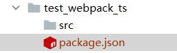
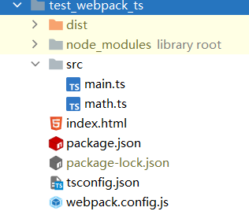

# 学习typescript

这里是Vue3网课的TS部分的笔记。代码仓库位于[tms: Typescript学习 (gitee.com)](https://gitee.com/masaikk/tms)。

---

### 作用域问题

对于同一目录下面的ts文件，编译器视为同一作用域，这就意味着不同文件中取名相同的变量会冲突。这就需要标定某个文件为块级作用域。应该在文件中写上代码

```typescript
export {}
```

---

### 使用ts-node安装typescript运行环境

```shell
npm install ts-node tslib @types/node --save
```

---

### 使用webpack安装typescript运行环境

1. 先进入文件夹，使用npm init初始化package.json。

   

2. 安装依赖

   ```shell
   npm install webpack webpack-cli ts-loader -D
   ```

   添加webpack.config.js并且加入build命令.

   ```javascript
   const path=require('path');
   const HtmlWebpackPlugin = require('html-webpack-plugin');
   
   module.exports ={
       entry: "./src/main.ts",
       output: {
           path: path.resolve(__dirname, './dist'),
           filename: "bundle.js",
       },
       resolve: {
           extensions: [".ts",".js",".cjs",".json"]
       },
       devServer: {
   
       },
       module: {
           rules: [
               {
                   test: /\.ts$/,
                   loader: "ts-loader"
               }
           ]
       },
       plugins: [
           new HtmlWebpackPlugin({
               template: "index.html"
           })
       ],
       mode: "development"
   }
   
   ```

   

3. 使用

   ```shell
   tsc --init
   ```

   创建tsconfig.json文件

4. 如果感觉频繁刷新繁琐，可以使用webpack-dev-server并且使用webpack serve命令。

   ```json
   {
     "name": "test_webpack_ts",
     "version": "1.0.0",
     "description": "",
     "main": "index.js",
     "scripts": {
       "test": "echo \"Error: no test specified\" && exit 1",
       "build": "webpack",
       "serve": "webpack serve"
     },
     "keywords": [
       "ts"
     ],
     "author": "masaikk",
     "license": "ISC",
     "devDependencies": {
       "ts-loader": "^9.2.6",
       "typescript": "^4.5.5",
       "webpack": "^5.68.0",
       "webpack-cli": "^4.9.2",
       "webpack-dev-server": "^4.7.4"
     }
   }
   ```

   文件的目录可以参考

   


---

   ### 类型的名称

   number/string对应的是typescript中的数字和字符串类型。

   String对应着JavaScript的字符串包装类。

   Number对应着JavaScript的数值包装类。

   **注意区分**

---

   ### unknown与any类型的区别

   unknown只能赋值给any类型和unknown类型。

   any类型可以赋值给任何类型。

   建议多使用unknown。

---

   ### never类型

   死循环或者因为抛出异常无法返回值的函数的类型。

   例如下列代码

   ```typescript
   function handleMessage(message: string | number) {
       switch (typeof message) {
           case "string": {
               // do something
               break;
           }
           case "number": {
               // do other thing
               break;
           }
           default: {
               const check: never = message;
           }
       }
   }
   ```

   类似与以上代码，如果使用了别的类型的参数，就会报错。

---

   ### tuple类型

   对于数组来说，不知道每个元素的类型。

   ```typescript
   /**
    * 新建一个数组
    */
   const arr: string[] = [];
   
   //新建一个元组
   const tup: [string, number, number] = ["abd", 12, 1.9]
   ```

   这里就可以确定每个元素的类型，防止因为某个元素不知道类型而缺失方法导致程序错误。

   结合泛型，类似于如下代码

   ```typescript
   function useState<T>(state: T) {
       let currentState = state;
       const changeState = (newState: T) => {
           //定义一个函数
           currentState = newState;
       }
   
       const tu: [T, (newState: T) => void] = [currentState, changeState];
       // 这里就使用元组比使用数组的好处在于知道类型
   
       return tu;
   }
   
   const [counter, setCounter] = useState(10);
   setCounter(1000);
   
   const [title, setTitle] = useState("abcd");
   
   const [flag, setFlag] = useState(true);
   ```

---

### 函数的类型

函数的返回值类型一般会因为可以自动推导而不写。

对于forEach方法的匿名函数来说，参数类型可以不写。

以上const tu: [T, (newState: T) => void] = [currentState, changeState];的(newState: T) => void是一个函数类型。

---

### 对象类型

举例

```ty
function useObject(obj:{x:number,y:number,z?:number}):number{
    return obj.x+obj.y
}
```

---

### 断言

as关键字用于子对象实例强制像父对象转化。（类似于多态）

```typescript
class Person {
}

class Student extends Person {
    study() {

    };
}

function doSomething(p: Person) {
    (p as Student).study();
}
```

实际上可以脱离上诉问题局限，直接转化类型。类似于：

```typescript
const mess: string = "lbwnb";
const num: number = (mess as unknown) as number;
```

**非空类型断言**

适用于某个方法的可选参数（因为可能造成undefined），使用关键字``!``。这里可以确保一定不是undefined

```typescript
function printMessLength(mess: string) {
    console.log(mess!.length);
}
printMessLength(mess);
```

*参考JS权威指南的笔记。*

---

### !!和??

``!!``一元，用于把数据转化成Boolean值

``??``二元，用于空值合并操作符，当操作符左值是null或者undefined的时候，返回右值，否则就返回左值。

```typescript
let message: string | null = '??';
const constant = message ?? "other";
// const constant = message ? message : "other";
```

---

### 函数类型

*不同于C++，函数类型的形参的名字在定义的时候不能省略。*

```ty
type addFunctionType = (number1: number, number2: number) => number;

const addFunc: addFunctionType = (num1: number, num2: number) => {
    return num1 + num2;
};
```

如上的代码所示，addFunctionType中的number1和number2的名字不能被省略。

---

### 类的基本定义，继承和抽象类

暂时跳过，感觉以后需要再回来看。P29

---

### 接口

类似于

```typescript
interface IInfoType {
    readonly name: string
    age: number
    friend?: {
        name: string
    }
}

const info: IInfoType = {
    name: "why",
    age: 18,
    friend: {
        name: "kobe"
    }
}

console.log(info.friend?.name)
console.log(info.name)
// info.name = "123"
info.age = 20
```

使用接口是可以多重接口的，使用implements关键字。但是继承只能单继承。

或者使用组合类型来表示。

*定义两个同名的interface，最后在使用的时候，是显示这两个interface合并之后的interface。（而不是覆盖掉）*

---

### 泛型

类似于C++的泛型

```typescript
function sum<Type>(num1:Type,num2:Type):Type{
    // @ts-ignore
    return num1 + num2;
}
```

但是这样的话就出现了问题，就是任意的Type有些属性是没有的。这就需要约束泛型的类型，使用``extends``关键字。

```typescript
function sum<Type extends number|string>(num1:Type,num2:Type):Type{
    // @ts-ignore
    return num1 + num2;
}
```

泛型接口

---

### 类型声明

有些第三方库是不包括类型声明的，这意味着要去社区找d.ts的文件。[TypeScript: Search for typed packages (typescriptlang.org)](https://www.typescriptlang.org/dt/search?search=)

也可以自定义声明文件，使用``declare``关键字，例如：

```typescript
declare module 'masaikk' {
    export function join(a: string, b: string): void
}

```

也可以声明函数并且在index中的script使用

```html
  <script>
    function fun(){
      console.log('fun');
    }
  </script>
```

```typescript
declare function fun(): void
```

使用以上代码声明。

