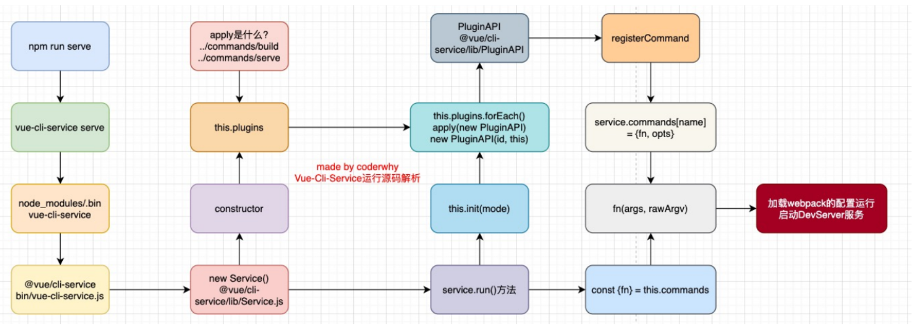
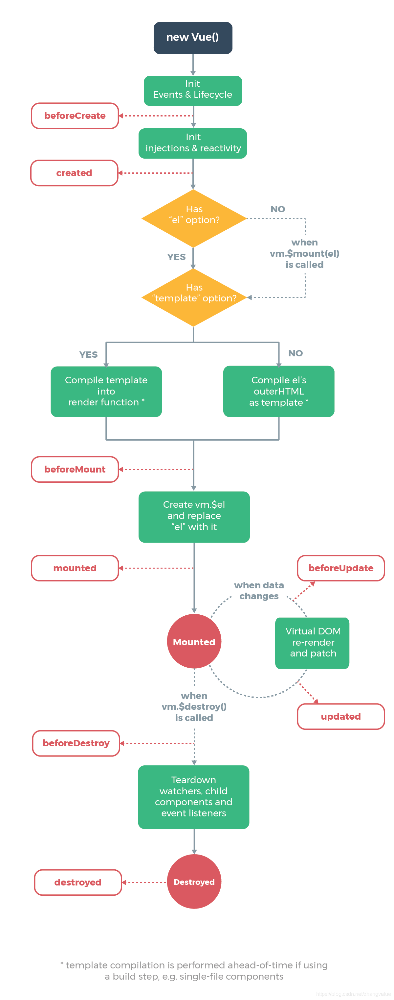
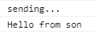
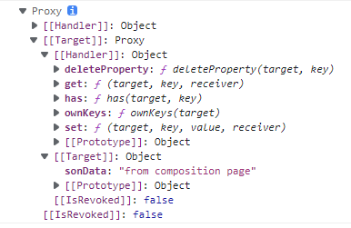
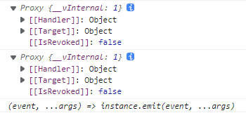
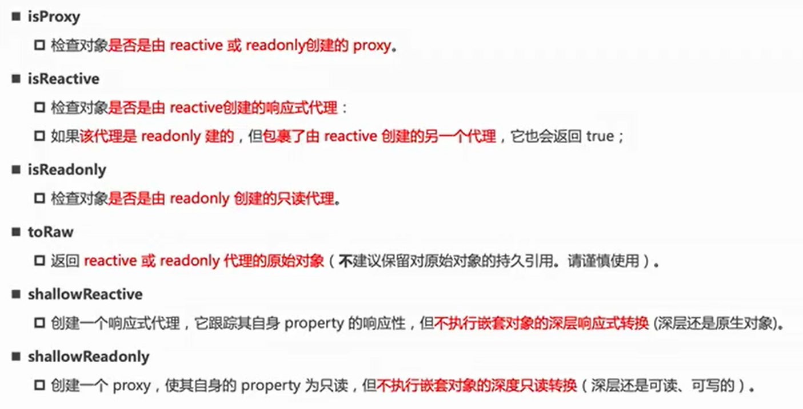
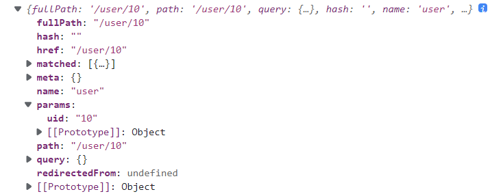

Vue3

学习vue3及其相关组件的笔记。代码位于[myvue: vue前端学习 (gitee.com)](https://gitee.com/masaikk/myvue)的vue3分支。

---

## vue项目基础

### Vue-cli相关知识

**vue-cli-service封装了webpack**

例如demo1/node_modules/@vue/cli-service/package.json中，指定了bin所指向的二进制文件的位置。

```json
{
      "bin": {
    "vue-cli-service": "bin/vue-cli-service.js"
  },
}
```

P10中详细介绍了webpack在vue-cli-service的源码解读，之后需要可以回来看。

**vue-cli的运行原理**



---

### vite

P10讲到了，很快，但是目前社区支持不够。

---

### Vue生命周期



[参考链接](https://segmentfault.com/a/1190000011381906)

```javascript
```


---

### Vue3父子组件传递值

### 这里不想看网课，暂时通过看博客复习这个。看不懂再回来P11

参考如下博客：

https://juejin.cn/post/6965062549771386887

父传子是使用props的方法，子传父使用``$emit``的方法。

示例子组件向父组件传递信息：

```javascript
//子组件
  methods:{
    sendEmitToFather(){
      console.log('sending...');
      this.$emit('son-mege','Hello from son')
    }
  }
```

父组件中在节点上绑定消息，传入函数

```javascript
<template>
  <div>
    <p>
      {{ mess }} in father page
    </p>
    <div>
      <use-props :son-data=this.mess @son-mege="getMessageFromSon"></use-props>
    </div>

  </div>
</template>

<script>
import useProps from "@/components/compisi/useProps";


export default {
  name: "CompPage",
  components: {useProps},
  data() {
    return {
      mess: 'from composition page'
    }
  },
  composition: {
    useProps
  },
  methods:{
    getMessageFromSon(data){
      console.log(data);
    }
  }
}
</script>
```

自动传入data数据，打印的情况如下所示



---

### props

这里是父向子传递数据的方式之一。

首先在自组件中声明props，如下所示：

```javascript
export default {
  name: "useProps",
  props: {
    sonData: {
      type: String,
      required: true,
    }
  },
  data() {
    return {
      mess: "use data props"
    }
  }
}
```

其中，props可以是数组也可以是对象。

然后在父组件中使用子组件中传入props参数，如下所示：

```javascript
    <div>
      <use-props :son-data=this.mess></use-props>
    </div>
```

完整代码为``demo2/src/views/CompPage.vue``

---

### Composition API

P15 重要

#### Mixin

复用的代码，如果Mixin与组件中出现命名冲突

#### options API 的弊端

某一个功能的各个逻辑会拆分到各个属性中。如果这个组件变得更大，那么拆分的会越来越散，难以阅读。

#### setup函数

传入props与context参数。对应着父传子的props。

setup因为比beforeCreated()函数还前，所以没有this对象。

在setup中记录props为一个proxy对象

```javascript
  setup(props, context) {
    console.log(props);
  },
```



另一个参数context，它包括三个属性：

+ attrs：所有非prop的attribute
+ slots：父组件的插槽
+ emit：$emit

或者直接使用解构写法来获取着三个属性

```javascript
  setup(props, {attrs, slots, emit}) {
    console.log(attrs);
    console.log(slots);
    console.log(emit);
  },
```



#### setup的返回

返回一个对象，也可以在组件中使用，比如

```javascript
  setup(props, {attrs, slots, emit}) {
    console.log(attrs);
    console.log(slots);
    console.log(emit);
    return {
      messSetup: "message form setup function"
    }
  },
```

以上参考代码位于``demo2/src/components/compisi/useProps.vue``

#### 响应式

使用reactive获取响应式对象，（这样的话数据如果有变化也能渲染到DOM里面）

此处代码位于``demo2/src/components/compisi/useSetup.vue``

例如:

```javascript
  setup(props, context) {

    const state=reactive({
      counter:100,
      tittle: "counter",
    })

    const increment = () => {
      state.counter++;
    }

    return {
      state,
      increment
    }
  }
```

reactive的参数只能是对象或者数组。基本数据类型需要用``ref``。

ref对象在template中被使用的时候，可以省略``.value``属性，称之为“自动解包”。在setup函数中，没有这个功能，必须要使用``.value``属性。例如：

```javascript
    let refCounter=ref(200);

    const state=reactive({
      counter:100,
      tittle: "counter",
    })

    const increment = () => {
      state.counter++;
      refCounter.value++;
      console.log(refCounter.value);
    }
```

使用``readonly``关键字得到一个原生对象的只读代理，即一个set方法被劫持的Proxy对象。例如：

```javascript
    const readOnlyInfo=readonly({
      tittle:"a setup counter"
    })
```

#### 相关语法



#### toRef和toRefs

都是收一个响应式对象的。

使用toRefs将响应式对象解包成数个ref，使用如下语法

```javascript
let { defaultMessage, defaultAudioURL } = toRefs(props);
```

使用toRef是将reactive对象中的某件键转化为ref对象。

#### watchEffect和watch的区别

``watchEffect``会首先执行一次，然后记录下来里面有多少个可响应对象，最后然后里面的可响应对象有变化，就出现执行。默认的``watchEffect``会在挂载之前就运行，或者可以使用传入参数``{flush:"post"}``来让它挂载之后再运行。

``watch``不会一开始就执行，记录某一个可响应对象的变化后执行。

#### 通过ref来获取dom

设置节点的ref属性，然后使用ref来获取，结合上述的watchEffect。要注意的是，这个对象必须要在挂载之后才能运行，使用钩子函数``onMounted``，或者监听变化：

```javascript
    <h2 ref="title">
      哈哈哈
    </h2>


setup(){
    const title=ref(null)
    watchEffect(()=>{
      console.log(title.value);
    })
}
```

代码位于``demo2/src/components/compisi/useSetup2.vue``

获取audio节点

定义如下``<audio controls src="http://119.23.182.180/azur/t1.mp3" ref="audioNode"></audio>``

使用flush设置为``post``的``watchEffect``，如下所示：

```javascript
    const audioNode=ref(null)
    watchEffect(()=>{
      console.log(audioNode.value.src);
      audioNode.value.src="http://119.23.182.180/azur/t2.mp3"
      audioNode.value.play()
    },{
      flush:"post"
    })
```

p17


---

### Vue源码部分解读

#### Vue网课部分

P19 P20 P21

*讲是讲得不错，可是我已经没有时间了。但是之后一定要回来看完。*

#### Vue博客

[Introduction · 深入剖析Vue源码 (penblog.cn)](https://book.penblog.cn/)


---

### vue-router

router-link的replace属性代表着url是否会被压栈。默认没这个属性就不会压栈。

#### 懒加载

类似于如下代码

```javascript
    {
        path: '/about',
        name: 'About',
        // route level code-splitting
        // this generates a separate chunk (about.[hash].js) for this route
        // which is lazy-loaded when the route is visited.
        component: () => import(/* webpackChunkName: "about" */ '../views/About.vue')
    },
```

这样的话可以讲打包后的js文件分开，并且在打包的时候也可以指定打包后的js文件的名字，例如

```javascript
component: () => import(/* webpackChunkName: "type-chunk" */'../views/Type.vue')
```

打包后的文件如下


#### 路由中的name属性

可以通过名字来跳转

#### 路由中的meta属性

传入一个对象来承载自定义数据

#### 动态路由匹配

类似Django的urls，使用匹配的方式来设置动态路由

```javascript
    {
        path: '/user/:uid',
        name: 'user',
        component: () => import(/* webpackChunkName: "user-chunk" */'../views/User.vue')
    }
```

相应的，在App.vue文件里面的view-linker也要修改``<router-link to="/user/10">我</router-link>``

可以在vue文件里面通过``this.$route``来访问



或者使用vue-router4以上提供的hook函数

```javascript
import { useRoute } from 'vue-router'

  setup(){
    const route = useRoute();
    console.log(route.params.uid);
  },
```

#### NotFound

如果路由没有匹配到，显示的页面

```javascript
    {
        path: "/:pathMatch(.*)*",
        component: ()=>import(/* webpackChunkName: "PageNotFound"*/'../views/NotFound.vue')
    }
```

注意要放在urls的最下面

而且能通过代码``$route.params.pathMatch``拿到。

#### 路由嵌套

等于向路由列表里面添加children属性

```javascript
{
        path: '/father',
        name: 'father',
        component: ()=>import(/* webpackChunkName: "father-chunk" */'../views/Father.vue'),
        children:[
            {
                path: 'son1',
                component:()=>import(/* webpackChunkName: "son1-ch"*/'../views/FatherSon1.vue')

            },
            {
                path: 'son2',
                component:()=>import(/* webpackChunkName: "son2-ch"*/'../views/FatherSon2.vue')

            },
        ]
    },
```

**并且注意，子路由不需要加上``\``**

#### 用代码跳转路由

注意\$router和\$route区别

```javascript
  methods:{
    jumpToFather(){
      this.$router.push('/father')
    }
  }
```

也提供了在setup()里面使用的hook

先``import {useRouter} from 'vue-router';``

```javascript
setup(){
    const router = useRouter();
    const jumpToFatherInSetupFunc=()=>{
      router.push('/father')
    }
    return {
      jumpToFatherInSetupFunc
    }
  }
```

### 动态添加路由

添加顶级路由，可以使用router对象的``addRoute``方法。

```javascript
router.addRoute({
    path:"/o1",
    name:"otherPage1",
    component:()=>import('../views/OtherPages1.vue')
})
```

添加二级路由，也可以使用上述方法，不过不同之处在于需要添加父路由的name属性作为传参。

而且需要注意，子路由的匹配规则不需要第一个``/``

代码如下所示：

```javascript
//添加二级路由
router.addRoute('father',{
    path:"o1",
    name:"otherPage1",
    component:()=>import('../views/OtherPages1.vue')
})
```

---

### VueX

#### 基础知识

注意不能用在component里面操作state，而是应该在mutations里面注册函数，用于修改state。

```javascript
import { createStore } from 'vuex'

export default createStore({
  state: {
    counter:0,
  },
  mutations: {
      increment(state){
          state.counter++;
      },
      decrement(state){
          state.counter--;
      }
  },
  actions: {
  },
  modules: {
  }
})
```

注意，在component中需要使用commit来注册mutations$\bigstar$

```javascript
  methods: {
    incre() {
      this.$store.commit('increment');
    },
    decre() {
      this.$store.commit('decrement');
    }
  }
```

最终component中使用state的代码为

```javascript
<p>This counter is {{ this.$store.state.counter }}</p>
```

整个component的代码为

```javascript
<template>
  <div>
    <p>This counter is {{ this.$store.state.counter }}</p>
    <div>
      <button @click="incre">increment</button>
      <button @click="decre">decrement</button>

    </div>
  </div>

</template>

<script>
export default {
  name: "CounterComp",
  methods: {
    incre() {
      this.$store.commit('increment');
    },
    decre() {
      this.$store.commit('decrement');
    }
  }
}
</script>
```

也可以将获取store的逻辑写道computed里面

```javascript
  computed:{
    sCounterNumber(){
      return this.$store.state.counter;
    }
  },
```

#### setup里面使用store

使用vuex提供的``useState``hook，配合``computed``的hook。

```javascript
  setup() {
    const store = useStore();
    const sCounter = computed(() => store.state.counter);
    return {
      sCounter
    }
  },
```

#### VueX的getters

对于getters的方法来说，对于每个函数都要传入state参数，然后方法中使用state获取状态。

```javascript
    getters: {
        totalPrice:(state)=> {
            let totalPrice = 0;
            for (const book of state.books) {
                totalPrice += book.price * book.number;
            }
            return totalPrice;
        }
    }
```

具体在使用的时候使用``this.$store.getters.name``来使用getters的值。

```javascript
  computed: {
    totalPrice() {
      return this.$store.getters.totalPrice;
    }
  }
```

代码位于demo2/src/components/UseStoreUtils.vue

或者传入两个参数``(state,getters)``用于调用其他的getters方法

#### 单一状态树

VueX推荐只使用一个``$store`` 

---

