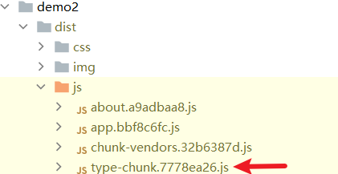
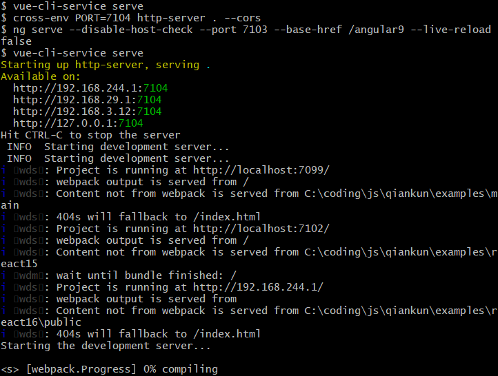

# Vue3

学习vue3及其相关组件的笔记。代码位于[myvue: vue前端学习 (gitee.com)](https://gitee.com/masaikk/myvue)的vue3分支。笔记源文件位于[jsm/vue.md · masaikk/interviewAccess - 码云 - 开源中国 (gitee.com)](https://gitee.com/masaikk/interview-access/blob/master/jsm/vue.md)

---

## vue项目基础

### Vue-cli相关知识

**vue-cli-service封装了webpack**

例如demo1/node_modules/@vue/cli-service/package.json中，指定了bin所指向的二进制文件的位置。

```json
{
    "bin": {
    "vue-cli-service": "bin/vue-cli-service.js"
  },
}
```

P10中详细介绍了webpack在vue-cli-service的源码解读，之后需要可以回来看。

**vue-cli的运行原理**


---

### vite

vite会将js打包成ES Module的形式，比webpack更快，并且不需要loader就可以加载css文件。

不同于webapck搭建的本地服务器使用的express服务器，vite1是使用了koa服务器，而vite2是使用的connect服务器。

对于浏览器中不能直接使用的ts或者less代码，vite的做法是返回一个同名文件，但是内容里面的typescript或者less语法已经被转化成ES6的语法。


并且，vite会在根目录下的.vite目录下，对文件进行预打包。这样可以减少第二次打包的运行速度。

使用``vite preview``可以对项目打包后的文件进行预览。


使用类似于vue-cli的vite脚手架@vitejs/create-app

```shell
create-app
```

**vite的加载问题**

浏览器中不能像npm那样加载地址，所以要将包的地址进行替换。

并且，像vue文件这种浏览器不识别的文件，会被vite编译为同名文件的js文件。

在这里对于vite工作原理进行解释的时候，需要做到以下两点：

1. 替换模块的地址。在这里使用koa服务器进行替代，但是vite内置的服务器是connect。
2. 解析vue文件。

搭建服务器

```javascript
const Koa = require("koa")
const app = new Koa()

app.use(async ctx => {
    ctx.body = 'koa 服务器'
})

app.listen(3000, () => {
    console.log('using port 3000');
})
```

也可以读取HTML文件进行渲染

```javascript
const Koa = require("koa")
const app = new Koa()
const fs=require('fs')

app.use(async ctx => {
    ctx.body = fs.readFileSync('./index.html','utf8')
})

app.listen(3000, () => {
    console.log('using port 3000');
})
```

由于浏览器不支持相对路径，所以应该对于路径进行转意表示，使用path模块进行路径的表示

```javascript
const Koa = require("koa")
const app = new Koa()
const fs = require('fs')
const path = require('path')

app.use(async ctx => {
    const {url} = ctx.request;
    if (url === '/') {
        ctx.type = 'text/html'
        ctx.body = fs.readFileSync('./index.html', 'utf8')
    } else if (url.endsWith('.js')) {
        const p = path.join(__dirname, url);
        console.log(p);
        ctx.type = 'application/javascript'
        ctx.body = fs.readFileSync(p, 'utf8')
    }
})

app.listen(3000, () => {
    console.log('using port 3000');
})
```

index.html的具体文件内容如下所示

```html
<!DOCTYPE html>
<html lang="en">
<head>
    <meta charset="UTF-8"/>
    <!--    <link rel="icon" href="/favicon.ico" />-->
    <meta name="viewport" content="width=device-width, initial-scale=1.0"/>
    <title>Vite App</title>
    <script src="main.js"></script>
</head>
<body>
<div id="app"></div>
<!--    <script type="module" src="/src/main.js"></script>-->

</body>
</html>
```

简单设置main.js的内容为``alert('hello vite')``。此时能够出现正常的js效果。


修改main.js的文件内容为

```javascript
import { createApp, h } from "vue";

createApp({
    render() {
        return h('div', 'this is a sentence');
    }
}).mount('#app');
```

考虑到``import { createApp, h } from "vue";``里面为裸模块的地址不是浏览器能够执行的路径，会报错：

可以考虑使用这个函数进行路径的修改，以下表示的是如果有包是来自于node_modules文件夹，就先加上``/@modules``前缀

```javascript
function rewriteImport(content) {
    return content.replace(/ from ['"](.*)['"]/g, function (s1, s2) {
        if (s2.startsWith('./') || s2.startsWith('/') || s2.startsWith('../')) {
            return s1;
        } else {
            return ` from '/@modules/${s2}`;
        }
    })
}
```

修改加载的文件，对于以上的包的路径进行替换，使其指向node_modules包（vite会自动帮用户操作这一步）

```javascript
const Koa = require("koa")
const app = new Koa()
const fs = require('fs')
const path = require('path')

app.use(async ctx => {
    const {url} = ctx.request;
    if (url === '/') {
        ctx.type = 'text/html'
        ctx.body = fs.readFileSync('./index.html', 'utf8')
    } else if (url.endsWith('.js')) {
        const p = path.join(__dirname, url);
        console.log(p);
        ctx.type = 'application/javascript'
        ctx.body = rewriteImport(fs.readFileSync(p, 'utf8'))
    } else if (url.startsWith('/@modules/')) {
        console.log(url);
        const moduleName = url.replace('/@modules/', '');
        const prefix = path.join(__dirname, "../node_modules", moduleName);
        const module = require(prefix + '/package.json').module
        const filePath = path.join(prefix, module);
        const ret = fs.readFileSync(filePath, "utf8")
        console.log(ret);
        ctx.type = 'application/javascript';
        ctx.body = rewriteImport(ret)
    }
})

function rewriteImport(content) {
    return content.replace(/ from ['"](.*)['"]/g, function (s1, s2) {
        if (s2.startsWith('./') || s2.startsWith('/') || s2.startsWith('../')) {
            return s1;
        } else {
            return ` from '/@modules/${s2}'`;
        }
    })
}

app.listen(3000, () => {
    console.log('using port 3000');
})
```

此时可以加载的内容如下所示


在network页面可以看到模块会被加载


但是如果此刻在代码中有node的判断，就会出现错误，因为此时没有环境变量


为了解决这个问题，可以在index.html中使用window.process变量进行定义。

```html
<!DOCTYPE html>
<html lang="en">
<head>
    <meta charset="UTF-8"/>
    <!--    <link rel="icon" href="/favicon.ico" />-->
    <meta name="viewport" content="width=device-width, initial-scale=1.0"/>
    <title>Vite App</title>

</head>
<body>
<div id="app"></div>
<script>
    window.process={
        env:{
            NODE_ENV :'dev'
        }
    }
</script>
<script src="/src/main.js" type="module"></script>
</body>
</html>

```

此时就能够正常渲染:


应该注意，上述的渲染是对于VNode的形式的，接下来对于SFC形式的文件进行渲染的操作：

```vue
<template>
  <div>
    <h1>
      {{ info.mess }}
    </h1>
  </div>

</template>

<script>
import { reactive } from "vue";

export default {
  name: "MyApp",
  setup() {
    let info = reactive({
      mess: "my app"
    })
    return {
      info
    }
  }
}
</script>

<style scoped>

</style>
```

修改mian.js文件

```javascript
import { createApp } from "vue";
import MyApp from './MyApp.vue'

createApp(MyApp).mount('#app');
```

但是很显然，直接在main.js中导入vue文件是无法识别的，所以应该转义到JavaScript内容。

这里需要考虑对于vue文件中的template和script两个组成部分进行分析，具体代码如下所示

```javascript
const compilerSFC = require('@vue/compiler-sfc')
const compilerDOM = require('@vue/compiler-dom')

app.use(async ctx => {
    const {url, query} = ctx.request;
    if (url === '/') {
        ctx.type = 'text/html'
        ctx.body = fs.readFileSync(path.join(__dirname, './index.html'), 'utf8')
    } else if (url.endsWith('.js')) {
        const p = path.join(__dirname, url);
        console.log(p);
        ctx.type = 'application/javascript'
        ctx.body = rewriteImport(fs.readFileSync(p, 'utf8'))
    } else if (url.startsWith('/@modules/')) {
        console.log(url);
        const moduleName = url.replace('/@modules/', '');
        const prefix = path.join(__dirname, "../node_modules", moduleName);
        const module = require(prefix + '/package.json').module
        const filePath = path.join(prefix, module);
        const ret = fs.readFileSync(filePath, "utf8")
        // console.log(ret);
        ctx.type = 'application/javascript';
        ctx.body = rewriteImport(ret)
    } else if (url.indexOf('.vue') > -1) {
        const p = path.join(__dirname, url.split('?')[0])
        const ret = compilerSFC.parse(fs.readFileSync(p, 'utf8'))
        if (!query.type) {
            const scriptContent = ret.descriptor.script.content
            const script = scriptContent.replace('export default ', 'const __script=')
            ctx.type = 'application/javascript'
            ctx.body = `
         ${rewriteImport(script)}
         import { render as __render } from '${url}?type=template'
         __script.render = __render
         export default __script
        `
        } else if (query.type === 'template') {
            const tpl = ret.descriptor.template.content
            const render = compilerDOM.compile(tpl, {
                mode: 'module'
            }).code
            ctx.type = 'application/javascript'
            ctx.body = rewriteImport(render)

        }
    }

})
```

如果文件是以.vue结尾的话，就走最后一项渲染的情况。

首先进入这段代码

```javascript
        if (!query.type) {
            const scriptContent = ret.descriptor.script.content
            const script = scriptContent.replace('export default ', 'const __script=')
            ctx.type = 'application/javascript'
            ctx.body = `
         ${rewriteImport(script)}
         import { render as __render } from '${url}?type=template'
         __script.render = __render
         export default __script
        `
```

这里表示得是将vue文件的代码的引用如``import {reactivate} from 'vue'``进行路径转义。并且对于template的情况，进行了渲染，得到了一个render函数，将其加入到文件中。再进行了如下的转义

```javascript
else if (query.type === 'template') {
            const tpl = ret.descriptor.template.content
            const render = compilerDOM.compile(tpl, {
                mode: 'module'
            }).code
            ctx.type = 'application/javascript'
            ctx.body = rewriteImport(render)
```

最后整个文件的代码被转义为

```javascript

         
import {reactive} from '/@modules/vue';

const __script={
  name: "MyApp",
  setup() {
    let info = reactive({
      mess: "my app"
    })
    return {
      info
    }

  }
}

         import { render as __render } from '/src/MyApp.vue?type=template'
         __script.render = __render
         export default __script
        
```


最终即可得到渲染的结果在页面上展示：


参考视频https://www.bilibili.com/video/BV1dh411S7Vz?p=6&vd_source=36542d6c49bf487d8a18d22be404b8d2

---

### vite插件

vite插件实际上是一个拥有名称，创建钩子或者生成钩子的对象。 

#### 示例插件

```javascript
export default function myExample() {
    return {
        name: 'my-example',
        resolveId(source) {
            if (source === 'virtual-module') {
                return source
            }
            return null
        },
        load(id) {
            if (id === 'virtual-module') {
                return 'export default "This is virtual"'
            }
            return null;
        }
    };
}
```

应该是应该函数的形式然后返回一个对象。

对于vite.config.js文件来说，导入插件并进行使用的代码如下所示

```javascript
import { defineConfig } from 'vite'
import vue from '@vitejs/plugin-vue'
import myExample from "./plugins/vite-plugin-my-example1";

// https://vitejs.dev/config/
export default defineConfig({
    plugins: [vue(), myExample()]
})
```

这个示例插件的用处是加载一个不存在的虚拟模块``virtual-module``

在main.js里面，使用一个不存在的模块

```javascript
import { createApp } from 'vue'
import App from './App.vue'
import vm from 'virtual-module'

console.log('vm '+vm)
createApp(App).mount('#app')
```

而vite打包的结构如下所示


```javascript
if (source === 'virtual-module') {
    return source
}
return null
```

这里返回source是表示对于模块的命中之后的处理，返回null是表示没有命中，由其他插件进行处理。

```javascript
if (id === 'virtual-module') {
                return 'export default "This is virtual"'
            }
```

这里表示只返回这一句代码。

实际上也就是导出该虚拟模块的值，在main.js中使用``import vm from 'virtual-module'``。这里vm的值就是``This is virtual``

#### 插件钩子

vite的钩子分为rollup钩子（与创建的时机有关）以及vite特有的钩子。

参考[博客](https://juejin.cn/post/7103165205483356168)以及如下插件的模板[https://github.com/jeddygong/vite-templates/tree/master/vite-plugin-template](https://github.com/jeddygong/vite-templates/tree/master/vite-plugin-template)

```typescript
import type { PluginOption } from 'vite';

export default function vitePluginTemplate(): PluginOption {
  return {
    // 插件名称
    name: 'vite-plugin-template',

    // pre 会较于 post 先执行
    enforce: 'pre', // post

    // 指明它们仅在 'build' 或 'serve' 模式时调用
    apply: 'build', // apply 亦可以是一个函数

    // 1. vite 独有的钩子：可以在 vite 被解析之前修改 vite 的相关配置。钩子接收原始用户配置 config 和一个描述配置环境的变量env
    config(config, { command }) {},

    // 2. vite 独有的钩子：在解析 vite 配置后调用。使用这个钩子读取和存储最终解析的配置。当插件需要根据运行的命令做一些不同的事情时，它很有用。
    configResolved(resolvedConfig) {},

    // 4. vite 独有的钩子：主要用来配置开发服务器，为 dev-server (connect 应用程序) 添加自定义的中间件
    configureServer(server) {},

    // 18的前面. vite 独有的钩子：转换 index.html 的专用钩子。钩子接收当前的 HTML 字符串和转换上下文
    transformIndexHtml(html) {},

    // vite 独有的钩子: 执行自定义HMR更新，可以通过ws往客户端发送自定义的事件
    handleHotUpdate({ file, server }) {},

    // 3. 构建阶段的通用钩子：在服务器启动时被调用：获取、操纵Rollup选项
    options(options) {},

    // 5. 构建阶段的通用钩子：在服务器启动时被调用：每次开始构建时调用
    buildStart(options) {},

    // 构建阶段的通用钩子：在每个传入模块请求时被调用：创建自定义确认函数，可以用来定位第三方依赖
    resolveId(source, importer, options) {},

    // 构建阶段的通用钩子：在每个传入模块请求时被调用：可以自定义加载器，可用来返回自定义的内容
    load(id) {},

    // 构建阶段的通用钩子：在每个传入模块请求时被调用：在每个传入模块请求时被调用，主要是用来转换单个模块
    transform(code, id) {},

    // 构建阶段的通用钩子：在构建结束后被调用，此处构建只是代表所有模块转义完成
    buildEnd() {},

    // 输出阶段钩子通用钩子：接受输出参数
    outputOptions(options) {},

    // 输出阶段钩子通用钩子：每次bundle.generate 和 bundle.write调用时都会被触发。
    renderStart(outputOptions, inputOptions) {},

    // 输出阶段钩子通用钩子：用来给chunk增加hash
    augmentChunkHash(chunkInfo) {},

    // 输出阶段钩子通用钩子：转译单个的chunk时触发。rollup输出每一个chunk文件的时候都会调用。
    renderChunk(code, chunk, options) {
      return null;
    },

    // 输出阶段钩子通用钩子：在调用 bundle.write 之前立即触发这个hook
    generateBundle(options, bundle, isWrite) {},

    // 输出阶段钩子通用钩子：在调用 bundle.write后，所有的chunk都写入文件后，最后会调用一次 writeBundle
    writeBundle(options, bundle) {},

    // 通用钩子：在服务器关闭时被调用
    closeBundle() {},
  };
}
```

##### 1. vite 独有的钩子

1. `enforce` ：值可以是`pre` 或 `post` ， `pre` 会较于 `post` 先执行；
2. `apply` ：值可以是 `build` 或 `serve`  亦可以是一个函数，指明它们仅在 `build` 或 `serve` 模式时调用；
3. `config(config, env)` ：可以在 vite 被解析之前修改 vite 的相关配置。钩子接收原始用户配置 config 和一个描述配置环境的变量env；
4. `configResolved(resolvedConfig)` ：在解析 vite 配置后调用。使用这个钩子读取和存储最终解析的配置。当插件需要根据运行的命令做一些不同的事情时，它很有用。
5. `configureServer(server)` ：主要用来配置开发服务器，为 dev-server (connect 应用程序) 添加自定义的中间件；
6. `transformIndexHtml(html)` ：转换 index.html 的专用钩子。钩子接收当前的 HTML 字符串和转换上下文；
7. `handleHotUpdate(ctx)`：执行自定义HMR更新，可以通过ws往客户端发送自定义的事件；

##### 2. vite 与 rollup 的通用钩子之构建阶段

1. `options(options)` ：在服务器启动时被调用：获取、操纵Rollup选项，严格意义上来讲，它执行于属于构建阶段之前；
2. `buildStart(options)`：在每次开始构建时调用；
3. `resolveId(source, importer, options)`：在每个传入模块请求时被调用，创建自定义确认函数，可以用来定位第三方依赖；
4. `load(id)`：在每个传入模块请求时被调用，可以自定义加载器，可用来返回自定义的内容；
5. `transform(code, id)`：在每个传入模块请求时被调用，主要是用来转换单个模块；
6. `buildEnd()`：在构建阶段结束后被调用，此处构建结束只是代表所有模块转义完成；

##### 3. vite 与 rollup 的通用钩子之输出阶段

1. `outputOptions(options)`：接受输出参数；
2. `renderStart(outputOptions, inputOptions)`：每次 bundle.generate 和 bundle.write 调用时都会被触发；
3. `augmentChunkHash(chunkInfo)`：用来给 chunk 增加 hash；
4. `renderChunk(code, chunk, options)`：转译单个的chunk时触发。rollup 输出每一个chunk文件的时候都会调用；
5. `generateBundle(options, bundle, isWrite)`：在调用 bundle.write 之前立即触发这个 hook；
6. `writeBundle(options, bundle)`：在调用 bundle.write后，所有的chunk都写入文件后，最后会调用一次 writeBundle；
7. `closeBundle()`：在服务器关闭时被调用。

以下表示得是钩子的生命周期：


设置enforce的值用于表示该插件所执行的时机


---

### vite-electron项目构建


---

### Vue生命周期


[参考链接](https://segmentfault.com/a/1190000011381906)

---

### Vue3父子组件传递值

参考如下博客：

https://juejin.cn/post/6965062549771386887

父传子是使用props的方法，子传父使用``$emit``的方法。

示例子组件向父组件传递信息：

```javascript
//子组件
  methods:{
    sendEmitToFather(){
      console.log('sending...');
      this.$emit('son-mege','Hello from son')
    }
  }
```

父组件中在节点上绑定消息，传入函数

```javascript
<template>
  <div>
    <p>
      {{ mess }} in father page
    </p>
    <div>
      <use-props :son-data=this.mess @son-mege="getMessageFromSon"></use-props>
    </div>

  </div>
</template>

<script>
import useProps from "@/components/compisi/useProps";


export default {
  name: "CompPage",
  components: {useProps},
  data() {
    return {
      mess: 'from composition page'
    }
  },
  composition: {
    useProps
  },
  methods:{
    getMessageFromSon(data){
      console.log(data);
    }
  }
}
</script>
```

自动传入data数据，打印的情况如下所示


---

### props

这里是父向子传递数据的方式之一。

#### vue2

首先在自组件中声明props，如下所示：

```javascript
export default {
  name: "useProps",
  props: {
    sonData: {
      type: String,
      required: true,
    }
  },
  data() {
    return {
      mess: "use data props"
    }
  }
}
```

其中，props可以是数组也可以是对象。

然后在父组件中使用子组件中传入props参数，如下所示：

```javascript
    <div>
      <use-props :son-data=this.mess></use-props>
    </div>
```

完整代码为`demo2/src/views/CompPage.vue`

#### vue3

参考[【vue3 ＜script setup＞ props 使用与讲解】defineProps、withDefaults 类型限制、默认值设置_普通网友的博客-CSDN博客](https://blog.csdn.net/m0_67401228/article/details/123304831)

---

### provide和inject

*用于非父子组件之间的共享数据。*

如果有一些嵌套的深层组件，使用props一直往下传递无疑是很麻烦的。所以这种情况下可以使用provide和inject。有如下特性：

+ 无论层级结构有多深，父组件都可以作为其所有子组件的依赖提供者。
+ 父组件使用provide来提供数据。
+ 子组件使用inject来使用数据。
+ 可以看成是long range props

以下是代码演示。

例子是创建了三个组件，按顺序是provide,home和homeson，展示如下：


可以在爷组件provide里面写下provide属性，表示提供这个数据。爷组件不需要管这个数据有没有用上。

```vue
<script>
import home from "@/components/useProvide/home";
export default {
  name: "provide",
  components: {
    home,
  },
  provide: {
    pp1: "some data",
    pp2: "other data",
  },
};
</script>
```

在孙节点homeson里面进行接收，使用inject

```vue
<template>
  <div>
    <div>home-son</div>
    <div>inject value: {{ pp1 }}-{{ pp2 }}</div>
  </div>
</template>

<script>
export default {
  name: "homeson",
  inject: ["pp1", "pp2"],
};
</script>

<style scoped></style>

```

即可正常展示


实际开发情况里面，provide里面的数据不能像上述例子里面一样写死。而是放在data里面。

并且如果使用上方``provide:{}``的写法，里面的this是``undefined``。所以更推荐``provide(){return{}}``写法，这里的this就有指向。即可使用this来引用data里面的数据。

```vue
<template>
  <div>
    <div>
      <p>provide</p>
    </div>
    <div>
      <home></home>
    </div>
  </div>
</template>

<script>
import home from "@/components/useProvide/home";

export default {
  name: "provide",
  components: {
    home,
  },
  provide() {
    return {
      pp1: "some data",
      pp2: "other data",
      da: this.dataV,
    };
  },
  data() {
    return {
      dataV: "data from data",
    };
  },
};
</script>

<style scoped></style>

```

参考代码``demo2/src/views/provide.vue``

如果想要响应的话，使用``computed``

```javascript
  provide() {
    return {
      pp1: "some data",
      pp2: "other data",
      da: computed(() => this.dataV),
    };
  },
```

---

### Slot

可以使用默认插槽，例如

```vue
<template>
  <div id="son">
    <div>显示插槽的组件</div>
    <div>
      <slot>
        <i>这里是默认插槽元素</i>
      </slot>
    </div>
  </div>
</template>

<script>
export default {
  name: "useSlot1",
};
</script>

<style scoped>
#son {
  border: #2c3e50 dashed 1px;
  background-color: aliceblue;
}
</style>

```

在父节点中展示即可

```vue
<template>
  <div>
    <div>使用插槽的父组件</div>
    <div>
      <use-slot1></use-slot1>
    </div>
  </div>
</template>

<script>
import useSlot1 from "@/components/compisi/useSlot1";
export default {
  name: "slotHolder",
  components: {
    useSlot1,
  },
};
</script>

<style scoped></style>

```

显示的效果：


#### 普通插槽

如果传入插槽，就不显示默认插槽内容

```html
    <div>
      <use-slot1>
        <el-button>不使用默认插槽而是使用DOM</el-button>
      </use-slot1>
    </div>
```


#### 具名插槽

参考代码``demo2/src/components/compisi/useSlot2.vue``，使用flex将样式展示为如下形式：


初始代码

```vue
<template>
  <div id="use-slot2">
    <div class="left">
      <slot></slot>
    </div>
    <div class="center">
      <slot></slot>
    </div>
    <div class="right">
      <slot></slot>
    </div>
  </div>
</template>

<script>
export default {
  name: "useSlot2",
};
</script>

<style scoped>
#use-slot2 {
  display: flex;
  width: 400px;
}

#use-slot2 > div {
  height: 50px;
  margin-top: 40px;
  border: #2c3e50 dotted 0.5px;
}

.left,
.right {
  width: 80px;
  background-color: aliceblue;
}

.center {
  flex: 1;
}
</style>

```

我们希望在插槽处传入三个slot然后分别渲染到以上的三块部分。

直接使用的话

```vue
    <div id="slot2holder">
      <use-slot2>
        <el-button>左边的内容</el-button>
        <el-button>中间的内容</el-button>
        <el-button>右边的内容</el-button>
      </use-slot2>
    </div>
```

会显示：


所以如果不指定名字的话，每个插槽都会分配到各个``<slot\>``中，所以需要使用具名插槽。

应该使用``<template>``标签以及``v-slot``属性。

在父组件中应该这样使用

```vue
    <div id="slot2holder">
      <use-slot2>
        <template v-slot:left><el-button>左边按钮</el-button></template>
        <template v-slot:center><el-button>中间按钮</el-button></template>
        <template v-slot:right><el-button>右边按钮</el-button></template>
      </use-slot2>
    </div>
```

使用``v-slot``来指定各个插槽的名字。

在子组件中使用的时候需要通过``<slot>``的``name``属性来指定具体要渲染的插槽模板。例如：

```vue
<template>
  <div id="use-slot2">
    <div class="left">
      <slot name="left"></slot>
    </div>
    <div class="center">
      <slot name="center"></slot>
    </div>
    <div class="right">
      <slot name="right"></slot>
    </div>
  </div>
</template>
```

展示的效果如下：


代码位于``demo2/src/components/compisi/useSlot2.vue``

同时，子组件里面的slot的name属性也可以结合子组件的props属性，都通过父组件的传入的值进行渲染。更具有普适性。

---

### keep-alive

---

### animation

使用``<transition>``会比单纯的使用``v-if``显得更加平滑。参考代码：

```vue
<template>
  <div>
    <p>set1</p>
    <el-button @click="isShow=!isShow">显示/隐藏</el-button>
  </div>
  <transition name="set1">
    <h2 v-if="isShow">some message</h2>
  </transition>

</template>

<script>
export default {
  name: "animationsSet1",
  data() {
    return {
      isShow: true
    }
  }
}
</script>

<style scoped>
.set1-enter-from,
.set1-leave-to {
  opacity: 0;
}
.set1-enter-to,
.set1-leave-from {
  opacity: 1;
}

.set1-enter-active,
.set1-leave-active{
  transition: opacity 2s ease;
}

</style>

```


这里就有两秒的淡入淡出效果。

原理：当插入或者删除包含在transition组件里面的元素的时候，vue将进行以下处理：

1. 自动嗅探目标元素是否应用了CSS过渡或者动画，如果有，那么在恰当的时机添加/删除CSS类名。
2. 如果transition组件提供了JavaScript钩子函数，这些钩子函数将在恰当的时机被调用。
3. 如果没有找到JavaScript的钩子函数也没有找到CSS过渡动画，那么DOM的插入或者删除操作会立即进行。

如同以上代码说明，使用了``name='set1'``，就会自动添加类``.set1-enter-active``等等。

在进入/离开的过渡中，会有 6 个 class 切换。

1. `v-enter-from`：定义进入过渡的开始状态。在元素被插入之前生效，在元素被插入之后的下一帧移除。
2. `v-enter-active`：定义进入过渡生效时的状态。在整个进入过渡的阶段中应用，在元素被插入之前生效，在过渡/动画完成之后移除。这个类可以被用来定义进入过渡的过程时间，延迟和曲线函数。
3. `v-enter-to`：定义进入过渡的结束状态。在元素被插入之后下一帧生效 (与此同时 `v-enter-from` 被移除)，在过渡/动画完成之后移除。
4. `v-leave-from`：定义离开过渡的开始状态。在离开过渡被触发时立刻生效，下一帧被移除。
5. `v-leave-active`：定义离开过渡生效时的状态。在整个离开过渡的阶段中应用，在离开过渡被触发时立刻生效，在过渡/动画完成之后移除。这个类可以被用来定义离开过渡的过程时间，延迟和曲线函数。
6. `v-leave-to`：离开过渡的结束状态。在离开过渡被触发之后下一帧生效 (与此同时 `v-leave-from` 被移除)，在过渡/动画完成之后移除。

添加CSS动画：

```css
.set2-enter-active
{
  animation: bounce 2s ease;
}
.set2-leave-active{
  animation: bounce 1s ease reverse;
}
@keyframes bounce {
  0%{
    transform: scale(0);
  }

  50%{
    transform: scale(1.2);
  }

  100%{
    transform: scale(1);
  }
}
```


---

### Composition API

P15 重要

#### Mixin

复用的代码，如果Mixin与组件中出现命名冲突

#### options API 的弊端

某一个功能的各个逻辑会拆分到各个属性中。如果这个组件变得更大，那么拆分的会越来越散，难以阅读。

#### setup函数

传入props与context参数。对应着父传子的props。

setup因为比beforeCreated()函数还前，所以没有this对象。

在setup中记录props为一个proxy对象

```javascript
  setup(props, context) {
    console.log(props);
  },
```


另一个参数context，它包括三个属性：

+ attrs：所有非prop的attribute
+ slots：父组件的插槽
+ emit：$emit

或者直接使用解构写法来获取着三个属性

```javascript
  setup(props, {attrs, slots, emit}) {
    console.log(attrs);
    console.log(slots);
    console.log(emit);
  },
```


#### setup的返回

返回一个对象，也可以在组件中使用，比如

```javascript
  setup(props, {attrs, slots, emit}) {
    console.log(attrs);
    console.log(slots);
    console.log(emit);
    return {
      messSetup: "message form setup function"
    }
  },
```

以上参考代码位于``demo2/src/components/compisi/useProps.vue``

#### 响应式

使用reactive获取响应式对象，（这样的话数据如果有变化也能渲染到DOM里面）

此处代码位于``demo2/src/components/compisi/useSetup.vue``

例如:

```javascript
  setup(props, context) {

    const state=reactive({
      counter:100,
      tittle: "counter",
    })

    const increment = () => {
      state.counter++;
    }

    return {
      state,
      increment
    }
  }
```

reactive的参数只能是对象或者数组。基本数据类型需要用``ref``。

ref对象在template中被使用的时候，可以省略``.value``属性，称之为“自动解包”。在setup函数中，没有这个功能，必须要使用``.value``属性。例如：

```javascript
    let refCounter=ref(200);

    const state=reactive({
      counter:100,
      tittle: "counter",
    })

    const increment = () => {
      state.counter++;
      refCounter.value++;
      console.log(refCounter.value);
    }
```

使用``readonly``关键字得到一个原生对象的只读代理，即一个set方法被劫持的Proxy对象。例如：

```javascript
    const readOnlyInfo=readonly({
      tittle:"a setup counter"
    })
```

#### 相关语法


#### toRef和toRefs

都是收一个响应式对象的。

使用toRefs将响应式对象解包成数个ref，使用如下语法

```javascript
let { defaultMessage, defaultAudioURL } = toRefs(props);
```

使用toRef是将reactive对象中的某件键转化为ref对象。

#### watch

第一个参数是一个函数，返回一个需要监听的值。

```javascript
const state = reactive({ count: 0 })
watch(
  () => state.count,
  (count, prevCount) => {
    /* ... */
  }
)
```

#### watchEffect和watch的区别

``watchEffect``会首先执行一次，然后记录下来里面有多少个可响应对象，最后然后里面的可响应对象有变化，就出现执行。默认的``watchEffect``会在挂载之前就运行，或者可以使用传入参数``{flush:"post"}``来让它挂载之后再运行。

``watch``不会一开始就执行，记录某一个可响应对象的变化后执行。

#### 通过ref来获取dom

设置节点的ref属性，然后使用ref来获取，结合上述的watchEffect。要注意的是，这个对象必须要在挂载之后才能运行，使用钩子函数``onMounted``，或者监听变化：

```javascript
    <h2 ref="title">
      哈哈哈
    </h2>


setup(){
    const title=ref(null)
    watchEffect(()=>{
      console.log(title.value);
    })
}
```

代码位于``demo2/src/components/compisi/useSetup2.vue``

获取audio节点

定义如下``<audio controls src="http://119.23.182.180/azur/t1.mp3" ref="audioNode"></audio>``

使用flush设置为``post``的``watchEffect``，如下所示：

```javascript
    const audioNode=ref(null)
    watchEffect(()=>{
      console.log(audioNode.value.src);
      audioNode.value.src="http://119.23.182.180/azur/t2.mp3"
      audioNode.value.play()
    },{
      flush:"post"
    })
```

注意，获取的dom一定要在return中返回，才能进行渲染。

---

### Vue源码部分解读

P18 P19 P20 P21

#### Vue网课部分

##### 虚拟DOM渲染

虚拟DOM渲染的时候更加方便，可以用diff算法来判断对比VNode（是一个JavaScript对象）之间的不同。*结合重绘和重排知识点。*

渲染过程如下：


##### mini-Vue的实现

主要包括以下三个模块：

+ 渲染系统模块
  + h函数，用于返回一个VNode对象
  + mount函数，用于将VNode挂载到DOM上
  + patch函数，用于对两个VNode进行对比，决定如何处理新的VNode
+ 可响应式系统模块
+ 应用程序入口模块

将vue文件里面的``template``标签渲染为调用h函数的，是使用了vue的编译插件，这里不讨论。

**h函数的实现**

思考Vue里面的h函数，主要传入了三个参数，第一个是标签名称，第二个是props比如说各个属性，第三个是内容或者是数组表示子节点，里面也包含h函数渲染出来的VNode。如下所示：

```javascript
    const VNode = h('div', {'class': 'why'}, [
        h('h2', null, '计数：100'),
        h('button', null, '+1')
    ])
```

大概是这样的实现情况

```javascript
const h = (tag, props, children) => {
  // 渲染VNode对象
  return {
    tag,
    props,
    children,
  };
};
```

简易的VNode如上所示，是树状的结构。在控制台打印输出如下：


**mount函数的实现**

用于将刚才的VNode转化成真实的DOM节点然后挂载到DOM上面。例如``mount(vnode, document.querySelector('#app'));``

还需要将vnode对象也保存一个DOM节点。参考代码如下所示：

```javascript
const mount = (vnode, container) => {
  // 1,创建真实的DOM元素
  const el = (vnode.el = document.createElement(vnode.tag));

  // 2,处理props
  if (vnode.props) {
    for (const key in vnode.props) {
      const value = vnode.props[key];

      //这里判断一些onclick之类的绑定的事件
      if (key.startsWith("on")) {
        // 绑定原生事件
        el.addEventListener(key.slice(2).toLowerCase(), value);
      } else {
        el.setAttribute(key, value);
      }
    }
  }

  // 3,处理children
  if (vnode.children) {
    // 如果只是一个字符串类型
    if (typeof vnode.children === "string") {
      el.textContent = vnode.children;
    } else {
      // 数组情况
      vnode.children.forEach((item) => {
        mount(item, el);
        //将每个数组里面的元素挂载到el里面
      });
    }
  }

  // 4,挂载到container上面;
  container.appendChild(el);
};
```

在此上，处理创建节点、遍历处理props、处理children（如有就递归调用mount）和挂载整个真实DOM节点。

**patch函数的实现**

用于比较新的vnode和旧的vnode，得出它们之间的不同。

传入两个vnode对象，分别代表旧vnode和新vnode。

首先比较tag，如果tag都不一样那么直接替换。

```javascript
if (n1.tag !== n2.tag) {
    //如果连标签都不同的话那么就直接替换。
    const n1ElParent = n1.el.parentElement;
    // 通过n1的el属性拿到整个DOM节点，再根据它拿到父节点准备去移除它。

    n1ElParent.removeChild(n1.el);
    mount(n2, n1ElParent);
    //删除n1，挂载n2
  } else {
  }
```

如果类型相同的话，应该先去取出n1的DOM对象然后在n2中的el进行保存。

```javascript
// 1,保存n1的el属性
    const el = (n2.el = n1.el);
```

然后处理props，分别是添加新的props和移除旧的vnode中应该被remove的props

```javascript
    // 2,处理props
    // 如果props是undefined，就返回一个空对象
    const oldProps = n1.props || {};
    const newProps = n2.props || {};

    // 2.1把新的props添加到el中
    for (const key in newProps) {
      const oldValue = oldProps[key];
      const newValue = newProps[key];
      if (newValue !== oldValue) {
        //如果不同，就用新的把旧的盖掉
        //这里判断一些onclick之类的绑定的事件
        if (key.startsWith("on")) {
          // 绑定原生事件
          el.addEventListener(key.slice(2).toLowerCase(), newValue);
        } else {
          el.setAttribute(key, newValue);
        }
      }
    }
    //2.2 把旧的props删掉
    for (const key in oldProps) {
      if (!(key in newProps)) {
        //这里判断一些onclick之类的绑定的事件
        if (key.startsWith("on")) {
          // 删除原生事件
          el.removeEventListener(key.slice(2).toLowerCase());
        } else {
          el.removeAttribute(key);
        }
      }
    }
```

之后是处理children，这里要关心children是否是字符串或者数组的情况。

下面表示的是除了新的children和旧的children都是数组的情况。

```javascript

    // 3，处理children
    const oldChildren = n1.children || [];
    const newChildren = n2.children || [];

    if (typeof newChildren === "string") {
      //如果新的child是字符串
      if (typeof oldChildren === "string") {
        if (newChildren !== oldChildren) {
          el.textContent = newChildren;
          //如果新旧子节点都是字符串而且不相等的话，就直接使用textContent属性换
        } else {
          el.innerHTML = newChildren;
          //否则就直接把整个新的字符串来赋值
        }
      }
    } else {
      //如果新的child不是字符串，而是数组
      if (typeof oldChildren === "string") {
        el.innerHTML = "";
        newChildren.forEach((item) => {
          mount(item, el);
          //挂载新的children
        });
      } else {
        // 如果旧的child不是字符串而是数组
        //这里结合diff算法和vue中结合key的优化
        //代码待补充
      }
    }
```

对于diff函数处理两个都是数组的情况（不考虑可以），遵循以下操作：

1. 前面有相同节点的原生进行patch操作
2. 如果new更长，就对更长的部分直接mount
3. 如果old更长，就对更长的部分直接移除

```javascript
       // 1.前面有相同节点的进z行原生的patch操作
        const commonLength = Math.min(oldChildren.length, newChildren.length);
        for (let i = 0; i < commonLength; i++) {
          patch(oldChildren[i], newChildren[i]);
        }
        // 2.newChildren>oldChildren
        if (newChildren.length > oldChildren.length) {
          //对于更长部分进行遍历
          newChildren.slice(oldChildren.length).forEach((item) => {
            //直接挂载
            mount(item, el);
          });
        }
        // 3.newChildren<oldChildren
        if (newChildren.length < oldChildren.length) {
          oldChildren.slice(newChildren.length).forEach((item) => {
            el.removeChild(item);
            //对更长的节点进行移除操作
          });
        }
```

**响应式系统的实现**

P19

数据劫持

Vue2中的实现：

太难了之后回来再看。


#### Vue博客

[Introduction · 深入剖析Vue源码 (penblog.cn)](https://book.penblog.cn/)

---

### vue-router

router-link的replace属性代表着url是否会被压栈。默认没这个属性就不会压栈。

#### 导入vue-router

使用如以下代码安装依赖 

``npm install vue-router@next``

在导入声明的时候可以使用``import type { RouteRecordRaw } from "vue-router";``的形式来声明导入的是type。

参考代码：

```typescript
import { createRouter, createWebHashHistory } from "vue-router";
import type { RouteRecordRaw } from "vue-router";

const routes: RouteRecordRaw[] = [
  {
    path: "/",
    redirect: "/login",
  },
  {
    path: "/login",
    component: () => import(""),
  },
];

const router = createRouter({
  routes: [],
  history: createWebHashHistory(),
});

export default router;
```

然后在main.ts中进行注册：

```typescript
import { createApp } from "vue";
import App from "./App.vue";
import router from "./router";

const app = createApp(App);
app.use(router);
app.mount("#app");
```

最后在App.vue中引入``<router-view></router-view>``

#### 懒加载

类似于如下代码

```javascript
    {
        path: '/about',
        name: 'About',
        // route level code-splitting
        // this generates a separate chunk (about.[hash].js) for this route
        // which is lazy-loaded when the route is visited.
        component: () => import(/* webpackChunkName: "about" */ '../views/About.vue')
    },
```

这样的话可以讲打包后的js文件分开，并且在打包的时候也可以指定打包后的js文件的名字，例如

```javascript
component: () => import(/* webpackChunkName: "type-chunk" */'../views/Type.vue')
```

打包后的文件如下



#### 路由中的name属性

可以通过名字来跳转

#### 路由中的meta属性

传入一个对象来承载自定义数据

#### 动态路由匹配

类似Django的urls，使用匹配的方式来设置动态路由

```javascript
    {
        path: '/user/:uid',
        name: 'user',
        component: () => import(/* webpackChunkName: "user-chunk" */'../views/User.vue')
    }
```

相应的，在App.vue文件里面的view-linker也要修改``<router-link to="/user/10">我</router-link>``

可以在vue文件里面通过``this.$route``来访问


或者使用vue-router4以上提供的hook函数

```javascript
import { useRoute } from 'vue-router'

  setup(){
    const route = useRoute();
    console.log(route.params.uid);
  },
```

#### NotFound

如果路由没有匹配到，显示的页面

```javascript
    {
        path: "/:pathMatch(.*)*",
        component: ()=>import(/* webpackChunkName: "PageNotFound"*/'../views/NotFound.vue')
    }
```

注意要放在urls的最下面

而且能通过代码``$route.params.pathMatch``拿到。

#### 路由嵌套

等于向路由列表里面添加children属性

```javascript
{
        path: '/father',
        name: 'father',
        component: ()=>import(/* webpackChunkName: "father-chunk" */'../views/Father.vue'),
        children:[
            {
                path: 'son1',
                component:()=>import(/* webpackChunkName: "son1-ch"*/'../views/FatherSon1.vue')

            },
            {
                path: 'son2',
                component:()=>import(/* webpackChunkName: "son2-ch"*/'../views/FatherSon2.vue')

            },
        ]
    },
```

**并且注意，子路由不需要加上``\``**

#### 用代码跳转路由

注意`\$router`和`\$route`区别

```javascript
  methods:{
    jumpToFather(){
      this.$router.push('/father')
    }
  }
```

也提供了在setup()里面使用的hook

先``import {useRouter} from 'vue-router';``

```javascript
setup(){
    const router = useRouter();
    const jumpToFatherInSetupFunc=()=>{
      router.push('/father')
    }
    return {
      jumpToFatherInSetupFunc
    }
  }
```

#### 动态添加路由

添加顶级路由，可以使用router对象的``addRoute``方法。

```javascript
router.addRoute({
    path:"/o1",
    name:"otherPage1",
    component:()=>import('../views/OtherPages1.vue')
})
```

添加二级路由，也可以使用上述方法，不过不同之处在于需要添加父路由的name属性作为传参。

而且需要注意，子路由的匹配规则不需要第一个``/``

代码如下所示：

```javascript
//添加二级路由
router.addRoute('father',{
    path:"o1",
    name:"otherPage1",
    component:()=>import('../views/OtherPages1.vue')
})
```

---

### VueX

#### 导入

使用``npm install vuex@next --save``安装

创建store/index.ts

```typescript
import { createStore } from "vuex";

const store = createStore({
  state: () => {
    return {
      name: "masaikk",
    };
  },
});

export default store;
```

然后在main.ts中进行注册

```typescript
import { createApp } from "vue";
import App from "./App.vue";
import router from "./router";
import store from "./store";

const app = createApp(App);
app.use(router);
app.use(store);
app.mount("#app");
```

使用时``<p>{{ $store.state.name }}</p>``

#### 基础知识

注意不能用在component里面操作state，而是应该在mutations里面注册函数，用于修改state。

```javascript
import { createStore } from 'vuex'

export default createStore({
  state: {
    counter:0,
  },
  mutations: {
      increment(state){
          state.counter++;
      },
      decrement(state){
          state.counter--;
      }
  },
  actions: {
  },
  modules: {
  }
})
```

注意，在component中需要使用commit来注册mutations$\bigstar$

```javascript
  methods: {
    incre() {
      this.$store.commit('increment');
    },
    decre() {
      this.$store.commit('decrement');
    }
  }
```

最终component中使用state的代码为

```javascript
<p>This counter is {{ this.$store.state.counter }}</p>
```

整个component的代码为

```javascript
<template>
  <div>
    <p>This counter is {{ this.$store.state.counter }}</p>
    <div>
      <button @click="incre">increment</button>
      <button @click="decre">decrement</button>

    </div>
  </div>

</template>

<script>
export default {
  name: "CounterComp",
  methods: {
    incre() {
      this.$store.commit('increment');
    },
    decre() {
      this.$store.commit('decrement');
    }
  }
}
</script>
```

也可以将获取store的逻辑写道computed里面

```javascript
  computed:{
    sCounterNumber(){
      return this.$store.state.counter;
    }
  },
```

#### setup里面使用store

使用vuex提供的``useState``hook，配合``computed``的hook。

```javascript
  setup() {
    const store = useStore();
    const sCounter = computed(() => store.state.counter);
    return {
      sCounter
    }
  },
```

#### VueX的getters

对于getters的方法来说，对于每个函数都要传入state参数，然后方法中使用state获取状态。

```javascript
    getters: {
        totalPrice:(state)=> {
            let totalPrice = 0;
            for (const book of state.books) {
                totalPrice += book.price * book.number;
            }
            return totalPrice;
        }
    }
```

具体在使用的时候使用``this.$store.getters.name``来使用getters的值。

```javascript
  computed: {
    totalPrice() {
      return this.$store.getters.totalPrice;
    }
  }
```

代码位于demo2/src/components/UseStoreUtils.vue

或者传入两个参数``(state,getters)``用于调用其他的getters方法

#### 单一状态树

VueX推荐只使用一个``$store`` 

---

### Axios封装

#### axios类封装

先尝试在main.ts中使用封装的AXIOS实例。

思考的步骤如下所示：

1. 创建自己的request类，封装好axios实例，构造函数和request函数。
2. 查看axios的声明文件，分析给定的类型声明，比如``AxiosRequestConfig``和``AxiosInstance``等。
3. 封装好自己的静态配置到另一个ts文件中，再导出配置文件。
4. 在自己的类的声明文件中导入之前的配置文件，new这个class对象，使用构造函数初始化自己的axios实例，导出这个对象。
5. 在main.ts中导入这个对象，测试。

下面是代码说明：

创建好自己的静态配置类：

```typescript
let BASE_URL = "";
const TIME_OUT = 10000;

if (process.env.NODE_ENV === "development") {
  BASE_URL = "http://119.23.182.180:10001/form/";
} else {
  BASE_URL = "http://119.23.182.180:10001/form/";
}

export { BASE_URL, TIME_OUT };

```

这里就可以区分生产环境和开发环境。

然后，可以声明自己封装的对象并且导出，这里简单声明了一个request方法

```typescript
import axios, { AxiosResponse } from "axios";
import type { AxiosInstance, AxiosRequestConfig } from "axios";

class MasaikkRequest {
  instance: AxiosInstance;

  constructor(config?: AxiosRequestConfig) {
    this.instance = axios.create(config);
  }

  request(config: AxiosRequestConfig): void {
    this.instance.request(config).then((response: AxiosResponse) => {
      console.log(response);
    });
  }
}

export default MasaikkRequest;

```

以上的类型都需要去axios的声明文件中找，位置``demo3/node_modules/axios/index.d.ts``

创建自己的服务类，导入之前的静态配置和自己的类的声明，进行创建对象并且将这个对象导出以便于别的文件进行使用

```typescript
import MasaikkRequest from "./request";

import { BASE_URL, TIME_OUT } from "./request/config";

const masaikkRequest = new MasaikkRequest({
  baseURL: BASE_URL,
  timeout: TIME_OUT,
});

export default masaikkRequest;

```

这里导出的``masaikkRequest``对象就是自己已经实例化的对象，别的文件导入了之后就可以直接调用它的request方法。

然后在main.ts中测试导入的情况：

```typescript
import { createApp } from "vue";
import App from "./App.vue";
import router from "./router";
import store from "./store";
import masaikkRequest from "./service";

const app = createApp(App);
app.use(router);
app.use(store);
app.mount("#app");

masaikkRequest.request({
  url: "getAudioPath/",
  method: "GET",
});

```

运行整个项目，可以看到导入成功，控制台中有打印res的信息：


#### axios实例封装

在此也提出一中封装axios实例的方法。

```javascript
import axios from "axios";
const serviceAxios = axios.create({
  baseURL: "http://127.0.0.1:8000",
  timeout: 5000,
});

export default serviceAxios;
```

导出这个``serviceAxios``之后就能封装它的各种方法。例如：

```javascript
import serviceAxios from "@/apis/networks";

export const getComments = (params) => {
  return serviceAxios({
    method: "get",
    url: "/user/get_comments/",
    params,
  });
};

export const addCommentById = (params) => {
  return serviceAxios({
    method: "get",
    url: "/user/add_comment/",
    params,
  });
};
```

最后可以在vue组件中导入封装好的方法并使用：

```javascript
getComments({}).then((res) => {
    // res
});
```

#### axios拦截器

提供一种简易的axios拦截器实现方法：

```javascript
import axios from "axios";
const serviceAxios = axios.create({
  baseURL: "http://127.0.0.1:8000",
  timeout: 5000,
});

serviceAxios.interceptors.request.use(
  (config) => {
    console.log(config);
    return config;
  },
  (error) => {
    Promise.reject(error);
  }
);

serviceAxios.interceptors.response.use(
  (res) => {
    console.log(res);
    return res;
  },
  (error) => {
    console.log(error);
  }
);

export default serviceAxios;

```

上面分别使用了请求拦截和响应拦截，并且要特别注意在拦截之后要返回。如``return config;``和``return res;``，否则就没有拦截的意义。

---

### i18n

安装``npm install vue-i18n@9 --save``。

i18n插件支持vue2和vue3，区别在于使用compositionAPI，分别对应于全局的``$t``和``t``。下面对于vue3部分展示。

在main.js中注册：

```js
import { createApp } from "vue";
import App from "./App.vue";
import { createI18n } from "vue-i18n";

const messages = {
  en: {
    message: {
      hello: "hello world",
    },
  },
  ja: {
    message: {
      hello: "こんにちは、世界",
    },
  },
};

// 2. Create i18n instance with options
const i18n = createI18n({
  locale: "ja", // set locale
  fallbackLocale: "en", // set fallback locale
  legacy: false,
  messages, // set locale messages
  // If you need to specify other options, you can set other options
  // ...
});
console.log(i18n);
createApp(App).use(i18n).mount("#app");

```

注意要在vue3中使用需要设置对象``legacy: false,``。

对于在每个组件中的导入``import {useI18n} from 'vue-i18n'``；使用``const {t,locale} =useI18n()``

最后在页面中渲染整个句子的操作``{{t('message.hello')}}``

并且可以修改locale.value的属性来修改地区。

示例组件：

```vue
<template>
  <div class="hello">
    {{t('message.hello')}}
    <button @click="changeLang">click</button>
  </div>
</template>

<script>
import {useI18n} from 'vue-i18n'
export default {

  name: 'HelloWorld',
  setup(){
    const {t,locale} =useI18n()
    const changeLang=()=>{
      locale.value='en'
    }
    return{
      t,
      changeLang
    }
  }

}
</script>
```

使用选择栏修改语言的小demo

```vue
<template>
  <div>
    <el-select v-model="langeValue" class="m-2" placeholder="Select" size="small">
      <el-option
          v-for="item in options"
          :key="item.value"
          :label="item.label"
          :value="item.value"
      />
    </el-select>
    <h3>
      {{t('message.hello')}}
    </h3>
  </div>
</template>

<script>
import {ref, watch} from "vue";
import {useI18n} from 'vue-i18n'

export default {
  name: "ChangeLang",
  setup() {
    const {t, locale} = useI18n()
    const langeValue = ref('en')
    const changeLang = (newLang) => {
      console.log(`设置了新语言${newLang}`);
      locale.value = newLang;
    }
    watch(()=>langeValue.value, (newLang) => {
      changeLang(newLang);
      //监听是否有变化
    })
    const options = [
      {
        value: 'en',
        label: 'en',
      },
      {
        value: 'zh',
        label: 'zh',
      },
      {
        value: 'ja',
        label: 'ja',
      },
    ]
    return {
      t,
      langeValue,
      options
    }
  }
}
</script>
```


代码位于``i18ndemo/src/components/ChangeLang.vue``

---

### element

#### el-image的懒加载

参考[ElementUI图片懒加载失效的问题 - 清晨_Ye - 博客园 (cnblogs.com)](https://www.cnblogs.com/qq752059037/p/14206289.html)

对于每一个el-image标签来说，不只是要加上lazy属性。因为默认的懒加载是针对上一级块作用域的，所以还需要在遍历之前加入div包裹一下el-image，可以看到这里的div都被附上了el-image类：


还需要加入css

```css
.demo-image__lazy .el-image {
  display: block;
  min-height: 200px;
  margin-bottom: 10px;
}
```

#### element排版

参考[Element-Ui组件（一）页面布局_究极死胖兽的博客-CSDN博客_element页面布局](https://blog.csdn.net/sps900608/article/details/90699185)

---

### Vue3 SSR

ssr操作是前端的发展趋势，在此记录学习笔记。参考代码：

https://github.com/jeddygong/vite-templates/tree/master/koa2-ssr-vite-vue3-ts-pinia

参考博客 [教你使用 koa2 + vite + ts + vue3 + pinia 构建前端 SSR 企业级项目 - 掘金 (juejin.cn)](https://juejin.cn/post/7086467466703929358)

---

考虑对于app导入插件

```typescript
import { createApp } from './main';
import { createRouter } from './router';
import createStore from '@/store';

const router = createRouter('client');
const pinia = createStore();

const { app } = createApp();

app.use(router);
app.use(pinia);

// 初始化 pinia
// 注意：__INITIAL_STATE__需要在 src/types/shims-global.d.ts中定义
if (window.__INITIAL_STATE__) {
    pinia.state.value = JSON.parse(window.__INITIAL_STATE__);
}

router.isReady().then(() => {
    app.mount('#app', true);
});

```

开启koa的服务器

```typescript
const fs = require('fs');
const path = require('path');

const Koa = require('koa');
const koaConnect = require('koa-connect');

const vite = require('vite');

(async () => {
    const app = new Koa();

    // 创建 vite 服务
    const viteServer = await vite.createServer({
        root: process.cwd(),
        logLevel: 'error',
        server: {
            middlewareMode: true
        }
    });

    // 注册 vite 的 Connect 实例作为中间件（注意：vite.middlewares 是一个 Connect 实例）
    app.use(koaConnect(viteServer.middlewares));

    app.use(async (ctx) => {
        try {
            // 1. 获取index.html
            let template = fs.readFileSync(path.resolve(__dirname, 'index.html'), 'utf-8');

            // 2. 应用 Vite HTML 转换。这将会注入 Vite HMR 客户端，
            template = await viteServer.transformIndexHtml(ctx.path, template);

            // 3. 加载服务器入口, vite.ssrLoadModule 将自动转换
            const { render } = await viteServer.ssrLoadModule('/src/entry-server.ts');

            //  4. 渲染应用的 HTML
            const [renderedHtml, state] = await render(ctx, {});

            const html = template
                .replace('<!--app-html-->', renderedHtml)
                .replace('<!--pinia-state-->', state);

            ctx.type = 'text/html';
            ctx.body = html;
        } catch (e) {
            viteServer && viteServer.ssrFixStacktrace(e);
            console.log(e.stack);
            ctx.throw(500, e.stack);
        }
    });

    app.listen(9000, () => {
        console.log('server is listening in 9000');
    });
})();

```

---

### 微前端-qiankun

参考官网[qiankun - qiankun (umijs.org)](https://qiankun.umijs.org/)。微前端--组合各个前端项目并且使用同一个路由。

技术难点：样式隔离，localStorge等参考[【微前端】qiankun 到底是个什么鬼 - 知乎 (zhihu.com)](https://zhuanlan.zhihu.com/p/379744976)

从最简单的微前端的解决方案开始：nginx路由代理[微前端学习系列(一)：微前端介绍 - 掘金 (juejin.cn)](https://juejin.cn/post/6955341801381167112)但是带来了很多缺点。**路由转发模式**、**iframe 模式**尽管可以实现**微前端**，但是体验不好。我们每次切换回已经访问过的子应用时，都需要重新加载子应用，对性能有很大的影响。基于以上问题，所以考虑使用single-spa技术或者二次封装的qiankun框架。

#### demo

参考官方demo[umijs/qiankun: 📦 🚀 Blazing fast, simple and complete solution for micro frontends. (github.com)](https://github.com/umijs/qiankun)




#### 使用

**qiankun 基座应用**的改造和 **single-spa** 基本相同，即**构建一个路由注册表**，然后根据**路由注册表**使用 **qiankun** 提供的 **registerMicroApps** 方法**注册子应用**，最后执行 **start** 方法来启动 **qiankun**。

参考[qiankun/index.js at master · umijs/qiankun (github.com)](https://github.com/umijs/qiankun/blob/master/examples/main/index.js)代码，以下是官方代码的截取：

```javascript
import 'zone.js'; // for angular subapp
import { initGlobalState, registerMicroApps, runAfterFirstMounted, setDefaultMountApp, start } from '../../es';
import './index.less';
/**
 * 主应用 **可以使用任意技术栈**
 * 以下分别是 React 和 Vue 的示例，可切换尝试
 */
import render from './render/ReactRender';

// import render from './render/VueRender';

/**
 * Step1 初始化应用（可选）
 */
render({ loading: true });

const loader = (loading) => render({ loading });

/**
 * Step2 注册子应用
 */

registerMicroApps(
  [
    {
      name: 'react16',
      entry: '//localhost:7100',
      container: '#subapp-viewport',
      loader,
      activeRule: '/react16',
    },
    {
      name: 'react15',
      entry: '//localhost:7102',
      container: '#subapp-viewport',
      loader,
      activeRule: '/react15',
    },
    {
      name: 'vue',
      entry: '//localhost:7101',
      container: '#subapp-viewport',
      loader,
      activeRule: '/vue',
    },
    {
      name: 'angular9',
      entry: '//localhost:7103',
      container: '#subapp-viewport',
      loader,
      activeRule: '/angular9',
    },
    {
      name: 'purehtml',
      entry: '//localhost:7104',
      container: '#subapp-viewport',
      loader,
      activeRule: '/purehtml',
    },
    {
      name: 'vue3',
      entry: '//localhost:7105',
      container: '#subapp-viewport',
      loader,
      activeRule: '/vue3',
    },
  ],
  {
    beforeLoad: [
      (app) => {
        console.log('[LifeCycle] before load %c%s', 'color: green;', app.name);
      },
    ],
    beforeMount: [
      (app) => {
        console.log('[LifeCycle] before mount %c%s', 'color: green;', app.name);
      },
    ],
    afterUnmount: [
      (app) => {
        console.log('[LifeCycle] after unmount %c%s', 'color: green;', app.name);
      },
    ],
  },
);

const { onGlobalStateChange, setGlobalState } = initGlobalState({
  user: 'qiankun',
});

onGlobalStateChange((value, prev) => console.log('[onGlobalStateChange - master]:', value, prev));

setGlobalState({
  ignore: 'master',
  user: {
    name: 'master',
  },
});

/**
 * Step3 设置默认进入的子应用
 */
setDefaultMountApp('/react16');

/**
 * Step4 启动应用
 */
start();

runAfterFirstMounted(() => {
  console.log('[MainApp] first app mounted');
});
```

其次是对于子目录的改进，**入口文件 index.js 添加生命周期方法 - mount、unmount、update 等**；对于webpack的项目来说，这几个生命周期函数是类似的。

#### 加载js的隔离机制


#### 沙箱机制

- 第一步，为每一个子应用创建一个**唯一**的**类 window 对象**；
- 第二步，**手动执行**子应用的 js 脚本，将**类 window 对象**作为**全局变量**，对全局变量的读写都作用在**类 window 对象**上；

不同于对加载全局window对象中single-spa技术中添加前缀的方法执行代码，qiankun使用了类似于沙箱的技术，即对于每个子项目中创建独特的window对象，然后使用eval方法调用：

```javascript
var fakeWindowA = { name: 'appA'}; // 子应用 appA 对应的类 window 对象
var fakeWindowB = { name: 'appB'}; // 子应用 appB 对应的类 window 对象
var jsStr = 'console.log(name)'; // 子应用 appA、appB 的都有的脚本字符串
var codeA = `(function(window){with(window){${jsStr}}})(fakeWindowA)`; 
var codeB = `(function(window){with(window){${jsStr}}})(fakeWindowB)`;
eval(codeA); // appA
eval(codeB); // appB
```

这种机制在es6中的实现为如下代码所示：

```javascript
class ProxySandbox {
    ...
    name: string;  // 沙盒的名称
    proxy: WindowProxy; // 沙盒对应的 proxy 对象
    sandboxRunning: boolean; // 判断沙盒是否激活
    
    // 沙盒的激活方法，当子应用挂载时，要先通过 active 方法将沙盒激活
    active() {
        ...
        this.sandboxRunning = true;
    }
    
    // 沙盒的失活方法。当子应用卸载以后，要执行 inactive 方法将沙盒失活
    inactive() {
        ...
        this.sandboxRunning = false;
    }
    
    constructor(name) {
        // 以子应用的名称作为沙盒的名称
        this.name = name;
        const self = this;
        // 获取原生的 window 对象
        const rawWindow = window;
        // 假的 window 对象
        const fakeWindow = {};
        // 在这里，qiankun 之所以要使用 proxy，主要是想拦截 fakeWindow 的读写等操作
        // 比如，子应用中要使用 setTimeout 方法，fakeWindow 中并没有，就需要从 rawWindow 获取
        this.proxy = new Proxy(fakeWindow, {
            set(target, key, value) {
                if (self.sandboxRunning) { // 沙盒已经激活
                    ...
                    // 子应用新增/修改的全局变量都保存到对应的fakeWindow
                    target[key] = value;
                }
            },
            get(target, key) {
                ...
                // 读取属性时，先从 fakeWindow 中获取，如果没有，就从 rawWindow 中获取
                return key in target ? target[key] : rawWindow[key];
            },
            ...
        });        
    }
}
```

#### css隔离

具体的方式有两种：**严格样式隔离**和 **scoped 样式隔离**。

严格模式需要设置，如下：

```javascript
import { start } from 'qiankun';

start({
    sandbox: {
       strictStyleIsolation: true 
    }
})
```

**严格样式隔离**，是基于 **Web Component** 的 **[shadow Dom](https://link.juejin.cn/?target=https%3A%2F%2Fdeveloper.mozilla.org%2Fzh-CN%2Fdocs%2FWeb%2FWeb_Components%2FUsing_shadow_DOM)** 实现的。通过 **shadow Dom**, 我们可以将一个**隐藏的、独立的 dom** 附加到一个另一个 dom 元素上，保证**元素的私有化**，不用担心与文档的其他部分发生冲突。

```javascript

  if (appElement.attachShadow) {
    shadow = appElement.attachShadow({ mode: 'open' });
  } else {
    // createShadowRoot was proposed in initial spec, which has then been deprecated
    shadow = (appElement as any).createShadowRoot();
  }
  shadow.innerHTML = innerHTML;
```

而对于scoped的样式隔离来说，是对于每个的dom节点添加了一层div，再对于css进行了一次选择，就像如下所示。

```css
div["data-qiankun=vue"] div {
    background-color: green;
}
```

并且，qiankun对于类似于vue框架中动态添加class的方式使用了类劫持以保证在动态类添加方式的时候还能进行css隔离，下面将对此进行讨论。

为了能获知**子应用动态添加 style 的操作**，**qiankun** 对 **document.head.appendChild** 方法进行了**劫持操作**，具体如下：

```javascript
// 原生的 appendChild 方法
const rawHeadAppendChild = document.head.appendChild;
// 重写原生方法
document.head.appendChild = function(newChild) {
    if (newChild.tagName === 'STYLE') {
        // 对 style 节点做处理
        ...
    
    }
    ...
    // 找到子应用对应的 html 片段的根 dom 节点
    const mountDOM = ....;
    // 通过原生的 appendChild 将动态 style 添加到子应用对应的 html 片段中
    rawHeadAppendChild.call(mountDOM, newChild);
}
```

当子应用调用 **document.head.appendChild** 动态添加 **style** 时，会被 **qiankun** 劫持，然后将 **style** 添加到**子应用对应的 html 片段**中。此时如果 **qiankun** 配置了**严格样式隔离**，新增的 **style** 是添加到 **shadow dom** 中的，**css 隔离**自然生效；如果 **qiankun** 配置了 **scoped 样式隔离**，在将 style 添加到子应用对应的 html 片段之前，会先获取到**样式内容**，然后为**样式内容**添加 **div["data-qiankun=xxx"] 前缀**，**css 隔离**也生效。

#### 子应用的卸载

由于沙箱机制，对于window等全局变量的卸载很容易。

关于 **setInterval** 引发的副作用，**qiankun** 是通过**劫持**原生的 **setInterval** 方法来解决的，具体代码如下：

```javascript
const rawWindowInterval = window.setInterval;
const rawWindowClearInterval = window.clearInterval;

function patch(global: Window) {
  // 收集子应用定义的定时器
  let intervals: number[] = [];
  // 重写原生的 clearInterval
  global.clearInterval = (intervalId: number) => {
    intervals = intervals.filter((id) => id !== intervalId);
    return rawWindowClearInterval(intervalId);
  };
  // 重写原生的 setInterval
  global.setInterval = (handler: Function, timeout?: number, ...args: any[]) => {
    const intervalId = rawWindowInterval(handler, timeout, ...args);
    intervals = [...intervals, intervalId];
    return intervalId;
  };
  // free 函数在子应用卸载时调用
  return function free() {
    intervals.forEach((id) => global.clearInterval(id));
    global.setInterval = rawWindowInterval;
    global.clearInterval = rawWindowClearInterval;

    return noop;
  };
}

```

#### 整体运行流程


#### 代码记录

记录vue3项目的main.js

```javascript
import './public-path';
import { createApp } from 'vue';
import { createRouter, createWebHistory } from 'vue-router';
import App from './App.vue';
import routes from './router';
import store from './store';

let router = null;
let instance = null;
let history = null;


function render(props = {}) {
  const { container } = props;
  history = createWebHistory(window.__POWERED_BY_QIANKUN__ ? '/vue3' : '/');
  router = createRouter({
    history,
    routes,
  });

  instance = createApp(App);
  instance.use(router);
  instance.use(store);
  instance.mount(container ? container.querySelector('#app') : '#app');
}

if (!window.__POWERED_BY_QIANKUN__) {
  render();
}

export async function bootstrap() {
  console.log('%c%s', 'color: green;', 'vue3.0 app bootstraped');
}

function storeTest(props) {
  props.onGlobalStateChange &&
    props.onGlobalStateChange(
      (value, prev) => console.log(`[onGlobalStateChange - ${props.name}]:`, value, prev),
      true,
    );
  props.setGlobalState &&
    props.setGlobalState({
      ignore: props.name,
      user: {
        name: props.name,
      },
    });
}

export async function mount(props) {
  storeTest(props);
  render(props);
  instance.config.globalProperties.$onGlobalStateChange = props.onGlobalStateChange;
  instance.config.globalProperties.$setGlobalState = props.setGlobalState;
}

export async function unmount() {
  instance.unmount();
  instance._container.innerHTML = '';
  instance = null;
  router = null;
  history.destroy();
}
```

注意上述代码，qiankun要求实现子应用的三个生命周期``bootstrap``、``mount``、 ``unmount``。

```javascript
/**
 * bootstrap 只会在微应用初始化的时候调用一次，下次微应用重新进入时会直接调用 mount 钩子，不会再重复触发 bootstrap。
 * 通常我们可以在这里做一些全局变量的初始化，比如不会在 unmount 阶段被销毁的应用级别的缓存等。
 */
export async function bootstrap() {

}


/**
 * 应用每次进入都会调用 mount 方法，通常我们在这里触发应用的渲染方法
 */
export async function mount(props) {

}


/**
 * 应用每次 切出/卸载 会调用的方法，通常在这里我们会卸载微应用的应用实例
 */
export async function unmount(props) {

}


/**
 * 可选生命周期钩子，仅使用 loadMicroApp 方式加载微应用时生效
 */
export async function update(props) {

}
```

并且添加了文件``public-path.js``

```javascript
if (window.__POWERED_BY_QIANKUN__) {
  // eslint-disable-next-line no-undef
  __webpack_public_path__ = window.__INJECTED_PUBLIC_PATH_BY_QIANKUN__;
}
```

#### Demo演示

参考视频[链接](https://www.bilibili.com/video/BV16T4y1e7TC)

展示使用一个react应用当成主应用，取名为micro-main，并且使用两个react应用当子应用并且分别取名为micro-app1和micro-app2，项目的结构如下：


首先在主应用中安装qiankun依赖，如果子应用中无嵌套子应用，则不需要在子应用中安装qiankun。

```shell
npm install qiankun -S
```

设置各个子应用以及主应用不会占用端口，在react项目中使用.env文件，在vue项目中使用vue.config.js文件。在demo项目中，主应用为3000，micro-app1为3001，micro-app2为3002。两个子应用的内容稍作修改。

在主应用中注册子应用的信息并且启动，参考如下：

```javascript
import React from 'react';
import ReactDOM from 'react-dom/client';
import './index.css';
import App from './App';

import {registerMicroApps, start} from 'qiankun';

registerMicroApps([
    {
        name: 'react app1', // app name registered
        entry: '//localhost:3001',
        container: '#micro-app1',
        activeRule: '/r1',
    },
    {
        name: 'react app2',
        entry: '//localhost:3002',
        container: '#micro-app2',
        activeRule: '/r2',
    },
]);

start();

const root = ReactDOM.createRoot(document.getElementById('root'));
root.render(
    <React.StrictMode>
        <App/>
    </React.StrictMode>
);

```

这里对应的是在app.js中的两个挂载点，app的代码参考如下：

```jsx
import './App.css';

function App() {
    return (
        <div className="App">
            <p>
                Qiankun main Application
            </p>
            <div id='micro-app1'></div>
            <div id='micro-app2'></div>
        </div>
    );
}

export default App;
```

但是这样是不能启动子应用的，必须在子应用中添加生命周期，并且还需要修改webpack的配置等操作，这里参考[官方文档](https://qiankun.umijs.org/zh/guide/tutorial#%E4%B8%BB%E5%BA%94%E7%94%A8)。

首先在每个子应用的根目录下添加public-path.js，参考为：

```javascript
if (window.__POWERED_BY_QIANKUN__) {
    // eslint-disable-next-line
    __webpack_public_path__ = window.__INJECTED_PUBLIC_PATH_BY_QIANKUN__;
}
```

这里的意义是全路径加载资源

添加生命周期函数，参考：

```javascript
import './public-path';
import React from 'react';
import ReactDOM from 'react-dom';
import './index.css'
import App from './App';

function render(props) {
    const {container} = props;
    ReactDOM.render(<App/>, container ? container.querySelector('#root') : document.querySelector('#root'));
}

if (!window.__POWERED_BY_QIANKUN__) {
    render({});
}

export async function bootstrap() {
    console.log('[react18] react app bootstraped');
}

export async function mount(props) {
    console.log('[react18] props from main framework', props);
    render(props);
}

export async function unmount(props) {
    const {container} = props;
    ReactDOM.unmountComponentAtNode(container ? container.querySelector('#root') : document.querySelector('#root'));
}
```

修改 `webpack` 配置

安装插件 `@rescripts/cli`，当然也可以选择其他的插件，例如 `react-app-rewired`。

```dash
npm i -D @rescripts/cli
```

根目录新增 `.rescriptsrc.js`：

```javascript
const { name } = require('./package');

module.exports = {
    webpack: (config) => {
        config.output.library = `${name}-[name]`;
        config.output.libraryTarget = 'umd';
        config.output.jsonpFunction = `webpackJsonp_${name}`;
        config.output.globalObject = 'window';
        return config;
    },

    devServer: (_) => {
        const config = _;

        config.headers = {
            'Access-Control-Allow-Origin': '*',
        };
        config.historyApiFallback = true;
        config.hot = false;
        config.watchContentBase = false;
        config.liveReload = false;

        return config;
    },
};
```

以上的代码中：

```javascript
config.headers = {
            'Access-Control-Allow-Origin': '*',
        };
```

是用来设置跨域，这样子应用中的资源就能被访问得到。

修改 `package.json`：

```diff
-   "start": "react-scripts start",
+   "start": "rescripts start",
-   "build": "react-scripts build",
+   "build": "rescripts build",
-   "test": "react-scripts test",
+   "test": "rescripts test",
-   "eject": "react-scripts eject"
```

依次启动两个子应用和主应用，就能得到如下效果：


*这里表示环境搭建成功。*

在注册子应用的时候可以添加props的对象来传递信息给子应用：

```javascript
registerMicroApps([
    {
        name: 'react app1', // app name registered
        entry: '//localhost:3001',
        container: '#micro-app1',
        activeRule: '/r1',
        props:{
            msg:'hello micro app1!'
        }
    },
    {
        name: 'react app2',
        entry: '//localhost:3002',
        container: '#micro-app2',
        activeRule: '/r2',
        props:{
            msg:'hello micro app2!'
        }
    },
]);
```

这里的props会在子应用的mount阶段中被使用到：

```javascript
export async function mount(props) {
    console.log('[react18] props from main framework', props);
    render(props);
}

function render(props) {
    const {container} = props;
    ReactDOM.render(<App/>, container ? container.querySelector('#root') : document.querySelector('#root'));
}
```


修改值的操作，详细查看官方文档。

#### 全局变量

```javascript
import {registerMicroApps, start, initGlobalState} from 'qiankun';

const state = {
    globalMsg: 'global message'
}

const actions = initGlobalState(state)

actions.onGlobalStateChange((state, prev) => {
    console.log(state, prev)
})

actions.offGlobalStateChange()
```

在这里可以设置全局的状态。

*[qiankun] globalState tools will be removed in 3.0, pls don't use it!*

#### 接入vue3

添加第三个子应用micro-app3，目前qiankun官网上说只支持webpack，所以创建一个webpack的vue3应用，并且修改端口

```javascript
const {defineConfig} = require('@vue/cli-service')
module.exports = defineConfig({
    transpileDependencies: true,
    devServer: {
        port: 3003
    }
})
```

首先讨论不使用子路由的情况 ，在main.js中添加子应用的生命周期

```javascript
import {createApp} from 'vue'
import App from './App.vue'
import './public-path.js'


let instance = null;

function render(props = {}) {
    const {container} = props;
    instance = createApp(App)
    instance.mount(container ? container.querySelector('#app') : '#app');
}

// 独立运行时
if (!window.__POWERED_BY_QIANKUN__) {
    render();
}

export async function bootstrap() {
    console.log('[vue] vue app bootstraped');
}

export async function mount(props) {
    console.log('[vue] props from main framework', props);
    render(props);
    instance.config.globalProperties.$onGlobalStateChange=props.onGlobalStateChange
    instance.config.globalProperties.$setGlobalStateChange=props.setGlobalStateChange
}
export async function unmount() {
    instance.unmount();
    instance._container.innerHTML = '';
    instance = null;
}
```

同时，为了保证静态资源的加载，也要添加public-path.js

```javascript
if (window.__POWERED_BY_QIANKUN__) {
    // eslint-disable-next-line
    __webpack_public_path__ = window.__INJECTED_PUBLIC_PATH_BY_QIANKUN__;
}
```

最后，还需要修改的vue.config.js的内容

```javascript
const { defineConfig } = require('@vue/cli-service')
const { name } = require('./package');
module.exports = defineConfig({
    transpileDependencies: true,
    devServer: {
        headers: {
            'Access-Control-Allow-Origin': '*',
        },
        port: 3003
    },
    configureWebpack: {
        output: {
            library: `${name}-[name]`,
            libraryTarget: 'umd', // 把微应用打包成 umd 库格式
            chunkLoadingGlobal: `webpackJsonp_${name}`,
        },
    },
})
```

在主应用中的注册和react子应用无太大差异

```javascript
    {
        name: 'vue app1',
        entry: '//localhost:3003',
        container: '#micro-app3',
        activeRule: '/v1',
    },
```

运行各个子应用再运行主应用，显示如下:


这里表示子应用也加载成功。

#### react子应用路由

修改index.js的内容，判断这个应用是独立打开的还是由qiankun打开的，即判断`window.__POWERED_BY_QIANKUN__`。

```javascript
import {BrowserRouter} from "react-router-dom";

function render(props) {
    const {container} = props;
    ReactDOM.render(
        <BrowserRouter
            basename={window.__POWERED_BY_QIANKUN__ ? "/r2" : undefined}
        >
            <App/>
        </BrowserRouter>
        , container ? container.querySelector('#root') : document.querySelector('#root'));
}

if (!window.__POWERED_BY_QIANKUN__) {
    render({});
}
```

#### vue3子应用路由

首先应该在main.js文件中引入和use路由对象

```javascript
import {createApp} from 'vue'
import App from './App.vue'
import './public-path.js'
import router from "./router";


let instance = null;

function render(props = {}) {
    const {container} = props;
    instance = createApp(App)
    instance.use(router)
    instance.mount(container ? container.querySelector('#app') : '#app');
}

// 独立运行时
if (!window.__POWERED_BY_QIANKUN__) {
    render();
}

export async function bootstrap() {
    console.log('[vue] vue app bootstraped');
}

export async function mount(props) {
    console.log('[vue] props from main framework', props);
    render(props);
    instance.config.globalProperties.$onGlobalStateChange=props.onGlobalStateChange
    instance.config.globalProperties.$setGlobalStateChange=props.setGlobalStateChange
}
export async function unmount() {
    instance.unmount();
    instance._container.innerHTML = '';
    instance = null;
}
```

并且，对于router文件来说，与普通的vue3项目不同的是，需要在创建router对象的时候判断当前应用是否是独立运行的还是由qiankun当做子应用的。判断的代码为：

```javascript
const router = createRouter({
    history: createWebHistory(window.__POWERED_BY_QIANKUN__ ? '/v1' : '/'),
    routes
})
```

整个router代码的参考如下所示

```javascript
import {createRouter, createWebHistory} from "vue-router";
import SonComp1 from "@/pages/SonComp1";
import SonComp2 from "@/pages/SonComp2";

const routes = [
    {
        path: '/s1',
        component: SonComp1
    },
    {
        path: '/s2',
        component: SonComp2
    }
]
const router = createRouter({
    history: createWebHistory(window.__POWERED_BY_QIANKUN__ ? '/v1' : '/'),
    routes
})
export default router;
```

最后不要忘记在这个子应用的app.vue中添加`<router-view>`等标签以渲染路由内容。

```vue
<template>
  <router-link to="/s1">son1</router-link>|
  <router-link to="/s2">son2</router-link>|
  <router-view></router-view>
  
  <HelloWorld msg="Welcome to Your Vue.js App"/>
</template>

<script>
import HelloWorld from './components/HelloWorld.vue'

export default {
  name: 'App',
  components: {
    HelloWorld
  }
}
</script>
```

启动项目的效果如下：


这里表示子应用的路由已经可以正常渲染。

---

### vue2的数据劫持

首先安装webpack等依赖，新建webpack.config.js的文件，内容参考

```javascript
const path=require('path')
const HtmlWebpackPlugin=require('html-webpack-plugin')

module.exports={
    entry:'./src/index.js',
    output:{
        filename:'bundle.js',
        path:path.resolve(__dirname,'dist')
    },
    resolve:{
      modules:[
          path.resolve(__dirname,''),
          path.resolve(__dirname,'node_modules')
      ]
    },
    devtool:'source-map',
    plugins:[
        new HtmlWebpackPlugin({
            template:path.resolve(__dirname,'public/index.html')
        })
    ],
    mode:"development"
}
```

对于vue的index文件来说，它的形式应该是这样的

```javascript
function Vue(options) {

}

export default Vue;
```

调用原型，添加`_init`方法，并且将示例this保存到变量vm中，再保存`options`

```javascript
function Vue(options) {
    this._init(options)
}

Vue.prototype._init = function () {
    var vm = this;
    vm.$options = options
}

export default Vue;
```

在此之后，需要设置initState方法，用于初始化状态，类似这样：

```javascript
function initState(vm) {

}

export {
    initState
}
```

调用的时候为：

```javascript
import {initState} from "./init";

function Vue(options) {
    this._init(options)
}

Vue.prototype._init = function () {
    var vm = this;
    vm.$options = options;
    initState(vm)
}

export default Vue;
```

对于`initState`方法来说，首先需要获取到实例vm里面的options，如果存在data字段，就需要`initData`。

```javascript
function initState(vm) {
    var options = vm.$options;
    if(options.data){
        initData(vm)
    }
}
```

判断类型，执行data方法，获取状态

```javascript
function initData(vm) {
    var data = vm.$options.data;
    data = vm._data = typeof data === 'function' ? data.call(vm) : data || {};
}
```

对于vm里面的状态，在vue2中，使用的是es5的`Object.defineProperty`，使得可以使用`vm._data.属性名`来获取数据。

```javascript
function proxyData(vm, target, key) {
    Object.defineProperty(vm, key, {
        get() {
            console.log('use proxyData : ' + vm[target][key]);
            return vm[target][key];
        },
        set(v) {
            vm[target][key] = v;
        }
    })
}

export default proxyData;
```

在使用的时候

```javascript
function initData(vm) {
    var data = vm.$options.data;
    data = vm._data = typeof data === 'function' ? data.call(vm) : data || {};

    for (var key in data) {
        proxyData(vm, '_data', key);
    }
}
```

在src下的index文件里面加入如下测试的代码

```javascript
import Vue from '../vue'

let vm = new Vue({
    el: '#app',
    data() {
        return {
            msg: 'This is a message'
        }
    }
})

console.log(vm.msg)
console.log(vm._data.msg)

```

均有显示：


到此时，已经实现了对于一个对象方法的代理。下面需要实现对于这个对象中变化的观察者。

首先设置观察

```javascript
function initData(vm) {
    var data = vm.$options.data;
    data = vm._data = typeof data === 'function' ? data.call(vm) : data || {};

    for (var key in data) {
        proxyData(vm, '_data', key);
    }
    observe(vm._data)
}
```

在observe文件中，首先判断数据的类型，如果是object就继续观察，创建观察者。

```javascript
import Observer from './observer'

function observe (data){
    if (typeof data !== 'object'|| data===null){
        console.log(typeof data)
        return data;
    }

    return new Observer(data);
}

export default observe;
```

observer内容如下

```javascript
import defineReactiveData from "./reactive";

function Observer(data) {
    if (Array.isArray(data)) {

    } else {
        this.walk(data)
    }
}

Observer.prototype.walk = function (data) {
    var keys = Object.keys(data);
    console.log(keys);
    for (var i = 0; i < keys.length; i++) {
        var key = keys[i];
        var value = data[key];
        defineReactiveData(data,key,value)
    }
}

export default Observer;
```

遍历这个对象的各个key，设置响应数据，在`defineReactiveData`中定义如下：

```javascript
function defineReactiveData(data, key, value) {
    Object.defineProperty(data, key, {
        get() {
            console.log('响应式数据获取 ' + value);
            return value;
        },
        set(newValue) {
            console.log('设置响应式数据 ' + newValue);
            if (newValue === value)
                return;
            else
                value = newValue;
        }
    })
}

export default defineReactiveData;
```

这里同样使用到了`Object.defineProperty`来重写get和set方法。

在测试代码中将vm.msg设置为11122233之后，可以得到这样的输出：


但是这种情况只处理了单层对象的情况，如果在`defineReactiveData`中出现的value是对象的话，就还需要进一步判断，这里也需要观察。所以最终的代码如下所示：

```javascript
import observe from "./observe";

function defineReactiveData(data, key, value) {
    observe(value)
    Object.defineProperty(data, key, {
        get() {
            console.log('响应式数据获取 ' + value);
            return value;
        },
        set(newValue) {
            console.log('设置响应式数据 ' + newValue);
            if (newValue === value)
                return;
            else
                value = newValue;
        }
    })
}

export default defineReactiveData;
```

测试代码为

```javascript
import Vue from '../vue'

let vm = new Vue({
    el: '#app',
    data() {
        return {
            msg: 'This is a message',
            myObj:{
                a:1,
                b:{
                    c:2
                }
            }
        }
    }
})

console.log(vm.msg)
console.log(vm._data.msg)
vm.msg='11122233'
console.log(vm.myObj);

```

结果为:


以上情况只针对于对象的情况，下面讨论数组的处理方式，这里需要对数组的方法进行重写：


