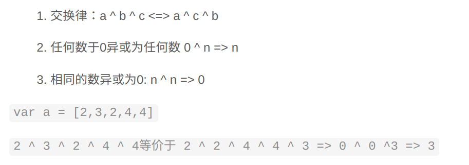
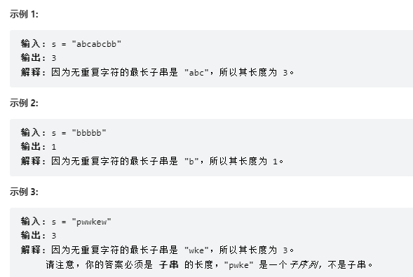
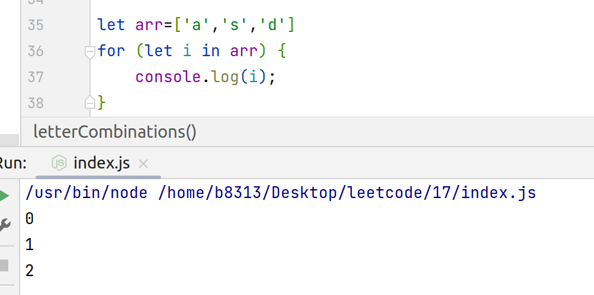
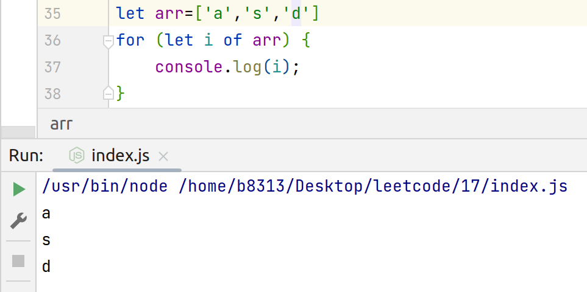
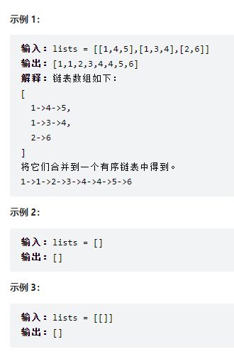

# 算法

## 算法记录

### 二叉树的层序遍历

#### 分析

参考[JavaScript——二叉树层序遍历_庸人°的博客-CSDN博客_二叉树层序遍历js](https://blog.csdn.net/wuxian_wj/article/details/121006926)

第一步判断root是否是null，如果为空我们直接返回空数组即可，如果不为空继续我们的代码运行
第二步声明了两个变量result用来承接最后的数组，并作为最后的结果返回。deep用来表示当前节点的层级，方便我们向result对应数组中添加元素。
然后就到了我们的递归方法recursion，recursion的参数是当前节点。在recursion中现实节点深度加一，我们要注意这个深度的流程是，对于二叉树的结构，向下递归一层deep加一，向上return一层deep减一。
判断result对应该层的数组元素是否存在，如果不存在直接等于[root]，如果存在则选择push方式添加当前root。
添加完当前节点就需要判断，当前节点的左节点是否存在，如果存在将当前节点的左节点作为参数递归调用当前recursion函数，如果不存在则跳过
当前节点的右节点是否存在，如果存在将当前节点的右节点作为参数递归调用当前recursion函数，如果不存在则跳过
当左节点右节点都不存在则深度减一并向上返回，或者节点的左节点右节点都已经遍历完毕也是同样深度减一并向上返回。
当全部执行完毕，返回result。

#### 代码

```javascript
  var levelOrder = function(root) {
    if (root === null)
        return []
    let result = [];
    let deep = 0;
    recursion(root);

    function recursion(root) {
        deep++;
        if (result[deep - 1])
            result[deep - 1].push(root)
        else
            result[deep - 1] = [root]
        if (root.left != null)
            recursion(root.left)
        if (root.right !== null)
            recursion(root.right)
        deep--
        return
    }
    return result;
};

```


## C++基本STL

### 参考链接

+ 参考[STL教程：C++ STL快速入门（非常详细） (biancheng.net)](http://c.biancheng.net/stl/)

+ 参考[代码随想录](https://programmercarl.com/)

+ 参考[自己的STL代码笔记](https://gitee.com/masaikk/ct)

### vector

```c++
#include <iostream>
#include <vector>
using namespace std;
 
int main()
{
   // 创建一个向量存储 int
   vector<int> vec; 
   int i;
 
   // 显示 vec 的原始大小
   cout << "vector size = " << vec.size() << endl;
 
   // 推入 5 个值到向量中
   for(i = 0; i < 5; i++){
      vec.push_back(i);
   }
 
   // 显示 vec 扩展后的大小
   cout << "extended vector size = " << vec.size() << endl;
 
   // 访问向量中的 5 个值
   for(i = 0; i < 5; i++){
      cout << "value of vec [" << i << "] = " << vec[i] << endl;
   }
 
   // 使用迭代器 iterator 访问值
   vector<int>::iterator v = vec.begin();
   while( v != vec.end()) {
      cout << "value of v = " << *v << endl;
      v++;
   }
 
   return 0;
}
```

结果

```shell
vector size = 0
extended vector size = 5
value of vec [0] = 0
value of vec [1] = 1
value of vec [2] = 2
value of vec [3] = 3
value of vec [4] = 4
value of v = 0
value of v = 1
value of v = 2
value of v = 3
value of v = 4
```

关于上面实例中所使用的各种函数，有几点要注意：

- push_back( ) 成员函数在向量的末尾插入值，如果有必要会扩展向量的大小。
- size( ) 函数显示向量的大小。
- begin( ) 函数返回一个指向向量开头的迭代器。
- end( ) 函数返回一个指向向量末尾的迭代器。

### map

```c++
#include <iostream>
#include <map>      // pair
#include <string>       // string
using namespace std;

int main() {
    //创建并初始化 map 容器
    std::map<std::string, std::string>myMap{ {"STL教程","http://c.biancheng.net/stl/"},
                                             {"C语言教程","http://c.biancheng.net/c/"},
                                             {"Java教程","http://c.biancheng.net/java/"} };
    //查找键为 "Java教程" 的键值对
    auto iter = myMap.find("Java教程");
    //从 iter 开始，遍历 map 容器
    for (; iter != myMap.end(); ++iter) {
        cout << iter->first << " " << iter->second << endl;
    }
    return 0;
}
```

输出

```shell
Java教程 http://c.biancheng.net/java/
STL教程 http://c.biancheng.net/stl/
```

### set

```c++
#include <iostream>
#include <set>
#include <string>
using namespace std;

int main()
{
    //创建空set容器
    std::set<std::string> myset;
    //空set容器不存储任何元素
    cout << "1、myset size = " << myset.size() << endl;
    //向myset容器中插入新元素
    myset.insert("http://c.biancheng.net/java/");
    myset.insert("http://c.biancheng.net/stl/");
    myset.insert("http://c.biancheng.net/python/");
    cout << "2、myset size = " << myset.size() << endl;
    //利用双向迭代器，遍历myset
    for (auto iter = myset.begin(); iter != myset.end(); ++iter) {
        cout << *iter << endl;
    }
    return 0;
}
```

输出

```shell
1、myset size = 0
2、myset size = 3
http://c.biancheng.net/java/
http://c.biancheng.net/python/
http://c.biancheng.net/stl/
```

---

## JavaScript库函数

JavaScript库函数参考[JavaScript 标准内置对象 - JavaScript | MDN (mozilla.org)](https://developer.mozilla.org/zh-CN/docs/Web/JavaScript/Reference/Global_Objects)

### Array函数

[Array - JavaScript | MDN (mozilla.org)](https://developer.mozilla.org/zh-CN/docs/Web/JavaScript/Reference/Global_Objects/Array)需要注意JavaScript中的，对于列表添加或者去除元素的四个函数，即`unshift()`,`shift()`以及`push()`,`pop()`注意这几个函数是相对应的。

#### 主要函数举例

+ `Array.prototype.includes()`

  用于判断某个元素是否存在于这个列表中，返回一个bool值。

+ `Array.prototype.findIndex()`

  返回一个符合测试函数的元素的坐标，如果没有，就返回-1。这个测试函数需要符合`function(element, index, array){ /* … */ }`形式。

+ `Array.prototype.reduce()`

  回调函数需要满足`function(previousValue, currentValue, currentIndex, array) { /* … */ }`形式

+ `Array.prototype.sort()`

  **这是一个原地函数**

  - 如果 `compareFn(a, b)` 大于 0，b 会被排列到 a 之前。
  - 如果 `compareFn(a, b)` 小于 0，那么 a 会被排列到 b 之前；
  - 如果 `compareFn(a, b)` 等于 0，a 和 b 的相对位置不变。

+ `Array.prototype.forEach()`

  用于遍历，参数为`function(element, index, array){ /* … */ }`

+ `Array.prototype.includes()`

  `includes()` 方法用来判断一个数组是否包含一个指定的值，根据情况，如果包含则返回 `true`，否则返回 `false`。它还有一个可选参数用于从这个坐标开始，`includes(searchElement, fromIndex)`中从`fromIndex` 索引处开始查找 `valueToFind`。如果为负值，则按升序从 `array.length + fromIndex` 的索引开始搜（即使从末尾开始往前跳 `fromIndex` 的绝对值个索引，然后往后搜寻）。默认为 0。

+ `Array.prototype.splice()`

  **这是一个原地函数**

  它用来删除一部分数据，然后如果第三个参数不为空，就把第三个参数之后的参数加到Array里面。并以数组形式返回被修改的内容。`splice(start, deleteCount, item1)`里面的deleteCount表示删除元素的个数。

+ `Array.prototype.slice()`

  `slice()` 方法返回一个新的数组对象，这一对象是一个由 `begin` 和 `end` 决定的原数组的**浅拷贝**（包括 `begin`，不包括`end`）。原始数组不会被改变。

+ `Array.length`

  获取数组长度。

对于`Array`类型的函数中，需要注意的是区分`splice()`和`slice()`的参数区别，splice是传入一个坐标，一个个数。slice是传入两个坐标而且不改变数组。

### Set函数

[Set - JavaScript | MDN (mozilla.org)](https://developer.mozilla.org/zh-CN/docs/Web/JavaScript/Reference/Global_Objects/Set)

#### 主要函数举例

+ `Set.prototype.add()`

  添加一个元素。

+ `Set.prototype.delete()`

  删除一个元素

+ `Set.prototype.has()`

  返回一个布尔值来指示对应的值是否存在于 Set 对象中。

+ `Set.prototype.size`

  这个属性，获取set的大小。

+ `Set.prototype.forEach()`

  用于遍历整个set，回调函数需要满足`function(value, key, set) { /* ... */ }`形式。因为 `Set` 中没有键，所以 `value` 会被共同传递给这两个参数。

---

## 力扣题实录

### [1. 两数之和 - 力扣（LeetCode）](https://leetcode.cn/problems/two-sum/)

给定一个整数数组 nums 和一个整数目标值 target，请你在该数组中找出 和为目标值 target  的那 两个 整数，并返回它们的数组下标。

你可以假设每种输入只会对应一个答案。但是，数组中同一个元素在答案里不能重复出现。

你可以按任意顺序返回答案。

示例 1：

输入：nums = [2,7,11,15], target = 9
输出：[0,1]
解释：因为 nums[0] + nums[1] == 9 ，返回 [0, 1] 。
示例 2：

输入：nums = [3,2,4], target = 6
输出：[1,2]
示例 3：

输入：nums = [3,3], target = 6
输出：[0,1]

```c++
class Solution {
public:
    vector<int> twoSum(vector<int>& nums, int target) {
        map<int,int> a;//建立hash表存放数组元素
        vector<int> b(2,-1);//存放结果
        for(int i=0;i<nums.size();i++)
            a.insert(map<int,int>::value_type(nums[i],i));
        for(int i=0;i<nums.size();i++)
        {
            if(a.count(target-nums[i])>0&&(a[target-nums[i]]!=i))
            //判断是否找到目标元素且目标元素不能是本身
            {
                b[0]=i;
                b[1]=a[target-nums[i]];
                break;
            }
        }
        return b;
    };
};
```

### [20. 有效的括号 - 力扣（LeetCode）](https://leetcode.cn/problems/valid-parentheses/)

给定一个只包括 '('，')'，'{'，'}'，'['，']' 的字符串 s ，判断字符串是否有效。

有效字符串需满足：

左括号必须用相同类型的右括号闭合。
左括号必须以正确的顺序闭合。


示例 1：

输入：s = "()"
输出：true
示例 2：

输入：s = "()[]{}"
输出：true
示例 3：

输入：s = "(]"
输出：false
示例 4：

输入：s = "([)]"
输出：false
示例 5：

输入：s = "{[]}"
输出：true


提示：

1 <= s.length <= 104
s 仅由括号 '()[]{}' 组成

```c++
const char LEFT1 = '(';
const char LEFT2 = '[';
const char LEFT3 = '{';
const char RIGHT1 = ')';
const char RIGHT2 = ']';
const char RIGHT3 = '}';

class Solution {
public:
    stack<int> punches = {};

    bool isValid(string s) {
        const int LENGTH = s.length();
        punches.push(0);
        if (LENGTH % 2 != 0) {
            return false;
        }
        for (int i = 0; i <= LENGTH; i++) {
            switch (s[i]) {
                case LEFT1: {
                    punches.push(1);
                    break;
                }
                case LEFT2: {
                    punches.push(2);
                    break;
                }
                case LEFT3: {
                    punches.push(3);
                    break;
                }
                case RIGHT1: {
                    if (punches.top() == 1) {
                        punches.pop();
                    } else {
                        return false;
                    }
                    break;
                }
                case RIGHT2: {
                    if (punches.top() == 2) {
                        punches.pop();
                    } else {
                        return false;
                    }
                    break;
                }
                case RIGHT3: {
                    if (punches.top() == 3) {
                        punches.pop();
                    } else {
                        return false;
                    }
                    break;
                }
                default: {
                    break;
                }
            }
        }
        if (punches.size() == 1) {
            return true;
        } else {
            return false;
        }
    };
};
```

### [21. 合并两个有序链表 - 力扣（LeetCode）](https://leetcode.cn/problems/merge-two-sorted-lists/)

将两个升序链表合并为一个新的 升序 链表并返回。新链表是通过拼接给定的两个链表的所有节点组成的。 

示例 1：


输入：l1 = [1,2,4], l2 = [1,3,4]
输出：[1,1,2,3,4,4]
示例 2：

输入：l1 = [], l2 = []
输出：[]
示例 3：

输入：l1 = [], l2 = [0]
输出：[0]


提示：

两个链表的节点数目范围是 [0, 50]
-100 <= Node.val <= 100
l1 和 l2 均按 非递减顺序 排列

```c++
class Solution {
public:
    ListNode *mergeTwoLists(ListNode *list1, ListNode *list2) {
        if (list1 == nullptr)
            return list2;
        if (list2 == nullptr)
            return list1;
        ListNode *myList = nullptr;
        ListNode *headIndexNode = myList;
        while (list1 != nullptr && list2 != nullptr) {
            if (list1->val < list2->val) {
                if (headIndexNode == nullptr) {
                    myList = new ListNode(list1->val);
                    headIndexNode = myList;
                } else {
                    headIndexNode->next = new ListNode(list1->val);
                    headIndexNode = headIndexNode->next;
                }
                list1 = list1->next;
            } else {
                if (headIndexNode == nullptr) {
                    myList = new ListNode(list2->val);
                    headIndexNode = myList;
                } else {
                    headIndexNode->next = new ListNode(list2->val);
                    headIndexNode = headIndexNode->next;
                }
                list2 = list2->next;
            }
        }
        if (list1 == nullptr)
            headIndexNode->next = list2;
        if (list2 == nullptr)
            headIndexNode->next = list1;
        return myList;
    }
};
```

可以考虑递归的方式

```c++
/**
 * Definition for singly-linked list.
 * struct ListNode {
 *     int val;
 *     ListNode *next;
 *     ListNode() : val(0), next(nullptr) {}
 *     ListNode(int x) : val(x), next(nullptr) {}
 *     ListNode(int x, ListNode *next) : val(x), next(next) {}
 * };
 */
class Solution {
public:
    ListNode* mergeTwoLists(ListNode* list1, ListNode* list2, int depth) {
        // If null then retuan another list
        string s(depth, ' ');
        cout << s;
        printList(list1, list2);
        cout << endl;
        if (!list1) {
            return list2;
        } else if(!list2) {
            return list1;
        } else if(list1->val < list2->val) { // Recursion Condition
            list1->next = mergeTwoLists(list1->next, list2, depth+1);
            string s(depth, ' ');
            cout << s;
            printList(list1, list2);
            cout << endl;
            return list1;
        } else {
            list2->next = mergeTwoLists(list1, list2->next, depth+1);
            string s(depth, ' ');
            cout << s;
            printList(list1, list2);
            cout << endl;
            return list2;
        }
    }
    
    void printList(ListNode* list1, ListNode* list2) {
        cout << "[";
        while (list1) {
            cout << list1->val << " ";
            list1 = list1->next;
        }
        cout << "] [";
        while (list2) {
            cout << list2->val << " ";
            list2 = list2->next;
        }
        cout << "]";
    }
};

```

### [53. 最大子数组和 - 力扣（LeetCode）](https://leetcode.cn/problems/maximum-subarray/)

给你一个整数数组 nums ，请你找出一个具有最大和的连续子数组（子数组最少包含一个元素），返回其最大和。

子数组 是数组中的一个连续部分。

示例 1：

输入：nums = [-2,1,-3,4,-1,2,1,-5,4]
输出：6
解释：连续子数组 [4,-1,2,1] 的和最大，为 6 。
示例 2：

输入：nums = [1]
输出：1
示例 3：

输入：nums = [5,4,-1,7,8]
输出：23


提示：

1 <= nums.length <= 105
-104 <= nums[i] <= 104


进阶：如果你已经实现复杂度为 O(n) 的解法，尝试使用更为精妙的 分治法 求解。

```c++
class Solution {
public:
    int maxSubArray(vector<int>& nums) {
        int pre = 0, maxAns = nums[0];
        for (const auto &x: nums) {
            pre = max(pre + x, x);
            maxAns = max(maxAns, pre);
        }
        return maxAns;
    }
};
```

### [70. 爬楼梯 - 力扣（LeetCode） (leetcode-cn.com)](https://leetcode-cn.com/problems/climbing-stairs/)

假设你正在爬楼梯。需要 n 阶你才能到达楼顶。

每次你可以爬 1 或 2 个台阶。你有多少种不同的方法可以爬到楼顶呢？

示例 1：

输入：n = 2
输出：2
解释：有两种方法可以爬到楼顶。
1. 1 阶 + 1 阶
2. 2 阶
示例 2：

输入：n = 3
输出：3
解释：有三种方法可以爬到楼顶。
1. 1 阶 + 1 阶 + 1 阶
2. 1 阶 + 2 阶
3. 2 阶 + 1 阶


提示：

1 <= n <= 45

```c++
class Solution {
public:
    int climbStairs(int n) {
        vector<int>stepArray={};
        stepArray.push_back(1);
        stepArray.push_back(1);
        int i=2;
        while(i<=n){
            stepArray.push_back(stepArray[i-2]+stepArray[i-1]);
            i++;
        }
        return stepArray[n];
    }
};
```

**注意递归法不能用，会超时。**

### [94. 二叉树的中序遍历 - 力扣（LeetCode） (leetcode-cn.com)](https://leetcode-cn.com/problems/binary-tree-inorder-traversal/)

给定一个二叉树的根节点 `root` ，返回它的 **中序** 遍历。

 这里给出一个非递归形式的遍历方法，注意条件判断语句。

```c++
class Solution {
public:
    vector<int> inorderTraversal(TreeNode* root) {
        vector<int> res;
        stack<TreeNode*> stk;
        while (root != nullptr || !stk.empty()) {
            while (root != nullptr) {
                stk.push(root);
                root = root->left;
            }
            root = stk.top();
            stk.pop();
            res.push_back(root->val);
            root = root->right;
        }
        return res;
    }
};
```

### [136. 只出现一次的数字 - 力扣（LeetCode）](https://leetcode.cn/problems/single-number/)

一开始我还在想对于这个题目中使用每个元素进行遍历，得到那个与众不同的数字，但是这样的时间复杂度是O(n*n)。

然后我又想到了对于一个数列来说，应该是先排序之后，看看有没有元素与前后的元素都不相同，这样的时间复杂度是O(nlogn)。

最后，发现了异或的操作，可以达到O(n)的时间复杂度。



所以对于这个题目来说直接遍历整个数列对于每个元素都求一下异或就可以了。这里可以借助JavaScript的reduce运算符。

```javascript
/**
 * @param {number[]} nums
 * @return {number}
 */
var singleNumber = function(nums) {
    return nums.reduce((a,b)=>{
        return a^b
    })
};
```

### [3. 无重复字符的最长子串 - 力扣（LeetCode）](https://leetcode.cn/problems/longest-substring-without-repeating-characters/) 

给定一个字符串 `s` ，请你找出其中不含有重复字符的 **最长子串** 的长度。



这是一个滑动窗口的问题，这里需要使用set来建立一个lookup表，但是一开始我做不出。在题解中，用到了`while (lookUp.has(s[i]))`感觉很不错，如果有新的元素，就一直从left处开始删除元素。代码如下

```javascript
/**
 * @param {string} s
 * @return {number}
 */
var lengthOfLongestSubstring = function (s) {
    let maxLength = 0;
    let currentLength = 0;
    let left = 0;

    let lookUp = new Set();
    let nums = s.length;
    if (nums === 0) {
        return 0;
    }
    for (let i = 0; i < nums; i++) {
        while (lookUp.has(s[i])) {
            lookUp.delete(s[left]);
            left += 1;
            currentLength -= 1;
        }
        lookUp.add(s[i]);
        currentLength += 1;
        if (maxLength < currentLength) {
            maxLength = currentLength;
        }

    }
    return maxLength;
};

```

### [5. 最长回文子串 - 力扣（LeetCode）](https://leetcode.cn/problems/longest-palindromic-substring/)

寻找最短的子回文序列并且返回这个序列

题目给出了两个题解，其中之一是使用了动态规划的方法，对于搜索的dp数组来说，分别用i和j来表示搜索的左边和右边，分以下几种条件进行讨论：

1. 如果i比j大，直接false
2. i==j，是true
3. i+1=j，就需要判断这两个元素是否相等，返回s[i]==s[j]
4. 判断s[i+1]到s[j-1]是否为回文序列，再判断收尾两个元素是否相等。

我自己的做法差点超时，而且其实没有用到dp而是用到的递归，在这里记录一下：

```javascript
/**
 * @param {string} s
 * @return {string}
 */
var longestPalindrome = function (s) {
    const TOTAL_LENGTH = s.length;
    // let lookUp = [];
    let left = 0;
    let right = 0;
    let maxLength = 0
    // for (let i = 0; i < TOTAL_LENGTH; i++) {
    //     lookUp.push([]);
    // }
    for (let i = 0; i < TOTAL_LENGTH; i++) {
        for (let j = 0; j < TOTAL_LENGTH; j++) {
            // lookUp[i][j] = calculateIfPalindrome(s, i, j)
            if (calculateIfPalindrome(s, i, j) && j - i > maxLength) {
                maxLength = j - i;
                left = i;
                right = j;
            }
        }
    }
    return s.slice(left, right + 1);
};

/**
 *
 * @param {string} s
 * @param {number} i
 * @param {number} j
 * @return {boolean}
 */
var calculateIfPalindrome = function (s, i, j) {
    if (i > j) {
        return false
    }
    if (i === j) {
        return true;
    } else if (i + 1 === j) {
        return s[i] === s[j]
    } else {
        return s[i] === s[j] && calculateIfPalindrome(s, i + 1, j - 1);
    }
}

```

使用动态规划的时候需要注意的点：

+ 实际上，一个字符串至少有一个长度为1的子串符合条件，所以maxlength可以从1开始。

+ 如果s的长度小于2,可以直接返回

+ 最后需要判断以下代码，不然会导致过多的undefine。

  ```javascript
  if (right - left < 3) {
                      lookUp[left][right] = true;
                  } else {
                      lookUp[left][right] = lookUp[left + 1][right - 1]
                  }
  ```

最终的代码如下所示

```javascript
/**
 * @param {string} s
 * @return {string}
 */
var longestPalindrome = function (s) {
    const TOTAL_LENGTH = s.length;
    let lookUp = [];
    let returnLeft = 0;
    let maxLength = 1
    if (TOTAL_LENGTH <= 1) {
        return s;
    }
    for (let i = 0; i < TOTAL_LENGTH; i++) {
        lookUp.push([]);
    }
    for (let i = 0; i < TOTAL_LENGTH; i++) {
        lookUp[i][i] = true;
    }

    for (let L = 2; L < TOTAL_LENGTH + 1; L++) {
        for (let left = 0; left < TOTAL_LENGTH; left++) {
            let right = left + L - 1;
            if (right >= TOTAL_LENGTH) {
                break;
            }
            if (s[left] !== s[right]) {
                lookUp[left][right] = false;
            } else {
                if (right - left < 3) {
                    lookUp[left][right] = true;
                } else {
                    lookUp[left][right] = lookUp[left + 1][right - 1]
                }
            }
            if (lookUp[left][right] && L > maxLength) {
                returnLeft = left;
                maxLength = L;
            }
        }

    }
    return s.slice(returnLeft, returnLeft + maxLength)
};
```

### [11. 盛最多水的容器 - 力扣（LeetCode）](https://leetcode.cn/problems/container-with-most-water/)

这道题用两个for固然可以做出来，但是可以采取双指针法。从头和尾部进行遍历，对于两个指针，先算出他们之间的容量，再将更小的数据向中间移动，直到两个指针重合，最后比较得出最大的数据作为输出。

```javascript
/**
 * @param {number[]} height
 * @return {number}
 */
var maxArea = function (height) {
    let left = 0;
    let right = height.length - 1;
    let allWeight = []
    while (left + 1 <= right) {
        if (height[left] < height[right]) {
            allWeight.push(height[left] * (right - left));
            left++;
        } else {
            allWeight.push(height[right] * (right - left));
            right--;
        }
    }
    allWeight.sort((a, b) => {
        return a - b
    })
    return allWeight[allWeight.length - 1]
};
```

这里需要注意的就是，数组的sort函数，即便是数字作为元素，都是返回字典序。如果需要返回大小序，应该按上图类似写法进行。

然后我发现根本不需要把全部数据存起来再比较，只需要比较最大的就可以了。

```javascript
/**
 * @param {number[]} height
 * @return {number}
 */
var maxArea = function (height) {
    let left = 0;
    let right = height.length - 1;
    let maxWeight = 0
    while (left + 1 <= right) {
        let nowWeight = Math.min(height[left], height[right]) * (right - left);
        if (maxWeight < nowWeight) {
            maxWeight = nowWeight
        }
        if (height[left] < height[right]) {
            left++;
        } else {
            right--;
        }
    }
    return maxWeight;
};
```

### [15. 三数之和 - 力扣（LeetCode）](https://leetcode.cn/problems/3sum/)

花了很多时间讨论边界情况，需要注意的点：

1. 因为这个是返回一个二维数组，所以需要判断数据里面的数据元素是否是相等的，但是用set是不行的，需要自己写一个比较：

   ```javascript
                   let addFlag = true;
                   triples.forEach((value) => {
                       addFlag = addFlag && !isEqual(value, aTri)
                   })
                   if (addFlag) {
                       triples.push(aTri);
                   }
   ```

2. 应该选定一个小于0的位置作为index1，并且注意多个0的情况

我的解答如下：

```javascript
/**
 * @param {number[]} nums
 * @return {object[]}
 */
var threeSum = function (nums) {
    nums.sort((a, b) => {
        return a - b;
    })
    let maxLength = nums.length;
    let noZeroNumber = 0;
    let triples = [];
    nums.forEach((value, index) => {
        if (value < 0) {
            noZeroNumber = index;
        }
    })

    for (let index1 = 0; index1 <= noZeroNumber + 1; index1++) {
        let index2 = index1 + 1;
        let index3 = maxLength - 1;
        while (index2 < index3) {
            let sumOf3 = nums[index1] + nums[index2] + nums[index3];
            if (sumOf3 === 0) {
                let aTri = [];
                // console.log(`add ${index1} ${index2} ${index3}`);
                aTri.push(nums[index1], nums[index2], nums[index3]);
                let addFlag = true;
                triples.forEach((value) => {
                    addFlag = addFlag && !isEqual(value, aTri)
                })
                if (addFlag) {
                    triples.push(aTri);
                }
                index2++;
            } else {
                if (sumOf3 > 0) {
                    index3--;
                } else {
                    index2++;
                }
            }
        }
    }
    return triples
};

/**
 *
 * @param {number[]} a
 * @param {number[]} b
 * @returns {boolean}
 */
function isEqual(a, b) {
    return a[0] === b[0] && a[1] === b[1] && a[2] === b[2]
}

let target =
    [-4, -2, 1, -5, -4, -4, 4, -2, 0, 4, 0, -2, 3, 1, -5, 0]

console.log(threeSum(target));

```

### [1790. 仅执行一次字符串交换能否使两个字符串相等 - 力扣（LeetCode）](https://leetcode.cn/problems/check-if-one-string-swap-can-make-strings-equal/)

我的做法是先字典序排序，先看看里面的元素是否相同，若是不同，就直接返回false。

如果相同，就从首尾开始，找一下哪里两个元素不同，再交换回去，最后比较两个数组。代码如下所示：

```javascript
/**
 * @param {string} s1
 * @param {string} s2
 * @return {boolean}
 */
var areAlmostEqual = function (s1, s2) {
    let maxLength = s1.length;
    let sortedS1 = Array.from(s1);
    sortedS1.sort();
    let sortedS2 = Array.from(s2);
    sortedS2.sort();
    for (let i = 0; i < maxLength; i++) {
        if (sortedS1[i] !== sortedS2[i]) {
            return false;
        }
    }
    s1 = s1.split('')
    s2 = s2.split('')
    let left1 = 0;
    let left2 = 0;
    let right1 = maxLength - 1;
    let right2 = maxLength - 1;

    while (s1[left1] === s2[left2] && left1 < right1) {
        left1++;
        left2++;
    }
    while (s1[right1] === s2[right2] && left1 < right1) {
        right1--;
        right2--;
    }
    let temp = s1[left1];
    s1[left1] = s1[right1];
    s1[right1] = temp;
    for (let i = 0; i < maxLength; i++) {
        if (s1[i] !== s2[i]) {
            return false;
        }
    }
    return true;

};

let src1 = 'abcd'
let src2 = 'dcba'
console.log(areAlmostEqual(src1, src2));

```

但是耗时太多。

官方的题解是不需要排序的：

```javascript
var areAlmostEqual = function(s1, s2) {
    const n = s1.length;
    const diff = [];
    for (let i = 0; i < n; ++i) {
        if (s1[i] !== s2[i]) {
            if (diff.length >= 2) {
                return false;
            }
            diff.push(i);
        }
    }
    if (diff.length === 0) {
        return true;
    }
    if (diff.length !== 2) {
        return false;
    }
    return s1[diff[0]] === s2[diff[1]] && s1[diff[1]] === s2[diff[0]];
};

```

### [17. 电话号码的字母组合 - 力扣（LeetCode）](https://leetcode.cn/problems/letter-combinations-of-a-phone-number/)

循环多次，不过就是要注意对于数组的forin与forof的区别。它们在遍历列表的时候，forin是只会遍历下标的。





```javascript
/**
 * @param {string} digits
 * @return {string[]}
 */
var letterCombinations = function (digits) {
    if (digits === '') return []
    let map = {
        '2': ['a', 'b', 'c'],
        '3': ['d', 'e', 'f'],
        '4': ['g', 'h', 'i'],
        '5': ['j', 'k', 'l'],
        '6': ['m', 'n', 'o'],
        '7': ['p', 'q', 'r', 's'],
        '8': ['t', 'u', 'v'],
        '9': ['w', 'x', 'y', 'z']
    };
    let totalDig = digits.split('');
    let result = [];
    for (let i of totalDig) {
        if (result.length === 0) {
            result = map[i]
        } else {
            let nowResult = []
            for (const iKey of result) {
                for (const iKeyKey of map[i]) {
                    nowResult.push(iKey + iKeyKey)
                }
            }
            result = nowResult
        }
    }
    return result
};
```

### [19. 删除链表的倒数第 N 个结点 - 力扣（LeetCode）](https://leetcode.cn/problems/remove-nth-node-from-end-of-list/)

就是先遍历一下看看这个链表有多少个节点，然后再分别讨论删除头，尾和中间的情况。系统题解中还包含了一个双指针的解法，用两个指针之间的间隔为n。

```javascript
//Definition for singly-linked list.
function ListNode(val, next) {
    this.val = (val === undefined ? 0 : val)
    this.next = (next === undefined ? null : next)
}

/**
 * @param {ListNode} head
 * @param {number} n
 * @return {ListNode}
 */
var removeNthFromEnd = function (head, n) {
    let totalNum = 0;
    let firstCurrent = head;
    while (firstCurrent !== null) {
        firstCurrent = firstCurrent.next;
        totalNum++;
    }
    let current = head;
    if (n === totalNum) {
        return current.next;
    } else {
        let currentNum = 1;
        while (currentNum < totalNum - n) {
            current = current.next;
            currentNum++;
        }
        if (n === 1) {
            current.next = null;
        } else {
            current.next = current.next.next;
        }
        return head;
    }
};
```

### [23. 合并K个升序链表 - 力扣（LeetCode）](https://leetcode.cn/problems/merge-k-sorted-lists/)



总的来说，题意就是合并多个有序的链表。

可以先思考一下如何合并两个有序链表：

首先分别讨论a，b是否为空。再依次移动current指针，直到其中一个链表为空，最后加上另外一个链表剩下的值。

```javascript
/**
 *
 * @param {ListNode} a
 * @param {ListNode} b
 * @return {ListNode}
 */
var merge2Lists = function (a, b) {
    if (a == null) {
        return b;
    }
    if (b == null) {
        return a;
    }
    let head = new ListNode();
    let current = head;
    while (a != null && b != null) {
        if (a.val > b.val) {
            current.next = b;
            current = current.next;
            b = b.next;
        } else {
            current.next = a;
            current = current.next;
            a = a.next;
        }
    }
    if (a == null) {
        current.next = b;
    } else {
        current.next = a;
    }
    return head.next;
}
```

对于合并n个链表，有如下思考：

1. 可以维护一个当前的结果链表resList，然后遍历链表数列中的全部链表，使用合并两个链表的方法，合并当前链表和resList，最终得到结果。
2. 使用分治法，维护一个函数`merge()`，它的签名为`var merge = (lists, l, r)`即返回链表数列lists的第l个到第r个链表merge之后的结果，所以整道题可以化为`merge(lists, 0, lists.length - 1);`。同时讨论边界情况，如果r==l，就直接返回本身这个链表。否则就取中间值mid，使用左右两边调用merge函数得到两个链表，再使用上面的合并两个链表的函数合并这两个链表。值得注意的是，在JavaScript中，取mid可以使用`let mid = (l + r) >> 1;`。参考代码如下

```javascript
/**
 * Definition for singly-linked list.*/
function ListNode(val, next) {
    this.val = (val === undefined ? 0 : val)
    this.next = (next === undefined ? null : next)
}

/**
 * @param {ListNode[]} lists
 * @return {ListNode}
 */
var mergeKLists = function (lists) {
    return merge(lists, 0, lists.length - 1);
};

/**
 *
 * @param {ListNode} a
 * @param {ListNode} b
 * @return {ListNode}
 */
var merge2Lists = function (a, b) {
    if (a == null) {
        return b;
    }
    if (b == null) {
        return a;
    }
    let head = new ListNode();
    let current = head;
    while (a != null && b != null) {
        if (a.val > b.val) {
            current.next = b;
            current = current.next;
            b = b.next;
        } else {
            current.next = a;
            current = current.next;
            a = a.next;
        }
    }
    if (a == null) {
        current.next = b;
    } else {
        current.next = a;
    }
    return head.next;
}

/**
 *
 * @param {ListNode[]} lists
 * @param {number} l
 * @param {number} r
 * @return {ListNode}
 */
var merge = (lists, l, r) => {
    if (l === r) {
        return lists[l];
    } else if (l > r) {
        return null;
    } else {
        let mid = (l + r) >> 1;
        return merge2Lists(merge(lists, l, mid), merge(lists, mid + 1, r));
    }
}
```

### [31. 下一个排列 - 力扣（LeetCode）](https://leetcode.cn/problems/next-permutation/)

对于这个题目来说，题解为拿出两个指针，左边的指针指向最小的逆序的数，右边是降序的，然后从这个列表的右边开始搜索，找到最小的数字（刚好大于左指针的数字），它需要被交换，再交换这两个数字。这样也可以保证左指针右边的都是完全降序的。然后为了保证交换后的列表是最小的，需要将这个列表左指针右边的数据倒排成升序的，因为升序是最小的。如果找不到左指针，那么这个列表本身全部都是降序排列的，已经是最大的，就可以直接倒排。

```javascript
/**
 * @param {number[]} nums
 * @return {void} Do not return anything, modify nums in-place instead.
 */
var nextPermutation = function(nums) {
    if (nums.length <= 1) {
        return;
    }
    let leftHand
    for (let i = nums.length - 2; i >= 0; i--) {
        if (nums[i] < nums[i + 1]) {
            leftHand = i;
            break;
        }
    }
    for (let i = nums.length - 1; i > leftHand; i--) {
        if (nums[i] > nums[leftHand]) {
            [nums[i], nums[leftHand]] = [nums[leftHand], nums[i]]
            let chopped = nums.splice(leftHand + 1)
            chopped.reverse();
            nums.push(...chopped);
            return;
        }
    }
    nums.reverse();
};

```

### [33. 搜索旋转排序数组 - 力扣（LeetCode）](https://leetcode.cn/problems/search-in-rotated-sorted-array/)

我的想法是先算出这个旋转的坐标，再构造一个有序的列表，最后再使用`indexOf()`方法，但是这样的事件复杂度是log(N)，超时了。

```javascript
/**
 * @param {number[]} nums
 * @param {number} target
 * @return {number}
 */
var search = function (nums, target) {
    let revIndex = 0;
    for (; revIndex < nums.length - 1; revIndex++) {
        if (nums[revIndex] < nums[revIndex = 1]) {
            break
        }
    }
    revIndex++;
    let max_length = nums.length;
    for (let i = 0; i <= revIndex; i++) {
        nums.push(nums[i]);
    }
    let newArr = nums.slice(revIndex + 1,);
    let index = newArr.indexOf(target);
    if (index === -1) {
        return -1
    } else {
        return (index + revIndex + 1) % max_length;
    }
};
```

参考的正确解答

```javascript
/**
 * @param {number[]} nums
 * @param {number} target
 * @return {number}
 */
var search = function (nums, target) {
    let lower = 0;
    let higher = nums.length - 1;
    while (lower <= higher) {
        let mid = lower + Math.floor((higher - lower) / 2);
        if (nums[mid] === target) {
            return mid;
        }
        // 先根据 nums[0] 与 target 的关系判断目标值是在左半段还是右半段
        if (target >= nums[0]) {
            // 目标值在左半段时，若 mid 在右半段，则将 mid 索引的值改成 inf
            if (nums[mid] < nums[0]) {
                nums[mid] = Infinity;
            }
        } else {
            // 目标值在右半段时，若 mid 在左半段，则将 mid 索引的值改成 -inf
            if (nums[mid] >= nums[0]) {
                nums[mid] = -Infinity;
            }
        }

        if (nums[mid] < target) {
            lower = mid + 1;
        } else {
            higher = mid - 1;
        }
    }
    return -1;

};


let arr = [5, 6, 7, 1, 2, 3]
console.log(search(arr, 7));
```

### [35. 搜索插入位置 - 力扣（LeetCode）](https://leetcode.cn/problems/search-insert-position/)

对于这个题目直接二分查找，并且需要注意的是停止的条件以及如果没有找到确切值，需要判断。

```javascript
/**
 * @param {number[]} nums
 * @param {number} target
 * @return {number}
 */
var searchInsert = function (nums, target) {
  let left = 0;
  let right = nums.length;
  let mid = left;
  while (left < right - 1) {
    mid = left + Math.floor((right - left) / 2);
    if (nums[mid] === target) {
      return mid;
    } else {
      if (nums[mid] > target) {
        right = mid;
      } else {
        left = mid;
      }
    }
  }
  return nums[left] >= target ? left : left + 1;
};
```

### [36. 有效的数独 - 力扣（LeetCode）](https://leetcode.cn/problems/valid-sudoku/)

对于找个题目，就新建行，列，九宫格的矩阵表示是否重复。并且由于数独的大小是确定的，所以时间复杂度和空间复杂度都是O(1)。

```javascript
/**
 * @param {character[][]} board
 * @return {boolean}
 */
var isValidSudoku = function(board) {
    const rows = new Array(9).fill(0).map(() => new Array(9).fill(0));
    const columns = new Array(9).fill(0).map(() => new Array(9).fill(0));
    const subboxes = new Array(3).fill(0).map(() => new Array(3).fill(0).map(() => new Array(9).fill(0)));
    for (let i = 0; i < 9; i++) {
        for (let j = 0; j < 9; j++) {
            const c = board[i][j];
            if (c !== '.') {
                const index = c.charCodeAt() - '0'.charCodeAt() - 1;
                rows[i][index]++;
                columns[j][index]++;
                subboxes[Math.floor(i / 3)][Math.floor(j / 3)][index]++;
                if (rows[i][index] > 1 || columns[j][index] > 1 || subboxes[Math.floor(i / 3)][Math.floor(j / 3)][index] > 1) {
                    return false;
                }
            }
        }
    }
    return true;
};

```

### [42. 接雨水 - 力扣（LeetCode）](https://leetcode.cn/problems/trapping-rain-water/)

对于这道题来说，最简的方法就是遍历每一列，看着这一列是否能够接水，接水的条件是分别向左边和右边遍历，得到最高列，这两个最高列中的较低的那个减去这列的高度，就是这列可以接水的大小了。最后将每一列都统计起来。

```javascript
/**
 * @param {number[]} height
 * @return {number}
 */
var trap = function (height) {
  let max_left = 0;
  for (max_left = 0; max_left < height.length; max_left++) {
    if (height[max_left] > 0) break;
  }
  let max_right = 0;
  for (max_right = height.length - 1; max_right > 0; max_right--) {
    if (height[max_right] > 0) break;
  }
  let total = 0;
  if (max_left >= max_right - 1) {
    return total;
  } else {
    for (let i = max_left + 1; i < max_right; i++) {
      let this_max_left_height = 0;
      //找出左边最高
      for (let j = i - 1; j >= max_left; j--) {
        if (height[j] > this_max_left_height) {
          this_max_left_height = height[j];
        }
      }
      let this_max_right_height = 0;
      //找出右边最高
      for (let j = i + 1; j <= max_right; j++) {
        if (height[j] > this_max_right_height) {
          this_max_right_height = height[j];
        }
      }
      //找出两端较小的
      let min_height = Math.min(this_max_left_height, this_max_right_height);
      //只有较小的一段大于当前列的高度才会有水，其他情况不会有水
      if (min_height > height[i]) {
        total = total + (min_height - height[i]);
      }
    }
    return total;
  }
};
```

很显然，上述做法在遍历每一列的时候都需要向左和向右遍历两次，很费时间。可以使用两个数组来分别表示第i个列的左右最高的墙。max_left_height [i] = Max(max_left_height [i-1],height[i-1])。它前边的墙的左边的最高高度和它前边的墙的高度选一个较大的，就是当前列左边最高的墙了。

```java
public int trap(int[] height) {
    int sum = 0;
    int[] max_left = new int[height.length];
    int[] max_right = new int[height.length];
    
    for (int i = 1; i < height.length - 1; i++) {
        max_left[i] = Math.max(max_left[i - 1], height[i - 1]);
    }
    for (int i = height.length - 2; i >= 0; i--) {
        max_right[i] = Math.max(max_right[i + 1], height[i + 1]);
    }
    for (int i = 1; i < height.length - 1; i++) {
        int min = Math.min(max_left[i], max_right[i]);
        if (min > height[i]) {
            sum = sum + (min - height[i]);
        }
    }
    return sum;
}

```

### [55. 跳跃游戏 - 力扣（LeetCode）](https://leetcode.cn/problems/jump-game/)

对于这道题来说，我的做法是生成一个dp数组，dp数组出来第一个之外全部为false（即一开始达不到），遍历nums数组，再根据遍历的结果按照上面的步长范围内给dp数组附上true。但是，这样消耗有点大。

```javascript
/**
 * @param {number[]} nums
 * @return {boolean}
 */
var canJump = function (nums) {
  const max_length = nums.length;
  let dp = new Array(max_length).fill(false);
  dp[0] = true;
  for (let i = 0; i < max_length; i++) {
    if (dp[i]) {
      for (let step = 1; step <= nums[i]; step++) {
        dp[i + step] = true;
      }
    }
  }
  return dp[max_length - 1];
};
```

删除dp列表，实际上，对于一个位置来说，可以到这个位置表示左边的全部位置都可以达到。使用变量k表示能够达到的最大位置。

```javascript
/**
 * @param {number[]} nums
 * @return {boolean}
 */
var canJump = function (nums) {
  let k = 0;
  for (let i = 0; i < nums.length; i++) {
    if (i > k) return false;
    k = Math.max(k, i + nums[i]);
  }
  return true;
};
```

### [198. 打家劫舍 - 力扣（LeetCode）](https://leetcode.cn/problems/house-robber/)

很像之前做过的一道题目，我在这里的做法就是新建一个dp数组表示打劫到第i家的最大收益是多少。然后讨论一下边缘状态长度等于1，2，3。最后遍历每一个点，得到完整的dp数组，最后输出dp数组的最后一项。

```javascript
/**
 * @param {number[]} nums
 * @return {number}
 */
var rob = function (nums) {
  const maxLength = nums.length;
  let dp = new Array(maxLength).fill(0);
  if (maxLength === 1) {
    return nums[0];
  } else if (maxLength === 2) {
    return Math.max(nums[0], nums[1]);
  } else if (maxLength === 3) {
    return Math.max(nums[0] + nums[2], nums[1]);
  } else {
    dp[0] = nums[0];
    dp[1] = Math.max(dp[0], nums[1]);
    dp[2] = Math.max(nums[1], nums[0] + nums[2]);
    for (let i = 3; i < maxLength; i++) {
      dp[i] = Math.max(nums[i] + dp[i - 2], dp[i - 1], nums[i] + dp[i - 3]);
    }
    return dp[maxLength - 1];
  }
};
```

并且，只讨论边缘情况长度等于1，2也是可以的。

```javascript
/**
 * @param {number[]} nums
 * @return {number}
 */
var rob = function (nums) {
  const maxLength = nums.length;
  let dp = new Array(maxLength).fill(0);
  if (maxLength === 1) {
    return nums[0];
  } else if (maxLength === 2) {
    return Math.max(nums[0], nums[1]);
  } else {
    dp[0] = nums[0];
    dp[1] = Math.max(dp[0], nums[1]);
    for (let i = 2; i < maxLength; i++) {
      dp[i] = Math.max(nums[i] + dp[i - 2], dp[i - 1]);
    }
    return dp[maxLength - 1];
  }
};
```

### [121. 买卖股票的最佳时机 - 力扣（LeetCode）](https://leetcode.cn/problems/best-time-to-buy-and-sell-stock/)

动态规划 前i天的最大收益 = max{前i-1天的最大收益，第i天的价格-前i-1天中的最小价格}。构建一个dp数组表示到了第i天的最大收益。

```javascript
/**
 * @param {number[]} prices
 * @return {number}
 */
var maxProfit = function (prices) {
  const maxLength = prices.length;
  if (maxLength <= 1) {
    return 0;
  }
  const dp = new Array(maxLength).fill(0);
  let min = prices[0];
  for (let i = 1; i < maxLength; i++) {
    dp[i] = Math.max(dp[i - 1], prices[i] - min);
    min = Math.min(min, prices[i]);
  }
  return dp[maxLength - 1];
};
```

这里的dp数组实际上可以化简成一个数。

```javascript
/**
 * @param {number[]} prices
 * @return {number}
 */
var maxProfit = function (prices) {
  const maxLength = prices.length;
  if (maxLength <= 1) {
    return 0;
  }
  let dp = 0
  let min = prices[0];
  for (let i = 1; i < maxLength; i++) {
    dp = Math.max(dp, prices[i] - min);
    min = Math.min(min, prices[i]);
  }
  return dp;
};
```

### [739. 每日温度 - 力扣（LeetCode）](https://leetcode.cn/problems/daily-temperatures/)

对于这道题来说，直接从第一天开始遍历，再遍历之后的每一天，可以做出来，但是这里的时间复杂度有$n(O^{2})$

对此，可以从后往前遍历。首先最后一天一定是0，然后遍历到i天，需要判断如果i+1天更大，那么result[i]=1；否则，就需要考虑result[i+1]是否为空，依次找到比第i天大的单位即可。

```javascript
/**
 * @param {number[]} temperatures
 * @return {number[]}
 */
var dailyTemperatures = function (temperatures) {
  const maxLength = temperatures.length;
  if (maxLength <= 1) {
    return maxLength === 1 ? [0] : [];
  }
  let results = new Array(maxLength).fill(0);
  for (let i = maxLength - 2; i >= 0; i--) {
    if (temperatures[i + 1] > temperatures[i]) {
      results[i] = 1;
    } else {
      let tempHighTemperatureIndex = i + 1;
      while (results[tempHighTemperatureIndex] !== 0) {
        if (temperatures[tempHighTemperatureIndex] > temperatures[i]) {
          results[i] = tempHighTemperatureIndex - i;
          tempHighTemperatureIndex = i + 1;
          break;
        } else {
          tempHighTemperatureIndex =
            tempHighTemperatureIndex + results[tempHighTemperatureIndex];
        }
      }
      if (temperatures[tempHighTemperatureIndex] > temperatures[i]) {
        results[i] = tempHighTemperatureIndex - i;
      }
    }
  }
  return results;
};
```

