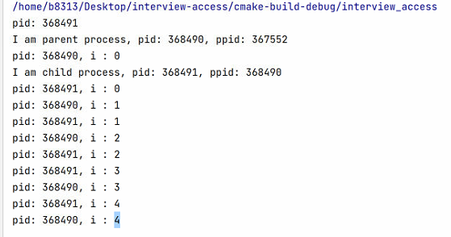
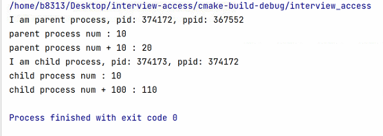
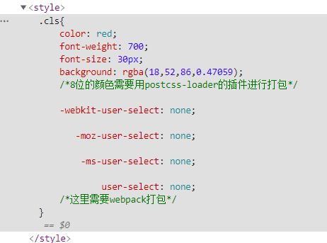
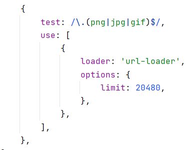
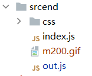
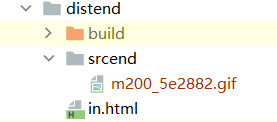
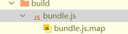
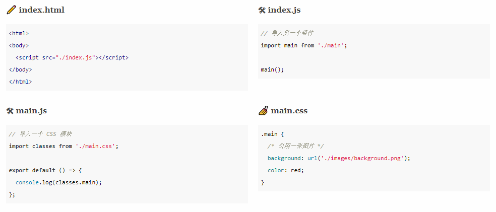

# 杂项知识

## 乱七八糟的杂项知识

### pytorch的unsqueeze和squeeze方法

pytorch的unsqueeze和squeeze方法，分别对张量进行升维和降维，链接如：

https://zhuanlan.zhihu.com/p/86763381

```python
import torch

x = torch.Tensor([1, 2, 3, 4])  # torch.Tensor是默认的tensor类型（torch.FlaotTensor）的简称。

print('-' * 50)
print(x)  # tensor([1., 2., 3., 4.])
print(x.size())  # torch.Size([4])
print(x.dim())  # 1
print(x.numpy())  # [1. 2. 3. 4.]

print('-' * 50)
print(torch.unsqueeze(x, 0))  # tensor([[1., 2., 3., 4.]])
print(torch.unsqueeze(x, 0).size())  # torch.Size([1, 4])
print(torch.unsqueeze(x, 0).dim())  # 2
print(torch.unsqueeze(x, 0).numpy())  # [[1. 2. 3. 4.]]

print('-' * 50)
print(torch.unsqueeze(x, 1))
# tensor([[1.],
#         [2.],
#         [3.],
#         [4.]])
print(torch.unsqueeze(x, 1).size())  # torch.Size([4, 1])
print(torch.unsqueeze(x, 1).dim())  # 2

print('-' * 50)
print(torch.unsqueeze(x, -1))
# tensor([[1.],
#         [2.],
#         [3.],
#         [4.]])
print(torch.unsqueeze(x, -1).size())  # torch.Size([4, 1])
print(torch.unsqueeze(x, -1).dim())  # 2

print('-' * 50)
print(torch.unsqueeze(x, -2))  # tensor([[1., 2., 3., 4.]])
print(torch.unsqueeze(x, -2).size())  # torch.Size([1, 4])
print(torch.unsqueeze(x, -2).dim())  # 2
```

以及对于某一个维度上的压缩操作，使用squeeze()方法

```python
print("*" * 50)

m = torch.zeros(2, 1, 2, 1, 2)
print(m.size())  # torch.Size([2, 1, 2, 1, 2])

n = torch.squeeze(m)
print(n.size())  # torch.Size([2, 2, 2])

n = torch.squeeze(m, 0)  # 当给定dim时，那么挤压操作只在给定维度上
print(n.size())  # torch.Size([2, 1, 2, 1, 2])

n = torch.squeeze(m, 1)
print(n.size())  # torch.Size([2, 2, 1, 2])

n = torch.squeeze(m, 2)
print(n.size())  # torch.Size([2, 1, 2, 1, 2])

n = torch.squeeze(m, 3)
print(n.size())  # torch.Size([2, 1, 2, 2])

print("@" * 50)
p = torch.zeros(2, 1, 1)
print(p)
# tensor([[[0.]],
#         [[0.]]])
print(p.numpy())
# [[[0.]]
#  [[0.]]]

print(p.size())
# torch.Size([2, 1, 1])

q = torch.squeeze(p)
print(q)
# tensor([0., 0.])

print(q.numpy())
# [0. 0.]

print(q.size())
# torch.Size([2])


print(torch.zeros(3, 2).numpy())
# [[0. 0.]
#  [0. 0.]
#  [0. 0.]]
```

---

### C++的进程fork问题

文档代码位于https://juejin.cn/post/6912612368996368392

代码位于根目录下的code/cpp/other中，注意cmakelists文件

**感觉cmake的知识与写法之后都应该找找机会去补补。**



对于fork函数来说，对于父进程和子进程都分别有一次返回。

使用的代码如下所示：

```c++
#include <unistd.h>
#include <stdio.h>


int main(){
    // 创建进程
    pid_t pid = fork();

    // 判断当前进程是父进程 还是子进程
    if (pid > 0){			// 进程号 > 0，即为子进程的进程号，当前为父进程
        printf("pid: %d\n", pid);
        printf("I am parent process, pid: %d, ppid: %d\n", getpid(), getppid());
    }
    else if (pid == 0){		// 进程号 == 0，表示当前为子进程
        printf("I am child process, pid: %d, ppid: %d\n", getpid(), getppid());
    }

    for (int i = 0; i < 5; i++){
        printf("pid: %d, i : %d\n", getpid(), i);
        sleep(1);
    }
    return 0;
}
```

进程之间的变量不会互相影响



代码如下:

```c++
    // 创建进程
    pid_t pid = fork();

    // 局部变量
    int num = 10;

    // 判断当前进程是父进程 还是子进程
    if (pid > 0){			// 进程号 > 0，即为子进程的进程号，当前为父进程
        printf("I am parent process, pid: %d, ppid: %d\n", getpid(), getppid());

        printf("parent process num : %d\n", num);
        num += 10;
        printf("parent process num + 10 : %d\n", num);

    }
    else if (pid == 0){		// 进程号 == 0，表示当前为子进程
        printf("I am child process, pid: %d, ppid: %d\n", getpid(), getppid());

        printf("child process num : %d\n", num);
        num += 100;
        printf("child process num + 100 : %d\n", num);
    }
```

---

### JavaScript的严格模式

来自于 [JS 必须知道的基础《严格模式 'use strict'》 - 掘金 (juejin.cn)](https://juejin.cn/post/6844904120214618120)

对于变量

+ 不允许意外创建全局变量

+ 不能使用 `delete` 操作符删除声明变量

+ 不用使用保留字（例如 ：implements、interface、let、package、 private、protected、public、static 和 yield 标识符）作为变量

对于对象

+ 为只读属性赋值会抛出TypeError

+ 对不可配置的（nonconfigurable）的属性使用 delete 操作符会抛出TypeError

+ 为不可扩展的（nonextensible）的对象添加属性会抛出TypeError

  + ```javascript
    Object.preventExtensions({});
    ```

+ 使用对象字面量时, 属性名必须唯一

this指向

+ 全局作用域的函数中的this不再指向全局而是undefined。

+ 如果使用构造函数时，如果忘了加new，this不再指向全局对象，而是undefined报错

其余的看以上链接。

---

### cmakelist

```cmake
set(CMAKE_CXX_FLAGS "-march=native -o3")
set(CMAKE_BUILD_TYPE "release")
```

优化模式只有在CMAKE_BUILD_TYPE为release的时候才生效

```cmake
add_executable(interview
        code/cpp/other/cm.cpp
        code/cpp/other/cm.h)add_executable
```

链接编译至可执行文件。第一行是生成的二进制文件名，后面是代码文件

---

### WGAN

- 判别器最后一层去掉sigmoid
- 生成器和判别器的loss不取log
- 每次更新判别器的参数之后把它们的绝对值截断到不超过一个固定常数c
- 不要用基于动量的优化算法（包括momentum和Adam），推荐RMSProp，SGD也行

---

### webpack $\bigstar$

#### webpack.config.js

这里位于Vue3视频的第六集。是cli的基础，在此记录代码，相当于对于之前学习的复习。

代码仓库位于 [wbpk: webpack studying (gitee.com)](https://gitee.com/masaikk/wbpk)

webpack 的基本配置的入口是位于当前目录下面src文件夹下面的index.js

默认的输出文件是在dist文件下面的。

注意：如果是使用webpack.config.js来配置文件的话，对于输出的文件，需要使用绝对路径。这也建议搭配node的path库来使用。例如：

```javascript
const path = require('path')
module.exports = {
   // 入口文件
    entry: './src/index.js',
    // 输出文件
    output: {
        filename: 'build/bundle.js',
        path: path.resolve(__dirname, 'dist')
    }, 
}
```

注意，出现报错*Uncaught TypeError: Cannot read properties of null (reading 'appendChild')*这里表示body节点还没创建出来就引用了这个js文件。应该让它在body节点中被包含。

创建一个实例的js文件，生成一个节点并且加入到body中。如下：

```javascript
const eleDiv=document.createElement('div');
eleDiv.className='cls';
eleDiv.innerHTML="Webpack";

document.body.appendChild(eleDiv);
```

在index.js文件中，可以通过这样的代码引入：

```javascript
import './out'
```

然后，实际上引入由webpack打包的代码的写法应该这样表示，应该写在body节点中间：

```html
<head>
    <meta charset="UTF-8">
    <title>index</title>
</head>
<body>
<script src="./build/bundle.js"></script>
</body>
```

能在页面中显示


在对于loader执行的顺序时，是对use数组从后到前进行使用，例如对于css或者less的loader的代码为

```javascript
{
test: /\.css$/,
use: ['style-loader', 'css-loader']
},
{
test: /\.less$/,
use: ['style-loader', 'css-loader', 'less-loader']
},
```

在webpack.config.js的文件里面可以指定webpack的运行模式，区别是在于输出的代码是否有压缩，设置如下：

```javascript
    // mode: "development"
    mode: "production"
```

对于某个loader的opinions的设置，也可以单独写出config.js文件进行表示。比如说postcss-loader插件，可以把现代的css代码转化为浏览器可以使用的css代码。其中，postcss.config.js的代码如下所示

```javascript
module.exports ={
    plugins:[
        require("postcss-preset-env")
    ]
}
```

这里就相当于webpack.config.js中的

```javascript
            {
                test: /\.css$/,
                use: ['style-loader', 'css-loader',{
                    loader: "postcss-loader",
                    options: {
                        postcssOpinions:{
                            plugins:[
                                require("postcss-preset-env")
                            ]
                        }
                    }
                }]
            },
```

而打包如下的css代码的时候，就需要此插件

```javascript
.cls{
    color: red;
    font-weight: 700;
    font-size: 30px;
    background: #12345678;
    /*8位的颜色需要用postcss-loader的插件进行打包*/

    user-select: none;
    /*这里需要webpack打包*/
}
```

最终打包的结果是



#### file-loader

使用这个插件对于静态的图片文件进行打包。*但是webpack5已经不建议用这个插件了。*

对于某个图片节点下的src的背景图片的插入，在webpack的打包中，不应该使用路径导入，而是应该使用import导入。

webpack.config.js的配置如下



应该使用如下的代码使用图片：

```javascript
import m200 from './m200.gif';

const imgNode = document.createElement('img');
imgNode.src=m200;


document.body.appendChild(eleDiv);
```

可以通过占位符之类的配置将打包的图片文件之类的输出表示不为哈希值。

占位符可以查看[file-loader | webpack](https://v4.webpack.js.org/loaders/file-loader/#placeholders)

比如使用这样的占位符可以输出到dist与原文件夹相同的文件夹下面，且保存原名和原后缀名以及加上了六位哈希值

```javascript
{
                test: /\.(png|jpg|gif)$/,
                use: [
                    {
                        loader: 'file-loader',
                        options: {
                            name:'[folder]/[name]_[hash:6].[ext]'
                        },
                    },
                ],
            },
```

文件结构如下





*关于占位符的其他内容就看文档，此外webpack不推荐file-loader了。*

### webpack打包模式

设置为development而且设置devtool为map模型，就能进行debug。

代码如下

```javascript
    mode: "development",
    devtool: "source-map",
```

打包出来多了一个js.map文件



### webpack的plugin

大部分都是第三方开发，用的使用查文档。

介绍CleanWebpackPlugin，用于自动清理上一次webpack打包之后的文件。

导入时也是用对象解析的方式

```javascript
const { CleanWebpackPlugin } = require('clean-webpack-plugin');
```

使用时新建一个对象

```javascript
    plugins: [
        // new HtmlWebpackPlugin({
        //     template: "./src/index.html",
        //     allChunks: true
        // })
        new CleanWebpackPlugin(),
    ],
```

不打算在这个上面再花时间。对于webpack部分有问题再补充。

---

### tensor.clone()

返回[tensor](https://so.csdn.net/so/search?q=tensor&spm=1001.2101.3001.7020)的拷贝，返回的新tensor和原来的tensor具有同样的大小和数据类型.。

**原tensor的requires_grad=True**

clone()返回的tensor是中间节点，梯度会流向原tensor，即返回的tensor的梯度会叠加在原tensor上

```python
>>> import torch
>>> a = torch.tensor(1.0, requires_grad=True)
>>> b = a.clone()
>>> id(a), id(b)  # a和b不是同一个对象
(140191154302240, 140191145593424)
>>> a.data_ptr(), b.data_ptr()  # 也不指向同一块内存地址
(94724518544960, 94724519185792)
>>> a.requires_grad, b.requires_grad  # 但b的requires_grad属性和a的一样，同样是True
(True, True)
>>> c = a * 2
>>> c.backward()
>>> a.grad
tensor(2.)
>>> d = b * 3
>>> d.backward()
>>> b.grad  # b的梯度值为None，因为是中间节点，梯度值不会被保存
>>> a.grad  # b的梯度叠加在a上
tensor(5.)
```

**原tensor的requires_grad=False**

```python
>>> import torch
>>> a = torch.tensor(1.0)
>>> b = a.clone()
>>> id(a), id(b)  # a和b不是同一个对象
(140191169099168, 140191154762208)
>>> a.data_ptr(), b.data_ptr()  # 也不指向同一块内存地址
(94724519502912, 94724519533952)
>>> a.requires_grad, b.requires_grad  # 但b的requires_grad属性和a的一样，同样是False
(False, False)
>>> b.requires_grad_()
>>> c = b * 2
>>> c.backward()
>>> b.grad
tensor(2.)
>>> a.grad  # None
```

---

### torch.nn/torch.functional

[pytorch中nn.functional()学习总结_fly_Xiaoma的博客-CSDN博客_torch.nn.function](https://blog.csdn.net/weixin_38664232/article/details/94662534?spm=1001.2101.3001.6650.1&utm_medium=distribute.pc_relevant.none-task-blog-2~default~CTRLIST~Rate-1.pc_relevant_default&depth_1-utm_source=distribute.pc_relevant.none-task-blog-2~default~CTRLIST~Rate-1.pc_relevant_default&utm_relevant_index=2)

nn.functional是一个很常用的模块，nn中的大多数layer在functional中都有一个与之对应的函数。nn.functional中的函数与nn.Module()的区别是：

nn.Module实现的层（layer）是一个特殊的类，都是由class Layer(nn.Module)定义，会自动提取可学习的参数
nn.functional中的函数更像是纯函数,由def functional(input）定义

注意：

如果模型有可学习的参数时，最好使用nn.Module；否则既可以使用nn.functional也可以使用nn.Module，二者在性能上没有太大差异，具体的使用方式取决于个人喜好。由于激活函数（ReLu、sigmoid、Tanh）、池化（MaxPool）等层没有可学习的参数，可以使用对应的functional函数，而卷积、全连接等有可学习参数的网络建议使用nn.Module。

注意：

虽然dropout没有可学习参数，但建议还是使用nn.Dropout而不是nn.functional.dropout，因为dropout在训练和测试两个阶段的行为有所差别，使用nn.Module对象能够通过model.eval操作加以区分。

```py
from torch.nn import functional as F
class Net(nn.Module):
    def __init(self):
    nn.Module(self).__init__()
    self.conv1=nn.Conv2d(3,6,5)
    slf.conv2=nn.Conv2d(6,16,5)
    self.fc1=nn.Linear(16*5*5,120)    #16--上一层输出为16通道，两个5为上一层的卷积核的宽和高
                                        #所以这一层的输入大小为：16*5*5
    self.fc2=nn.Linear(120,84)
    self.fc3=nn.Linear(84,10)
 
    def forward(self,x):    #对父类方法的重载
        x=F.pool(F.relu(self.conv1(x)),2)
        x=F.pool(F.relu(self.conv2(x)),2)
        x=x.view(-1,16*5*5)
        x=x.relu(self.fc1(x))
        x=x.relu(self.fc2(x))
        x=self.fc3(x)
 
        return x
```

在代码中，不具备可学习参数的层（激活层、池化层），将它们用函数代替，这样可以不用放置在构造函数__init__中。有可学习的模块，也可以用functional代替，只不过实现起来比较繁琐，需要手动定义参数parameter，如前面实现自定义的全连接层，就可以将weight和bias两个参数单独拿出来，在构造函数中初始化为parameter。

```python
class MyLinear(nn.Module):
    def __init__(self):
    super(MyLinear,self).__init__():
    self.weight=nn.Parameter(t.randn(3,4))
    self.bias=nn.Parameter(t.zeros(3))
    
    def forward(self):
        return F.linear(input,weight,bias)
```

---

### parcel

```json
  "scripts": {
    "watch": "cross-env NODE_ENV=development parcel index.html --no-hmr --open",
    "build": "cross-env NODE_ENV=production parcel build index.html --no-minify --public-url ./",
    "link-local": "yalc link"
  },
```

在看JavaScript深度学习的代码的时候，看到了parcel的打包工具。和webpack相比，不需要webpack.config.json。而且打包得更快。但是，webpack有更好的插件社区。以后单独使用js或者ts的时候，可以考虑使用这个工具。



---

### 排序问题


---

### JS正则表达式配合match

JavaScript通过match配合拓展运算符来匹配正则表达式的各部分

```javascript
function getNumberParts(number) {
    const rnumber = /(\d+)\.(\d+)/;
    const matches = number.match(rnumber);
    if (matches === null) {
        return null;
    }

    const [, ...captures] = number.match(rnumber);
    return captures;
}

(() => {
    console.log(getNumberParts('1234.56'));
    //[ '1234', '56' ]
})()
```

注意其中``const [, ...captures] = number.match(rnumber);``这行的代码。

源代码位于[此](code/js/other/reFetch/main.js)

---

### Python的logging

参考[https://juejin.cn/post/6844903692915703815](https://juejin.cn/post/6844903692915703815)

对于日志的具体信息，有以下格式的记录：

|  **变量**   |    **格式**     |        **变量描述**        |
| :---------: | :-------------: | :------------------------: |
|   asctime   |   %(asctime)s   |      时间，可以格式化      |
|    name     |     %(name)     |       日志对象的名称       |
|  filename   |  %(filename)s   |     不包含路径的文件名     |
|  pathname   |  %(pathname)s   |      包含路径的文件名      |
|  funcName   |  %(funcName)s   |    日志记录所在的函数名    |
|  levelname  |  %(levelname)s  |       日志的级别名称       |
|   message   |   %(message)s   |       具体的日志信息       |
|   lineno    |   %(lineno)d    | 执行日志记录代码所在的行号 |
|  pathname   |  %(pathname)s   |          完整路径          |
|   process   |   %(process)d   |         当前进程ID         |
| processName | %(processName)s |        当前进程名称        |
|   thread    |   %(thread)d    |         当前线程ID         |
| threadName  | %(threadName)s  |        当前线程名称        |

无配置文件的log默认输出到控制台。logging 模块这样设计是为了更好的灵活性，比如有时候我们既想在控制台中输出DEBUG 级别的日志，又想在文件中输出WARNING级别的日志。可以只设置一个最低级别的 Logger 对象，两个不同级别的 Handler 对象，示例代码如下：

```python
import logging
import logging.handlers

logger = logging.getLogger("logger")

handler1 = logging.StreamHandler()
handler2 = logging.FileHandler(filename="test.log")

logger.setLevel(logging.DEBUG)
handler1.setLevel(logging.WARNING)
handler2.setLevel(logging.DEBUG)

formatter = logging.Formatter("%(asctime)s %(name)s %(levelname)s %(message)s")
handler1.setFormatter(formatter)
handler2.setFormatter(formatter)

logger.addHandler(handler1)
logger.addHandler(handler2)

# 分别为 10、30、30
# print(handler1.level)
# print(handler2.level)
# print(logger.level)

logger.debug('This is a customer debug message')
logger.info('This is an customer info message')
logger.warning('This is a customer warning message')
logger.error('This is an customer error message')
logger.critical('This is a customer critical message')
```

最终logger的设置步骤：先设置logger对象，再设置handler对象（可以有多个），然后针对每个handler对象设置format等信息，最后给logger对象添加handler对象。使用logger的方法来记录logger。

参考正确的代码：

```python
import logging


class Log:
    def __init__(self):
        self.logger = logging.getLogger('log1')
        self.log_handler = logging.FileHandler(filename="useapi/static/test.log", mode="a")
        self.stream_handler = logging.StreamHandler()

        self.formatter = logging.Formatter("%(asctime)s %(name)s:%(levelname)s:%(message)s")

        self.stream_handler.setFormatter(self.formatter)
        self.log_handler.setFormatter(self.formatter)
        self.log_handler.setLevel(logging.DEBUG)
        self.logger.addHandler(self.log_handler)
        self.logger.addHandler(self.stream_handler)

    def log_info(self, mess):
        self.logger.info(mess)

    def log_warn(self, mess):
        self.logger.warning(mess)

```


创建了自定义的 Logger 对象，就不要在用 logging 中的日志输出方法了，这些方法使用的是默认配置的 Logger 对象，否则会输出的日志信息会重复。应该只用logger的输出方法，例如以下代码：

```python
import logging
import logging.handlers

logger = logging.getLogger("logger")
handler = logging.StreamHandler()
handler.setLevel(logging.DEBUG)
formatter = logging.Formatter("%(asctime)s %(name)s %(levelname)s %(message)s")
handler.setFormatter(formatter)
logger.addHandler(handler)
logger.debug('This is a customer debug message')
logging.info('This is an customer info message')
logger.warning('This is a customer warning message')
logger.error('This is an customer error message')
logger.critical('This is a customer critical message')

```

以上信息有些被输出了两遍。

---

### torchsnooper

[参考链接](https://github.com/zasdfgbnm/TorchSnooper)

```python
with torchsnooper.snoop():
    for epoch in range(args.epochs):
        train(epoch)
```

---

## pandas操作

### merge

合并两个表[Pandas merge合并操作 (biancheng.net)](http://c.biancheng.net/pandas/merge.html)。

### apply

输入一个lamda函数，对于每一行都进行操作。[pandas apply() 函数用法 - 简书 (jianshu.com)](https://www.jianshu.com/p/4fdd6eee1b06)。

### diff

计算两个行之间的不同值。
