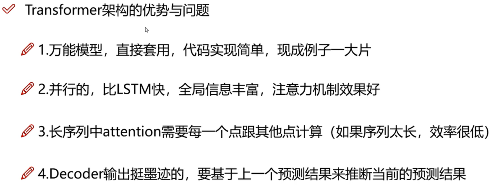
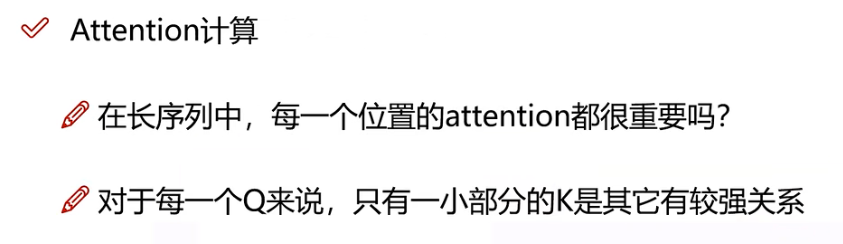
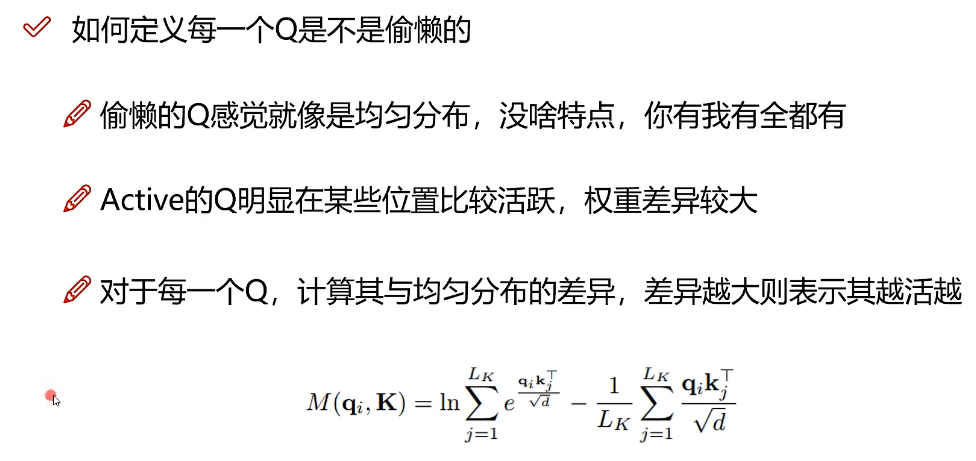
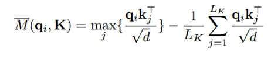
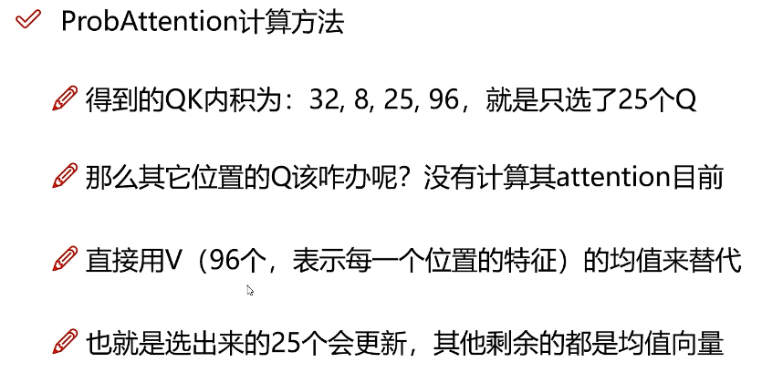

# 机器学习基础知识

可以参考《百面机器学习》的笔记[传送门](../ml.md)

---

## 强化学习

### Q-Learning

首先是最基本的Q-Learning算法，通过每一个state，在根据Reward表来确定一个state的时候，其中这里的Reward是根据实际情况建立的静态表，使用的一个确定的action所对应的reward。在进行一些操作之后，补全Q表。但是这样的缺点在于如果State很多的话，创建一个Q表是不切实际的，所以衍生出了深度Q-Learning网络（DQN）。参考[A Painless Q-learning Tutorial (一个 Q-learning 算法的简明教程)_皮果提的博客-CSDN博客](https://blog.csdn.net/itplus/article/details/9361915)。

---

### DQN

参考[Simple_Reinforcement_Learning/2.双模型_平衡车.ipynb at main · lansinuote/Simple_Reinforcement_Learning · GitHub](https://github.com/lansinuote/Simple_Reinforcement_Learning/blob/main/6.DQN算法/2.双模型_平衡车.ipynb)就是建立一个Q网络，并且使用一个深度神经网络来根据state来计算action。注意，在以上实例代码中使用了model和next_model两个模型用来延迟更新，它们分别是动作模型和经验模型。

```python
def get_value(state, action):
    #使用状态计算出动作的logits
    #[b, 4] -> [b, 2]
    value = model(state)

    #根据实际使用的action取出每一个值
    #这个值就是模型评估的在该状态下,执行动作的分数
    #在执行动作前,显然并不知道会得到的反馈和next_state
    #所以这里不能也不需要考虑next_state和reward
    #[b, 2] -> [b, 1]
    value = value.gather(dim=1, index=action)

    return value

```

以上为使用model来计算action的函数。

```python
def get_target(reward, next_state, over):
    #上面已经把模型认为的状态下执行动作的分数给评估出来了
    #下面使用next_state和reward计算真实的分数
    #针对一个状态,它到底应该多少分,可以使用以往模型积累的经验评估
    #这也是没办法的办法,因为显然没有精确解,这里使用延迟更新的next_model评估

    #使用next_state计算下一个状态的分数
    #[b, 4] -> [b, 2]
    with torch.no_grad():
        target = next_model(next_state)

    #取所有动作中分数最大的
    #[b, 2] -> [b, 1]
    target = target.max(dim=1)[0]
    target = target.reshape(-1, 1)

    #下一个状态的分数乘以一个系数,相当于权重
    target *= 0.98

    #如果next_state已经游戏结束,则next_state的分数是0
    #因为如果下一步已经游戏结束,显然不需要再继续玩下去,也就不需要考虑next_state了.
    #[b, 1] * [b, 1] -> [b, 1]
    target *= (1 - over)

    #加上reward就是最终的分数
    #[b, 1] + [b, 1] -> [b, 1]
    target += reward

    return target

```

以上函数用来计算真实的action，就是使用了next_model。`target = target.max(dim=1)[0]`是取所有动作当中分数最大的那个，即走过了深度神经网络层之后最有可能选择的那个动作表示当前应该选择的动作。注意这里要区分reward和分数的区别，reward是根据当前环境给出的，作为当前state选择action的反馈。

以上平衡车的action空间是离散的，如果要考虑到连续的动作空间，可以参考[Simple_Reinforcement_Learning/3.双模型_倒立摆.ipynb at main · lansinuote/Simple_Reinforcement_Learning · GitHub](https://github.com/lansinuote/Simple_Reinforcement_Learning/blob/main/6.DQN算法/3.双模型_倒立摆.ipynb)因为DQN是不适合玩连续型的动作空间的，所以必须给动作空间离散化。

---

## 时间序列预测

### informer模型

参考视频[【时间序列预测】只需半天就能搞定 LSTM+Informer时间序列预测源码解读+时间序列airma模型—pandas/机器学习实战（python+opencv_哔哩哔哩_bilibili](https://www.bilibili.com/video/BV1Me4y1e7Jf/?vd_source=36542d6c49bf487d8a18d22be404b8d2)原始论文[[2012.07436\] Informer: Beyond Efficient Transformer for Long Sequence Time-Series Forecasting (arxiv.org)](https://arxiv.org/abs/2012.07436)

对于一个长的序列来说，如果使用滑动窗口进行预测的话，在预测进入到后期，用来进行预测的值都是之前预测出来的值，可信度降低。如果是使用之前全部的值用来预测的话，最早的值又有可能因为距离太远而对后面被预测的值产生负面影响。



以为如上的问题，提出了一种叫做informer的方法，它应该要做到：

1. attention系数计算得要快。
2. Decoder需要一次性输出全部的输出。
3. 堆叠encoder的速度也要快。

#### attention问题

结合transformer里面的K和V的理解[transformer中的Q,K,V到底是什么？ - 知乎 (zhihu.com)](https://www.zhihu.com/question/427629601)以及[深度学习attention机制中的Q,K,V分别是从哪来的？ - 知乎 (zhihu.com)](https://www.zhihu.com/question/325839123/answer/2473804749)



对于有些Q来说，他对于每个key的分配都是差不多一样的，这样的话这些Q在计算注意力机制的时候，是没有什么用的，可以剔除的。所以对于原始的句子，可以做采样。是可以通过计算每一个Q与均匀分布的差异，来看出哪个Q是没有贡献的Q。



并且，在informer论文中提到，计算每个Q的分布的时候，没必要去计算这个Q与全部的Key的分布，可以先对Key进行（随机）采样，减少计算量。这个算法在论文中叫做ProbAttention。在论文中，是假设一个序列有96个token，那么对于正常来说，就有96个Q和96个K。论文中随机采样了25个K。所以计算到每个Q有25个（内积）值，论文中为了选取Q并且加速，直接对于每个Q来说选这些值中的最大值与均匀分布之间的差异。最后选择出差异最大的25个Q进入之后的操作。



所以ProbAttention的贡献点在于：

1. 对于K的采样。
2. 使用最大值和平均值求差异。
3. 选取差异最大的Q才去计算attention。
4. 对于那些没有更新的Q，就直接用96个Q的V的平均值代替（因为这些Q被视为和均匀分布相差不大，所以直接用均匀分布的平均数当作它的值）。



有Self-attention Distilling算法，实质上是一个下采样操作，对于做了一次attention操作之后，使用1D的maxpoll操作减小序列的长度（论文中长度96变成长度48），然后送入下一次attention操作。操作逐层递减（这里的含义是逐层选拔），在堆叠多次之后，就是informer的decoder部分的操作。


 
