# 图神经网络笔记

代码位于[GNN代码](https://gitee.com/masaikk/tgn)，课程位于[课程](https://www.bilibili.com/video/BV1RU4y1K7iU)

使用pytorch

---

## Graph Embedding

[参考代码](https://github.com/shenweichen/GraphEmbedding)

embedding的五种方法：

+ DeepWalk
+ LINE
+ Node2Vec
+ Struct2Vec
+ SDNE


---

## Graph Neural Network

### GCN

单纯的卷积。不过要注意正则化的两种形式。有$D^{-1}A$得到非对称矩阵和$D^{-\frac{1}{2}}AD^{-\frac{1}{2}}$可以得到对称矩阵。

代码参考[https://github.com/tkipf/pygcn](https://github.com/tkipf/pygcn)

使用了cora数据集进行分类示例，cora数据集包括节点的特征（稀疏），节点的分类标签和节点之间的单向连接关系。

```python
idx_features_labels = np.genfromtxt("{}{}.content".format(path, dataset),dtype=np.dtype(str))
```

使用如上代码读取节点，节点特征和标签：

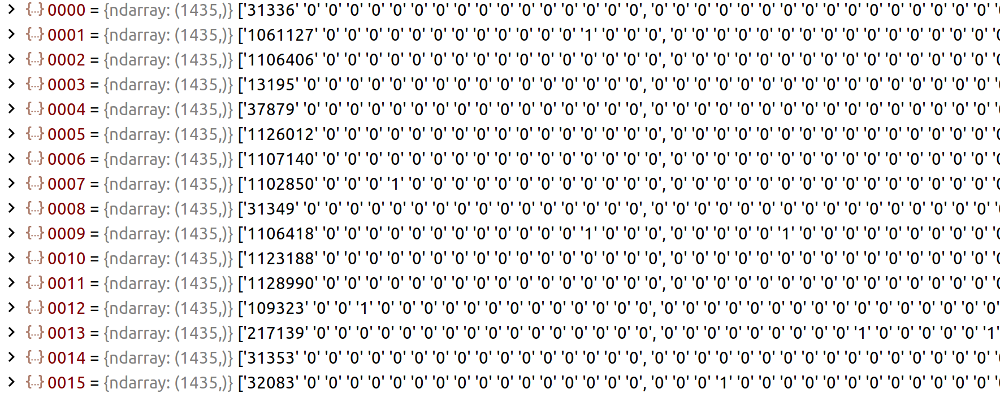

可以看到每个节点有1433个特征。

边的数据如下，为无序的单项连接，共计5429边。

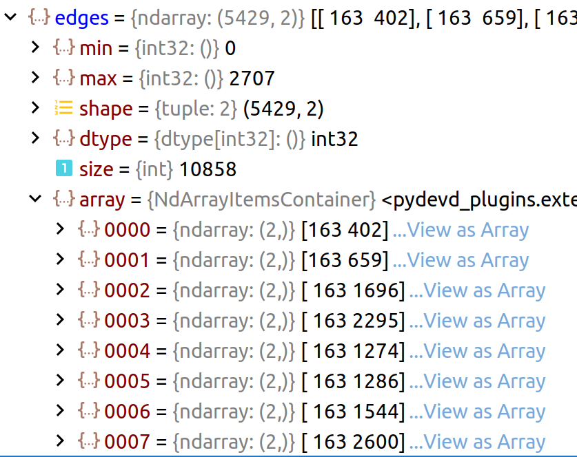

使用如下语句处理边

```python
edges = np.array(list(map(idx_map.get, edges_unordered.flatten())),
                     dtype=np.int32).reshape(edges_unordered.shape)
adj = sp.coo_matrix((np.ones(edges.shape[0]), (edges[:, 0], edges[:, 1])),
                        shape=(labels.shape[0], labels.shape[0]),
                        dtype=np.float32)
```

最终adj是coo_matrix的形式。

因为邻接表是单向的所以要建立对称的邻接矩阵（将有向图转为无向图）。具体实现为原矩阵加上转置矩阵，再减去重叠部分。如下所示：

```python
adj = adj + adj.T.multiply(adj.T > adj) - adj.multiply(adj.T > adj)
```

然后对于特征和邻接表进行归一化操作。（如果不进行归一化就会造成梯度爆炸或者梯度消失）

```python
def normalize(mx):
    """Row-normalize sparse matrix"""
    rowsum = np.array(mx.sum(1)) # 计算得到 和向量
    r_inv = np.power(rowsum, -1).flatten() # 求倒数
    r_inv[np.isinf(r_inv)] = 0. # 如果出现了inf就设置为0
    r_mat_inv = sp.diags(r_inv) # 将向量转化为对角阵D^-1
    mx = r_mat_inv.dot(mx) # 使用了D^-1 * A 的归一化
    return mx
```

这里使用的是$D^{-1}A$形式非对称的归一化方法。这里的mx按行相加都为1。

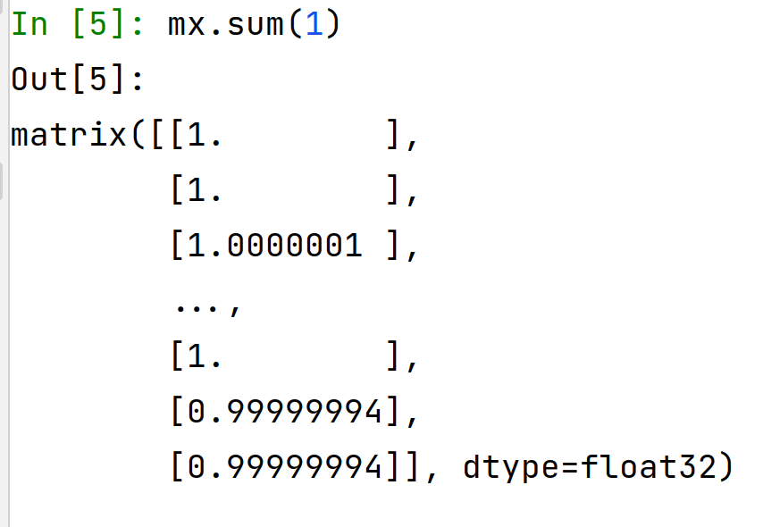
$$
H^{(l+1)}=\sigma(\tilde{D}^{-\frac{1}{2}}\tilde{A}\tilde{D}^{-\frac{1}{2}}\cdot H^{(l)} \cdot W^{(l)})
$$
其中这里的$\tilde{A}$为邻接矩阵$A$加上对角阵$I$再归一化的结果。

反映在代码中是：

```python
adj = normalize(adj + sp.eye(adj.shape[0]))
```

GCN模型解析

```python
class GCN(nn.Module):
    def __init__(self, nfeat, nhid, nclass, dropout):
        super(GCN, self).__init__()

        self.gc1 = GraphConvolution(nfeat, nhid)
        self.gc2 = GraphConvolution(nhid, nclass)
        self.dropout = dropout

    def forward(self, x, adj):
        x = F.relu(self.gc1(x, adj))
        x = F.dropout(x, self.dropout, training=self.training)
        x = self.gc2(x, adj)
        return F.log_softmax(x, dim=1)
```

每层的代码为：

```python
class GraphConvolution(Module):
    """
    Simple GCN layer, similar to https://arxiv.org/abs/1609.02907
    """

    def __init__(self, in_features, out_features, bias=True):
        super(GraphConvolution, self).__init__()
        self.in_features = in_features
        self.out_features = out_features
        self.weight = Parameter(torch.FloatTensor(in_features, out_features))
        if bias:
            self.bias = Parameter(torch.FloatTensor(out_features))
        else:
            self.register_parameter('bias', None)
        self.reset_parameters()

    def reset_parameters(self):
        stdv = 1. / math.sqrt(self.weight.size(1))
        self.weight.data.uniform_(-stdv, stdv)
        if self.bias is not None:
            self.bias.data.uniform_(-stdv, stdv)

    def forward(self, input, adj):
        support = torch.mm(input, self.weight)
        output = torch.spmm(adj, support)
        if self.bias is not None:
            return output + self.bias
        else:
            return output

    def __repr__(self):
        return self.__class__.__name__ + ' (' \
               + str(self.in_features) + ' -> ' \
               + str(self.out_features) + ')'

```

单层GCN中的``support = torch.mm(input, self.weight)``表示$H^{(l)} \cdot W^{(l)}$。``output = torch.spmm(adj, support)``稀疏矩阵相乘表示$\tilde{D}^{-\frac{1}{2}}\tilde{A}\tilde{D}^{-\frac{1}{2}}\cdot H^{(l)} \cdot W^{(l)}$。

设置了训练的函数

```python
def train(epoch):
    t = time.time()
    model.train()
    optimizer.zero_grad()
    output = model(features, adj)
    loss_train = F.nll_loss(output[idx_train], labels[idx_train])
    acc_train = accuracy(output[idx_train], labels[idx_train])
    loss_train.backward()
    optimizer.step()

    if not args.fastmode:
        # Evaluate validation set performance separately,
        # deactivates dropout during validation run.
        model.eval()
        output = model(features, adj)

    loss_val = F.nll_loss(output[idx_val], labels[idx_val])
    acc_val = accuracy(output[idx_val], labels[idx_val])
    print('Epoch: {:04d}'.format(epoch+1),
          'loss_train: {:.4f}'.format(loss_train.item()),
          'acc_train: {:.4f}'.format(acc_train.item()),
          'loss_val: {:.4f}'.format(loss_val.item()),
          'acc_val: {:.4f}'.format(acc_val.item()),
          'time: {:.4f}s'.format(time.time() - t))
```


### GraphSAGE

于GCN的不同点在于，GCN局限于见过的图，而GraphSAGE能够在没见过的节点上进行。而且，GCN是面向全图进行的，GraphSAGE是局部的邻居聚合。

重点在于第K次聚合了K-1次时该节点的特征和第K次该节点邻居的特征（通过一个聚合函数）作为本节点第K次的特征。

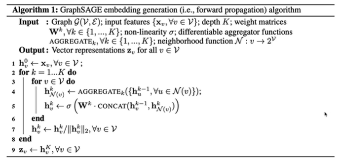

可以选择最大邻居数，如果真实的邻居超过了数量，就随机选择邻居。如果数量不够，就有些节点多选几遍。

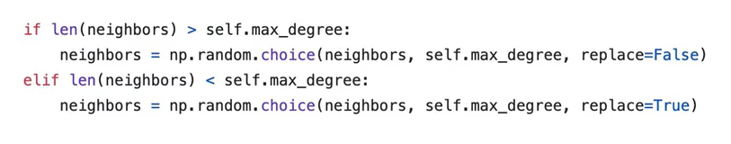

上述聚合函数的要求是：

1. 输入的顺序不影响结果。
2. 输入的邻居节点的特征不变，输出的结果也应该不变。

GraphSAGE_minibatch

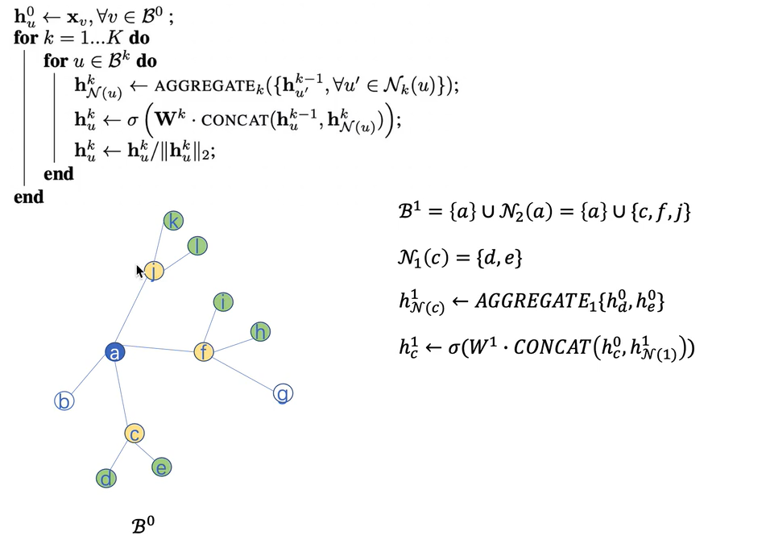

想求得a节点的嵌入，看得到有邻居cfj。对于c节点嵌入，根据邻居d和e在第0层的嵌入算得c的邻居嵌入，再通过它自身的嵌入拼接起来算得节点c在第1层的嵌入表示。

### GAT

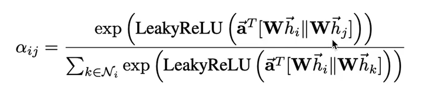

计算两个节点之间的attention系数。对于每个想要求得的$e_{ij}$的值去做归一化的操作。

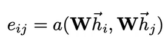

如上图所示，计算i节点余某一个邻居就节点$e^{LeakReLU(e_{ij})}$的值，在把分母算上所有节点这种运算的和，最终得到$a_{ij}$为i节点到j节点的注意力系数。

代码展示，在读取数据以及正则化阶段与GCN代码类似。代码参考[https://github.com/Diego999/pyGAT/blob/master/utils.py](https://github.com/Diego999/pyGAT/blob/master/utils.py)。

 构建GAT模型

```python
class GAT(nn.Module):
    def __init__(self, nfeat, nhid, nclass, dropout, alpha, nheads):
        """Dense version of GAT."""
        super(GAT, self).__init__()
        self.dropout = dropout

        self.attentions = [GraphAttentionLayer(nfeat, nhid, dropout=dropout, alpha=alpha, concat=True) for _ in range(nheads)]
        for i, attention in enumerate(self.attentions):
            self.add_module('attention_{}'.format(i), attention)

        self.out_att = GraphAttentionLayer(nhid * nheads, nclass, dropout=dropout, alpha=alpha, concat=False)

    def forward(self, x, adj):
        x = F.dropout(x, self.dropout, training=self.training)
        x = torch.cat([att(x, adj) for att in self.attentions], dim=1)
        x = F.dropout(x, self.dropout, training=self.training)
        x = F.elu(self.out_att(x, adj))
        return F.log_softmax(x, dim=1)
```

对于每一个attention层来说代码为：

```python
class GraphAttentionLayer(nn.Module):
    """
    Simple GAT layer, similar to https://arxiv.org/abs/1710.10903
    """
    def __init__(self, in_features, out_features, dropout, alpha, concat=True):
        super(GraphAttentionLayer, self).__init__()
        self.dropout = dropout
        self.in_features = in_features
        self.out_features = out_features
        self.alpha = alpha
        self.concat = concat

        self.W = nn.Parameter(torch.empty(size=(in_features, out_features)))
        nn.init.xavier_uniform_(self.W.data, gain=1.414)
        self.a = nn.Parameter(torch.empty(size=(2*out_features, 1)))
        nn.init.xavier_uniform_(self.a.data, gain=1.414)

        self.leakyrelu = nn.LeakyReLU(self.alpha)

    def forward(self, h, adj):
        Wh = torch.mm(h, self.W) # h.shape: (N, in_features), Wh.shape: (N, out_features)
        e = self._prepare_attentional_mechanism_input(Wh)

        zero_vec = -9e15*torch.ones_like(e)
        attention = torch.where(adj > 0, e, zero_vec)
        attention = F.softmax(attention, dim=1)
        attention = F.dropout(attention, self.dropout, training=self.training)
        h_prime = torch.matmul(attention, Wh)

        if self.concat:
            return F.elu(h_prime)
        else:
            return h_prime

    def _prepare_attentional_mechanism_input(self, Wh):
        # Wh.shape (N, out_feature)
        # self.a.shape (2 * out_feature, 1)
        # Wh1&2.shape (N, 1)
        # e.shape (N, N)
        Wh1 = torch.matmul(Wh, self.a[:self.out_features, :])
        Wh2 = torch.matmul(Wh, self.a[self.out_features:, :])
        # broadcast add
        e = Wh1 + Wh2.T
        return self.leakyrelu(e)

    def __repr__(self):
        return self.__class__.__name__ + ' (' + str(self.in_features) + ' -> ' + str(self.out_features) + ')'

```

创建$\alpha$向量``self.a = nn.Parameter(torch.empty(size=(2*out_features, 1)))``因为


表示两个h向量拼接在一起所以$\alpha$向量是有2倍的。在cora数据集上是16*1。

创建W向量``self.W = nn.Parameter(torch.empty(size=(in_features, out_features)))``在cora数据集上表示1433*8。

```python
self.attentions = [GraphAttentionLayer(nfeat, nhid, dropout=dropout, alpha=alpha, concat=True) for _ in range(nheads)]
for i, attention in enumerate(self.attentions):
    self.add_module('attention_{}'.format(i), attention)
```

表示循环了8次，有8个attention层，然后拼接在一起。这里表示多头注意力。

最后再加上一个attention层将之前层合起来。

```python
self.out_att = GraphAttentionLayer(nhid * nheads, nclass, dropout=dropout, alpha=alpha, concat=False)
```


---

### RecGNN与ConvGNN的区别

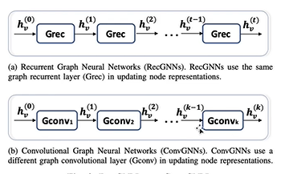

RecGNN与ConvGNN的区别在于前者每轮用的参数都是相同的，而卷积每轮的参数都是不同的。

---

### GAE

Graph Auto-Encoder

学习参数Z，编码图，再通过反向操作还原图，将原来的图和得到的还原图之间作比较得到loss。

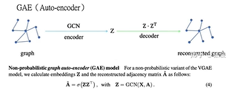

VGAE类似的，形如VAE

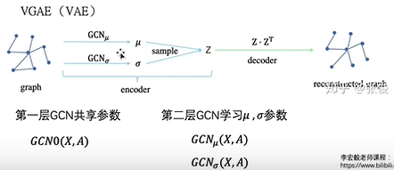

---

### HGAN

Heterogeneous  Graph Attention Networks

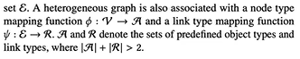

通过某个规定的Meta-Path可以将异构图转化为同构图，例如固定“蓝-黄-蓝”为Meta-Path，那么同一个Meta-Path两端的色节点就可以变成邻居，进而转化为此Meta-Path下的同构图:

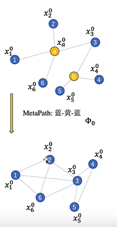

先考虑节点级别的embedding，类似于GAT，先求得某个节点对于它邻居的节点的e，再通过softmax来得到attention系数。

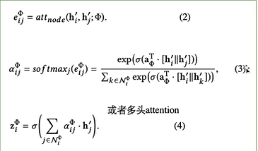

$$z^{\Phi_0}_{i}$$表示在$$\Phi_0$$这种Meta-Path下面节点1对于它全部邻居的attention系数相加之后作为节点自身的embedding。

再计算语义级别的attention表示：

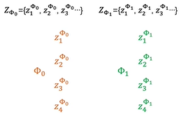

这里可以看出$$Z_{\Phi_0}$$表示在$$\Phi_0$$这种Meta-Path下面全部的节点的embedding的组合。

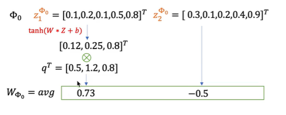

对于$$Z_{\Phi_0}$$中全部的值进行线性运算在乘以一个可以学习的参数$$q^T$$得到诺干个标量，$$W_{\Phi_0}$$就是对这些标量的平均。

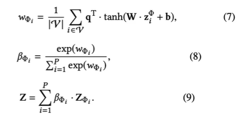

再对于$$W_{\Phi_0}$$进行softmax操作得到attention系数$$\beta_{\Phi}$$，再对于同一个节点i来说，将全部的Meta-Path的$$\beta_{\Phi}$$乘以自身的节点特征，最终得到该节点的语义级别的embedding。

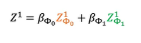

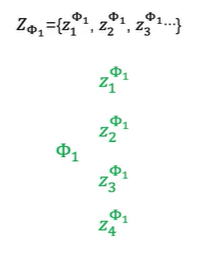

---

### GTN

Graph Transformer Network

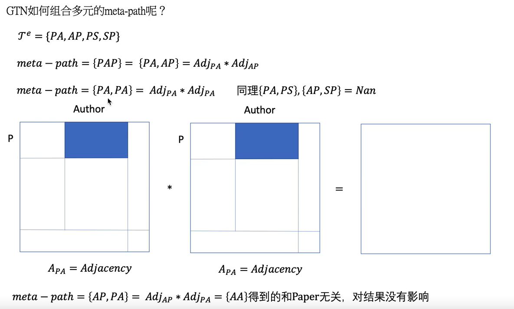

---

### Edge embedding in Heterogeneous  Graph

如果使用同构图中的embedding方式，比如说随机游走，可能会导致同种节点出现的次数过大。
