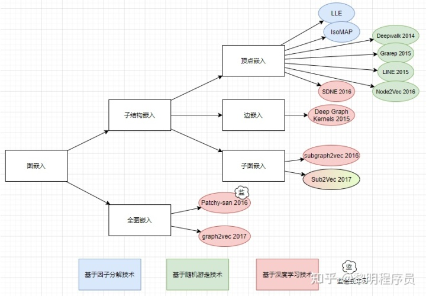

# 机器学习面经问题

在此记录面经问题，包括答案。主要内容为机器学习。

---

1. 项目中为什么使用lightGBM，比起xgboost的优点是什么？

   来自[NLP面试复盘 | 阿里/腾讯/头条/paypal/快手_abcdefg90876的博客-CSDN博客](https://blog.csdn.net/abcdefg90876/article/details/107398761)

   答：

2. 因果词向量的应用场景？

   来自[NLP面试复盘 | 阿里/腾讯/头条/paypal/快手_abcdefg90876的博客-CSDN博客](https://blog.csdn.net/abcdefg90876/article/details/107398761)

3. SGD与min-SGD的区别

   来自[NLP面试复盘 | 阿里/腾讯/头条/paypal/快手_abcdefg90876的博客-CSDN博客](https://blog.csdn.net/abcdefg90876/article/details/107398761)

4. 为什么GCN中需要正则化？

   如果不正则化，那么特征大的节点在卷积之后越来越大，小的就会越来越小。会引起梯度爆炸。

5. GCN中的卷积操作的具体含义？

   将结点的邻居（包括自己）的信息进行汇总。

6. 图嵌入有什么方法？

   

7. 解释一下Structural Deep Network Embedding（SDNE）？

   SDNE认为像DeepWalk、LINE之类的算法都是浅层模型，无法有效地应对数据稀疏和数据的全局关联性质。SDNE在训练过程中联合了一阶和二阶近邻。

8. 介绍一下graphSAGE？

   参考自己的笔记

9. 

