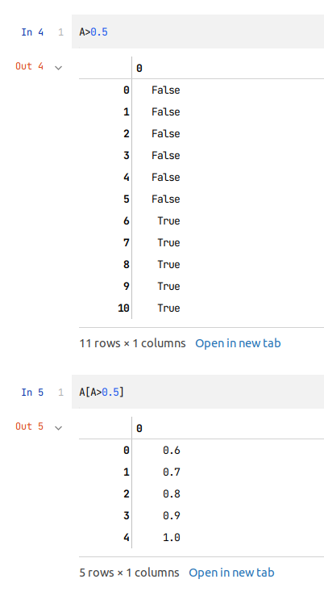

# Python数据挖掘

---

代码位于：https://gitee.com/masaikk/data-deep-mear-exercise.git

---

2.4 索引

```py
A=np.linspace(0,1,11)
A>0.5
```

输出




2.5 调整大小和形状

```python
import numpy as np

data = np.arange(5)
# 将numpy数组合并
print(data)
print(np.vstack((data, data, data)))
```

输出为：

可以通过以下代码将一个numpy数组转化成列形式的：

```py
data=data[:,np.newaxis]
```


可以将numpy数组从列的方向上合并：

```py
np.hstack((data,data,data))
```

**注意上述两种的合并的方式需要传入元组。**


2.6 numpy数组的元素操作

原始数据为：


分别进行整体的求和，行上的求和和列上的求和，结果如下：


